1. Review last weeks material.
#14E1. Add to the following model varying slopes on the predictor x.
yi ∼ Normal(µi,σ)
µi = αgroup[i] + βxi
αgroup ∼ Normal(α,σα)
α ∼ Normal(0,10)
β ∼ Normal(0,1)
σ ∼ HalfCauchy(0,2)
σα ∼ HalfCauchy(0,2)  #HalfCauchy?

yi ~ normal(ui,σ)
µi = αgroup[i] + βxi

αgroup ∼ Normal(α,σα)
α ∼ Normal(0,10)
σα ∼ HalfCauchy(0,2)

xi ~ normal(b,σb)
b ∼ Normal(0,10)
σb ∼ HalfCauchy(0,2)

β ∼ Normal(0,1)
σ ∼ HalfCauchy(0,2)


#14E2. Think up a context in which varying intercepts will be positively correlated with varying slopes. Provide a mechanistic explanation for the correlation.
(1) Example for (not-sure) correlated varying intercepts with varying slopes
An isolate sporulate at different timepoints, say 7,11,15dpi, the slope is the rate of sporulation across timepoints. Now apply fungicide before
the inoculate the isolate to the plant. Since different isolates have different sensitivity level to fungicide, sporulation of some would be 
totally knocked down while the insensitive ones can sporulate to some extent. Now let's look at genetically distinct insensitive populations of 
isolates: Group1, generally highly insensitive; Group2, generally intermediate insensitive; Group3,generally low insensitive. Now let's model the sporulation percentage over different time points, for three groups of isolates, with application of fungicide. Spoculation percentage is counts of plants out of ten plants being tested, which is sporulating at the time of observation.

S ~ Possion(10,p)
p = a+bt*T 

here a is varying intercept, which varied btw different groups of isolates, who has a baseline sporulation different in response to fungicide
bt is a varying slope, which varied btw different groups of isolates as well. The slope is the sporulation rate over time. The varying intecept and slopes are (negatively/positively) correlated. Because isolate more insensitive reached a high level of sporulation at the first timepoint, which is the usual time point for full sporulation. Say sometimes would reach 100% sporulation. So it has little space to increase more. So the actual sporualtion rate over time might be smaller. However, some sensitive isolates would not sporulate further even with time elasping, so it remains to see what the data says.


(2) Example for negatively correlated varying intercepts with varying slopes

Same experiment as above but not with fungicide application, assume the plants used are "universally" susceptible to all isolates. So all isolates should be fully sporulate sooner or later, around 7-11dpi. So the ones sporulate higher earlier would expect a smaller sporulation rate over time, compared to ones that has a low sporulation, but able to catch up later. Here the varying intercepts and slopes are negatively correlated.

(3) Example for positively correlated varying intercepts with varying slopes
Suppose a heterokaryon isolate was inoculated to a plant. It has different nuclei types within it. The one survive better at that cultivar, or under that circumstance would be has a higher proportion in the nuclei composition/balance over time. Say there are different isolates with different nuclei composition, of which Nuclei_A fit our selection condition best. So the sporulation percentage of that isolate (a combination of different nuclei) would positive correlated with proportion of Nuclei_A in that isolate. Let's fit a model to the sporulation percentage after 
S ~ Possion(10,p)
p = a+bP*P 

P is the initial percentage of NucleiA in a specific isolate, while a is the baseline sporulation of different isolates. They both are positively correlated with the proportion of NucleiA in different isolate. So they are positivelyl correlated too.


Now Let's fit a model to the proportion of major nuclei after first round of selection over additional Round of selection. As it is the the dominant nuclei fit better in the first round of selection, its proportion is going to increase over time upon same selection treatment. However the increase rate remains unclear whehter it is higher. 

N ~ Normal(u,σ)
u = a+bR*R

#14M1.Repeat the café robot simulation from the beginning of the chapter. This time, set rho to zero, so that there is no correlation between intercepts and slopes. How does the posterior distribution of the correlation reflect this change in the underlying simulation?


```r
a <- 3.5            # average morning wait time
b <- (-1)           # average difference afternoon wait time
sigma_a <- 1        # std dev in intercepts
sigma_b <- 0.5      # std dev in slopes
rho <- (-0.7)      # correlation between intercepts and slopes
```


```r
Mu <- c( a , b )
```


```r
cov_ab <- sigma_a*sigma_b*rho
Sigma <- matrix( c(sigma_a^2,cov_ab,cov_ab,sigma_b^2) , ncol=2 )
```


```r
N_cafes <- 20
```


```r
library(MASS)
set.seed(5) # used to replicate example
vary_effects <- mvrnorm( N_cafes , Mu , Sigma )
```


```r
a_cafe <- vary_effects[,1]
b_cafe <- vary_effects[,2]
```


```r
library(rethinking)
```

```
## Loading required package: rstan
```

```
## Loading required package: StanHeaders
```

```
## Loading required package: ggplot2
```

```
## rstan (Version 2.19.3, GitRev: 2e1f913d3ca3)
```

```
## For execution on a local, multicore CPU with excess RAM we recommend calling
## options(mc.cores = parallel::detectCores()).
## To avoid recompilation of unchanged Stan programs, we recommend calling
## rstan_options(auto_write = TRUE)
```

```
## For improved execution time, we recommend calling
## Sys.setenv(LOCAL_CPPFLAGS = '-march=corei7 -mtune=corei7')
## although this causes Stan to throw an error on a few processors.
```

```
## Loading required package: parallel
```

```
## Loading required package: dagitty
```

```
## rethinking (Version 1.95)
```

```
## 
## Attaching package: 'rethinking'
```

```
## The following object is masked from 'package:stats':
## 
##     rstudent
```

```r
plot( a_cafe , b_cafe , col=rangi2 ,
    xlab="intercepts (a_cafe)" , ylab="slopes (b_cafe)" )

# overlay population distribution
library(ellipse)
```

```
## Warning: package 'ellipse' was built under R version 3.6.3
```

```
## 
## Attaching package: 'ellipse'
```

```
## The following object is masked from 'package:rethinking':
## 
##     pairs
```

```
## The following object is masked from 'package:graphics':
## 
##     pairs
```

```r
for ( l in c(0.1,0.3,0.5,0.8,0.99) )
    lines(ellipse(Sigma,centre=Mu,level=l),col=col.alpha("black",0.2))
```

<!-- -->
No correlation shown between intercept and slope

simulates 10 visits to each cafe, 5 in the morning and 5 in the afternoon, and combine into a dataframe

```r
set.seed(22)
N_visits <- 10
afternoon <- rep(0:1,N_visits*N_cafes/2)
cafe_id <- rep( 1:N_cafes , each=N_visits )
mu <- a_cafe[cafe_id] + b_cafe[cafe_id]*afternoon
sigma <- 0.5  # std dev within cafes
wait <- rnorm( N_visits*N_cafes , mu , sigma )
d <- data.frame( cafe=cafe_id , afternoon=afternoon , wait=wait )
```

fit the model

```r
m14M1 <- ulam(
    alist(
        wait ~ normal( mu , sigma ),
        mu <- a_cafe[cafe] + b_cafe[cafe]*afternoon,
        c(a_cafe,b_cafe)[cafe] ~ multi_normal( c(a,b) , Rho , sigma_cafe ),
        a ~ normal(5,2),
        b ~ normal(-1,0.5),
        sigma_cafe ~ exponential(1),
        sigma ~ exponential(1),
        Rho ~ lkj_corr(2)
    ) , data=d , chains=4 , cores=4 , log_lik = TRUE)
```

```
## Warning: The largest R-hat is NA, indicating chains have not mixed.
## Running the chains for more iterations may help. See
## http://mc-stan.org/misc/warnings.html#r-hat
```

```
## Warning: Bulk Effective Samples Size (ESS) is too low, indicating posterior means and medians may be unreliable.
## Running the chains for more iterations may help. See
## http://mc-stan.org/misc/warnings.html#bulk-ess
```

```
## Warning: Tail Effective Samples Size (ESS) is too low, indicating posterior variances and tail quantiles may be unreliable.
## Running the chains for more iterations may help. See
## http://mc-stan.org/misc/warnings.html#tail-ess
```
!above model not go through with prompt
The largest R-hat is NA, indicating chains have not mixed.
Running the chains for more iterations may help
tried iter up to 6000, not working

```r
#marginal posterior distributions
plot(precis(m14M1,depth = 3))
```

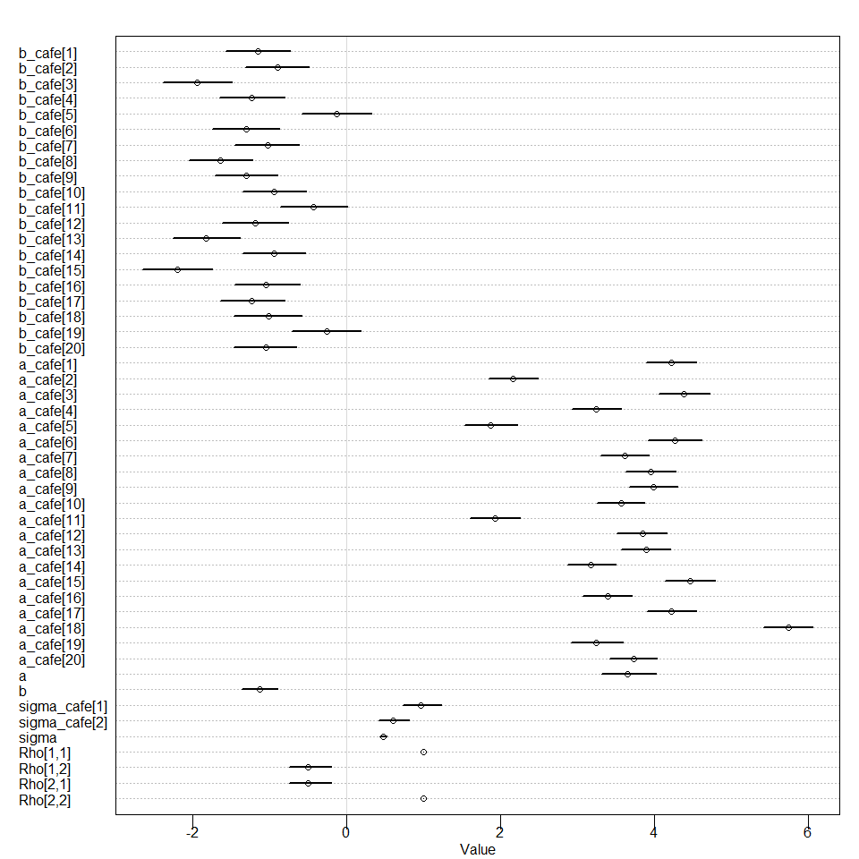<!-- -->

```r
precis(m14M1,depth = 3)
```

```
##                     mean           sd       5.5%       94.5%    n_eff     Rhat4
## b_cafe[1]     -1.1494855 2.669331e-01 -1.5667408 -0.72960448 2325.846 1.0001683
## b_cafe[2]     -0.8992284 2.652712e-01 -1.3183435 -0.48518758 2120.522 0.9991882
## b_cafe[3]     -1.9480227 2.798793e-01 -2.3869829 -1.49499245 2375.921 1.0009773
## b_cafe[4]     -1.2324688 2.672595e-01 -1.6573210 -0.80217343 2436.928 1.0004742
## b_cafe[5]     -0.1331900 2.856303e-01 -0.5790025  0.32775577 2323.453 1.0000059
## b_cafe[6]     -1.3015016 2.735684e-01 -1.7445514 -0.87108488 2034.356 0.9984547
## b_cafe[7]     -1.0285851 2.635330e-01 -1.4519581 -0.61629322 2975.508 0.9985961
## b_cafe[8]     -1.6390617 2.637294e-01 -2.0469054 -1.22680694 2343.378 0.9994078
## b_cafe[9]     -1.3066812 2.565750e-01 -1.7066680 -0.89706450 2586.619 1.0020322
## b_cafe[10]    -0.9485645 2.625543e-01 -1.3537033 -0.52458783 2951.995 0.9994077
## b_cafe[11]    -0.4289445 2.771088e-01 -0.8581326  0.01309357 2336.721 0.9995411
## b_cafe[12]    -1.1876104 2.709955e-01 -1.6130619 -0.76058135 2647.961 0.9993531
## b_cafe[13]    -1.8233730 2.714941e-01 -2.2576005 -1.38811044 2468.429 0.9994315
## b_cafe[14]    -0.9417839 2.577837e-01 -1.3481485 -0.53410662 2598.937 0.9990381
## b_cafe[15]    -2.1960511 2.830811e-01 -2.6501810 -1.74451507 2228.400 0.9988755
## b_cafe[16]    -1.0427541 2.653981e-01 -1.4554641 -0.60186851 2490.133 0.9999399
## b_cafe[17]    -1.2294284 2.615503e-01 -1.6462067 -0.80287429 2506.844 1.0000370
## b_cafe[18]    -1.0160823 2.766536e-01 -1.4614130 -0.57838103 2680.514 1.0003549
## b_cafe[19]    -0.2538980 2.811445e-01 -0.7095752  0.18891631 2195.855 0.9998102
## b_cafe[20]    -1.0528513 2.560310e-01 -1.4611407 -0.64781242 2554.980 0.9992673
## a_cafe[1]      4.2166510 2.032868e-01  3.8962421  4.54104211 2271.355 0.9991281
## a_cafe[2]      2.1634278 2.014227e-01  1.8454269  2.48787221 2288.311 0.9994243
## a_cafe[3]      4.3786399 2.022642e-01  4.0594563  4.71230816 2201.449 1.0002065
## a_cafe[4]      3.2439970 1.969236e-01  2.9233479  3.56986662 2268.048 1.0012682
## a_cafe[5]      1.8743036 2.142397e-01  1.5360866  2.22026926 2470.320 1.0006243
## a_cafe[6]      4.2635814 2.109563e-01  3.9154139  4.60863021 2667.363 0.9989171
## a_cafe[7]      3.6174849 2.006645e-01  3.3026323  3.92701585 3446.141 0.9987461
## a_cafe[8]      3.9501758 1.995922e-01  3.6263539  4.27367111 2450.517 0.9997049
## a_cafe[9]      3.9810968 1.968983e-01  3.6757396  4.29855239 2355.632 1.0030917
## a_cafe[10]     3.5623999 1.968011e-01  3.2477556  3.87279263 2473.072 1.0016683
## a_cafe[11]     1.9280001 2.054665e-01  1.5963776  2.24823979 2355.023 0.9988211
## a_cafe[12]     3.8419813 2.032389e-01  3.5113805  4.16325685 2378.721 1.0007642
## a_cafe[13]     3.8890020 2.010227e-01  3.5688449  4.21099895 2771.331 1.0003735
## a_cafe[14]     3.1748733 1.954539e-01  2.8679645  3.49081620 2442.946 0.9986792
## a_cafe[15]     4.4571134 2.042277e-01  4.1313520  4.78389581 2302.744 0.9989796
## a_cafe[16]     3.3871684 2.015144e-01  3.0617832  3.70998295 2620.634 0.9992624
## a_cafe[17]     4.2189505 2.010686e-01  3.9053432  4.53852028 2737.740 0.9991970
## a_cafe[18]     5.7416507 2.024100e-01  5.4109693  6.05811073 2574.819 1.0010483
## a_cafe[19]     3.2455089 2.074309e-01  2.9191363  3.59043724 2285.273 0.9989401
## a_cafe[20]     3.7299550 1.954286e-01  3.4117838  4.03621324 2751.979 0.9996420
## a              3.6523868 2.204402e-01  3.3094610  4.01596262 2238.942 1.0015726
## b             -1.1306449 1.472713e-01 -1.3649172 -0.90298781 2124.214 1.0004474
## sigma_cafe[1]  0.9574826 1.620257e-01  0.7331795  1.23523385 2114.636 0.9995461
## sigma_cafe[2]  0.5971836 1.264935e-01  0.4176872  0.81064075 1767.666 0.9997443
## sigma          0.4732856 2.758979e-02  0.4317900  0.51805183 1895.329 1.0012587
## Rho[1,1]       1.0000000 0.000000e+00  1.0000000  1.00000000      NaN       NaN
## Rho[1,2]      -0.5026399 1.784988e-01 -0.7499561 -0.19816098 1977.595 1.0022136
## Rho[2,1]      -0.5026399 1.784988e-01 -0.7499561 -0.19816098 1977.595 1.0022136
## Rho[2,2]       1.0000000 7.617258e-17  1.0000000  1.00000000 1874.549 0.9979980
```


```r
traceplot(m14M1)
```

```
## Waiting to draw page 2 of 4
```

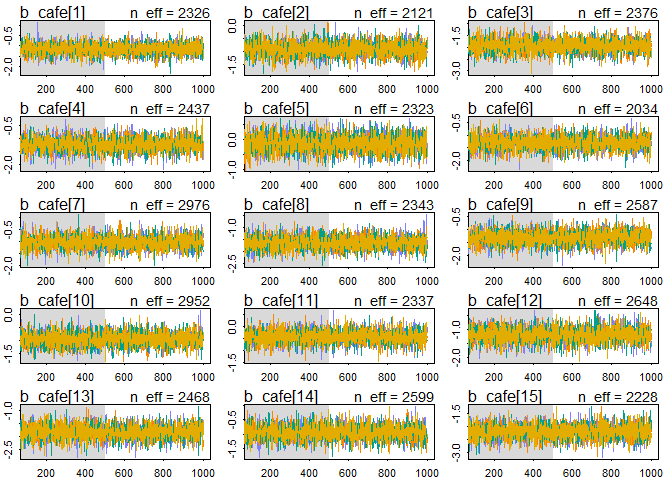<!-- -->

```
## Waiting to draw page 3 of 4
```

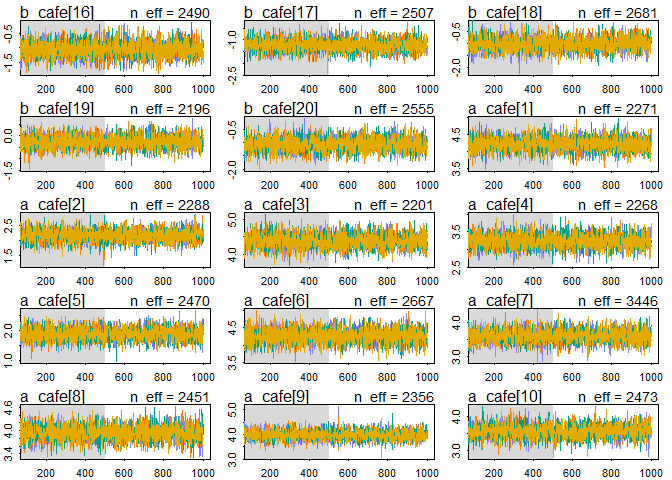<!-- -->

```
## Waiting to draw page 4 of 4
```

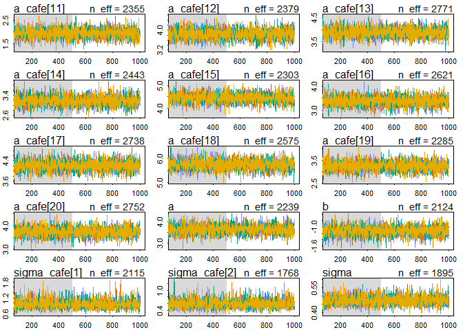<!-- -->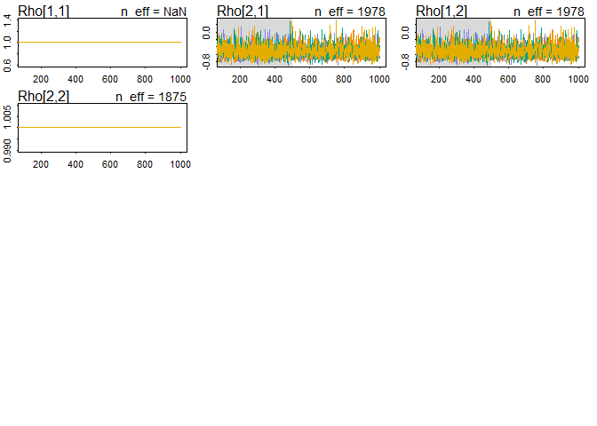<!-- -->

```r
trankplot(m14M1,n_cols = 2)
```

```
## Waiting to draw page 2 of 5
```

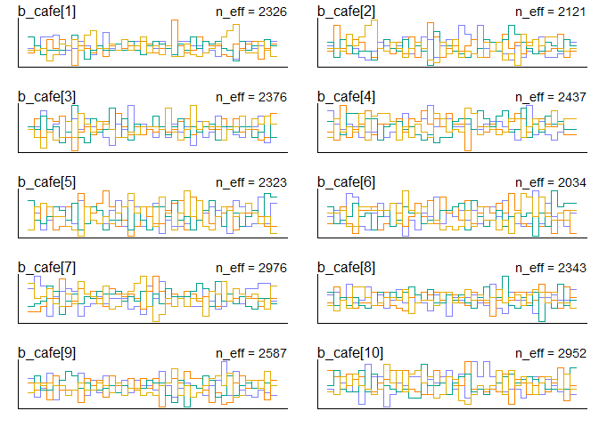<!-- -->

```
## Waiting to draw page 3 of 5
```

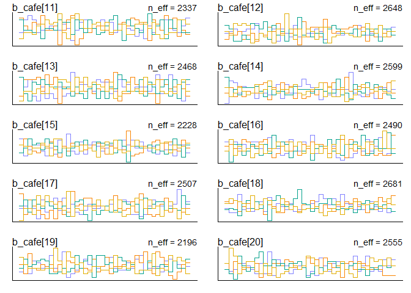<!-- -->

```
## Waiting to draw page 4 of 5
```

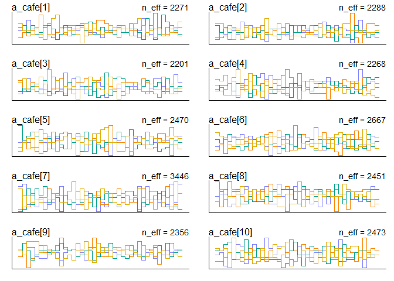<!-- -->

```
## Waiting to draw page 5 of 5
```

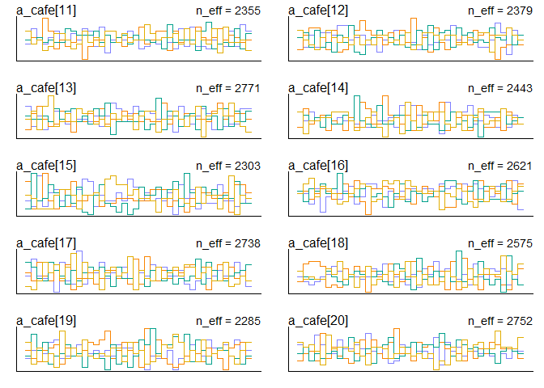<!-- -->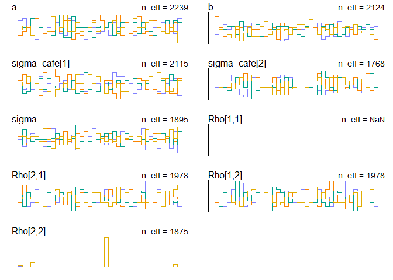<!-- -->
inspect posterior distribution of varying effects

```r
post <- extract.samples(m14M1)
#posterior correlation between intercepts and slopes
dens(post$Rho[,1,2])
```

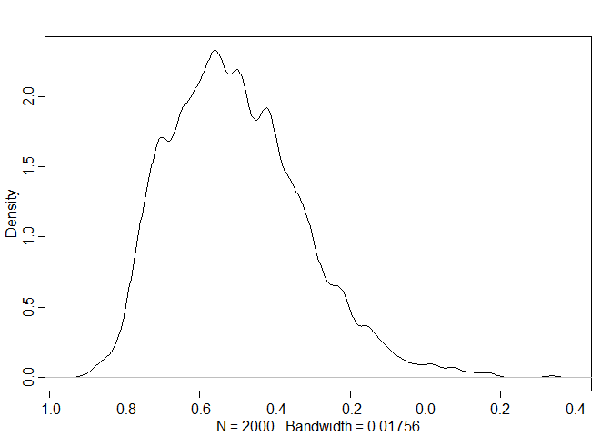<!-- -->
The posterior is concentrated on 0 now, refelecting the data generation process

<!-- !try non-centered model (not finished) -->
# ```{r}
# m14M1_2 <- ulam(
#     alist(
#         wait ~ normal( mu , sigma ),
#         mu <- a[cafe] + b[afternoon],
# 
#         # adapative priors - non-centered
#        #fixed priors
#        # a ~ normal(5,2),
#       # b ~ normal(-1,0.5),
#         sigma_cafe ~ exponential(1),
#         sigma ~ exponential(1),
#         cholesky_factor_corr[4]:L_Rho_cafe ~ lkj_corr_cholesky(2)
#       
#       # compute ordinary correlation matrixes from Cholesky factors
#       gq> matrix[4,4]:Rho_cafe <<- multiply_lower_tri_self_transpose(L_Pho_cafe)
#     ) , data=d , chains=4 , cores=4 , log_lik=TRUE)
# ```

#14M2.Fit this multilevel model to the simulated café data:
Wi ∼ Normal(µi; σ)
µi = αcafé[i] + βcafé[i]Ai
αcafé ∼ Normal(α; σα)
βcafé ∼ Normal(β; σβ)
α ∼ Normal(0; 10)
β ∼ Normal(0; 10)
σ ∼ HalfCauchy(0; 1)  #halfCauchy ???
σα ∼ HalfCauchy(0; 1)
σβ ∼ HalfCauchy(0; 1)
Use WAIC to compare this model to the model from the chapter, the one that uses a multi-variate
Gaussian prior. Explain the result.
set Rho to -0.7, the same as in the book

```r
m14M2 <- ulam(
    alist(
        wait ~ normal(mu , sigma),
        mu <- a_cafe[cafe] + b_cafe[cafe]*afternoon,
        
        # multi-level model
        a_cafe[cafe] ~ normal(a,sigma_a),
        b_cafe[cafe] ~ normal(b,sigma_b),
        
        # adaptative priors centered
        a ~ normal(0,10),
        b ~ normal(0,10),
      
        # fixed prior
        sigma ~ dcauchy(0,1), #HalfCauchy ???
        sigma_a ~ dcauchy(0,1),
        sigma_b ~ dcauchy(0,1)
    ) , data=d , chains=4 , cores=4, log_lik = TRUE)
```


```r
precis(m14M2,depth=2)
```

```
##                  mean         sd       5.5%       94.5%    n_eff     Rhat4
## a_cafe[1]   4.2029608 0.19863122  3.8828571  4.50840370 2632.768 0.9986592
## a_cafe[2]   2.2088550 0.19574563  1.9026996  2.52763990 2178.604 0.9989315
## a_cafe[3]   4.3480965 0.20268684  4.0134379  4.65986135 2579.575 0.9994472
## a_cafe[4]   3.2526318 0.20050441  2.9332116  3.57728539 2442.243 0.9989036
## a_cafe[5]   1.9520021 0.20642971  1.6227944  2.27027271 2143.454 0.9986175
## a_cafe[6]   4.2397117 0.19941348  3.9165013  4.55910721 2390.594 0.9996117
## a_cafe[7]   3.6131654 0.19910728  3.2939439  3.94583641 2271.822 0.9989569
## a_cafe[8]   3.9343440 0.19691010  3.6154274  4.24795479 2149.579 0.9991300
## a_cafe[9]   3.9715290 0.19791008  3.6577984  4.29063998 2396.042 0.9983463
## a_cafe[10]  3.5690379 0.19607846  3.2548562  3.88667324 2590.286 0.9992268
## a_cafe[11]  1.9929695 0.20667730  1.6670607  2.31775157 2370.662 0.9986209
## a_cafe[12]  3.8326189 0.19842203  3.5112533  4.14052755 2561.070 1.0008145
## a_cafe[13]  3.8628781 0.19692295  3.5421039  4.18211788 2611.473 0.9989060
## a_cafe[14]  3.1933769 0.19757459  2.8806503  3.51417549 2072.441 0.9988420
## a_cafe[15]  4.4186948 0.19739306  4.1034798  4.73542141 2357.122 0.9983166
## a_cafe[16]  3.3939749 0.19688456  3.0740102  3.70726032 2305.906 0.9994549
## a_cafe[17]  4.2008156 0.19488505  3.8890084  4.49740049 2730.595 0.9987464
## a_cafe[18]  5.6910600 0.19890879  5.3777766  6.01367738 2201.290 1.0002455
## a_cafe[19]  3.2707971 0.20422879  2.9548008  3.60725591 1677.522 1.0019905
## a_cafe[20]  3.7347010 0.19947745  3.4187231  4.05743178 2243.779 1.0014188
## b_cafe[1]  -1.1092107 0.26425211 -1.5317807 -0.69797335 2288.102 0.9991277
## b_cafe[2]  -1.0160193 0.26130088 -1.4393014 -0.60047886 2261.225 0.9992764
## b_cafe[3]  -1.9183223 0.27307810 -2.3645351 -1.49918264 2249.460 1.0003515
## b_cafe[4]  -1.2681306 0.27105703 -1.6994987 -0.84308389 2695.691 0.9989683
## b_cafe[5]  -0.2524632 0.28008642 -0.7044978  0.18692371 2062.477 0.9998042
## b_cafe[6]  -1.2666314 0.26562546 -1.6873916 -0.83550677 2487.236 0.9993899
## b_cafe[7]  -1.0218359 0.26821859 -1.4524145 -0.59713646 2498.406 0.9992994
## b_cafe[8]  -1.6285205 0.27096089 -2.0636117 -1.19173368 2067.483 0.9996816
## b_cafe[9]  -1.2971135 0.26292057 -1.7183925 -0.88370344 2189.677 0.9990078
## b_cafe[10] -0.9625438 0.26217168 -1.3913077 -0.54533525 2432.090 0.9995162
## b_cafe[11] -0.5454470 0.28073496 -0.9965350 -0.09866262 2489.832 0.9982713
## b_cafe[12] -1.1771851 0.26976193 -1.6205907 -0.75171718 2359.691 0.9986083
## b_cafe[13] -1.8171506 0.26618900 -2.2389586 -1.38303779 2233.741 0.9995118
## b_cafe[14] -0.9775176 0.26898719 -1.4077336 -0.53966345 1930.023 0.9990653
## b_cafe[15] -2.1723591 0.28636373 -2.6189916 -1.72694935 2184.808 0.9986110
## b_cafe[16] -1.0612298 0.26083151 -1.4742970 -0.64580707 2243.567 0.9998823
## b_cafe[17] -1.1774898 0.26259658 -1.5893302 -0.74626556 2479.759 0.9997429
## b_cafe[18] -0.8629434 0.27014530 -1.2972011 -0.41177917 2255.057 1.0015731
## b_cafe[19] -0.2660107 0.28081912 -0.7151368  0.18128572 1936.790 0.9999505
## b_cafe[20] -1.0553199 0.27240790 -1.4867633 -0.60914773 2402.227 1.0007567
## a           3.6453649 0.21606517  3.3057758  3.98544820 2415.613 0.9992041
## b          -1.1503760 0.15469156 -1.3938305 -0.89947574 2321.004 0.9999556
## sigma       0.4756127 0.02693149  0.4342277  0.52259320 1978.557 0.9995680
## sigma_a     0.9430258 0.17291907  0.7152721  1.23732067 1758.815 1.0005682
## sigma_b     0.5765927 0.12362215  0.4018141  0.78797281 1743.550 0.9988502
```

inspect posterior distribution

```r
post <- extract.samples(m14M2)
#posterior correlation between intercepts and slopes
dens(post$a)
```

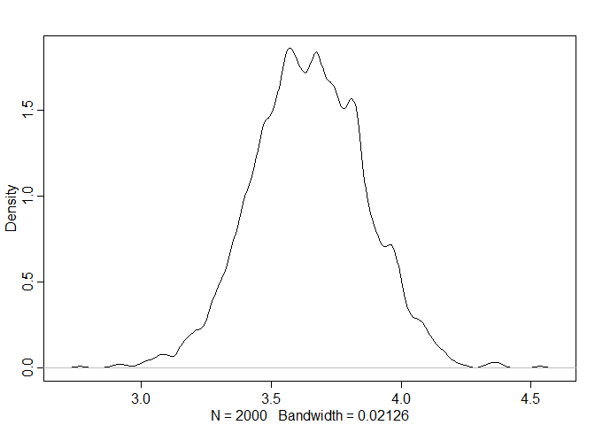<!-- -->

compare multi-level and multi-variate Gaussion model

```r
compare(m14M1,m14M2)
```

```
##           WAIC       SE    dWAIC      dSE    pWAIC    weight
## m14M1 305.4853 17.71064 0.000000       NA 33.22390 0.6645218
## m14M2 306.8523 17.95200 1.367021 2.044485 32.87544 0.3354782
```
multi-variate Gaussion model is better, but overall they are quite similar as in below.


```r
plot(compare(m14M1,m14M2))
```

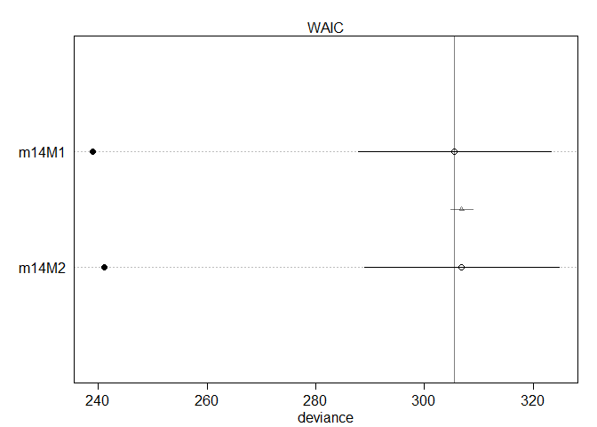<!-- -->


2. Update last weeks problems if necessary. Can you fit non-centered models? Are you using multivariate normal distributions where appropriate?


3. Rongkui's Instrumental Variable problem (see earlier email)


4. Attached are data from an experiment measuring hypocotyl length in ~ 180 natural arabidopsis accessions grown in high and low red:far-red light.  We want to know if there are differences in accessions in their length in high R:FR ("H") and in their response to low R:FR("L").  Also we want to obtain an estimate for hypocotyl length for each accession in high and low R:FR for downstream GWAS analysis.

Relevant variables:
length -- hypocotyl length
line -- unique ID for each accession (you could also use nativename)
light -- indicator for high or low RFR
exp -- two independent experiments were done
plate -- this is an incomplete block design with a subset (10? 12?) of accessions on each plate.
Let's try a variety of increasingly complex models:
 No pooling
 Partial pooling of intercepts and slopes for line and intercepts for plate and experiment, but treat each variable separately (no multivariate component).  you might also consider adding an experiment slope effect
As 2, but use a multivariate normal model for the line slope and intercept effects
As 3, but non-centered
Evaluate and compare the models.  Is there evidence of line, treatment, and line X treatment effects?  How does the magnitude of the experiment and plate effects compare to the line effects?

