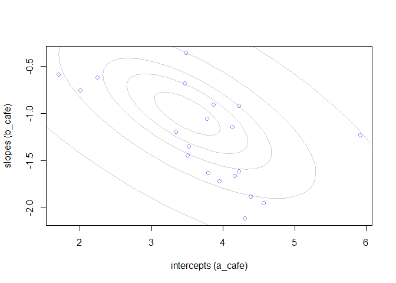
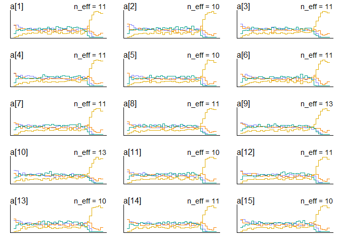
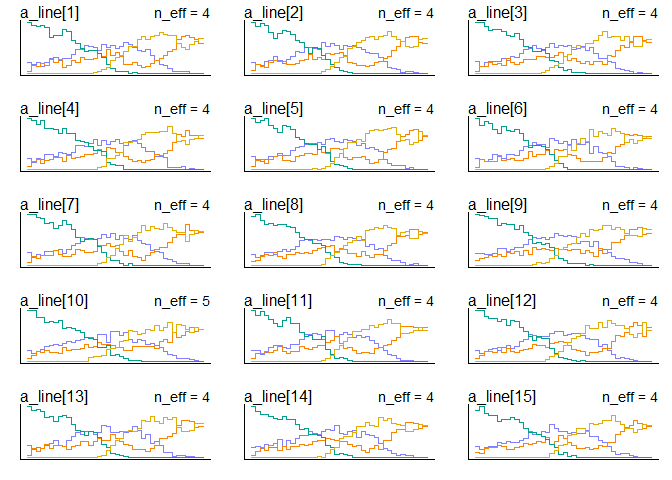
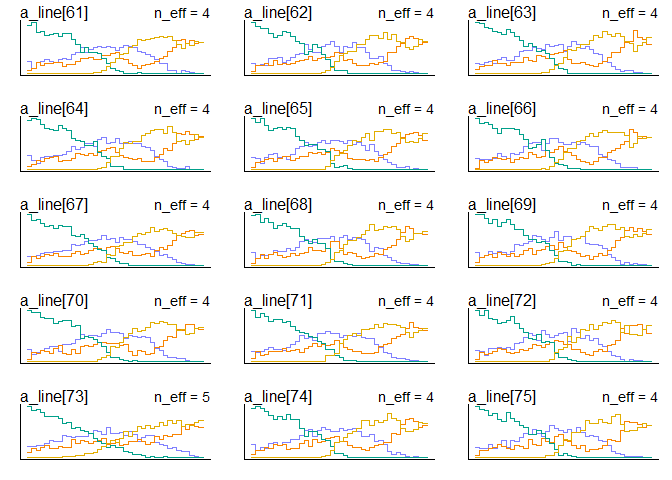
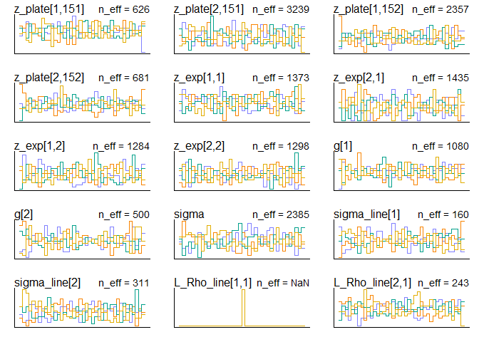
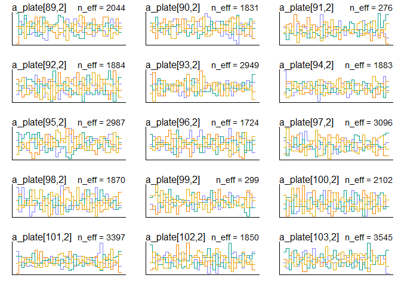

#14M1.Repeat the café robot simulation from the beginning of the chapter. This time, set rho to zero, so that there is no correlation between intercepts and slopes. How does the posterior distribution of the correlation reflect this change in the underlying simulation?


```r
a <- 3.5            # average morning wait time
b <- (-1)           # average difference afternoon wait time
sigma_a <- 1        # std dev in intercepts
sigma_b <- 0.5      # std dev in slopes
rho <- (-0.7)      # correlation between intercepts and slopes
```


```r
Mu <- c( a , b )
```


```r
cov_ab <- sigma_a*sigma_b*rho
Sigma <- matrix( c(sigma_a^2,cov_ab,cov_ab,sigma_b^2) , ncol=2 )
```


```r
N_cafes <- 20
```


```r
library(MASS)
set.seed(5) # used to replicate example
vary_effects <- mvrnorm( N_cafes , Mu , Sigma )
```


```r
a_cafe <- vary_effects[,1]
b_cafe <- vary_effects[,2]
```


```r
library(rethinking)
```

```
## Loading required package: rstan
```

```
## Loading required package: StanHeaders
```

```
## Loading required package: ggplot2
```

```
## rstan (Version 2.19.3, GitRev: 2e1f913d3ca3)
```

```
## For execution on a local, multicore CPU with excess RAM we recommend calling
## options(mc.cores = parallel::detectCores()).
## To avoid recompilation of unchanged Stan programs, we recommend calling
## rstan_options(auto_write = TRUE)
```

```
## For improved execution time, we recommend calling
## Sys.setenv(LOCAL_CPPFLAGS = '-march=corei7 -mtune=corei7')
## although this causes Stan to throw an error on a few processors.
```

```
## Loading required package: parallel
```

```
## Loading required package: dagitty
```

```
## rethinking (Version 1.95)
```

```
## 
## Attaching package: 'rethinking'
```

```
## The following object is masked from 'package:stats':
## 
##     rstudent
```

```r
plot( a_cafe , b_cafe , col=rangi2 ,
    xlab="intercepts (a_cafe)" , ylab="slopes (b_cafe)" )

# overlay population distribution
library(ellipse)
```

```
## Warning: package 'ellipse' was built under R version 3.6.3
```

```
## 
## Attaching package: 'ellipse'
```

```
## The following object is masked from 'package:rethinking':
## 
##     pairs
```

```
## The following object is masked from 'package:graphics':
## 
##     pairs
```

```r
for ( l in c(0.1,0.3,0.5,0.8,0.99) )
    lines(ellipse(Sigma,centre=Mu,level=l),col=col.alpha("black",0.2))
```

<!-- -->
No correlation shown between intercept and slope

simulates 10 visits to each cafe, 5 in the morning and 5 in the afternoon, and combine into a dataframe

```r
set.seed(22)
N_visits <- 10
afternoon <- rep(0:1,N_visits*N_cafes/2)
cafe_id <- rep( 1:N_cafes , each=N_visits )
mu <- a_cafe[cafe_id] + b_cafe[cafe_id]*afternoon
sigma <- 0.5  # std dev within cafes
wait <- rnorm( N_visits*N_cafes , mu , sigma )
d <- data.frame( cafe=cafe_id , afternoon=afternoon , wait=wait )
```

fit the model

```r
m14M1 <- ulam(
    alist(
        wait ~ normal( mu , sigma ),
        mu <- a_cafe[cafe] + b_cafe[cafe]*afternoon,
        c(a_cafe,b_cafe)[cafe] ~ multi_normal( c(a,b) , Rho , sigma_cafe ),
        a ~ normal(5,2),
        b ~ normal(-1,0.5),
        sigma_cafe ~ exponential(1),
        sigma ~ exponential(1),
        Rho ~ lkj_corr(2)
    ) , data=d , chains=4 , cores=4 , log_lik = TRUE)
```

```
## Warning: The largest R-hat is NA, indicating chains have not mixed.
## Running the chains for more iterations may help. See
## http://mc-stan.org/misc/warnings.html#r-hat
```

```
## Warning: Bulk Effective Samples Size (ESS) is too low, indicating posterior means and medians may be unreliable.
## Running the chains for more iterations may help. See
## http://mc-stan.org/misc/warnings.html#bulk-ess
```

```
## Warning: Tail Effective Samples Size (ESS) is too low, indicating posterior variances and tail quantiles may be unreliable.
## Running the chains for more iterations may help. See
## http://mc-stan.org/misc/warnings.html#tail-ess
```
!above model not go through with prompt
The largest R-hat is NA, indicating chains have not mixed.
Running the chains for more iterations may help
tried iter up to 6000, not working

```r
#marginal posterior distributions
plot(precis(m14M1,depth = 3))
```

<!-- -->

```r
precis(m14M1,depth = 3)
```

```
##                     mean           sd       5.5%       94.5%    n_eff     Rhat4
## b_cafe[1]     -1.1494855 2.669331e-01 -1.5667408 -0.72960448 2325.846 1.0001683
## b_cafe[2]     -0.8992284 2.652712e-01 -1.3183435 -0.48518758 2120.522 0.9991882
## b_cafe[3]     -1.9480227 2.798793e-01 -2.3869829 -1.49499245 2375.921 1.0009773
## b_cafe[4]     -1.2324688 2.672595e-01 -1.6573210 -0.80217343 2436.928 1.0004742
## b_cafe[5]     -0.1331900 2.856303e-01 -0.5790025  0.32775577 2323.453 1.0000059
## b_cafe[6]     -1.3015016 2.735684e-01 -1.7445514 -0.87108488 2034.356 0.9984547
## b_cafe[7]     -1.0285851 2.635330e-01 -1.4519581 -0.61629322 2975.508 0.9985961
## b_cafe[8]     -1.6390617 2.637294e-01 -2.0469054 -1.22680694 2343.378 0.9994078
## b_cafe[9]     -1.3066812 2.565750e-01 -1.7066680 -0.89706450 2586.619 1.0020322
## b_cafe[10]    -0.9485645 2.625543e-01 -1.3537033 -0.52458783 2951.995 0.9994077
## b_cafe[11]    -0.4289445 2.771088e-01 -0.8581326  0.01309357 2336.721 0.9995411
## b_cafe[12]    -1.1876104 2.709955e-01 -1.6130619 -0.76058135 2647.961 0.9993531
## b_cafe[13]    -1.8233730 2.714941e-01 -2.2576005 -1.38811044 2468.429 0.9994315
## b_cafe[14]    -0.9417839 2.577837e-01 -1.3481485 -0.53410662 2598.937 0.9990381
## b_cafe[15]    -2.1960511 2.830811e-01 -2.6501810 -1.74451507 2228.400 0.9988755
## b_cafe[16]    -1.0427541 2.653981e-01 -1.4554641 -0.60186851 2490.133 0.9999399
## b_cafe[17]    -1.2294284 2.615503e-01 -1.6462067 -0.80287429 2506.844 1.0000370
## b_cafe[18]    -1.0160823 2.766536e-01 -1.4614130 -0.57838103 2680.514 1.0003549
## b_cafe[19]    -0.2538980 2.811445e-01 -0.7095752  0.18891631 2195.855 0.9998102
## b_cafe[20]    -1.0528513 2.560310e-01 -1.4611407 -0.64781242 2554.980 0.9992673
## a_cafe[1]      4.2166510 2.032868e-01  3.8962421  4.54104211 2271.355 0.9991281
## a_cafe[2]      2.1634278 2.014227e-01  1.8454269  2.48787221 2288.311 0.9994243
## a_cafe[3]      4.3786399 2.022642e-01  4.0594563  4.71230816 2201.449 1.0002065
## a_cafe[4]      3.2439970 1.969236e-01  2.9233479  3.56986662 2268.048 1.0012682
## a_cafe[5]      1.8743036 2.142397e-01  1.5360866  2.22026926 2470.320 1.0006243
## a_cafe[6]      4.2635814 2.109563e-01  3.9154139  4.60863021 2667.363 0.9989171
## a_cafe[7]      3.6174849 2.006645e-01  3.3026323  3.92701585 3446.141 0.9987461
## a_cafe[8]      3.9501758 1.995922e-01  3.6263539  4.27367111 2450.517 0.9997049
## a_cafe[9]      3.9810968 1.968983e-01  3.6757396  4.29855239 2355.632 1.0030917
## a_cafe[10]     3.5623999 1.968011e-01  3.2477556  3.87279263 2473.072 1.0016683
## a_cafe[11]     1.9280001 2.054665e-01  1.5963776  2.24823979 2355.023 0.9988211
## a_cafe[12]     3.8419813 2.032389e-01  3.5113805  4.16325685 2378.721 1.0007642
## a_cafe[13]     3.8890020 2.010227e-01  3.5688449  4.21099895 2771.331 1.0003735
## a_cafe[14]     3.1748733 1.954539e-01  2.8679645  3.49081620 2442.946 0.9986792
## a_cafe[15]     4.4571134 2.042277e-01  4.1313520  4.78389581 2302.744 0.9989796
## a_cafe[16]     3.3871684 2.015144e-01  3.0617832  3.70998295 2620.634 0.9992624
## a_cafe[17]     4.2189505 2.010686e-01  3.9053432  4.53852028 2737.740 0.9991970
## a_cafe[18]     5.7416507 2.024100e-01  5.4109693  6.05811073 2574.819 1.0010483
## a_cafe[19]     3.2455089 2.074309e-01  2.9191363  3.59043724 2285.273 0.9989401
## a_cafe[20]     3.7299550 1.954286e-01  3.4117838  4.03621324 2751.979 0.9996420
## a              3.6523868 2.204402e-01  3.3094610  4.01596262 2238.942 1.0015726
## b             -1.1306449 1.472713e-01 -1.3649172 -0.90298781 2124.214 1.0004474
## sigma_cafe[1]  0.9574826 1.620257e-01  0.7331795  1.23523385 2114.636 0.9995461
## sigma_cafe[2]  0.5971836 1.264935e-01  0.4176872  0.81064075 1767.666 0.9997443
## sigma          0.4732856 2.758979e-02  0.4317900  0.51805183 1895.329 1.0012587
## Rho[1,1]       1.0000000 0.000000e+00  1.0000000  1.00000000      NaN       NaN
## Rho[1,2]      -0.5026399 1.784988e-01 -0.7499561 -0.19816098 1977.595 1.0022136
## Rho[2,1]      -0.5026399 1.784988e-01 -0.7499561 -0.19816098 1977.595 1.0022136
## Rho[2,2]       1.0000000 7.617258e-17  1.0000000  1.00000000 1874.549 0.9979980
```


```r
traceplot(m14M1)
```

```
## Waiting to draw page 2 of 4
```

<!-- -->

```
## Waiting to draw page 3 of 4
```

<!-- -->

```
## Waiting to draw page 4 of 4
```

<!-- --><!-- -->

```r
trankplot(m14M1,n_cols = 2)
```

```
## Waiting to draw page 2 of 5
```

<!-- -->

```
## Waiting to draw page 3 of 5
```

<!-- -->

```
## Waiting to draw page 4 of 5
```

<!-- -->

```
## Waiting to draw page 5 of 5
```

<!-- --><!-- -->
inspect posterior distribution of varying effects

```r
post <- extract.samples(m14M1)
#posterior correlation between intercepts and slopes
dens(post$Rho[,1,2])
```

<!-- -->
The posterior is concentrated on 0 now, refelecting the data generation process

non-centered ?
# ```{r}
# m14M1_2 <- ulam(
#     alist(
#         wait ~ normal( mu , sigma ),
#         mu <- a[cafe] + b[afternoon],
# 
#         # adapative priors - non-centered
#        #fixed priors
#        # a ~ normal(5,2),
#       # b ~ normal(-1,0.5),
#         sigma_cafe ~ exponential(1),
#         sigma ~ exponential(1),
#         cholesky_factor_corr[4]:L_Rho_cafe ~ lkj_corr_cholesky(2)
#       
#       # compute ordinary correlation matrixes from Cholesky factors
#       gq> matrix[4,4]:Rho_cafe <<- multiply_lower_tri_self_transpose(L_Pho_cafe)
#     ) , data=d , chains=4 , cores=4 , log_lik=TRUE)
# ```

#14M2.Fit this multilevel model to the simulated café data:
Wi ∼ Normal(µi; σ)
µi = αcafé[i] + βcafé[i]Ai
αcafé ∼ Normal(α; σα)
βcafé ∼ Normal(β; σβ)
α ∼ Normal(0; 10)
β ∼ Normal(0; 10)
σ ∼ HalfCauchy(0; 1)  #halfCauchy ???
σα ∼ HalfCauchy(0; 1)
σβ ∼ HalfCauchy(0; 1)
Use WAIC to compare this model to the model from the chapter, the one that uses a multi-variate
Gaussian prior. Explain the result.
set Rho to -0.7, the same as in the book

```r
m14M2 <- ulam(
    alist(
        wait ~ normal(mu , sigma),
        mu <- a_cafe[cafe] + b_cafe[cafe]*afternoon,
        
        # multi-level model
        a_cafe[cafe] ~ normal(a,sigma_a),
        b_cafe[cafe] ~ normal(b,sigma_b),
        
        # adaptative priors centered
        a ~ normal(0,10),
        b ~ normal(0,10),
      
        # fixed prior
        sigma ~ dcauchy(0,1), #HalfCauchy ???
        sigma_a ~ dcauchy(0,1),
        sigma_b ~ dcauchy(0,1)
    ) , data=d , chains=4 , cores=4, log_lik = TRUE)
```


```r
precis(m14M2,depth=2)
```

```
##                  mean         sd       5.5%       94.5%    n_eff     Rhat4
## a_cafe[1]   4.2029608 0.19863122  3.8828571  4.50840370 2632.768 0.9986592
## a_cafe[2]   2.2088550 0.19574563  1.9026996  2.52763990 2178.604 0.9989315
## a_cafe[3]   4.3480965 0.20268684  4.0134379  4.65986135 2579.575 0.9994472
## a_cafe[4]   3.2526318 0.20050441  2.9332116  3.57728539 2442.243 0.9989036
## a_cafe[5]   1.9520021 0.20642971  1.6227944  2.27027271 2143.454 0.9986175
## a_cafe[6]   4.2397117 0.19941348  3.9165013  4.55910721 2390.594 0.9996117
## a_cafe[7]   3.6131654 0.19910728  3.2939439  3.94583641 2271.822 0.9989569
## a_cafe[8]   3.9343440 0.19691010  3.6154274  4.24795479 2149.579 0.9991300
## a_cafe[9]   3.9715290 0.19791008  3.6577984  4.29063998 2396.042 0.9983463
## a_cafe[10]  3.5690379 0.19607846  3.2548562  3.88667324 2590.286 0.9992268
## a_cafe[11]  1.9929695 0.20667730  1.6670607  2.31775157 2370.662 0.9986209
## a_cafe[12]  3.8326189 0.19842203  3.5112533  4.14052755 2561.070 1.0008145
## a_cafe[13]  3.8628781 0.19692295  3.5421039  4.18211788 2611.473 0.9989060
## a_cafe[14]  3.1933769 0.19757459  2.8806503  3.51417549 2072.441 0.9988420
## a_cafe[15]  4.4186948 0.19739306  4.1034798  4.73542141 2357.122 0.9983166
## a_cafe[16]  3.3939749 0.19688456  3.0740102  3.70726032 2305.906 0.9994549
## a_cafe[17]  4.2008156 0.19488505  3.8890084  4.49740049 2730.595 0.9987464
## a_cafe[18]  5.6910600 0.19890879  5.3777766  6.01367738 2201.290 1.0002455
## a_cafe[19]  3.2707971 0.20422879  2.9548008  3.60725591 1677.522 1.0019905
## a_cafe[20]  3.7347010 0.19947745  3.4187231  4.05743178 2243.779 1.0014188
## b_cafe[1]  -1.1092107 0.26425211 -1.5317807 -0.69797335 2288.102 0.9991277
## b_cafe[2]  -1.0160193 0.26130088 -1.4393014 -0.60047886 2261.225 0.9992764
## b_cafe[3]  -1.9183223 0.27307810 -2.3645351 -1.49918264 2249.460 1.0003515
## b_cafe[4]  -1.2681306 0.27105703 -1.6994987 -0.84308389 2695.691 0.9989683
## b_cafe[5]  -0.2524632 0.28008642 -0.7044978  0.18692371 2062.477 0.9998042
## b_cafe[6]  -1.2666314 0.26562546 -1.6873916 -0.83550677 2487.236 0.9993899
## b_cafe[7]  -1.0218359 0.26821859 -1.4524145 -0.59713646 2498.406 0.9992994
## b_cafe[8]  -1.6285205 0.27096089 -2.0636117 -1.19173368 2067.483 0.9996816
## b_cafe[9]  -1.2971135 0.26292057 -1.7183925 -0.88370344 2189.677 0.9990078
## b_cafe[10] -0.9625438 0.26217168 -1.3913077 -0.54533525 2432.090 0.9995162
## b_cafe[11] -0.5454470 0.28073496 -0.9965350 -0.09866262 2489.832 0.9982713
## b_cafe[12] -1.1771851 0.26976193 -1.6205907 -0.75171718 2359.691 0.9986083
## b_cafe[13] -1.8171506 0.26618900 -2.2389586 -1.38303779 2233.741 0.9995118
## b_cafe[14] -0.9775176 0.26898719 -1.4077336 -0.53966345 1930.023 0.9990653
## b_cafe[15] -2.1723591 0.28636373 -2.6189916 -1.72694935 2184.808 0.9986110
## b_cafe[16] -1.0612298 0.26083151 -1.4742970 -0.64580707 2243.567 0.9998823
## b_cafe[17] -1.1774898 0.26259658 -1.5893302 -0.74626556 2479.759 0.9997429
## b_cafe[18] -0.8629434 0.27014530 -1.2972011 -0.41177917 2255.057 1.0015731
## b_cafe[19] -0.2660107 0.28081912 -0.7151368  0.18128572 1936.790 0.9999505
## b_cafe[20] -1.0553199 0.27240790 -1.4867633 -0.60914773 2402.227 1.0007567
## a           3.6453649 0.21606517  3.3057758  3.98544820 2415.613 0.9992041
## b          -1.1503760 0.15469156 -1.3938305 -0.89947574 2321.004 0.9999556
## sigma       0.4756127 0.02693149  0.4342277  0.52259320 1978.557 0.9995680
## sigma_a     0.9430258 0.17291907  0.7152721  1.23732067 1758.815 1.0005682
## sigma_b     0.5765927 0.12362215  0.4018141  0.78797281 1743.550 0.9988502
```

inspect posterior distribution

```r
post <- extract.samples(m14M2)
#posterior correlation between intercepts and slopes
dens(post$a)
```

<!-- -->

compare multi-level and multi-variate Gaussion model

```r
compare(m14M1,m14M2)
```

```
##           WAIC       SE    dWAIC      dSE    pWAIC    weight
## m14M1 305.4853 17.71064 0.000000       NA 33.22390 0.6645218
## m14M2 306.8523 17.95200 1.367021 2.044485 32.87544 0.3354782
```
multi-variate Gaussion model is better, but overall they are quite similar as in below.


```r
plot(compare(m14M1,m14M2))
```

<!-- -->


2. Update last weeks problems if necessary. Can you fit non-centered models? Are you using multivariate normal distributions where appropriate?

?how to fit non-centered model to cafe dataset

3. Rongkui's Instrumental Variable problem (see earlier email)
simulated data on effect of education on wages

```r
set.seed(73)
N <- 500 #simulate 500 people
U_sim <- rnorm(N)
Q_sim <- sample(1:4,size = N,replace = TRUE) # quarter of the year each person is born in 
E_sim <- rnorm(N, U_sim+Q_sim) # larger value of Q_sim associated with more education, beta_QE is one
W_sim <- rnorm(N, U_sim+0*E_sim) #education has no effect on wages, beta_EW is zero
dat_sim <- list(
  W = standardize(W_sim),
  E = standardize(E_sim),
  Q = standardize(Q_sim)
)
```

E and W confounded by U, without knowing U, directly regress wages on education would generate
the inference of "education leads to higher wages"

```r
m14.4 <- ulam(
  alist(
    W ~ dnorm(mu,sigma),
    mu <- aW + bEW*E,
    aW ~ dnorm(0,0.2),
    bEW ~ dnorm(0,0.5),
    sigma ~ dexp(1)
  ),data = dat_sim, chains = 4, cores = 4
)
```


```r
trankplot(m14.4)
```

<!-- -->


```r
precis(m14.4)
```

```
##              mean         sd        5.5%      94.5%    n_eff     Rhat4
## aW    0.001202152 0.04037652 -0.06347356 0.06607981 1706.487 1.0029059
## bEW   0.397292299 0.03973951  0.33541289 0.45833100 1786.064 1.0015440
## sigma 0.918847608 0.03116978  0.86996310 0.97097246 1846.831 0.9990899
```

Consider W & E as covariance caused by the unknown confounder U

```r
m14.5 <- ulam(
  alist(
    c(W,E) ~ multi_normal(c(muW,muE), Rho, Sigma),
    muW <- aW + bEW * E,
    muE <- aE + bQE * Q,
    c(aW,aE) ~ normal(0,0.2),
    c(bEW,bQE) ~ normal(0,0.5),
    Rho ~ lkj_corr(2),
    Sigma ~ exponential(1)
  ), data = dat_sim, chains = 4, cores = 4
)
```

```
## Warning: The largest R-hat is NA, indicating chains have not mixed.
## Running the chains for more iterations may help. See
## http://mc-stan.org/misc/warnings.html#r-hat
```

```
## Warning: Bulk Effective Samples Size (ESS) is too low, indicating posterior means and medians may be unreliable.
## Running the chains for more iterations may help. See
## http://mc-stan.org/misc/warnings.html#bulk-ess
```

```
## Warning: Tail Effective Samples Size (ESS) is too low, indicating posterior variances and tail quantiles may be unreliable.
## Running the chains for more iterations may help. See
## http://mc-stan.org/misc/warnings.html#tail-ess
```

```r
trankplot(m14.5)
```

<!-- -->

```r
plot(precis(m14.5,depth = 3))
```

<!-- -->
try other simulations, sample from posterior !new code

```r
m14.4x <- ulam(m14.4, data = dat_sim, chains = 4, cores = 4)
m14.5x <- ulam(m14.5, data = dat_sim, chains = 4, cores = 4)
```

```
## Warning: The largest R-hat is NA, indicating chains have not mixed.
## Running the chains for more iterations may help. See
## http://mc-stan.org/misc/warnings.html#r-hat
```

```
## Warning: Bulk Effective Samples Size (ESS) is too low, indicating posterior means and medians may be unreliable.
## Running the chains for more iterations may help. See
## http://mc-stan.org/misc/warnings.html#bulk-ess
```

```
## Warning: Tail Effective Samples Size (ESS) is too low, indicating posterior variances and tail quantiles may be unreliable.
## Running the chains for more iterations may help. See
## http://mc-stan.org/misc/warnings.html#tail-ess
```
simulate a positive effect of education on wages

```r
set.seed(73)
N <- 500 #simulate 500 people
U_sim <- rnorm(N)
Q_sim <- sample(1:4,size = N,replace = TRUE) # quarter of the year each person is born in 
E_sim <- rnorm(N, U_sim+Q_sim) # larger value of Q_sim associated with more education, beta_QE is one
W_sim <- rnorm(N, U_sim+0.2*E_sim) #education has no effect on wages, beta_EW is zero
dat_sim <- list(
  W = standardize(W_sim),
  E = standardize(E_sim),
  Q = standardize(Q_sim)
)
```


```r
library(dagitty)
dagIV <- dagitty("dag{
E -> W
E <- U -> W
Q -> E
}")
instrumentalVariables(dagIV, exposure = "E", outcome = "W")
```

```
##  Q
```
Look at the data from the paper later

4. Attached are data from an experiment measuring hypocotyl length in ~ 180 natural arabidopsis accessions grown in high and low red:far-red light.  We want to know if there are differences in accessions in their length in high R:FR ("H") and in their response to low R:FR("L").  Also we want to obtain an estimate for hypocotyl length for each accession in high and low R:FR for downstream GWAS analysis.

Relevant variables:
length -- hypocotyl length
line -- unique ID for each accession (you could also use nativename)
light -- indicator for high or low RFR
exp -- two independent experiments were done
plate -- this is an incomplete block design with a subset (10? 12?) of accessions on each plate.

```r
library(rethinking)
hypocotypl <- read.csv(file = "hyp.lengths.both.experiments.labels.csv",stringsAsFactors = FALSE)
hypocotypl$S =ifelse(hypocotypl$light=="H",1L,2L)
hypocotypl$E =ifelse(hypocotypl$exp =="A",1L,2L)
hypocotypl$L = standardize(hypocotypl$length)
#plate_levels <- c(1:152)
hypocotypl$P <- as.numeric(as.factor(hypocotypl$plate))
d <- list(
  S = hypocotypl$S,
  E = hypocotypl$E,
  L = hypocotypl$L,
  P = hypocotypl$P,
  A = as.numeric(as.factor(hypocotypl$line))
)
```

Let's try a variety of increasingly complex models:
No pooling

```r
m1 <- ulam(
  alist(
    L ~ dnorm(mu,sigma), #normal() ?
    mu <- a+b_shield*S, #a mean light treatment effect on accesion
    a ~ dnorm(0,1.5),
    b_shield ~ dnorm(0,1.5),
    sigma ~ dexp(1)  #exponential()
  ),data = d, chains = 4, cores = 4, log_lik = TRUE
)
```


```r
trankplot(m1)
```

<!-- -->


```r
precis(m1)
```

```
##                mean         sd       5.5%      94.5%     n_eff    Rhat4
## a        -1.1924094 0.02283038 -1.2276893 -1.1556870  588.0834 1.004075
## b_shield  0.7984943 0.01444250  0.7757436  0.8209195  587.8724 1.004301
## sigma     0.9169321 0.00478514  0.9094555  0.9248346 1020.5223 1.001979
```
the standardized mean length is around 0.4
high red:far-red light ratio a negative influence on hypocotyl length on all accesions in general
there is a large variation within the data

Partial pooling of intercepts and slopes for line and intercepts for plate and experiment, but treat each variable separately (no multivariate component).  you might also consider adding an experiment slope effect

```r
#no experiment slope effect
m2 <- ulam(
  alist(
    L ~ dnorm(mu,sigma),
    mu <- a[A]+b[A]*S+a_p[P]+a_e[E],
    
    # partial pooling & adaptative prior
    a[A] ~ dnorm(a_bar,sigma),
    a_bar ~ dnorm(0,1.5),
    sigma ~ dexp(1),
    
    b[A] ~ dnorm(0,sigma_b),
    sigma_b ~ dexp(1),
    
    a_p[P] ~ dnorm(0,sigma_p),
    sigma_p ~ dexp(1),
    
    a_e[E] ~ dnorm(0,sigma_e),
    sigma_e ~ dexp(1) 
  ),data = d, chains = 4, cores = 4, log_lik = TRUE, iter = 4000 
)
```

```
## Warning: There were 2 divergent transitions after warmup. Increasing adapt_delta above 0.95 may help. See
## http://mc-stan.org/misc/warnings.html#divergent-transitions-after-warmup
```

```
## Warning: There were 1998 transitions after warmup that exceeded the maximum treedepth. Increase max_treedepth above 10. See
## http://mc-stan.org/misc/warnings.html#maximum-treedepth-exceeded
```

```
## Warning: Examine the pairs() plot to diagnose sampling problems
```

```
## Warning: The largest R-hat is 1.25, indicating chains have not mixed.
## Running the chains for more iterations may help. See
## http://mc-stan.org/misc/warnings.html#r-hat
```

```
## Warning: Bulk Effective Samples Size (ESS) is too low, indicating posterior means and medians may be unreliable.
## Running the chains for more iterations may help. See
## http://mc-stan.org/misc/warnings.html#bulk-ess
```

```
## Warning: Tail Effective Samples Size (ESS) is too low, indicating posterior variances and tail quantiles may be unreliable.
## Running the chains for more iterations may help. See
## http://mc-stan.org/misc/warnings.html#tail-ess
```

```r
#re-parameterize?
```

```r
trankplot(m2)
```

```
## Waiting to draw page 2 of 35
```

<!-- -->

```
## Waiting to draw page 3 of 35
```

<!-- -->

```
## Waiting to draw page 4 of 35
```

<!-- -->

```
## Waiting to draw page 5 of 35
```

<!-- -->

```
## Waiting to draw page 6 of 35
```

<!-- -->

```
## Waiting to draw page 7 of 35
```

<!-- -->

```
## Waiting to draw page 8 of 35
```

<!-- -->

```
## Waiting to draw page 9 of 35
```

<!-- -->

```
## Waiting to draw page 10 of 35
```

<!-- -->

```
## Waiting to draw page 11 of 35
```

<!-- -->

```
## Waiting to draw page 12 of 35
```

<!-- -->

```
## Waiting to draw page 13 of 35
```

<!-- -->

```
## Waiting to draw page 14 of 35
```

<!-- -->

```
## Waiting to draw page 15 of 35
```

<!-- -->

```
## Waiting to draw page 16 of 35
```

<!-- -->

```
## Waiting to draw page 17 of 35
```

<!-- -->

```
## Waiting to draw page 18 of 35
```

<!-- -->

```
## Waiting to draw page 19 of 35
```

<!-- -->

```
## Waiting to draw page 20 of 35
```

<!-- -->

```
## Waiting to draw page 21 of 35
```

<!-- -->

```
## Waiting to draw page 22 of 35
```

<!-- -->

```
## Waiting to draw page 23 of 35
```

<!-- -->

```
## Waiting to draw page 24 of 35
```

<!-- -->

```
## Waiting to draw page 25 of 35
```

<!-- -->

```
## Waiting to draw page 26 of 35
```

<!-- -->

```
## Waiting to draw page 27 of 35
```

<!-- -->

```
## Waiting to draw page 28 of 35
```

<!-- -->

```
## Waiting to draw page 29 of 35
```

<!-- -->

```
## Waiting to draw page 30 of 35
```

<!-- -->

```
## Waiting to draw page 31 of 35
```

<!-- -->

```
## Waiting to draw page 32 of 35
```

<!-- -->

```
## Waiting to draw page 33 of 35
```

<!-- -->

```
## Waiting to draw page 34 of 35
```

<!-- -->

```
## Waiting to draw page 35 of 35
```

<!-- --><!-- -->
n_eff is < 50 for a[accesion], doubt if it could get much better with more iterations,model should be modified
other parameters b[accesion] is very good
a[p] bad ~500 n_eff
a[e] bad ~50


```r
precis(m2,depth = 2)
```

```
##                   mean          sd         5.5%         94.5%        n_eff
## a[1]     -8.993198e-03 0.612994853 -0.715867992  1.3521948122    10.555497
## a[2]     -4.881919e-01 0.610556713 -1.190763857  0.8895359747    10.403505
## a[3]     -5.805471e-01 0.639219982 -1.372399903  0.7951190729    11.337319
## a[4]      1.643458e+00 0.617972899  0.926923459  3.0037344449    10.549210
## a[5]      8.926347e-01 0.613656541  0.186430109  2.2649305514    10.376458
## a[6]      5.519179e-01 0.607281897 -0.136366772  1.9100356870    10.509745
## a[7]     -6.302099e-01 0.621703888 -1.357284545  0.7410158182    10.696874
## a[8]     -8.517612e-01 0.634920928 -1.625129626  0.5171026700    11.130788
## a[9]     -5.166839e-01 0.668165041 -1.375540381  0.8543862193    12.639682
## a[10]    -2.205146e-01 0.689378822 -1.125029611  1.1672972574    13.077105
## a[11]    -1.495422e+00 0.611813982 -2.201080200 -0.1217016394    10.385316
## a[12]    -5.055267e-01 0.617542937 -1.231550157  0.8488461303    10.786162
## a[13]    -3.999410e-01 0.606564864 -1.090778195  0.9510958229    10.471886
## a[14]     1.342806e-01 0.614731164 -0.580094604  1.4888897382    10.977706
## a[15]    -4.603013e-05 0.616174093 -0.728338237  1.3378506078    10.457147
## a[16]    -6.834861e-01 0.612209745 -1.395545768  0.6669190872    10.503295
## a[17]     8.184225e-02 0.612912198 -0.614014911  1.4281486405    10.550251
## a[18]    -6.536811e-01 0.629176653 -1.422552180  0.7190967722    11.210585
## a[19]    -4.534483e-01 0.614448606 -1.164445938  0.8996439821    10.641967
## a[20]     4.119764e-01 0.607020957 -0.271292784  1.7676292154    10.256053
## a[21]    -5.150840e-01 0.603167465 -1.204605506  0.8401895250    10.500961
## a[22]    -9.436066e-01 0.602718432 -1.640768324  0.3971160724    10.335780
## a[23]    -1.125325e+00 0.603438055 -1.808633215  0.2238233338    10.353337
## a[24]     3.581600e-01 0.604803586 -0.333112443  1.7160537516    10.421229
## a[25]     9.337365e-01 0.609770009  0.238800903  2.3004094723    10.382773
## a[26]    -3.704922e-01 0.649329565 -1.190403620  1.0192216867    11.960462
## a[27]    -1.171159e+00 0.613355329 -1.896389015  0.1991683479    10.583658
## a[28]    -1.184568e+00 0.607259306 -1.866110652  0.1704310473    10.257652
## a[29]    -1.089368e-01 0.616926012 -0.822345564  1.2635402261    10.602027
## a[30]     3.566537e-01 0.602824772 -0.323827696  1.7070103522    10.270533
## a[31]    -2.855541e-01 0.614036035 -0.995295479  1.0828065322    10.556588
## a[32]    -5.201418e-01 0.700007517 -1.451303027  0.8762511613    13.321835
## a[33]    -1.432909e+00 0.609000634 -2.145158142 -0.0650166210    10.534246
## a[34]     2.290104e+00 0.604675890  1.601644519  3.6468013979    10.377454
## a[35]     2.007844e+00 0.607282840  1.322060033  3.3620474099    10.276873
## a[36]     5.862058e-02 0.602447195 -0.640100823  1.4018152374    10.279805
## a[37]     3.152107e-01 0.606085305 -0.370613266  1.6826190843    10.272285
## a[38]    -9.370901e-02 0.604840868 -0.785740663  1.2620867396    10.441078
## a[39]    -8.018864e-01 0.606965031 -1.503744681  0.5604015830    10.333376
## a[40]     3.033794e-01 0.713083174 -0.655671617  1.7212224799    13.664769
## a[41]     2.276134e+00 0.607626525  1.567889078  3.6285912525    10.541465
## a[42]    -1.784973e+00 0.608598136 -2.485732378 -0.4323291526    10.544961
## a[43]     2.209269e-01 0.609415869 -0.486982146  1.5781648967    10.525807
## a[44]    -1.142281e+00 0.631697893 -1.896523279  0.2373676972    10.893504
## a[45]    -3.076562e-01 0.629084097 -1.076734577  1.0626464699    11.387604
## a[46]    -1.667042e-01 0.617360021 -0.885635589  1.1968079057    10.734317
## a[47]     1.278426e+00 0.609904921  0.565012777  2.6423616430    10.566662
## a[48]     6.668435e-01 0.609663185 -0.013855128  2.0148986083    10.256177
## a[49]     5.828408e-01 0.609346543 -0.111350247  1.9564611727    10.561364
## a[50]     4.632238e-01 0.608604438 -0.240357554  1.8209749280    10.543952
## a[51]     1.321331e-01 0.606206502 -0.572031109  1.4926244567    10.339769
## a[52]    -3.471055e-01 0.613605238 -1.054033481  1.0202673335    10.498791
## a[53]     1.398476e+00 0.616511793  0.666765845  2.7547870808    10.648881
## a[54]    -1.268044e-01 0.607484646 -0.832181600  1.2072811253    10.643559
## a[55]     3.240228e-01 0.631499104 -0.440043728  1.6901765337    11.045782
## a[56]    -4.098513e-01 0.605038238 -1.091133854  0.9333183964    10.357234
## a[57]    -3.551024e-01 0.613395983 -1.067068733  0.9985760186    10.582497
## a[58]    -3.385407e-01 0.607579966 -1.047736368  1.0158622359    10.420779
## a[59]    -6.383168e-01 0.608347933 -1.339980939  0.7202107677    10.518435
## a[60]     2.197334e+00 0.604343146  1.499007764  3.5564695852    10.340184
## a[61]    -6.809324e-01 0.616638684 -1.390494267  0.6755877570    10.705165
## a[62]     5.536092e-01 0.605803268 -0.137972406  1.9029215310    10.344763
## a[63]     1.888596e+00 0.612696126  1.176291124  3.2599042136    10.492678
## a[64]    -5.557725e-01 0.611730675 -1.265517701  0.8077674280    10.320620
## a[65]    -3.414934e-01 0.612511492 -1.061526183  1.0255486369    10.605078
## a[66]    -8.097987e-01 0.612246425 -1.517920484  0.5400058640    10.437812
## a[67]    -7.869077e-01 0.644638772 -1.583508510  0.5745650003    11.587089
## a[68]     1.049557e+00 0.602078119  0.355665055  2.3933332285    10.296099
## a[69]     1.108051e-01 0.610751565 -0.589831800  1.4732909645    10.414260
## a[70]    -1.071289e+00 0.622589737 -1.797017198  0.2992394818    10.924321
## a[71]    -7.271152e-01 0.617551039 -1.456270571  0.6286057262    10.777892
## a[72]     1.783649e+00 0.604334805  1.091213629  3.1299812022    10.459385
## a[73]    -1.901780e-01 0.728664516 -1.178752859  1.2078097929    14.252288
## a[74]     1.371161e+00 0.609826743  0.664545930  2.7268547912    10.421581
## a[75]     8.567218e-01 0.604163094  0.170049695  2.2036392676    10.245350
## a[76]     4.310638e-01 0.611173457 -0.275760574  1.7918505417    10.608796
## a[77]     1.586348e-02 0.617278229 -0.698000183  1.3768848973    10.653091
## a[78]     1.659784e+00 0.606050871  0.959120970  3.0267020406    10.405650
## a[79]     9.502452e-01 0.607081606  0.259636039  2.3153186007    10.477879
## a[80]     8.638829e-01 0.620604055  0.144408585  2.2476311508    10.743233
## a[81]    -5.015877e-01 0.724130795 -1.471207495  0.9190928783    14.044348
## a[82]    -2.412968e-01 0.608221974 -0.930813694  1.1188190776    10.445122
## a[83]     1.290707e-01 0.607313425 -0.556117762  1.4953837083    10.484382
## a[84]    -3.500589e-02 0.701175808 -0.962255399  1.3636890686    13.546840
## a[85]     1.790898e-01 0.614525582 -0.532507670  1.5289943707    10.620042
## a[86]    -5.628809e-01 0.635069748 -1.326686058  0.8217077026    11.089704
## a[87]    -1.438962e+00 0.623448695 -2.178334036 -0.0708696123    10.678626
## a[88]     1.964009e-01 0.606158637 -0.493436033  1.5614540574    10.404605
## a[89]    -9.455722e-01 0.675140522 -1.808411792  0.4272317065    12.722601
## a[90]     1.218325e+00 0.614381575  0.493389808  2.5802725862    10.640221
## a[91]     1.743531e+00 0.622133563  1.012044177  3.1103483166    10.844536
## a[92]     3.223446e-01 0.612388655 -0.389967681  1.6745283308    10.569500
## a[93]     8.350078e-01 0.628510045  0.085583198  2.1974193401    11.118473
## a[94]     8.180443e-01 0.617402828  0.096199683  2.1732989894    10.863686
## a[95]     1.991262e+00 0.626636535  1.245022720  3.3502710893    10.855818
## a[96]    -6.938691e-01 0.668164919 -1.554960235  0.6825715483    12.634343
## a[97]    -5.907306e-01 0.633424016 -1.344970535  0.7954148807    11.488641
## a[98]    -1.299817e+00 0.610146622 -1.993412107  0.0469929441    10.551537
## a[99]    -1.119856e+00 0.611691199 -1.826338604  0.2404660906    10.539472
## a[100]    5.050315e-02 0.607123146 -0.656270997  1.4079835323    10.336603
## a[101]   -5.084341e-01 0.612193218 -1.202775949  0.8458948617    10.455110
## a[102]   -4.375729e-01 0.707499945 -1.402706682  0.9537564153    14.154918
## a[103]   -5.860490e-01 0.620106593 -1.306628210  0.7704914565    10.753515
## a[104]   -4.778870e-02 0.676452263 -0.929923319  1.3121652126    12.628274
## a[105]   -9.804827e-02 0.618242379 -0.830452952  1.2666667816    10.745083
## a[106]    1.204954e+00 0.614180752  0.506052766  2.5682714588    10.347061
## a[107]    3.673200e-01 0.615145691 -0.338223181  1.7381539608    10.511617
## a[108]   -7.076908e-01 0.677404555 -1.580261068  0.7080831688    12.656020
## a[109]   -1.835382e-02 0.625611409 -0.781798440  1.3511656816    11.031971
## a[110]   -1.295367e+00 0.650766026 -2.097521083  0.0675908811    11.687282
## a[111]    7.791881e-01 0.620725183  0.045570967  2.1422071825    10.674825
## a[112]   -8.677971e-01 0.628646959 -1.631885004  0.5072897080    11.156671
## a[113]    1.943813e-01 0.613535477 -0.517628884  1.5598106330    10.590675
## a[114]   -5.574605e-01 0.606526421 -1.259977254  0.7972354841    10.473816
## a[115]    1.116847e+00 0.617818668  0.394693825  2.4747097476    10.686092
## a[116]   -1.657088e+00 0.610460066 -2.357530591 -0.3076355728    10.416587
## a[117]   -1.342501e+00 0.630775590 -2.109530226  0.0219561761    11.386665
## a[118]    1.104339e+00 0.602019521  0.414374314  2.4683794914    10.322503
## a[119]   -7.203890e-01 0.603523385 -1.414192765  0.6355354185    10.256078
## a[120]   -9.993161e-01 0.670442522 -1.849485258  0.3882186089    12.510288
## a[121]   -4.394159e-01 0.704924125 -1.378472991  0.9708390800    13.951371
## a[122]    9.353755e-01 0.605581694  0.234348344  2.2797186818    10.272989
## a[123]    3.930819e-01 0.605644726 -0.297885562  1.7465684710    10.337214
## a[124]    1.117255e+00 0.604736546  0.425225948  2.4723017220    10.279075
## a[125]   -4.537980e-01 0.606940479 -1.153343773  0.9140347754    10.366132
## a[126]   -3.918149e-01 0.647137773 -1.197947677  0.9695973110    11.890376
## a[127]   -1.143352e+00 0.614432504 -1.851490174  0.2257248599    10.510184
## a[128]   -1.221433e+00 0.610414347 -1.930091389  0.1332731378    10.570457
## a[129]    1.368421e+00 0.606258232  0.658401706  2.7137940388    10.600480
## a[130]   -2.088511e-01 0.611138361 -0.909965894  1.1783581993    10.706477
## a[131]   -8.248750e-01 0.618748418 -1.554508268  0.5379066744    10.781209
## a[132]    1.042796e-01 0.602772869 -0.581994849  1.4504361569    10.302692
## a[133]   -2.773421e-01 0.606397582 -0.962841750  1.0777243438    10.429295
## a[134]   -6.472160e-02 0.760059875 -1.140457115  1.3604893741    16.556261
## a[135]   -1.889170e-01 0.653762997 -1.012388566  1.1552620915    11.925325
## a[136]   -1.082192e+00 0.669111717 -1.960003602  0.2968302906    13.228540
## a[137]   -6.262093e-01 0.606077893 -1.325019700  0.7315456044    10.394730
## a[138]   -1.223083e+00 0.611899091 -1.930874457  0.1372598113    10.533334
## a[139]    1.736077e-01 0.607458745 -0.534370597  1.5407673806    10.573337
## a[140]    7.564311e-02 0.604086006 -0.613528207  1.4350776369    10.283795
## a[141]   -5.058330e-01 0.639666935 -1.280234496  0.8614290608    11.487852
## a[142]    1.016727e+00 0.605415751  0.326028926  2.3673056507    10.310525
## a[143]    1.434356e-01 0.615344063 -0.576756034  1.4992576481    10.530644
## a[144]    1.316283e+00 0.610665375  0.610345460  2.6792385177    10.415479
## a[145]    6.751280e-01 0.606622995 -0.013381205  2.0394409361    10.479548
## a[146]    6.251969e-01 0.615380337 -0.103706812  1.9746843800    10.920646
## a[147]   -7.530772e-02 0.605256332 -0.771842103  1.2797595296    10.349907
## a[148]   -3.345603e-01 0.608366755 -1.030330916  1.0355899681    10.587943
## a[149]   -6.764353e-01 0.611167123 -1.379826148  0.6815313492    10.446478
## a[150]   -1.152092e+00 0.610434804 -1.854054143  0.2100350565    10.529086
## a[151]    1.714826e-01 0.682459620 -0.720098300  1.5553318463    12.723744
## a[152]   -8.116522e-01 0.617281303 -1.532588548  0.5396250126    10.823168
## a[153]   -1.004517e+00 0.614907407 -1.732223734  0.3677033755    10.578328
## a[154]   -6.819648e-02 0.613589568 -0.775842890  1.2907889047    10.524813
## a[155]   -4.395646e-01 0.611133139 -1.142649743  0.9308703783    10.630335
## a[156]    8.021736e-01 0.630979042  0.050280236  2.1589119736    11.168433
## a[157]    3.430101e-01 0.611477304 -0.364570805  1.7027979888    10.491638
## a[158]   -2.578474e-01 0.728429939 -1.249407477  1.1783895194    14.440098
## a[159]   -2.999089e-02 0.618228717 -0.752094671  1.3295337036    10.712128
## a[160]    6.241124e-02 0.615402835 -0.658777366  1.4304678423    10.511921
## a[161]   -8.651954e-01 0.609879925 -1.560409388  0.4933987660    10.464208
## a[162]    6.322802e-01 0.604536666 -0.057036931  1.9970244264    10.304960
## a[163]    9.900085e-01 0.607327598  0.302680045  2.3407874905    10.379094
## a[164]    1.105460e-01 0.614587624 -0.615762571  1.4737900806    10.433565
## a[165]   -1.194024e+00 0.616625261 -1.911555645  0.1585089434    10.648731
## a[166]   -5.238365e-01 0.605689550 -1.217698634  0.8228649335    10.546814
## a[167]   -2.288503e-01 0.614310908 -0.944529274  1.1325159795    10.488021
## a[168]    8.929559e-01 0.614600852  0.177686827  2.2636374769    10.603434
## a[169]   -7.113341e-01 0.610044703 -1.406616919  0.6429132112    10.440687
## a[170]   -3.761951e-01 0.608615772 -1.069973439  0.9896559775    10.386923
## a[171]   -6.269771e-01 0.613253948 -1.329956162  0.7472186389    10.471674
## a[172]    5.667086e-01 0.608603601 -0.133168268  1.9369415365    10.297746
## a[173]    1.663807e+00 0.607790536  0.958706972  3.0103884840    10.301660
## a[174]   -7.808645e-01 0.607424572 -1.465005042  0.5806583322    10.268208
## a[175]   -5.094093e-01 0.709232971 -1.472150016  0.9067663550    14.203754
## a[176]   -4.490700e-01 0.611923506 -1.151571757  0.9110118320    10.328296
## a[177]    7.339870e-01 0.608299328  0.039441312  2.0955016176    10.397549
## a[178]   -8.982964e-01 0.607198175 -1.594353107  0.4699313264    10.387757
## a[179]   -1.769107e+00 0.604302226 -2.458955238 -0.4162071817    10.473586
## a[180]   -1.011431e+00 0.613491831 -1.722973455  0.3686668991    10.488890
## a_bar    -4.965460e-02 0.586626070 -0.689107087  1.3054139426     9.789524
## sigma     5.851688e-01 0.003116485  0.580192915  0.5901936037 11786.554173
## b[1]     -1.864795e-03 0.114216707 -0.185684706  0.1804969024  4002.824327
## b[2]      1.480616e-01 0.110392568 -0.028059431  0.3269768252  4058.601026
## b[3]      6.363737e-01 0.159550440  0.382033779  0.8930635827  5465.827725
## b[4]      4.066645e-01 0.124730586  0.208057558  0.6055808856  4149.852744
## b[5]      6.325039e-02 0.116022251 -0.120041268  0.2493526173  3967.623683
## b[6]     -2.705643e-01 0.105751594 -0.440852683 -0.1032600949  4232.564869
## b[7]      9.605123e-02 0.130025448 -0.110167689  0.3037239865  4624.595767
## b[8]      2.012563e-01 0.158749414 -0.045825710  0.4615608731  6432.563449
## b[9]      1.920248e-01 0.248500101 -0.204019614  0.5899161785  8912.294171
## b[10]     6.708863e-02 0.210803193 -0.263806118  0.4107936714  8658.061352
## b[11]     3.392713e-01 0.113365259  0.158109617  0.5190995695  3786.894429
## b[12]    -4.670842e-02 0.124513692 -0.244512027  0.1506910096  4729.051611
## b[13]     2.000410e-01 0.102331385  0.037133893  0.3633533416  3131.312109
## b[14]     8.207901e-02 0.118394625 -0.108119008  0.2704749141  4607.058326
## b[15]    -4.876463e-02 0.130814304 -0.256592659  0.1580930151  5984.297570
## b[16]     1.820109e-01 0.109904161  0.004126561  0.3568235873  3745.431774
## b[17]     5.615510e-02 0.124570617 -0.141343619  0.2535689970  5317.556315
## b[18]     2.140961e-01 0.166239484 -0.050030685  0.4792276440  7028.330283
## b[19]     4.225999e-02 0.121777777 -0.153723844  0.2391800635  4445.576481
## b[20]     2.499689e-01 0.098318838  0.090074635  0.4051522295  3533.161264
## b[21]     2.378693e-01 0.102850025  0.072790360  0.4022609395  2732.759729
## b[22]     6.850331e-01 0.101336815  0.524941719  0.8481674313  3346.940286
## b[23]     6.404975e-01 0.102596862  0.475677563  0.8067079249  3237.386728
## b[24]    -3.413119e-01 0.107590733 -0.513183286 -0.1710812499  5169.844443
## b[25]     6.931976e-03 0.104517708 -0.159145713  0.1741900136  4253.860295
## b[26]     1.180115e-01 0.190237280 -0.184473209  0.4246003407  7271.520699
## b[27]     1.501626e-01 0.114658303 -0.026985958  0.3345632596  4907.398659
## b[28]     8.331821e-01 0.104488434  0.666753083  1.0017863305  3015.771499
## b[29]     2.002092e-01 0.131255176 -0.007442472  0.4075362165  5155.427443
## b[30]    -3.508625e-01 0.097611750 -0.505125877 -0.1952605318  3730.389397
## b[31]     7.285718e-01 0.112261137  0.550532366  0.9062857635  3821.342499
## b[32]     7.369591e-02 0.220107128 -0.277913807  0.4235284433  8152.876184
## b[33]     5.795870e-01 0.112671063  0.400858627  0.7576249503  2965.599432
## b[34]    -1.690105e-01 0.098762183 -0.326014841 -0.0094569259  3583.961415
## b[35]    -1.614545e-01 0.103655659 -0.329945359  0.0025796143  4236.005516
## b[36]     8.928664e-02 0.101510212 -0.073027211  0.2504332798  4024.082984
## b[37]     1.935948e-02 0.099622995 -0.142035267  0.1807421644  3194.853078
## b[38]     2.421994e-01 0.099831188  0.080982240  0.3983722130  3617.437623
## b[39]     2.840458e-01 0.100703757  0.122243511  0.4444437865  3184.478446
## b[40]    -1.181936e-01 0.247313373 -0.516433801  0.2802121577  8783.875590
## b[41]    -8.568909e-01 0.111998272 -1.034446589 -0.6777088989  5197.583303
## b[42]     8.483756e-01 0.108289911  0.676462499  1.0203129216  3553.711153
## b[43]    -5.184889e-02 0.121251044 -0.243589801  0.1425577270  5612.355274
## b[44]     4.234238e-01 0.150165541  0.182913634  0.6648655430  5576.761878
## b[45]    -1.632252e-01 0.153244834 -0.408951944  0.0815845329  8121.351172
## b[46]    -1.047768e-01 0.123217317 -0.296793380  0.0914905075  5435.868738
## b[47]    -3.221195e-02 0.112142784 -0.212110277  0.1473728267  4320.735591
## b[48]     9.018901e-02 0.099418244 -0.069941965  0.2492765772  3210.042481
## b[49]    -1.593771e-01 0.109066084 -0.331766636  0.0173276804  4620.492240
## b[50]    -2.255008e-01 0.099253991 -0.381934122 -0.0648791656  3545.464479
## b[51]    -2.205207e-01 0.104566223 -0.389282496 -0.0542948142  3887.648450
## b[52]     1.039043e-02 0.112350532 -0.166369359  0.1907212162  3407.311996
## b[53]    -3.145514e-01 0.126363888 -0.514706610 -0.1112055157  4938.886389
## b[54]     9.494257e-02 0.109851001 -0.082696610  0.2690419115  3733.214048
## b[55]    -8.808667e-02 0.151546895 -0.330542927  0.1518302785  6186.703088
## b[56]     3.827513e-01 0.106212402  0.214205214  0.5513168211  3776.067094
## b[57]     2.132003e-01 0.124849478  0.014152751  0.4145054145  4869.491698
## b[58]     6.472531e-02 0.111743467 -0.116254459  0.2453063611  5446.665497
## b[59]     2.228305e-01 0.110561689  0.046118145  0.4010505343  3217.283281
## b[60]    -1.030186e-01 0.101091312 -0.264195845  0.0581100760  4465.568218
## b[61]     4.738803e-01 0.118690958  0.285291050  0.6626073502  4137.451641
## b[62]    -1.776389e-01 0.103034183 -0.340229721 -0.0107770732  4287.593224
## b[63]     1.352630e-02 0.116738261 -0.169818451  0.1984382056  3762.783783
## b[64]     3.486033e-01 0.105322876  0.181157190  0.5162916643  3101.937723
## b[65]     1.673936e-01 0.114310308 -0.015761442  0.3507389865  3714.004887
## b[66]     1.805267e-01 0.112632204  0.002993343  0.3574904826  4292.137002
## b[67]     1.592911e-02 0.197899601 -0.298569137  0.3279508684  8328.410522
## b[68]    -3.292171e-01 0.105917281 -0.499820850 -0.1634040950  4802.708243
## b[69]     1.318499e-01 0.110990961 -0.044941848  0.3060584918  3720.240819
## b[70]     7.124955e-01 0.140832557  0.487879917  0.9379538457  5038.309607
## b[71]     3.306377e-01 0.133545871  0.116902868  0.5451381564  6184.199817
## b[72]    -4.791900e-01 0.100192808 -0.637687677 -0.3219345720  3475.737288
## b[73]    -5.249115e-02 0.323512388 -0.565562125  0.4641680806 10163.956910
## b[74]    -1.290207e-01 0.106838165 -0.300333320  0.0415181398  4449.190084
## b[75]    -2.983186e-01 0.099221899 -0.456144156 -0.1400098555  3501.824930
## b[76]    -3.077048e-01 0.114574269 -0.489690730 -0.1223241197  5252.263799
## b[77]     4.789198e-02 0.126604582 -0.155553475  0.2517815471  5252.167586
## b[78]    -3.355558e-01 0.104423827 -0.502522534 -0.1688047200  4253.070903
## b[79]    -3.284963e-01 0.103708535 -0.493119802 -0.1627606452  4021.454982
## b[80]    -1.175945e-01 0.128230662 -0.322905272  0.0859254133  4579.694348
## b[81]    -2.689072e-02 0.250307105 -0.423583045  0.3782635520  8284.008588
## b[82]    -1.606588e-02 0.102035670 -0.179118371  0.1468274280  3612.303719
## b[83]     1.113370e-01 0.106419223 -0.062382014  0.2793528731  4148.437480
## b[84]    -2.056263e-01 0.252090314 -0.614181281  0.2030120354  8915.552233
## b[85]    -1.212357e-01 0.113113994 -0.301836515  0.0610518702  3453.984089
## b[86]    -5.879305e-02 0.158198289 -0.309420128  0.1925163880  6069.234781
## b[87]     5.752786e-01 0.135449477  0.361235036  0.7936825168  4388.515133
## b[88]    -1.999051e-01 0.107847136 -0.373407868 -0.0283354392  4669.051778
## b[89]     2.995299e-01 0.204705134 -0.028484946  0.6314794831  7207.054282
## b[90]    -2.352526e-01 0.120088775 -0.429118258 -0.0476001285  5460.979950
## b[91]    -2.052625e-01 0.132479647 -0.416462650  0.0105921261  5986.259242
## b[92]     8.251877e-02 0.115799292 -0.104646182  0.2681860369  4300.875522
## b[93]    -3.165530e-01 0.162597373 -0.574535246 -0.0561374867  7735.962458
## b[94]    -2.081403e-01 0.129494217 -0.415092520 -0.0028782227  5250.928102
## b[95]    -2.327198e-01 0.136888165 -0.455283797 -0.0137974745  6576.961243
## b[96]    -5.170364e-02 0.263289902 -0.474035337  0.3625750133  8784.740618
## b[97]     8.241173e-02 0.159202932 -0.174992945  0.3366990908  6643.790110
## b[98]     5.812260e-01 0.107269003  0.410885919  0.7545553294  3940.671311
## b[99]     7.652294e-01 0.112917983  0.583568735  0.9496735932  3798.309595
## b[100]    6.102002e-03 0.106951094 -0.161485135  0.1784307025  4242.199704
## b[101]    3.354535e-01 0.118403224  0.144927214  0.5269801910  4106.212491
## b[102]   -1.366492e-01 0.314949068 -0.647356571  0.3630020237  9638.396341
## b[103]    3.408811e-01 0.130089881  0.136116242  0.5498653161  5366.821905
## b[104]   -5.271075e-02 0.268684854 -0.482843917  0.3716635535  7770.901788
## b[105]    1.550155e-01 0.131274735 -0.054136453  0.3654800011  4898.657753
## b[106]   -2.652092e-01 0.119811012 -0.456599404 -0.0743792006  5528.249472
## b[107]    3.934463e-01 0.116062493  0.208931377  0.5775317913  4470.391247
## b[108]    6.620383e-02 0.209047427 -0.271703304  0.4009055028  8223.347321
## b[109]   -3.902126e-01 0.154737542 -0.638143594 -0.1405958365  7323.043702
## b[110]    5.729800e-01 0.222043392  0.215671216  0.9259053026  6963.138714
## b[111]   -2.861278e-01 0.129380929 -0.495923229 -0.0831562236  5679.439552
## b[112]   -9.353597e-02 0.158443896 -0.346619615  0.1577139199  7301.524279
## b[113]   -1.110134e-01 0.118975762 -0.298776668  0.0809964168  4302.398072
## b[114]    6.264435e-02 0.109086627 -0.111693221  0.2353593998  4388.019222
## b[115]   -3.221588e-01 0.127106909 -0.528551142 -0.1202262196  6109.249443
## b[116]    7.278947e-01 0.115585546  0.541180150  0.9147280302  3351.371857
## b[117]    8.415016e-01 0.143271897  0.610561738  1.0673564137  4031.180355
## b[118]   -1.775631e-01 0.102143503 -0.340527705 -0.0118500483  3836.741834
## b[119]    2.171607e-01 0.100124127  0.055367049  0.3735404751  4053.613004
## b[120]    2.365860e-02 0.233480783 -0.344717707  0.4004299303  8437.902254
## b[121]   -1.431955e-01 0.314698772 -0.650750829  0.3510843457  9196.746357
## b[122]   -2.308094e-01 0.101692767 -0.392610568 -0.0707073968  3702.921998
## b[123]    2.285833e-02 0.109438381 -0.152949727  0.2001192385  3400.277005
## b[124]   -1.912743e-01 0.095348237 -0.345882351 -0.0379017128  3169.184075
## b[125]    2.053580e-01 0.104937470  0.040334942  0.3723195789  3277.608772
## b[126]    1.498463e-01 0.171042692 -0.120187087  0.4280986363  6033.421527
## b[127]    5.914949e-01 0.114331039  0.410115330  0.7733546901  3873.855937
## b[128]    3.819012e-01 0.114125396  0.199170398  0.5619676671  3630.234686
## b[129]   -2.147848e-01 0.108926856 -0.387876829 -0.0413975879  3627.826190
## b[130]    2.266427e-01 0.119458914  0.035871058  0.4211014749  3864.804581
## b[131]    4.580570e-01 0.126853161  0.256920908  0.6632172073  4702.237339
## b[132]   -3.820427e-02 0.100229086 -0.199211108  0.1188787228  4018.338799
## b[133]    3.850997e-01 0.105670016  0.218037303  0.5530572726  4259.771546
## b[134]   -1.969660e-02 0.268503654 -0.452289253  0.4137374548  8427.480723
## b[135]    2.357592e-02 0.184196966 -0.265104643  0.3194076318  8363.031677
## b[136]   -4.866020e-02 0.245064504 -0.438380925  0.3405126276  8501.234251
## b[137]    2.374203e-01 0.105554172  0.067464647  0.4075709853  3693.752392
## b[138]    2.424399e-01 0.112029610  0.065080355  0.4209937660  4097.485790
## b[139]    2.663935e-01 0.112337182  0.086555064  0.4474743810  3789.085474
## b[140]    9.411503e-02 0.101807482 -0.070003721  0.2564532831  3894.517580
## b[141]    3.920633e-01 0.168513617  0.121772315  0.6648681921  7403.461085
## b[142]   -4.507401e-01 0.102644095 -0.616075033 -0.2897379565  3718.251040
## b[143]   -3.248531e-01 0.114221719 -0.505787608 -0.1452290859  4997.305150
## b[144]   -5.525485e-01 0.113333912 -0.734080515 -0.3737061293  4529.258689
## b[145]   -1.915946e-01 0.110784314 -0.366632718 -0.0140140699  4977.247365
## b[146]   -3.951125e-02 0.127471768 -0.243724295  0.1672008143  5351.565138
## b[147]   -2.425947e-02 0.104547669 -0.190299838  0.1449953845  3108.310876
## b[148]    2.265461e-01 0.109515780  0.049335032  0.4021340852  3767.467714
## b[149]    4.304152e-01 0.111364723  0.253235498  0.6107230154  3222.401385
## b[150]    3.757263e-01 0.117793672  0.188512707  0.5667360045  5033.055587
## b[151]    9.729093e-02 0.266610507 -0.327326936  0.5299591081  7639.716948
## b[152]    7.362582e-01 0.126144972  0.537247183  0.9407734429  4046.602361
## b[153]    4.924491e-01 0.119199693  0.302316810  0.6829499549  4617.890298
## b[154]    3.527677e-01 0.119494626  0.157718330  0.5438948049  4930.191229
## b[155]    4.289849e-01 0.112421256  0.250637449  0.6096730419  3916.353213
## b[156]   -3.814742e-01 0.153932542 -0.630008729 -0.1373521894  6793.704084
## b[157]   -9.325175e-02 0.113654456 -0.277554582  0.0858610885  3620.694608
## b[158]   -7.328182e-02 0.273073408 -0.503865806  0.3623407323  8291.434185
## b[159]   -1.014415e-01 0.131822393 -0.310563714  0.1057113866  5808.805265
## b[160]   -5.163938e-02 0.118387244 -0.240005638  0.1333203777  4884.343900
## b[161]    4.015710e-01 0.110381023  0.223891704  0.5760674285  3609.619723
## b[162]   -3.326067e-01 0.100985276 -0.495542646 -0.1718760794  3446.915367
## b[163]   -2.363334e-01 0.100727616 -0.397611964 -0.0776475991  3640.082249
## b[164]   -3.523179e-02 0.121522650 -0.232640633  0.1614046710  5104.303781
## b[165]    8.435124e-02 0.125719375 -0.116925165  0.2825724495  4487.063606
## b[166]    6.592444e-02 0.103987773 -0.098724763  0.2344767077  3221.997855
## b[167]   -1.074871e-01 0.118821487 -0.295619265  0.0847168104  4938.772612
## b[168]    1.496678e-01 0.118462388 -0.040874140  0.3384697533  4100.761979
## b[169]    9.068052e-02 0.110551271 -0.086351402  0.2684678621  4085.238165
## b[170]    9.359357e-02 0.111506900 -0.081942251  0.2753811128  4645.441407
## b[171]    3.944327e-01 0.107647564  0.220447417  0.5654485084  3608.790992
## b[172]    1.714821e-01 0.103281427  0.010094781  0.3358381792  3577.152910
## b[173]   -3.835031e-01 0.102832446 -0.547326412 -0.2203455289  3771.033126
## b[174]    4.287911e-01 0.099622379  0.269676494  0.5876037310  3078.724992
## b[175]   -4.027772e-02 0.266831529 -0.470423614  0.3835960534  8281.776514
## b[176]    3.061943e-01 0.105946811  0.135397763  0.4751385720  3840.584238
## b[177]    4.498144e-01 0.109047037  0.278018765  0.6269773403  3732.798724
## b[178]    3.696931e-01 0.100569246  0.211126335  0.5304649865  2889.241903
## b[179]    8.399142e-01 0.101418827  0.680457665  1.0028827373  2845.952224
## b[180]    4.848744e-01 0.112659472  0.306323900  0.6642716678  3481.996415
## sigma_b   3.523423e-01 0.023476341  0.316940955  0.3915318710  1671.608898
## a_p[1]   -7.896417e-01 0.078882255 -0.919236267 -0.6649650951   534.739430
## a_p[2]   -1.269525e-01 0.079978803 -0.256244153 -0.0005896595   612.591339
## a_p[3]   -4.351899e-01 0.080404158 -0.564633715 -0.3063639583   569.867032
## a_p[4]    2.929949e-01 0.079482836  0.165209127  0.4199771527   575.083151
## a_p[5]   -1.810894e-01 0.083610644 -0.314325889 -0.0459629123   589.928806
## a_p[6]    3.743615e-01 0.087225405  0.234688923  0.5160306675   733.982266
## a_p[7]   -2.602057e-01 0.079515754 -0.385782945 -0.1349189344   546.465769
## a_p[8]    3.125388e-01 0.080360408  0.185551692  0.4421877267   552.356260
## a_p[9]   -2.066257e-01 0.090671441 -0.352095213 -0.0624743721   736.877527
## a_p[10]   5.798499e-01 0.090605319  0.435168249  0.7256796703   749.166039
## a_p[11]  -3.255566e-01 0.085675687 -0.461959971 -0.1873107851   679.124950
## a_p[12]   3.696466e-01 0.085255048  0.235623813  0.5065630774   660.470055
## a_p[13]  -4.986858e-01 0.082577380 -0.630886062 -0.3654688852   611.577631
## a_p[14]   8.896669e-01 0.087066753  0.750352898  1.0273411675   713.384319
## a_p[15]  -1.826468e-01 0.077986865 -0.307539774 -0.0588740770   534.962096
## a_p[16]   1.188096e-01 0.081401033 -0.011218498  0.2505690279   596.685789
## a_p[17]  -2.147926e-01 0.084985914 -0.346986926 -0.0793780587   630.373949
## a_p[18]   6.524295e-01 0.086738656  0.512309431  0.7928530773   768.220632
## a_p[19]  -4.056051e-01 0.085969446 -0.543669149 -0.2668595171   657.132626
## a_p[20]   2.397421e-01 0.086281462  0.102011472  0.3759585898   642.701306
## a_p[21]  -9.271997e-01 0.087036050 -1.067369039 -0.7889210835   589.290250
## a_p[22]  -3.801483e-01 0.083309590 -0.515163486 -0.2514926029   661.932585
## a_p[23]  -5.528908e-01 0.078439589 -0.678597351 -0.4271797380   559.729803
## a_p[24]   2.277694e-01 0.079781668  0.099849530  0.3542450450   547.147593
## a_p[25]  -4.992738e-01 0.085395801 -0.636757663 -0.3630085164   637.851918
## a_p[26]   4.554753e-01 0.089663717  0.309040072  0.5948301114   799.518278
## a_p[27]  -6.350488e-01 0.078401358 -0.762599373 -0.5107954999   556.574631
## a_p[28]   3.532160e-02 0.078984250 -0.089314979  0.1619715424   521.303490
## a_p[29]  -5.689657e-01 0.090337958 -0.712430474 -0.4254708168   627.649428
## a_p[30]  -2.227554e-01 0.089422521 -0.367241806 -0.0795652201   786.262666
## a_p[31]  -2.552713e-04 0.077853775 -0.127506962  0.1222067861   561.564522
## a_p[32]   3.302623e-01 0.078179613  0.206850807  0.4552652030   512.787982
## a_p[33]  -3.068777e-01 0.087173734 -0.447169320 -0.1689130549   696.425603
## a_p[34]   5.890822e-01 0.084223739  0.453096181  0.7242654090   658.054250
## a_p[35]   2.361076e-01 0.083453595  0.104270046  0.3686795014   605.111936
## a_p[36]   8.053578e-02 0.081448358 -0.047661615  0.2117491026   596.276032
## a_p[37]  -4.891241e-01 0.087124488 -0.627641252 -0.3527382345   660.657028
## a_p[38]   6.997568e-01 0.083768039  0.564095992  0.8332811946   685.522602
## a_p[39]  -1.086464e-01 0.083239358 -0.243183868  0.0235609022   644.363798
## a_p[40]   6.797272e-01 0.086998916  0.539911683  0.8197998177   635.205601
## a_p[41]  -8.150464e-01 0.095096157 -0.968537332 -0.6616810751   870.455441
## a_p[42]   6.820648e-01 0.097445624  0.526260764  0.8365855271   944.357811
## a_p[43]  -4.141747e-01 0.081560972 -0.546254831 -0.2851328895   547.922692
## a_p[44]   9.512429e-02 0.081788646 -0.033425445  0.2277746931   598.164741
## a_p[45]  -5.522287e-01 0.085837616 -0.690469981 -0.4161602328   618.678651
## a_p[46]   4.819285e-01 0.093082546  0.331510564  0.6308596071   808.057841
## a_p[47]  -2.703046e-01 0.083114384 -0.405304148 -0.1414125823   622.652908
## a_p[48]   3.062713e-01 0.082753440  0.175256448  0.4387135461   577.795532
## a_p[49]  -7.657255e-01 0.083365673 -0.899492888 -0.6326381785   545.482903
## a_p[50]   3.970331e-01 0.087401715  0.259807058  0.5367756368   770.899576
## a_p[51]  -3.352016e-01 0.085216797 -0.472530070 -0.2015146198   658.117434
## a_p[52]   2.188775e-01 0.088268282  0.078074784  0.3603576629   644.376521
## a_p[53]  -8.045106e-01 0.092245840 -0.952460807 -0.6608633784   668.644138
## a_p[54]   2.244784e-01 0.092033890  0.076349763  0.3698005685   853.750579
## a_p[55]  -3.705635e-01 0.089066556 -0.514942553 -0.2306954280   660.599858
## a_p[56]   2.849081e-01 0.088873299  0.143378506  0.4276280487   750.096219
## a_p[57]  -2.911563e-01 0.089623276 -0.432581854 -0.1505108185   731.151100
## a_p[58]   4.190871e-01 0.090792488  0.272316173  0.5654799702   820.057681
## a_p[59]  -2.424191e-01 0.081675213 -0.374337825 -0.1128385135   576.217515
## a_p[60]   1.838287e-01 0.079128774  0.059481939  0.3101856217   577.773589
## a_p[61]  -2.126169e-01 0.083945546 -0.346151116 -0.0771925068   644.320429
## a_p[62]   4.304762e-01 0.083903795  0.295200278  0.5634350506   651.373787
## a_p[63]   5.926149e-02 0.085359456 -0.076533815  0.1967450373   663.155390
## a_p[64]   4.244957e-01 0.086138900  0.288119417  0.5645884423   654.291726
## a_p[65]  -5.461594e-01 0.094120734 -0.695717288 -0.3972859301   726.003064
## a_p[66]   3.167075e-01 0.094801293  0.164680835  0.4679960137   903.048228
## a_p[67]   3.315770e-02 0.086203977 -0.104727044  0.1713639870   647.765869
## a_p[68]   5.220978e-02 0.090251908 -0.091399096  0.1969748147   774.029847
## a_p[69]  -2.056671e-01 0.093123638 -0.355445473 -0.0566805967   768.143074
## a_p[70]   4.888717e-01 0.095896072  0.338259893  0.6415627179   856.830880
## a_p[71]  -1.350388e-01 0.080458447 -0.262050297 -0.0076023246   599.095552
## a_p[72]   2.906679e-01 0.080298751  0.164543923  0.4204420131   558.929293
## a_p[73]  -4.428475e-01 0.092701964 -0.591216579 -0.2950342222   790.378257
## a_p[74]   9.605005e-01 0.090441518  0.818180095  1.1072206105   823.796802
## a_p[75]  -5.163249e-01 0.077884381 -0.641119798 -0.3920492609   558.670734
## a_p[76]   2.169093e-01 0.076453436  0.093585325  0.3404246039   508.519403
## a_p[77]  -9.175789e-01 0.085333011 -1.053202329 -0.7804252607   605.819531
## a_p[78]   5.883764e-01 0.087028046  0.450117110  0.7306345088   753.973111
## a_p[79]  -6.793193e-01 0.083914039 -0.812321213 -0.5452591684   659.684909
## a_p[80]   7.093174e-02 0.081569947 -0.059078638  0.1984854206   590.031529
## a_p[81]  -1.845347e-01 0.086450492 -0.324770788 -0.0471793672   666.715129
## a_p[82]   5.314613e-01 0.087807048  0.391169549  0.6717797667   759.059029
## a_p[83]  -3.572168e-01 0.082004861 -0.491849903 -0.2274097259   569.305034
## a_p[84]   2.909765e-01 0.083177980  0.157769757  0.4235286069   626.169467
## a_p[85]  -1.265588e+00 0.085671136 -1.401168829 -1.1295976513   604.358552
## a_p[86]   4.972915e-01 0.083962905  0.364448030  0.6307806986   715.891944
## a_p[87]  -9.307592e-02 0.083275229 -0.228192959  0.0373905809   621.606798
## a_p[88]   1.732719e-01 0.082418827  0.041550445  0.3064713470   581.635134
## a_p[89]  -4.057420e-01 0.094005460 -0.556581352 -0.2542805009   723.038701
## a_p[90]   6.893375e-01 0.089826584  0.545055352  0.8326709194   760.511361
## a_p[91]  -4.844158e-01 0.084603319 -0.618576017 -0.3503678647   622.753743
## a_p[92]   6.700041e-02 0.082720838 -0.066301271  0.1978129823   587.094678
## a_p[93]  -5.367704e-01 0.084720814 -0.671860776 -0.3996528253   721.012405
## a_p[94]   8.839732e-01 0.086915164  0.745335043  1.0212636839   710.301892
## a_p[95]  -2.039019e-01 0.078415756 -0.331905493 -0.0790320907   539.486701
## a_p[96]   1.485343e-01 0.079022280  0.022761097  0.2756292583   573.299978
## a_p[97]  -5.319538e-01 0.095079121 -0.686275488 -0.3821440606   780.794861
## a_p[98]   6.205402e-01 0.095335295  0.468417158  0.7714278567   908.142180
## a_p[99]  -2.567700e-02 0.085432910 -0.163372302  0.1115316633   629.046361
## a_p[100]  2.354944e-01 0.082040038  0.105688678  0.3672979424   595.163640
## a_p[101] -4.900414e-01 0.088200267 -0.631832941 -0.3492099894   642.175028
## a_p[102]  9.454112e-01 0.088291554  0.803236941  1.0876537695   733.300356
## a_p[103] -2.243871e-01 0.077649031 -0.349583291 -0.0995766413   517.619103
## a_p[104]  1.765252e-01 0.077294851  0.053567250  0.3010379136   513.614597
## a_p[105] -1.663306e-01 0.085098392 -0.303284642 -0.0293300743   635.517412
## a_p[106]  6.520432e-01 0.085265461  0.514618475  0.7886036106   656.456638
## a_p[107] -4.171658e-02 0.079668332 -0.170872531  0.0852860363   548.655409
## a_p[108]  3.475691e-01 0.079855510  0.219241630  0.4732513434   572.930368
## a_p[109] -4.723139e-01 0.082198959 -0.603079199 -0.3410997188   629.189280
## a_p[110]  5.870602e-01 0.085541271  0.449430784  0.7206306471   693.418476
## a_p[111]  2.826460e-02 0.077567001 -0.094821826  0.1512875139   555.010809
## a_p[112]  3.181572e-01 0.076005572  0.198606185  0.4405347323   518.632552
## a_p[113] -1.763703e-01 0.092706645 -0.323762161 -0.0294065128   730.351243
## a_p[114]  3.540672e-01 0.099597069  0.193623996  0.5127677688  1029.383633
## a_p[115] -1.047823e-01 0.084973619 -0.242127955  0.0320385371   635.910968
## a_p[116]  4.125307e-01 0.090272877  0.269862253  0.5579788746   688.603029
## a_p[117] -6.623670e-01 0.111370469 -0.841013349 -0.4861645799  1239.258585
## a_p[118]  6.424248e-01 0.105548046  0.474409845  0.8116154136  1070.819170
## a_p[119]  2.602418e-01 0.087173041  0.119952086  0.3989115263   700.749639
## a_p[120]  1.042025e-01 0.085004050 -0.031044687  0.2409142030   634.530463
## a_p[121] -6.194239e-01 0.086865330 -0.757729453 -0.4812322114   636.964654
## a_p[122]  7.941224e-01 0.085426417  0.654653943  0.9286152643   648.075753
## a_p[123]  9.827037e-02 0.075097098 -0.022105181  0.2179810515   495.291421
## a_p[124]  7.272337e-02 0.076544439 -0.049893753  0.1936052776   522.069243
## a_p[125] -6.839852e-01 0.085656819 -0.819763935 -0.5464055607   572.859792
## a_p[126]  2.723530e-01 0.082219735  0.140734121  0.4032146896   655.461147
## a_p[127] -9.486398e-02 0.085998905 -0.233551388  0.0398782146   640.826666
## a_p[128]  4.715803e-01 0.087895034  0.327991823  0.6102949940   658.406007
## a_p[129] -8.224602e-01 0.084541438 -0.958490865 -0.6857509409   637.500673
## a_p[130]  1.117357e-01 0.086953295 -0.027357625  0.2515388926   653.720549
## a_p[131] -5.833598e-01 0.081130960 -0.712237994 -0.4547716874   582.995545
## a_p[132] -5.812851e-02 0.082206174 -0.190363299  0.0718904447   607.838617
## a_p[133] -4.164499e-01 0.089430604 -0.561357994 -0.2748327750   678.883082
## a_p[134]  4.160277e-01 0.093943044  0.264130487  0.5620371873   837.545389
## a_p[135] -4.218405e-01 0.087531185 -0.561672257 -0.2823392904   673.991864
## a_p[136]  1.800763e-01 0.090810587  0.037631367  0.3266053754   747.828238
## a_p[137] -2.713279e-01 0.109432660 -0.445379363 -0.0982450994  1066.758194
## a_p[138]  2.134486e-01 0.107077849  0.044605948  0.3857802840  1094.269459
## a_p[139]  1.459068e-01 0.084170368  0.009155096  0.2772251259   647.375484
## a_p[140]  5.126600e-01 0.085217273  0.378391641  0.6505132736   628.171836
## a_p[141]  9.037453e-02 0.083805266 -0.043725188  0.2246320210   654.100384
## a_p[142]  5.683961e-01 0.084907680  0.429592780  0.7046741036   706.239511
## a_p[143] -6.378944e-01 0.089926727 -0.778272347 -0.4950744655   765.721886
## a_p[144]  4.841309e-01 0.090135706  0.336241982  0.6265383301   720.907035
## a_p[145] -3.465933e-01 0.076007588 -0.467615220 -0.2264726721   531.237665
## a_p[146]  4.087244e-01 0.077733743  0.285340089  0.5321998514   545.256846
## a_p[147] -1.865669e-01 0.077710735 -0.308775368 -0.0625082549   536.967502
## a_p[148]  6.105154e-01 0.078678462  0.484451530  0.7362238067   536.379317
## a_p[149] -5.786322e-01 0.086732197 -0.717264085 -0.4395621207   661.400075
## a_p[150]  2.196160e-01 0.089229865  0.076691986  0.3608176115   746.303524
## a_p[151] -4.901353e-01 0.083098191 -0.623629969 -0.3569364436   633.089974
## a_p[152]  2.639091e-01 0.082600004  0.130512401  0.3938419361   600.676804
## sigma_p   4.668339e-01 0.030159966  0.421217325  0.5167660104  1911.665441
## a_e[1]   -2.801529e-01 0.589037929 -1.670895304  0.3404992717     9.665490
## a_e[2]   -1.009167e-01 0.580107806 -1.436315160  0.5412634845     9.782106
## sigma_e   5.757597e-01 0.625918113  0.065349945  1.7948552551    18.955524
##              Rhat4
## a[1]     1.4733802
## a[2]     1.4791439
## a[3]     1.4149720
## a[4]     1.4678240
## a[5]     1.4761941
## a[6]     1.4806667
## a[7]     1.4516641
## a[8]     1.4188132
## a[9]     1.3473303
## a[10]    1.3269113
## a[11]    1.4800143
## a[12]    1.4523073
## a[13]    1.4702317
## a[14]    1.4491563
## a[15]    1.4619101
## a[16]    1.4727604
## a[17]    1.4671604
## a[18]    1.4226637
## a[19]    1.4630612
## a[20]    1.4922670
## a[21]    1.4805310
## a[22]    1.4853045
## a[23]    1.4839526
## a[24]    1.4815683
## a[25]    1.4845013
## a[26]    1.3738747
## a[27]    1.4669065
## a[28]    1.4850894
## a[29]    1.4628300
## a[30]    1.4911520
## a[31]    1.4686651
## a[32]    1.3137104
## a[33]    1.4727070
## a[34]    1.4836171
## a[35]    1.4861480
## a[36]    1.4864779
## a[37]    1.4857476
## a[38]    1.4840719
## a[39]    1.4861498
## a[40]    1.3014676
## a[41]    1.4733905
## a[42]    1.4721313
## a[43]    1.4649909
## a[44]    1.4401055
## a[45]    1.4182009
## a[46]    1.4514634
## a[47]    1.4708674
## a[48]    1.4894198
## a[49]    1.4751748
## a[50]    1.4790626
## a[51]    1.4824463
## a[52]    1.4769797
## a[53]    1.4570593
## a[54]    1.4692639
## a[55]    1.4317861
## a[56]    1.4849125
## a[57]    1.4639023
## a[58]    1.4791947
## a[59]    1.4736027
## a[60]    1.4862448
## a[61]    1.4565846
## a[62]    1.4795644
## a[63]    1.4716340
## a[64]    1.4816923
## a[65]    1.4714628
## a[66]    1.4714689
## a[67]    1.3943269
## a[68]    1.4845142
## a[69]    1.4764710
## a[70]    1.4456797
## a[71]    1.4513937
## a[72]    1.4785935
## a[73]    1.2744579
## a[74]    1.4763304
## a[75]    1.4893487
## a[76]    1.4666284
## a[77]    1.4584097
## a[78]    1.4822623
## a[79]    1.4818458
## a[80]    1.4556516
## a[81]    1.2857980
## a[82]    1.4835998
## a[83]    1.4762023
## a[84]    1.3025348
## a[85]    1.4646839
## a[86]    1.4215515
## a[87]    1.4510053
## a[88]    1.4803834
## a[89]    1.3381096
## a[90]    1.4583408
## a[91]    1.4469897
## a[92]    1.4677303
## a[93]    1.4303728
## a[94]    1.4531388
## a[95]    1.4402833
## a[96]    1.3512004
## a[97]    1.4088893
## a[98]    1.4714291
## a[99]    1.4687817
## a[100]   1.4808328
## a[101]   1.4780813
## a[102]   1.2943222
## a[103]   1.4469471
## a[104]   1.3370302
## a[105]   1.4517725
## a[106]   1.4744465
## a[107]   1.4677836
## a[108]   1.3498276
## a[109]   1.4289882
## a[110]   1.3914092
## a[111]   1.4569238
## a[112]   1.4260715
## a[113]   1.4667620
## a[114]   1.4772614
## a[115]   1.4590148
## a[116]   1.4767291
## a[117]   1.4117642
## a[118]   1.4903166
## a[119]   1.4931080
## a[120]   1.3556411
## a[121]   1.3005692
## a[122]   1.4844310
## a[123]   1.4878303
## a[124]   1.4903705
## a[125]   1.4835385
## a[126]   1.3806046
## a[127]   1.4717887
## a[128]   1.4703498
## a[129]   1.4661577
## a[130]   1.4655967
## a[131]   1.4548289
## a[132]   1.4894664
## a[133]   1.4775246
## a[134]   1.2343641
## a[135]   1.3756202
## a[136]   1.3307023
## a[137]   1.4808525
## a[138]   1.4773103
## a[139]   1.4695399
## a[140]   1.4872936
## a[141]   1.4042882
## a[142]   1.4940822
## a[143]   1.4629184
## a[144]   1.4760334
## a[145]   1.4818633
## a[146]   1.4467850
## a[147]   1.4906559
## a[148]   1.4708577
## a[149]   1.4777820
## a[150]   1.4675224
## a[151]   1.3303998
## a[152]   1.4533108
## a[153]   1.4657696
## a[154]   1.4614836
## a[155]   1.4738636
## a[156]   1.4217822
## a[157]   1.4677404
## a[158]   1.2836709
## a[159]   1.4524421
## a[160]   1.4691289
## a[161]   1.4739713
## a[162]   1.4941525
## a[163]   1.4834866
## a[164]   1.4717423
## a[165]   1.4587146
## a[166]   1.4709262
## a[167]   1.4643443
## a[168]   1.4652222
## a[169]   1.4777149
## a[170]   1.4854418
## a[171]   1.4743377
## a[172]   1.4849991
## a[173]   1.4844282
## a[174]   1.4878919
## a[175]   1.2979190
## a[176]   1.4841117
## a[177]   1.4809408
## a[178]   1.4938522
## a[179]   1.4841097
## a[180]   1.4751315
## a_bar    1.5416596
## sigma    0.9998372
## b[1]     1.0016553
## b[2]     1.0014987
## b[3]     1.0007920
## b[4]     1.0013980
## b[5]     1.0006993
## b[6]     1.0010056
## b[7]     1.0002229
## b[8]     1.0001706
## b[9]     1.0000943
## b[10]    0.9998984
## b[11]    1.0011495
## b[12]    1.0009218
## b[13]    1.0003365
## b[14]    1.0011260
## b[15]    1.0006934
## b[16]    1.0015525
## b[17]    1.0009467
## b[18]    1.0001886
## b[19]    1.0003199
## b[20]    1.0017777
## b[21]    1.0006243
## b[22]    1.0012189
## b[23]    1.0006268
## b[24]    1.0007134
## b[25]    1.0014612
## b[26]    0.9996815
## b[27]    1.0007318
## b[28]    1.0009866
## b[29]    1.0023143
## b[30]    1.0010091
## b[31]    1.0013540
## b[32]    1.0005662
## b[33]    1.0012113
## b[34]    1.0002644
## b[35]    1.0004352
## b[36]    1.0003432
## b[37]    1.0006776
## b[38]    1.0004025
## b[39]    1.0011092
## b[40]    0.9999071
## b[41]    1.0003479
## b[42]    1.0007157
## b[43]    0.9999682
## b[44]    1.0011378
## b[45]    1.0001028
## b[46]    0.9999484
## b[47]    1.0012386
## b[48]    1.0019759
## b[49]    1.0002687
## b[50]    1.0013823
## b[51]    1.0001983
## b[52]    1.0017803
## b[53]    1.0007660
## b[54]    1.0005984
## b[55]    1.0013416
## b[56]    1.0008584
## b[57]    1.0001907
## b[58]    1.0005602
## b[59]    1.0011450
## b[60]    1.0009413
## b[61]    1.0000964
## b[62]    1.0000012
## b[63]    1.0014188
## b[64]    1.0013770
## b[65]    1.0018108
## b[66]    1.0000297
## b[67]    0.9999855
## b[68]    1.0007384
## b[69]    1.0022571
## b[70]    1.0002198
## b[71]    0.9998127
## b[72]    1.0004951
## b[73]    0.9999505
## b[74]    1.0006607
## b[75]    1.0009592
## b[76]    1.0000151
## b[77]    1.0007319
## b[78]    1.0007416
## b[79]    1.0003695
## b[80]    1.0001428
## b[81]    1.0000965
## b[82]    1.0009686
## b[83]    1.0015565
## b[84]    0.9996693
## b[85]    1.0011583
## b[86]    1.0007602
## b[87]    1.0000470
## b[88]    1.0008805
## b[89]    1.0001421
## b[90]    0.9997018
## b[91]    1.0002111
## b[92]    1.0005978
## b[93]    1.0000448
## b[94]    1.0010702
## b[95]    1.0016277
## b[96]    1.0000423
## b[97]    0.9998172
## b[98]    0.9999704
## b[99]    1.0006703
## b[100]   1.0006250
## b[101]   1.0009269
## b[102]   0.9998679
## b[103]   1.0000688
## b[104]   1.0000106
## b[105]   1.0001777
## b[106]   1.0008341
## b[107]   1.0005943
## b[108]   1.0003443
## b[109]   1.0000723
## b[110]   1.0000590
## b[111]   1.0005278
## b[112]   1.0006884
## b[113]   1.0010190
## b[114]   1.0001011
## b[115]   1.0000565
## b[116]   1.0007344
## b[117]   1.0011391
## b[118]   1.0006781
## b[119]   1.0007662
## b[120]   1.0001439
## b[121]   1.0001914
## b[122]   1.0001536
## b[123]   1.0010928
## b[124]   1.0011809
## b[125]   1.0013615
## b[126]   0.9998631
## b[127]   1.0012769
## b[128]   1.0007161
## b[129]   1.0013391
## b[130]   1.0010098
## b[131]   1.0015055
## b[132]   1.0008472
## b[133]   1.0005071
## b[134]   0.9999299
## b[135]   0.9997403
## b[136]   1.0006123
## b[137]   1.0000252
## b[138]   1.0019905
## b[139]   1.0008484
## b[140]   1.0006865
## b[141]   0.9998473
## b[142]   1.0019976
## b[143]   1.0004356
## b[144]   1.0004950
## b[145]   1.0004514
## b[146]   1.0007031
## b[147]   1.0019559
## b[148]   1.0008251
## b[149]   1.0018526
## b[150]   1.0000955
## b[151]   1.0002668
## b[152]   1.0022255
## b[153]   1.0011262
## b[154]   1.0004571
## b[155]   1.0011580
## b[156]   0.9998506
## b[157]   1.0008173
## b[158]   0.9999741
## b[159]   1.0003451
## b[160]   1.0013687
## b[161]   1.0005315
## b[162]   1.0014274
## b[163]   1.0011507
## b[164]   1.0004534
## b[165]   1.0003840
## b[166]   1.0005784
## b[167]   1.0010123
## b[168]   1.0005690
## b[169]   1.0009947
## b[170]   1.0010041
## b[171]   1.0018463
## b[172]   1.0010548
## b[173]   1.0008887
## b[174]   1.0011137
## b[175]   0.9999662
## b[176]   1.0014460
## b[177]   1.0005175
## b[178]   1.0032236
## b[179]   1.0021937
## b[180]   1.0019599
## sigma_b  1.0025139
## a_p[1]   1.0068102
## a_p[2]   1.0082865
## a_p[3]   1.0034357
## a_p[4]   1.0020533
## a_p[5]   1.0069894
## a_p[6]   1.0059895
## a_p[7]   1.0032608
## a_p[8]   1.0022494
## a_p[9]   1.0048592
## a_p[10]  1.0066660
## a_p[11]  1.0021896
## a_p[12]  1.0033966
## a_p[13]  1.0072655
## a_p[14]  1.0062842
## a_p[15]  1.0042525
## a_p[16]  1.0030230
## a_p[17]  1.0067441
## a_p[18]  1.0044026
## a_p[19]  1.0024708
## a_p[20]  1.0025665
## a_p[21]  1.0075902
## a_p[22]  1.0054485
## a_p[23]  1.0029078
## a_p[24]  1.0031417
## a_p[25]  1.0056274
## a_p[26]  1.0052357
## a_p[27]  1.0031104
## a_p[28]  1.0028090
## a_p[29]  1.0068185
## a_p[30]  1.0065274
## a_p[31]  1.0024372
## a_p[32]  1.0038179
## a_p[33]  1.0070109
## a_p[34]  1.0067924
## a_p[35]  1.0054802
## a_p[36]  1.0024385
## a_p[37]  1.0063282
## a_p[38]  1.0055135
## a_p[39]  1.0022363
## a_p[40]  1.0043828
## a_p[41]  1.0044811
## a_p[42]  1.0034399
## a_p[43]  1.0031880
## a_p[44]  1.0030435
## a_p[45]  1.0065196
## a_p[46]  1.0049619
## a_p[47]  1.0024998
## a_p[48]  1.0028124
## a_p[49]  1.0080172
## a_p[50]  1.0038528
## a_p[51]  1.0030235
## a_p[52]  1.0028776
## a_p[53]  1.0072643
## a_p[54]  1.0040702
## a_p[55]  1.0029300
## a_p[56]  1.0019065
## a_p[57]  1.0053690
## a_p[58]  1.0058342
## a_p[59]  1.0036659
## a_p[60]  1.0028456
## a_p[61]  1.0074241
## a_p[62]  1.0068748
## a_p[63]  1.0030981
## a_p[64]  1.0035711
## a_p[65]  1.0055614
## a_p[66]  1.0039864
## a_p[67]  1.0028741
## a_p[68]  1.0020167
## a_p[69]  1.0045710
## a_p[70]  1.0047898
## a_p[71]  1.0023735
## a_p[72]  1.0030363
## a_p[73]  1.0047756
## a_p[74]  1.0045313
## a_p[75]  1.0029035
## a_p[76]  1.0038446
## a_p[77]  1.0071688
## a_p[78]  1.0047668
## a_p[79]  1.0024093
## a_p[80]  1.0030576
## a_p[81]  1.0054824
## a_p[82]  1.0052763
## a_p[83]  1.0032984
## a_p[84]  1.0016913
## a_p[85]  1.0066262
## a_p[86]  1.0047193
## a_p[87]  1.0031453
## a_p[88]  1.0034370
## a_p[89]  1.0048811
## a_p[90]  1.0055850
## a_p[91]  1.0027391
## a_p[92]  1.0030855
## a_p[93]  1.0054722
## a_p[94]  1.0061083
## a_p[95]  1.0039837
## a_p[96]  1.0019496
## a_p[97]  1.0056623
## a_p[98]  1.0031466
## a_p[99]  1.0035212
## a_p[100] 1.0028011
## a_p[101] 1.0060967
## a_p[102] 1.0054274
## a_p[103] 1.0035556
## a_p[104] 1.0030073
## a_p[105] 1.0062891
## a_p[106] 1.0064919
## a_p[107] 1.0022906
## a_p[108] 1.0031472
## a_p[109] 1.0063884
## a_p[110] 1.0045733
## a_p[111] 1.0030820
## a_p[112] 1.0030314
## a_p[113] 1.0061807
## a_p[114] 1.0028557
## a_p[115] 1.0027420
## a_p[116] 1.0010612
## a_p[117] 1.0025540
## a_p[118] 1.0035861
## a_p[119] 1.0022260
## a_p[120] 1.0031592
## a_p[121] 1.0057108
## a_p[122] 1.0071156
## a_p[123] 1.0040668
## a_p[124] 1.0031357
## a_p[125] 1.0065336
## a_p[126] 1.0056696
## a_p[127] 1.0016340
## a_p[128] 1.0026813
## a_p[129] 1.0050874
## a_p[130] 1.0050531
## a_p[131] 1.0035118
## a_p[132] 1.0017857
## a_p[133] 1.0046294
## a_p[134] 1.0050974
## a_p[135] 1.0031585
## a_p[136] 1.0012911
## a_p[137] 1.0036763
## a_p[138] 1.0039608
## a_p[139] 1.0024784
## a_p[140] 1.0029773
## a_p[141] 1.0051588
## a_p[142] 1.0061404
## a_p[143] 1.0025057
## a_p[144] 1.0021032
## a_p[145] 1.0085206
## a_p[146] 1.0068725
## a_p[147] 1.0033149
## a_p[148] 1.0041783
## a_p[149] 1.0059703
## a_p[150] 1.0056348
## a_p[151] 1.0028144
## a_p[152] 1.0026432
## sigma_p  1.0023171
## a_e[1]   1.5482598
## a_e[2]   1.5360436
## sigma_e  1.2171818
```


#0329 stop here 14.2 in book
As 2, but use a multivariate normal model for the line slope and intercept effects

```r
# multivariate normal model for line slope and intercept, no plate or experiment
m3 <- ulam(
  alist(
    L ~ dnorm(mu,sigma),
    mu <- a_line[A]+b_line[A]*S,
    # partial pooling & adaptative prior
    c(a_line,b_line)[A] ~ multi_normal(c(a,b),Rho,sigma_A),
    a ~ dnorm(0,2),
    b ~ dnorm(0,1),
    sigma_A ~ dexp(1),
    Rho ~ lkj_corr(2),
    sigma ~ dexp(1)
    ),data = d, chains = 4, cores = 4, log_lik = TRUE, control = list(max_treedepth=15)
)
```

```
## Warning: The largest R-hat is NA, indicating chains have not mixed.
## Running the chains for more iterations may help. See
## http://mc-stan.org/misc/warnings.html#r-hat
```

```
## Warning: Bulk Effective Samples Size (ESS) is too low, indicating posterior means and medians may be unreliable.
## Running the chains for more iterations may help. See
## http://mc-stan.org/misc/warnings.html#bulk-ess
```

```
## Warning: Tail Effective Samples Size (ESS) is too low, indicating posterior variances and tail quantiles may be unreliable.
## Running the chains for more iterations may help. See
## http://mc-stan.org/misc/warnings.html#tail-ess
```

```r
#pairs(m3)
```


```r
trankplot(m3)
```

```
## Waiting to draw page 2 of 25
```

<!-- -->

```
## Waiting to draw page 3 of 25
```

<!-- -->

```
## Waiting to draw page 4 of 25
```

<!-- -->

```
## Waiting to draw page 5 of 25
```

<!-- -->

```
## Waiting to draw page 6 of 25
```

<!-- -->

```
## Waiting to draw page 7 of 25
```

<!-- -->

```
## Waiting to draw page 8 of 25
```

<!-- -->

```
## Waiting to draw page 9 of 25
```

<!-- -->

```
## Waiting to draw page 10 of 25
```

<!-- -->

```
## Waiting to draw page 11 of 25
```

<!-- -->

```
## Waiting to draw page 12 of 25
```

<!-- -->

```
## Waiting to draw page 13 of 25
```

<!-- -->

```
## Waiting to draw page 14 of 25
```

<!-- -->

```
## Waiting to draw page 15 of 25
```

<!-- -->

```
## Waiting to draw page 16 of 25
```

<!-- -->

```
## Waiting to draw page 17 of 25
```

<!-- -->

```
## Waiting to draw page 18 of 25
```

<!-- -->

```
## Waiting to draw page 19 of 25
```

<!-- -->

```
## Waiting to draw page 20 of 25
```

<!-- -->

```
## Waiting to draw page 21 of 25
```

<!-- -->

```
## Waiting to draw page 22 of 25
```

<!-- -->

```
## Waiting to draw page 23 of 25
```

<!-- -->

```
## Waiting to draw page 24 of 25
```

<!-- -->

```
## Waiting to draw page 25 of 25
```

<!-- -->

```r
precis(m3,depth = 3)
```

```
##                     mean          sd         5.5%        94.5%    n_eff
## b_line[1]    0.638974669 0.108841014  0.459540222  0.813649965 4222.162
## b_line[2]    0.801883687 0.101582340  0.642158728  0.969647996 4436.610
## b_line[3]    1.641028136 0.183788835  1.349096837  1.938034454 4623.060
## b_line[4]    0.805583885 0.130755544  0.603917601  1.011219902 4662.189
## b_line[5]    0.604403732 0.121320428  0.407735622  0.795875029 5075.572
## b_line[6]    0.223643254 0.108895121  0.054224613  0.393498621 4623.839
## b_line[7]    1.064266303 0.140884938  0.833556218  1.293784620 5438.211
## b_line[8]    0.997223191 0.170873976  0.728478626  1.266440553 4690.516
## b_line[9]    1.222351453 0.291547023  0.743584211  1.677443652 4132.603
## b_line[10]   0.727714010 0.282945337  0.271767481  1.158073817 4334.110
## b_line[11]   0.812351231 0.115655033  0.624425413  0.997066889 4617.953
## b_line[12]   0.627951599 0.133656350  0.415021592  0.837167547 4555.309
## b_line[13]   0.860871799 0.094515249  0.712915434  1.006927278 3172.554
## b_line[14]   0.770505925 0.120516867  0.575883396  0.963759439 3533.929
## b_line[15]   0.487771890 0.142568759  0.258196451  0.712990401 3407.103
## b_line[16]   0.978502499 0.113627295  0.805273870  1.160956488 3943.069
## b_line[17]   0.923003864 0.120888955  0.727784695  1.116827286 3590.690
## b_line[18]   1.220270575 0.182505825  0.926628154  1.502501824 3838.569
## b_line[19]   0.782702031 0.127739134  0.578370328  0.985816332 3801.052
## b_line[20]   0.891693677 0.094383701  0.744796886  1.039927244 4553.177
## b_line[21]   1.234900615 0.104144683  1.067920463  1.398783779 4335.354
## b_line[22]   1.467606141 0.097618201  1.311440517  1.621387072 4399.296
## b_line[23]   1.370805062 0.094399261  1.222838880  1.524456791 3338.451
## b_line[24]   0.633988754 0.109274129  0.459984672  0.803452887 4176.764
## b_line[25]   0.785146547 0.103272174  0.623660824  0.953704755 6473.107
## b_line[26]   1.071418740 0.225469732  0.709538404  1.439968135 4629.802
## b_line[27]   1.048120064 0.116362215  0.866288177  1.232269937 2918.034
## b_line[28]   1.576171567 0.097694775  1.422372284  1.724610839 4775.838
## b_line[29]   1.070428617 0.139994543  0.845596162  1.289680067 3616.727
## b_line[30]   0.097560967 0.092977436 -0.052056709  0.242315321 4827.515
## b_line[31]   1.288450735 0.114574240  1.105867027  1.473868224 3511.707
## b_line[32]   1.048240339 0.294554122  0.559955780  1.508416982 4315.807
## b_line[33]   1.354302651 0.107688706  1.181048222  1.530342448 4297.675
## b_line[34]   0.503993295 0.100623300  0.341332677  0.658964956 4697.007
## b_line[35]   0.640552101 0.103922252  0.471372799  0.803457439 3185.558
## b_line[36]   0.749120193 0.099448217  0.590098677  0.905510331 4487.468
## b_line[37]   0.820237603 0.100845626  0.660334890  0.976758483 4306.946
## b_line[38]   0.933277884 0.100319079  0.773383131  1.090209549 4187.462
## b_line[39]   0.921710145 0.094848880  0.774297503  1.072848108 4436.314
## b_line[40]   0.537780141 0.333776801  0.011469084  1.074402838 4589.591
## b_line[41]  -0.288698759 0.112957327 -0.468906234 -0.104917385 3086.256
## b_line[42]   1.678685313 0.105634168  1.509733724  1.847933212 4581.032
## b_line[43]   0.523665103 0.125785655  0.321862270  0.730772381 4858.856
## b_line[44]   1.130262532 0.162079409  0.860611515  1.389274073 4243.727
## b_line[45]   0.450884251 0.176022633  0.165826823  0.722008679 5388.696
## b_line[46]   0.501353701 0.122865861  0.304796075  0.697998401 3972.876
## b_line[47]   0.469436401 0.117971726  0.287186232  0.656329607 4074.603
## b_line[48]   0.797851191 0.096355259  0.643142454  0.945859882 4094.279
## b_line[49]   0.655263131 0.108624195  0.478180532  0.828281676 3826.635
## b_line[50]   0.366285903 0.096514453  0.211235042  0.523151068 3643.123
## b_line[51]   0.516855700 0.103209265  0.353712636  0.679637073 3759.311
## b_line[52]   0.649799090 0.108519570  0.479181580  0.817867440 4753.277
## b_line[53]   0.047154504 0.125704818 -0.152369129  0.244964078 3927.100
## b_line[54]   0.986138982 0.109720438  0.807503937  1.161446786 3929.731
## b_line[55]   0.201684393 0.163029813 -0.056281889  0.472276247 4299.037
## b_line[56]   1.115246019 0.098126156  0.957188609  1.274300842 3991.174
## b_line[57]   0.791139185 0.136101528  0.580704379  1.003844222 3725.943
## b_line[58]   0.849399454 0.111519606  0.674562070  1.029672838 3975.662
## b_line[59]   1.039116390 0.112828940  0.860017534  1.219586683 5060.832
## b_line[60]   0.379784282 0.094082217  0.227965260  0.530010884 4694.296
## b_line[61]   1.435963247 0.117150481  1.253795751  1.618683422 3846.087
## b_line[62]   0.789147209 0.104426028  0.623862444  0.955687651 4769.438
## b_line[63]   0.470854529 0.121600948  0.271322006  0.659330861 3659.188
## b_line[64]   0.974239027 0.110551783  0.795141916  1.150083404 5538.038
## b_line[65]   0.787878246 0.111381829  0.606715150  0.963782433 3487.308
## b_line[66]   1.036853975 0.112962630  0.857792542  1.217637543 4288.973
## b_line[67]   0.944155345 0.234431000  0.574214516  1.312221829 3796.640
## b_line[68]   0.300471127 0.099273405  0.141683186  0.457493618 4459.820
## b_line[69]   0.882727316 0.104291826  0.714845402  1.049466722 4511.139
## b_line[70]   1.578066008 0.150914089  1.329995675  1.809525536 4914.917
## b_line[71]   0.925743843 0.137382741  0.708138555  1.146003233 3969.326
## b_line[72]   0.112050625 0.097944158 -0.042637111  0.267645001 3607.912
## b_line[73]   1.012335330 0.367247924  0.425496348  1.594335714 3983.217
## b_line[74]   0.581748920 0.102709346  0.418699573  0.745367277 3665.054
## b_line[75]   0.551531344 0.093846443  0.397614356  0.695941133 3804.336
## b_line[76]   0.549883335 0.113491694  0.366667680  0.724270187 3868.718
## b_line[77]   0.831574764 0.130697499  0.623891088  1.038440575 6339.927
## b_line[78]   0.210579218 0.099737257  0.051725669  0.365911786 4997.479
## b_line[79]   0.331516259 0.108495378  0.154387209  0.508663012 5139.999
## b_line[80]   0.454603574 0.135457495  0.232687435  0.672087211 3891.235
## b_line[81]   1.068212724 0.371702444  0.477631351  1.668318055 4500.948
## b_line[82]   0.436969976 0.103345094  0.275765871  0.602591520 3629.785
## b_line[83]   0.886976452 0.101153648  0.726837716  1.047089538 3389.370
## b_line[84]   0.674968741 0.332804031  0.132171266  1.192200950 4128.442
## b_line[85]   0.554676125 0.114969735  0.374384048  0.744087829 4608.743
## b_line[86]   0.812917840 0.179673264  0.527643065  1.095409382 4702.948
## b_line[87]   1.217190618 0.138033928  1.005215515  1.433162914 3772.289
## b_line[88]   0.184181776 0.104180757  0.020644757  0.351967453 3923.430
## b_line[89]   1.184038258 0.254073807  0.774222592  1.588929301 3375.380
## b_line[90]   0.295238073 0.120529271  0.100234498  0.486186075 4265.809
## b_line[91]   0.406705890 0.145421359  0.170278262  0.640139396 4147.760
## b_line[92]   0.563488838 0.108571439  0.387179107  0.733341952 4151.042
## b_line[93]  -0.105565405 0.169494797 -0.376781816  0.175060797 4417.221
## b_line[94]   0.407172235 0.139740935  0.193013148  0.627443864 4703.627
## b_line[95]   0.232950215 0.143927550  0.007161444  0.463715223 4279.126
## b_line[96]   1.171544384 0.305912339  0.693300398  1.672182021 4251.370
## b_line[97]   0.817612905 0.177473771  0.533182128  1.103541352 3758.096
## b_line[98]   1.478295619 0.106568358  1.308152438  1.650179901 4413.682
## b_line[99]   1.355650074 0.115088268  1.172268442  1.539493352 4811.503
## b_line[100]  0.659371750 0.111906109  0.480143300  0.834131998 4184.189
## b_line[101]  1.025816184 0.126315157  0.828045232  1.219731926 4297.107
## b_line[102]  1.020704270 0.349840982  0.466716978  1.568509441 4036.913
## b_line[103]  1.115527732 0.134405451  0.903985965  1.327232511 4264.504
## b_line[104]  0.824568941 0.303893388  0.335270520  1.319202426 4316.170
## b_line[105]  0.905205459 0.130189939  0.699850249  1.111836215 4268.367
## b_line[106]  0.122747593 0.125586029 -0.078325437  0.322821456 5224.885
## b_line[107]  0.984525319 0.116337725  0.799367739  1.167732409 4168.567
## b_line[108]  1.220694720 0.256450105  0.803196712  1.618086156 4543.833
## b_line[109]  0.507257422 0.164173159  0.242713939  0.765545026 3986.653
## b_line[110]  1.548749713 0.252014468  1.154798521  1.948603263 3772.679
## b_line[111]  0.279012015 0.130100452  0.073681077  0.489801669 4098.496
## b_line[112]  0.849276842 0.172547286  0.569999262  1.124758842 4370.585
## b_line[113]  0.652709904 0.116710813  0.465444985  0.834311893 3189.044
## b_line[114]  0.924818908 0.103073873  0.752982047  1.089095819 3808.619
## b_line[115]  0.324387542 0.125473895  0.117059685  0.520147256 4200.953
## b_line[116]  1.389995254 0.113645794  1.207364789  1.571084874 4070.245
## b_line[117]  1.661214601 0.164300041  1.396506076  1.923327637 3991.706
## b_line[118]  0.532400256 0.095990510  0.380225230  0.685673822 3706.986
## b_line[119]  1.018446828 0.094075708  0.869641228  1.168496168 3553.784
## b_line[120]  1.202152917 0.285636703  0.746734866  1.667458028 3352.986
## b_line[121]  1.042747507 0.342064486  0.511116402  1.597397420 3836.593
## b_line[122]  0.524922509 0.102281941  0.369486471  0.689896319 4240.936
## b_line[123]  0.712719869 0.106293645  0.540048270  0.876767685 4653.845
## b_line[124]  0.425407656 0.091458035  0.277914059  0.573889520 3934.443
## b_line[125]  1.142376332 0.101010233  0.981472640  1.307371723 3730.899
## b_line[126]  0.924001720 0.199314777  0.605372520  1.251817505 4677.644
## b_line[127]  1.154357774 0.121277982  0.958889398  1.350622410 3823.258
## b_line[128]  1.179356839 0.119982981  0.983714712  1.369178791 4093.814
## b_line[129]  0.410296279 0.103976550  0.242914407  0.575923112 4926.298
## b_line[130]  1.086237908 0.121287170  0.893678123  1.282770488 4428.891
## b_line[131]  1.126979222 0.136164538  0.910695782  1.343950096 3658.679
## b_line[132]  0.656421754 0.095374722  0.508761966  0.805853922 4669.499
## b_line[133]  0.918191551 0.104249798  0.753396018  1.084353910 3508.844
## b_line[134]  0.810403170 0.406212449  0.156001469  1.467096922 2705.919
## b_line[135]  0.940523532 0.225548691  0.585638409  1.303017745 4497.848
## b_line[136]  0.939620900 0.283602008  0.476130833  1.390536615 3467.461
## b_line[137]  1.187522786 0.102539398  1.018130022  1.350718920 4967.213
## b_line[138]  1.007005979 0.109497071  0.834713976  1.179660568 4841.245
## b_line[139]  0.985335068 0.110168673  0.814270604  1.160386473 4623.420
## b_line[140]  0.813793341 0.101993968  0.653890023  0.973708496 4162.607
## b_line[141]  0.707286399 0.180456064  0.415657856  0.987228049 3861.413
## b_line[142]  0.167795343 0.102777580  0.005120411  0.331302580 4137.441
## b_line[143]  0.347272238 0.119966133  0.156046866  0.540918912 4419.538
## b_line[144] -0.199039461 0.118236189 -0.387796308 -0.012281504 3575.930
## b_line[145]  0.584956518 0.120721618  0.394040428  0.777645602 3754.287
## b_line[146]  0.730065456 0.132458022  0.518597875  0.942217140 3783.908
## b_line[147]  0.581943772 0.104278396  0.416399953  0.752030183 4328.503
## b_line[148]  1.019804070 0.109766697  0.843215284  1.195657960 3749.455
## b_line[149]  1.289273122 0.106286291  1.119065612  1.457846070 3962.469
## b_line[150]  1.080427730 0.122408013  0.887277591  1.274808027 4321.742
## b_line[151]  0.776738753 0.310671741  0.290171270  1.277299737 4267.483
## b_line[152]  1.436847665 0.128741009  1.233378928  1.646574048 3645.149
## b_line[153]  1.285709997 0.120301291  1.094827034  1.477920515 3476.684
## b_line[154]  0.884080381 0.127752865  0.678126702  1.082700429 4194.035
## b_line[155]  1.153654127 0.112925352  0.977550261  1.333307274 5066.922
## b_line[156]  0.099632732 0.171327889 -0.175167612  0.373045049 4865.670
## b_line[157]  0.526818128 0.116083523  0.344842629  0.709952783 4494.010
## b_line[158]  0.919874434 0.349260198  0.337516455  1.483416296 3831.146
## b_line[159]  0.204972171 0.133677425 -0.013470042  0.415072705 3376.482
## b_line[160]  0.754703432 0.127935744  0.550484199  0.960155417 3061.208
## b_line[161]  1.055418166 0.106428958  0.888585050  1.223236461 4274.057
## b_line[162]  0.400059767 0.099060112  0.241166176  0.557168549 3295.261
## b_line[163]  0.558650828 0.100572041  0.396913503  0.719201900 4113.895
## b_line[164]  0.456232039 0.127673187  0.247270239  0.662686549 3479.603
## b_line[165]  0.774693066 0.132904988  0.565033158  0.992225891 3485.768
## b_line[166]  0.773711120 0.097855532  0.619902309  0.931620878 4900.052
## b_line[167]  0.607627553 0.126639743  0.404868001  0.810990885 5410.284
## b_line[168]  0.726857638 0.121385163  0.533415759  0.921551526 4526.283
## b_line[169]  0.851629368 0.111191119  0.675401664  1.029157894 5300.291
## b_line[170]  0.795412897 0.117571869  0.606061022  0.987969045 3812.564
## b_line[171]  1.111697625 0.109664307  0.942976240  1.286227122 4086.063
## b_line[172]  0.799746965 0.102398380  0.638521495  0.961816296 3564.691
## b_line[173]  0.082047704 0.101185913 -0.080146589  0.245390994 4197.405
## b_line[174]  1.030466438 0.101399162  0.868779856  1.191622289 5047.223
## b_line[175]  1.095823991 0.351163234  0.543045925  1.666750182 5123.894
## b_line[176]  0.976954630 0.106137253  0.805041507  1.143344314 3860.246
## b_line[177]  1.050739590 0.100401793  0.887679771  1.211283866 4620.944
## b_line[178]  1.264768261 0.097484735  1.106699598  1.423106871 4986.181
## b_line[179]  1.760917999 0.096492968  1.610070232  1.918220221 5550.026
## b_line[180]  1.205875999 0.110253508  1.025639385  1.383251121 3799.601
## a_line[1]   -1.271571302 0.176741709 -1.559685778 -0.986474049 4620.117
## a_line[2]   -1.676778934 0.157339129 -1.940117687 -1.429346841 4145.873
## a_line[3]   -2.395275125 0.312925930 -2.900764161 -1.895409587 4348.907
## a_line[4]    0.619519598 0.204517968  0.289341859  0.928812033 4810.850
## a_line[5]   -0.182726348 0.187842380 -0.484307672  0.115791831 5176.630
## a_line[6]   -0.245970806 0.170727753 -0.515108889  0.017043851 4382.252
## a_line[7]   -2.193148862 0.221714804 -2.551702803 -1.825252539 5361.437
## a_line[8]   -2.190056829 0.261553842 -2.608841297 -1.777129399 3437.362
## a_line[9]   -2.441001678 0.433689300 -3.159291398 -1.764927435 4037.068
## a_line[10]  -1.339071313 0.509985202 -2.138169376 -0.526276331 4572.740
## a_line[11]  -2.479474835 0.183519506 -2.774557763 -2.188001417 5257.643
## a_line[12]  -1.687573300 0.212936339 -2.023898938 -1.355842216 4771.783
## a_line[13]  -1.648735910 0.153173068 -1.894095276 -1.408314399 3118.584
## a_line[14]  -1.156602132 0.197531876 -1.470976038 -0.834574858 3540.666
## a_line[15]  -0.896396770 0.224127923 -1.255532590 -0.531462056 3207.631
## a_line[16]  -2.230000082 0.186994525 -2.530095055 -1.939438251 3822.531
## a_line[17]  -1.450800940 0.182769138 -1.741354384 -1.154808637 3971.116
## a_line[18]  -2.323372326 0.270240470 -2.741352579 -1.898203986 3620.900
## a_line[19]  -1.663933400 0.201377720 -1.984494589 -1.342609009 3665.719
## a_line[20]  -0.587913591 0.150164956 -0.830696594 -0.350174804 4472.726
## a_line[21]  -2.218600939 0.162332481 -2.467647827 -1.956804939 5105.017
## a_line[22]  -2.314015881 0.158917301 -2.567535546 -2.053231238 4810.893
## a_line[23]  -2.608458108 0.147812245 -2.846184551 -2.375114725 3207.291
## a_line[24]  -1.377724345 0.173367852 -1.648535136 -1.104479670 4470.634
## a_line[25]  -0.326932067 0.166215801 -0.591837248 -0.063153581 5819.909
## a_line[26]  -2.050645581 0.357127774 -2.619080233 -1.486755012 4547.507
## a_line[27]  -2.590863635 0.182940766 -2.879218596 -2.296931277 2988.248
## a_line[28]  -2.614219231 0.151648091 -2.852251984 -2.372016031 4500.416
## a_line[29]  -1.668517764 0.212546005 -2.009451045 -1.328450556 3680.028
## a_line[30]  -0.292723241 0.148071993 -0.521740755 -0.062977346 4533.130
## a_line[31]  -1.198824076 0.187699805 -1.499052490 -0.904648984 3571.346
## a_line[32]  -2.194558148 0.554923463 -3.073264698 -1.279966511 4223.557
## a_line[33]  -2.620457177 0.164918126 -2.886626137 -2.364756226 4073.415
## a_line[34]   1.089764868 0.159155857  0.838724377  1.348126552 4939.071
## a_line[35]   0.681729512 0.167716432  0.408358634  0.945966905 3449.578
## a_line[36]  -1.076424021 0.160449206 -1.331593910 -0.822190092 4124.555
## a_line[37]  -1.156225215 0.157887790 -1.407370144 -0.907844924 3613.781
## a_line[38]  -1.370669277 0.158632097 -1.623416746 -1.120424301 4463.280
## a_line[39]  -1.899398784 0.150256625 -2.137512677 -1.663868739 4366.951
## a_line[40]  -0.719114927 0.621768449 -1.731557395  0.288343489 4029.841
## a_line[41]   1.399017031 0.183690224  1.108502330  1.697286935 3270.017
## a_line[42]  -3.238817511 0.170393304 -3.508666323 -2.959013780 4656.793
## a_line[43]  -0.730909555 0.198120956 -1.061749133 -0.418238585 5037.720
## a_line[44]  -2.286788962 0.253537440 -2.687573289 -1.875849207 4432.227
## a_line[45]  -1.179745379 0.280950389 -1.639768888 -0.740854261 5187.265
## a_line[46]  -1.241041829 0.208197056 -1.568039265 -0.897951602 3888.762
## a_line[47]   0.394394214 0.195169262  0.082796667  0.695310504 4377.458
## a_line[48]  -0.688357523 0.153816642 -0.929219218 -0.441578498 4205.077
## a_line[49]  -0.837691779 0.170207965 -1.100351783 -0.562752742 4003.716
## a_line[50]  -0.559620083 0.157865632 -0.814106347 -0.308095294 3884.631
## a_line[51]  -1.213034223 0.164720170 -1.472911828 -0.951989159 4043.053
## a_line[52]  -1.518272188 0.172700660 -1.791770579 -1.241261146 4245.578
## a_line[53]   0.978617552 0.196839439  0.670316823  1.296834208 4136.818
## a_line[54]  -1.543843254 0.173471775 -1.825758197 -1.257786395 3967.564
## a_line[55]  -0.143292631 0.251049694 -0.547646830  0.267752090 4137.663
## a_line[56]  -1.678315409 0.151681711 -1.919268093 -1.436275342 4025.439
## a_line[57]  -1.404196786 0.209268383 -1.727852528 -1.084812105 4225.026
## a_line[58]  -1.868031639 0.165805668 -2.136157049 -1.604481127 3694.276
## a_line[59]  -1.946064982 0.183564726 -2.235058544 -1.656005439 5384.976
## a_line[60]   1.032910063 0.151452775  0.787984304  1.272012845 4103.184
## a_line[61]  -2.186716770 0.189047258 -2.488719558 -1.896120294 3580.194
## a_line[62]  -1.304341019 0.169601593 -1.580328511 -1.038458826 4473.828
## a_line[63]   0.995376452 0.187304158  0.704868127  1.300299663 3781.137
## a_line[64]  -1.840286060 0.179143967 -2.114521834 -1.556175200 5096.637
## a_line[65]  -1.669509529 0.176153815 -1.947797850 -1.385213029 3321.910
## a_line[66]  -2.177747253 0.179121713 -2.469607651 -1.889072404 4124.541
## a_line[67]  -2.486724693 0.347645066 -3.035429796 -1.947051208 3462.252
## a_line[68]  -0.084997357 0.157211570 -0.330993403  0.168916035 4937.026
## a_line[69]  -1.291908244 0.167144763 -1.553887043 -1.016835880 4531.617
## a_line[70]  -2.626510415 0.235128537 -2.997330277 -2.246354465 5108.647
## a_line[71]  -1.877852167 0.220071428 -2.231596146 -1.522331182 4003.965
## a_line[72]   0.498964678 0.155465577  0.251902155  0.745878056 3757.462
## a_line[73]  -2.063937363 0.748128274 -3.271967850 -0.880754492 3681.409
## a_line[74]   0.069376679 0.173173103 -0.205380245  0.337217780 3878.938
## a_line[75]  -0.598648926 0.147390826 -0.824129825 -0.365591871 3707.712
## a_line[76]  -1.045139135 0.177975109 -1.334031142 -0.757065557 3925.617
## a_line[77]  -1.530301730 0.204732317 -1.851826619 -1.208555373 5488.156
## a_line[78]   0.706258143 0.157622271  0.463452328  0.956273136 5034.459
## a_line[79]  -0.323513221 0.168622876 -0.602511866 -0.048631984 5300.457
## a_line[80]  -0.205043381 0.217432113 -0.557126933  0.145770251 3673.657
## a_line[81]  -2.038120007 0.744028390 -3.210179985 -0.838454655 4419.823
## a_line[82]  -0.997077675 0.164859025 -1.260525122 -0.737544194 3920.174
## a_line[83]  -1.279608571 0.161215554 -1.538459201 -1.019450262 3317.770
## a_line[84]  -1.363379961 0.578972514 -2.258839773 -0.430450183 4386.669
## a_line[85]  -1.140194274 0.191339667 -1.449629646 -0.835562594 4171.056
## a_line[86]  -2.224740258 0.292578714 -2.684630174 -1.742494431 4498.344
## a_line[87]  -2.586448098 0.223101029 -2.941368357 -2.239069856 3424.725
## a_line[88]  -0.586056133 0.165074895 -0.856183857 -0.321945064 4005.997
## a_line[89]  -2.424439091 0.446815621 -3.128425096 -1.724491263 3392.669
## a_line[90]   0.189713514 0.199822786 -0.127619387  0.505711264 4376.489
## a_line[91]   0.739694395 0.237020821  0.365626650  1.117807117 4089.315
## a_line[92]  -0.514767552 0.171263148 -0.794890794 -0.234019663 3923.814
## a_line[93]   0.601360201 0.246836902  0.204239952  1.001118960 4086.124
## a_line[94]  -0.219184079 0.230265119 -0.574818812  0.144461537 4652.066
## a_line[95]   1.107770289 0.234140292  0.737571768  1.483865115 4338.025
## a_line[96]  -2.623895317 0.455134162 -3.377103879 -1.900203750 3785.600
## a_line[97]  -1.645612140 0.276937532 -2.095267966 -1.210951318 3775.727
## a_line[98]  -2.797427355 0.170454779 -3.073246647 -2.534861946 4296.725
## a_line[99]  -2.156716839 0.189058780 -2.463776883 -1.846968496 4671.312
## a_line[100] -1.152982913 0.176044542 -1.427908950 -0.865407960 4326.021
## a_line[101] -1.649243625 0.194932546 -1.946568170 -1.336773046 4555.967
## a_line[102] -2.084096235 0.615247357 -3.069823263 -1.086031863 3385.154
## a_line[103] -2.013876813 0.212537422 -2.344846553 -1.680316656 4134.116
## a_line[104] -1.506874786 0.450119192 -2.238482334 -0.788954998 4191.001
## a_line[105] -1.525568435 0.205330119 -1.859247414 -1.199217655 3955.760
## a_line[106]  0.537264588 0.199535056  0.226752370  0.853134201 5225.400
## a_line[107] -0.662145869 0.187592614 -0.954582269 -0.359441649 4115.996
## a_line[108] -2.688059698 0.438653320 -3.382162135 -1.954017620 4414.300
## a_line[109] -1.409998530 0.249801569 -1.805281881 -1.001250971 3877.994
## a_line[110] -2.919756519 0.324890172 -3.442274755 -2.415953853 3699.489
## a_line[111] -0.129286402 0.212620126 -0.464528814  0.214487380 4016.266
## a_line[112] -2.305871329 0.268454311 -2.741684191 -1.875901743 4147.492
## a_line[113] -1.025061932 0.186894324 -1.314190621 -0.720389027 2846.087
## a_line[114] -1.880925392 0.161965526 -2.141093249 -1.611058894 3479.250
## a_line[115] -0.129705032 0.196267719 -0.440640170  0.186536909 4159.444
## a_line[116] -2.804211606 0.171903655 -3.081574203 -2.525266396 4233.441
## a_line[117] -2.788763188 0.293668691 -3.266759528 -2.315823164 4125.499
## a_line[118] -0.022545107 0.151030005 -0.263086198  0.224291927 3724.283
## a_line[119] -2.230308439 0.148014621 -2.465349110 -1.991074294 3631.637
## a_line[120] -2.773120002 0.452990630 -3.516274676 -2.041797749 3199.075
## a_line[121] -2.158496807 0.546805506 -3.059490017 -1.282136298 3904.984
## a_line[122] -0.269509013 0.164637890 -0.526309868 -0.015252757 3940.483
## a_line[123] -0.920978803 0.164520455 -1.171337646 -0.659106927 4736.159
## a_line[124]  0.002363925 0.148875969 -0.235404798  0.240840241 4023.954
## a_line[125] -2.013077864 0.161176836 -2.270316189 -1.752150172 3976.454
## a_line[126] -1.802568435 0.334439527 -2.340644645 -1.269787513 4566.764
## a_line[127] -2.327038621 0.189873399 -2.628039274 -2.021013893 3570.623
## a_line[128] -2.357739260 0.186258711 -2.652441276 -2.060601173 3850.105
## a_line[129]  0.372827197 0.171935728  0.101854393  0.652827368 5033.898
## a_line[130] -1.859728500 0.186294001 -2.160341999 -1.570711533 4059.748
## a_line[131] -1.994882338 0.224407532 -2.350820447 -1.638516981 3482.150
## a_line[132] -0.937123528 0.152107808 -1.183014006 -0.701503164 4515.783
## a_line[133] -1.475929018 0.164516800 -1.743303105 -1.210807810 3461.715
## a_line[134] -1.512003994 0.938805578 -3.010185081  0.005330979 3541.041
## a_line[135] -1.782628289 0.368950633 -2.381947915 -1.207708018 4180.477
## a_line[136] -2.288140044 0.432319931 -3.004006730 -1.603638876 3548.958
## a_line[137] -2.118246573 0.164632950 -2.379398926 -1.849360080 5130.919
## a_line[138] -2.564311989 0.170192970 -2.836608768 -2.292950041 4190.590
## a_line[139] -1.261395911 0.179588377 -1.544109757 -0.971998643 4313.145
## a_line[140] -1.207481654 0.160968512 -1.458880226 -0.947141812 4452.209
## a_line[141] -0.815781066 0.278496469 -1.254559193 -0.369086009 4230.517
## a_line[142] -0.042256639 0.158173971 -0.288083532  0.209569544 4319.433
## a_line[143] -1.009965273 0.196289145 -1.325101960 -0.693784194 4030.221
## a_line[144]  0.731471806 0.193059787  0.438334536  1.041585952 3520.451
## a_line[145] -0.854127260 0.181530688 -1.142053219 -0.555136152 4292.513
## a_line[146] -0.671845880 0.212080547 -1.009991945 -0.330803875 3809.361
## a_line[147] -1.218908006 0.168351917 -1.488037299 -0.946288667 4233.896
## a_line[148] -1.685079412 0.171259222 -1.956862672 -1.403873090 3524.583
## a_line[149] -2.138316313 0.167509927 -2.408175785 -1.873475601 4251.148
## a_line[150] -2.194548589 0.193581653 -2.497094116 -1.875104035 4107.136
## a_line[151] -1.098544614 0.494057416 -1.885728323 -0.328797091 4021.832
## a_line[152] -2.117627863 0.214514812 -2.470557771 -1.778285163 4009.555
## a_line[153] -2.336673221 0.186579459 -2.635633134 -2.045359674 3444.800
## a_line[154] -1.037945027 0.201863007 -1.354941715 -0.714041988 4419.817
## a_line[155] -1.651250138 0.179908405 -1.932999291 -1.373276672 5384.250
## a_line[156]  0.116184609 0.272825075 -0.323325123  0.542215720 4737.387
## a_line[157] -0.585704773 0.186485386 -0.877183636 -0.284649416 4536.289
## a_line[158] -1.816837753 0.696183775 -2.926407147 -0.680211915 4233.460
## a_line[159] -0.537147689 0.210114441 -0.874113924 -0.198899465 3902.181
## a_line[160] -1.254568642 0.205699042 -1.585267318 -0.929819313 2957.189
## a_line[161] -2.015725629 0.169423883 -2.282282048 -1.748171431 4021.877
## a_line[162] -0.732498110 0.158721363 -0.988755475 -0.476561286 3605.468
## a_line[163] -0.441609507 0.159552615 -0.691048256 -0.194558431 3889.294
## a_line[164] -0.630473672 0.201310649 -0.950030911 -0.301393298 4100.559
## a_line[165] -2.418549461 0.207465776 -2.746920850 -2.075531187 4029.388
## a_line[166] -1.772311685 0.155299804 -2.023163563 -1.524960236 4968.299
## a_line[167] -1.406587044 0.207896976 -1.755146816 -1.068780347 5467.243
## a_line[168] -0.138868290 0.189401050 -0.443710410  0.166595271 4338.551
## a_line[169] -2.039214623 0.177034467 -2.324934647 -1.756283911 5894.418
## a_line[170] -1.667358051 0.179220041 -1.955766722 -1.386083254 3836.182
## a_line[171] -1.808192062 0.172783586 -2.084280862 -1.538838277 4273.713
## a_line[172] -0.358778252 0.159244135 -0.608886971 -0.110558711 3852.811
## a_line[173]  0.853702295 0.160053297  0.600560158  1.118809469 4379.937
## a_line[174] -1.732585521 0.162076031 -1.993172897 -1.479782533 4862.289
## a_line[175] -2.613376384 0.625902790 -3.625200955 -1.633600961 5229.468
## a_line[176] -1.699021392 0.172187650 -1.970114193 -1.416180690 3897.259
## a_line[177] -0.427061194 0.153927952 -0.669497884 -0.177901963 4894.777
## a_line[178] -2.596313622 0.154684651 -2.845050199 -2.338718113 4381.359
## a_line[179] -3.367054599 0.156442742 -3.616276790 -3.122400389 5508.963
## a_line[180] -2.285676680 0.178643158 -2.572126499 -1.999988251 3976.757
## a           -1.297248421 0.080543477 -1.426044518 -1.167404388 2581.865
## b            0.809118450 0.033335210  0.757876058  0.862941160 2510.911
## sigma_A[1]   1.062310472 0.062219987  0.967462399  1.167205359 2764.663
## sigma_A[2]   0.415934589 0.026416171  0.376479815  0.459262468 2323.042
## Rho[1,1]     1.000000000 0.000000000  1.000000000  1.000000000      NaN
## Rho[1,2]    -0.841993925 0.025168943 -0.880765386 -0.800681728 2477.029
## Rho[2,1]    -0.841993925 0.025168943 -0.880765386 -0.800681728 2477.029
## Rho[2,2]     1.000000000 0.000000000  1.000000000  1.000000000      NaN
## sigma        0.635981940 0.003246835  0.630774493  0.641265996 2183.117
##                 Rhat4
## b_line[1]   0.9985517
## b_line[2]   0.9992162
## b_line[3]   0.9985289
## b_line[4]   0.9982262
## b_line[5]   0.9984858
## b_line[6]   0.9991512
## b_line[7]   0.9986350
## b_line[8]   0.9987337
## b_line[9]   0.9995756
## b_line[10]  0.9982798
## b_line[11]  0.9988591
## b_line[12]  0.9985005
## b_line[13]  0.9993128
## b_line[14]  0.9986859
## b_line[15]  0.9996977
## b_line[16]  0.9992503
## b_line[17]  0.9993551
## b_line[18]  0.9988285
## b_line[19]  0.9984828
## b_line[20]  0.9985913
## b_line[21]  0.9989333
## b_line[22]  0.9990138
## b_line[23]  0.9996877
## b_line[24]  0.9985094
## b_line[25]  0.9984260
## b_line[26]  0.9986076
## b_line[27]  0.9992295
## b_line[28]  0.9988957
## b_line[29]  0.9992619
## b_line[30]  1.0000010
## b_line[31]  0.9989426
## b_line[32]  0.9993199
## b_line[33]  0.9994913
## b_line[34]  0.9988565
## b_line[35]  0.9984966
## b_line[36]  0.9990600
## b_line[37]  0.9987710
## b_line[38]  1.0005625
## b_line[39]  0.9982743
## b_line[40]  0.9985857
## b_line[41]  0.9991234
## b_line[42]  0.9984980
## b_line[43]  0.9988756
## b_line[44]  1.0002794
## b_line[45]  0.9983444
## b_line[46]  0.9988600
## b_line[47]  0.9989884
## b_line[48]  0.9982083
## b_line[49]  0.9991247
## b_line[50]  0.9993670
## b_line[51]  0.9990779
## b_line[52]  0.9985253
## b_line[53]  0.9989602
## b_line[54]  0.9986625
## b_line[55]  0.9987479
## b_line[56]  0.9986030
## b_line[57]  0.9994211
## b_line[58]  0.9984502
## b_line[59]  0.9994164
## b_line[60]  0.9985567
## b_line[61]  0.9993588
## b_line[62]  0.9986876
## b_line[63]  0.9988091
## b_line[64]  0.9986623
## b_line[65]  1.0001638
## b_line[66]  0.9988727
## b_line[67]  1.0007884
## b_line[68]  0.9986199
## b_line[69]  0.9985847
## b_line[70]  0.9987231
## b_line[71]  0.9992088
## b_line[72]  0.9988362
## b_line[73]  0.9986689
## b_line[74]  0.9991185
## b_line[75]  0.9987291
## b_line[76]  0.9988203
## b_line[77]  0.9989601
## b_line[78]  0.9982522
## b_line[79]  0.9990160
## b_line[80]  0.9984961
## b_line[81]  0.9990231
## b_line[82]  0.9984074
## b_line[83]  0.9996189
## b_line[84]  0.9990484
## b_line[85]  0.9985163
## b_line[86]  0.9987393
## b_line[87]  0.9991959
## b_line[88]  0.9985191
## b_line[89]  0.9992135
## b_line[90]  0.9989935
## b_line[91]  0.9989552
## b_line[92]  0.9986900
## b_line[93]  0.9993931
## b_line[94]  0.9987176
## b_line[95]  0.9982105
## b_line[96]  0.9986733
## b_line[97]  0.9992202
## b_line[98]  0.9989105
## b_line[99]  0.9982971
## b_line[100] 0.9985429
## b_line[101] 0.9986323
## b_line[102] 0.9982634
## b_line[103] 0.9985104
## b_line[104] 0.9992634
## b_line[105] 0.9986752
## b_line[106] 0.9995645
## b_line[107] 0.9991729
## b_line[108] 0.9985859
## b_line[109] 0.9990266
## b_line[110] 0.9996668
## b_line[111] 0.9993941
## b_line[112] 0.9993316
## b_line[113] 0.9992931
## b_line[114] 0.9992142
## b_line[115] 0.9984582
## b_line[116] 0.9989093
## b_line[117] 0.9984536
## b_line[118] 0.9988392
## b_line[119] 0.9983349
## b_line[120] 1.0000622
## b_line[121] 0.9985885
## b_line[122] 0.9991551
## b_line[123] 0.9989162
## b_line[124] 0.9991559
## b_line[125] 1.0007562
## b_line[126] 0.9988071
## b_line[127] 0.9990261
## b_line[128] 0.9990907
## b_line[129] 0.9984061
## b_line[130] 0.9986987
## b_line[131] 0.9987268
## b_line[132] 0.9987387
## b_line[133] 0.9990142
## b_line[134] 0.9990423
## b_line[135] 0.9992966
## b_line[136] 1.0000420
## b_line[137] 0.9986649
## b_line[138] 0.9985339
## b_line[139] 0.9983610
## b_line[140] 0.9996824
## b_line[141] 0.9992657
## b_line[142] 0.9987326
## b_line[143] 0.9996217
## b_line[144] 0.9986450
## b_line[145] 0.9993538
## b_line[146] 0.9994969
## b_line[147] 0.9985479
## b_line[148] 0.9990937
## b_line[149] 0.9984374
## b_line[150] 0.9991802
## b_line[151] 0.9989871
## b_line[152] 0.9991763
## b_line[153] 0.9984783
## b_line[154] 0.9985403
## b_line[155] 0.9988730
## b_line[156] 0.9992263
## b_line[157] 0.9988675
## b_line[158] 1.0000080
## b_line[159] 0.9992138
## b_line[160] 0.9985316
## b_line[161] 0.9987516
## b_line[162] 0.9992308
## b_line[163] 0.9982377
## b_line[164] 0.9993017
## b_line[165] 1.0000160
## b_line[166] 0.9991611
## b_line[167] 0.9982266
## b_line[168] 0.9982087
## b_line[169] 0.9990634
## b_line[170] 0.9995873
## b_line[171] 0.9994952
## b_line[172] 0.9993538
## b_line[173] 0.9991187
## b_line[174] 0.9986996
## b_line[175] 0.9986021
## b_line[176] 0.9997510
## b_line[177] 0.9987712
## b_line[178] 0.9991255
## b_line[179] 0.9988265
## b_line[180] 1.0002839
## a_line[1]   0.9988003
## a_line[2]   0.9995785
## a_line[3]   0.9989531
## a_line[4]   0.9983215
## a_line[5]   0.9982929
## a_line[6]   0.9992652
## a_line[7]   0.9983052
## a_line[8]   0.9989303
## a_line[9]   1.0001174
## a_line[10]  0.9985551
## a_line[11]  0.9991246
## a_line[12]  0.9987567
## a_line[13]  0.9991979
## a_line[14]  0.9985476
## a_line[15]  1.0003016
## a_line[16]  0.9994619
## a_line[17]  0.9989259
## a_line[18]  0.9988010
## a_line[19]  0.9986224
## a_line[20]  0.9985731
## a_line[21]  0.9984397
## a_line[22]  0.9989809
## a_line[23]  1.0003901
## a_line[24]  0.9986072
## a_line[25]  0.9986287
## a_line[26]  0.9983458
## a_line[27]  0.9990010
## a_line[28]  0.9987145
## a_line[29]  0.9985879
## a_line[30]  1.0002682
## a_line[31]  0.9995588
## a_line[32]  0.9986807
## a_line[33]  0.9998113
## a_line[34]  0.9989245
## a_line[35]  0.9985008
## a_line[36]  0.9993352
## a_line[37]  0.9985396
## a_line[38]  1.0003935
## a_line[39]  0.9982661
## a_line[40]  0.9998747
## a_line[41]  0.9990108
## a_line[42]  0.9983487
## a_line[43]  0.9989514
## a_line[44]  0.9996802
## a_line[45]  0.9986429
## a_line[46]  0.9990507
## a_line[47]  0.9983839
## a_line[48]  0.9988588
## a_line[49]  0.9993308
## a_line[50]  0.9993316
## a_line[51]  0.9991651
## a_line[52]  0.9982903
## a_line[53]  0.9991825
## a_line[54]  0.9983579
## a_line[55]  0.9987706
## a_line[56]  0.9985128
## a_line[57]  0.9991934
## a_line[58]  0.9984466
## a_line[59]  0.9983626
## a_line[60]  0.9990963
## a_line[61]  0.9993298
## a_line[62]  0.9984059
## a_line[63]  0.9989036
## a_line[64]  0.9986137
## a_line[65]  0.9996766
## a_line[66]  0.9991551
## a_line[67]  1.0003557
## a_line[68]  0.9983190
## a_line[69]  0.9983472
## a_line[70]  0.9982914
## a_line[71]  0.9988956
## a_line[72]  0.9990277
## a_line[73]  0.9983823
## a_line[74]  0.9985238
## a_line[75]  0.9983804
## a_line[76]  0.9988756
## a_line[77]  0.9985460
## a_line[78]  0.9984493
## a_line[79]  0.9987323
## a_line[80]  0.9988997
## a_line[81]  0.9989194
## a_line[82]  0.9984685
## a_line[83]  0.9998403
## a_line[84]  0.9995396
## a_line[85]  0.9986495
## a_line[86]  0.9985425
## a_line[87]  0.9991854
## a_line[88]  0.9988033
## a_line[89]  0.9991900
## a_line[90]  0.9985722
## a_line[91]  0.9986695
## a_line[92]  0.9989990
## a_line[93]  0.9992834
## a_line[94]  0.9986412
## a_line[95]  0.9983964
## a_line[96]  0.9990715
## a_line[97]  0.9993158
## a_line[98]  0.9989111
## a_line[99]  0.9981285
## a_line[100] 0.9986283
## a_line[101] 0.9984737
## a_line[102] 0.9984684
## a_line[103] 0.9985834
## a_line[104] 0.9988325
## a_line[105] 0.9988311
## a_line[106] 0.9991823
## a_line[107] 0.9988092
## a_line[108] 0.9984870
## a_line[109] 0.9990300
## a_line[110] 1.0000558
## a_line[111] 0.9998155
## a_line[112] 0.9987037
## a_line[113] 0.9995121
## a_line[114] 0.9987199
## a_line[115] 0.9986419
## a_line[116] 0.9991000
## a_line[117] 0.9984070
## a_line[118] 0.9989330
## a_line[119] 0.9983683
## a_line[120] 0.9996689
## a_line[121] 0.9986452
## a_line[122] 0.9991125
## a_line[123] 0.9986719
## a_line[124] 0.9992880
## a_line[125] 1.0009748
## a_line[126] 0.9992312
## a_line[127] 0.9995824
## a_line[128] 0.9990345
## a_line[129] 0.9985041
## a_line[130] 0.9991121
## a_line[131] 0.9989106
## a_line[132] 0.9985677
## a_line[133] 0.9986276
## a_line[134] 0.9998141
## a_line[135] 0.9995338
## a_line[136] 0.9997074
## a_line[137] 0.9994122
## a_line[138] 0.9985694
## a_line[139] 0.9988530
## a_line[140] 0.9991761
## a_line[141] 0.9990482
## a_line[142] 0.9983193
## a_line[143] 0.9992270
## a_line[144] 0.9984082
## a_line[145] 0.9994470
## a_line[146] 0.9995509
## a_line[147] 0.9985774
## a_line[148] 0.9989431
## a_line[149] 0.9984253
## a_line[150] 0.9990343
## a_line[151] 0.9983276
## a_line[152] 0.9988264
## a_line[153] 0.9985182
## a_line[154] 0.9986612
## a_line[155] 0.9987899
## a_line[156] 0.9993339
## a_line[157] 0.9988222
## a_line[158] 0.9994211
## a_line[159] 0.9985016
## a_line[160] 0.9986226
## a_line[161] 0.9984806
## a_line[162] 0.9994347
## a_line[163] 0.9983132
## a_line[164] 0.9994602
## a_line[165] 0.9993160
## a_line[166] 0.9994629
## a_line[167] 0.9984559
## a_line[168] 0.9984021
## a_line[169] 0.9989568
## a_line[170] 0.9997410
## a_line[171] 0.9993536
## a_line[172] 0.9992528
## a_line[173] 0.9995677
## a_line[174] 0.9987110
## a_line[175] 0.9988411
## a_line[176] 0.9992435
## a_line[177] 0.9992698
## a_line[178] 0.9990930
## a_line[179] 0.9984845
## a_line[180] 1.0003465
## a           1.0004623
## b           1.0015432
## sigma_A[1]  0.9993927
## sigma_A[2]  1.0007123
## Rho[1,1]          NaN
## Rho[1,2]    0.9982307
## Rho[2,1]    0.9982307
## Rho[2,2]          NaN
## sigma       0.9999312
```

<!-- -->
the standardized mean length is around 0.32 compared to 0.4 in the model with no pooling (m1)
high red:far-red light ratio a negative influence on hypocotyl length on all accesions in general
beta is around -0.81 89%[-0.86 to -0.76] compared to -0.8 89%[-0.82 to -0.78] in the model with no pooling (m1)


```r
m3_par_light <- as.data.frame(precis(m3,depth = 3)$mean[1:180])
hist(m3_par_light$`precis(m3, depth = 3)$mean[1:180]`,xlab = "influence of high red:far-red light ratio on hypocotyl length of Arapidopsis accesions")
```

<!-- -->
In general, high red:far red light ratio has a negative effect on hypocotyl length, only positive on a few accessions

```r
m3_par_line <- as.data.frame(precis(m3,depth = 3)$mean[181:360])
hist(m3_par_line$`precis(m3, depth = 3)$mean[181:360]`,xlab = "influence of genotype on hypocotyl length of Arapidopsis accesions ")
```

<!-- -->


```r
# multivariate normal model for line slope and intercept, with plate and experiment
m4 <- ulam(
  alist(
    L ~ dnorm(mu,sigma),
    mu <- a_line[A]+b_line[A]*S+a_plate[P]+a_exp[E],
    # partial pooling & adaptative prior
    c(a_line,b_line)[A] ~ multi_normal(c(a,b),Rho,sigma_A),
    a ~ dnorm(0,2),
    b ~ dnorm(0,1),
    sigma_A ~ dexp(1),
    Rho ~ lkj_corr(2),
    sigma ~ dexp(1)，
      
    a_plate[P] ~ dnorm(a_bar,sigma_p),
    a_bar ~ dnorm(0,1.5),
    sigma_p ~ dexp(1),
     
    a_exp[E] ~ dnorm(0,sigma_e),
    sigma_e ~ dexp(1) 
    ),data = d, chains = 4, cores = 4, log_lik = TRUE, control = list(max_treedepth=15),iter=4000
)
```

```
## Warning: The largest R-hat is NA, indicating chains have not mixed.
## Running the chains for more iterations may help. See
## http://mc-stan.org/misc/warnings.html#r-hat
```

```
## Warning: Bulk Effective Samples Size (ESS) is too low, indicating posterior means and medians may be unreliable.
## Running the chains for more iterations may help. See
## http://mc-stan.org/misc/warnings.html#bulk-ess
```

```
## Warning: Tail Effective Samples Size (ESS) is too low, indicating posterior variances and tail quantiles may be unreliable.
## Running the chains for more iterations may help. See
## http://mc-stan.org/misc/warnings.html#tail-ess
```


```r
trankplot(m4)
```

```
## Waiting to draw page 2 of 36
```

<!-- -->

```
## Waiting to draw page 3 of 36
```

<!-- -->

```
## Waiting to draw page 4 of 36
```

<!-- -->

```
## Waiting to draw page 5 of 36
```

<!-- -->

```
## Waiting to draw page 6 of 36
```

<!-- -->

```
## Waiting to draw page 7 of 36
```

<!-- -->

```
## Waiting to draw page 8 of 36
```

<!-- -->

```
## Waiting to draw page 9 of 36
```

<!-- -->

```
## Waiting to draw page 10 of 36
```

<!-- -->

```
## Waiting to draw page 11 of 36
```

<!-- -->

```
## Waiting to draw page 12 of 36
```

<!-- -->

```
## Waiting to draw page 13 of 36
```

<!-- -->

```
## Waiting to draw page 14 of 36
```

<!-- -->

```
## Waiting to draw page 15 of 36
```

<!-- -->

```
## Waiting to draw page 16 of 36
```

<!-- -->

```
## Waiting to draw page 17 of 36
```

<!-- -->

```
## Waiting to draw page 18 of 36
```

<!-- -->

```
## Waiting to draw page 19 of 36
```

<!-- -->

```
## Waiting to draw page 20 of 36
```

<!-- -->

```
## Waiting to draw page 21 of 36
```

<!-- -->

```
## Waiting to draw page 22 of 36
```

<!-- -->

```
## Waiting to draw page 23 of 36
```

<!-- -->

```
## Waiting to draw page 24 of 36
```

<!-- -->

```
## Waiting to draw page 25 of 36
```

<!-- -->

```
## Waiting to draw page 26 of 36
```

<!-- -->

```
## Waiting to draw page 27 of 36
```

<!-- -->

```
## Waiting to draw page 28 of 36
```

<!-- -->

```
## Waiting to draw page 29 of 36
```

<!-- -->

```
## Waiting to draw page 30 of 36
```

<!-- -->

```
## Waiting to draw page 31 of 36
```

<!-- -->

```
## Waiting to draw page 32 of 36
```

<!-- -->

```
## Waiting to draw page 33 of 36
```

<!-- -->

```
## Waiting to draw page 34 of 36
```

<!-- -->

```
## Waiting to draw page 35 of 36
```

<!-- -->

```
## Waiting to draw page 36 of 36
```

<!-- --><!-- -->

```r
precis(m4,depth = 3)
```

```
##                      mean          sd          5.5%        94.5%        n_eff
## b_line[1]     0.705025467 0.122711834  0.5112589414  0.900385349  1820.207356
## b_line[2]     0.907066669 0.116167734  0.7206196630  1.091429887  1495.257908
## b_line[3]     1.456407097 0.179801645  1.1708476507  1.746715958  3265.561140
## b_line[4]     0.963764978 0.135004776  0.7444366822  1.178981224  2636.375444
## b_line[5]     0.717234945 0.124490061  0.5162425368  0.916242738  1713.260424
## b_line[6]     0.423681180 0.114931519  0.2399432343  0.607045033  1349.825162
## b_line[7]     0.912435407 0.136968483  0.6937407389  1.134060247  1970.548662
## b_line[8]     1.080647729 0.172893351  0.7983019971  1.355956864  3443.526565
## b_line[9]     1.205606716 0.284908984  0.7550075626  1.655932287  4636.354307
## b_line[10]    0.937762579 0.262933317  0.5262033584  1.370871548  6338.438134
## b_line[11]    1.196233622 0.125622842  0.9940621235  1.395609588  1667.157618
## b_line[12]    0.766333591 0.136877452  0.5495780324  0.984335255  2431.489619
## b_line[13]    0.938058248 0.109686849  0.7631968517  1.114895642  1477.231052
## b_line[14]    0.807470743 0.132294472  0.5977811361  1.017756213  2036.520839
## b_line[15]    0.677153613 0.140520459  0.4531332739  0.903033959  1856.098543
## b_line[16]    0.988315387 0.120908156  0.7987745456  1.183771214  1735.258072
## b_line[17]    0.786940718 0.134183779  0.5714033291  1.004308829  1860.480155
## b_line[18]    1.070406873 0.177076065  0.7855163806  1.354005985  2827.344972
## b_line[19]    0.809175397 0.133415561  0.5973463818  1.023068289  1998.055756
## b_line[20]    0.970612090 0.107069289  0.7984409435  1.139583141  1392.844991
## b_line[21]    0.997354081 0.110052633  0.8213347208  1.172745892  1417.172841
## b_line[22]    1.488733268 0.111724442  1.3080350269  1.665888973  1474.616488
## b_line[23]    1.438299602 0.109001380  1.2653699270  1.613249215  1431.378375
## b_line[24]    0.377746982 0.117201272  0.1898125418  0.566166265  1737.002662
## b_line[25]    0.665290655 0.112763920  0.4886326328  0.847151697  1938.141462
## b_line[26]    0.965096445 0.213733724  0.6237690242  1.312231799  3379.644039
## b_line[27]    0.985895746 0.124673133  0.7870047014  1.188115195  1893.343893
## b_line[28]    1.613925622 0.111226356  1.4350412862  1.790690364  1337.928229
## b_line[29]    0.948817052 0.142401877  0.7225952025  1.177909199  2241.929640
## b_line[30]    0.344827998 0.106837441  0.1737430383  0.516657393  1404.132786
## b_line[31]    1.468907699 0.121634949  1.2751478202  1.662979535  1626.244765
## b_line[32]    1.108518243 0.280264969  0.6595455374  1.552457170  5147.499097
## b_line[33]    1.410648197 0.119282520  1.2212243472  1.601966413  1635.397568
## b_line[34]    0.425061147 0.108006865  0.2536795331  0.597738632  1726.114717
## b_line[35]    0.445357845 0.114059073  0.2601759414  0.627133565  1857.642561
## b_line[36]    0.820556357 0.109235824  0.6486381239  0.994823664  1456.318172
## b_line[37]    0.744867030 0.107827671  0.5728911463  0.918869487  1523.243440
## b_line[38]    0.973079365 0.108074752  0.7983566096  1.144385350  1238.007019
## b_line[39]    1.061683713 0.106391694  0.8885784654  1.232367142  1371.843815
## b_line[40]    0.533090295 0.316121309  0.0254440938  1.045372102  6028.891334
## b_line[41]   -0.274036208 0.122303711 -0.4704163526 -0.079951188  1667.564106
## b_line[42]    1.706929177 0.112913929  1.5264260532  1.887199711  1671.302573
## b_line[43]    0.651684146 0.132918630  0.4407197817  0.864040660  1990.945625
## b_line[44]    1.319151204 0.163054083  1.0596569761  1.578860373  2704.382811
## b_line[45]    0.639345968 0.166926726  0.3759591755  0.911964676  2941.906136
## b_line[46]    0.659327595 0.132163084  0.4520458589  0.867371908  1632.591932
## b_line[47]    0.577007083 0.123280256  0.3799517150  0.771765773  1762.679531
## b_line[48]    0.760796024 0.105652601  0.5922065896  0.930833201  1397.836755
## b_line[49]    0.525909935 0.118850537  0.3353191035  0.710613962  1645.803484
## b_line[50]    0.495976640 0.107249637  0.3235772457  0.668727555  1234.138672
## b_line[51]    0.523155530 0.113269946  0.3441870026  0.706379051  1277.378343
## b_line[52]    0.788853291 0.122336973  0.5918816013  0.982195211  2051.908722
## b_line[53]    0.286203566 0.135156603  0.0698282350  0.501049853  2232.768790
## b_line[54]    0.868347023 0.118591096  0.6798305326  1.060106544  1727.955603
## b_line[55]    0.618408289 0.162220568  0.3603071740  0.873489983  2904.527713
## b_line[56]    1.116886377 0.112199143  0.9361685294  1.296389165  1952.373573
## b_line[57]    0.976792842 0.133307044  0.7643952901  1.190055973  1989.185813
## b_line[58]    0.840919247 0.116505169  0.6562829555  1.027372236  1306.201815
## b_line[59]    0.985005293 0.116374220  0.8015675361  1.173905886  1548.156922
## b_line[60]    0.493712915 0.109770921  0.3159918177  0.667298051  1577.696091
## b_line[61]    1.266857786 0.123156091  1.0698600966  1.461023881  1888.528031
## b_line[62]    0.514109270 0.110547264  0.3354496439  0.688226943  1708.734050
## b_line[63]    0.586697643 0.127069740  0.3794309450  0.791229229  2066.195481
## b_line[64]    1.111993463 0.113854161  0.9299679418  1.292106104  1386.727756
## b_line[65]    0.934335250 0.124953145  0.7342983062  1.134986802  1489.603737
## b_line[66]    0.976016282 0.119891498  0.7828786394  1.167583305  1535.122099
## b_line[67]    1.013419874 0.218019048  0.6699437124  1.359935280  5034.268195
## b_line[68]    0.339367567 0.113407718  0.1598522952  0.523661674  1367.929106
## b_line[69]    0.850804314 0.121896148  0.6558914275  1.046735345  1830.014941
## b_line[70]    1.593877232 0.150659621  1.3531989815  1.834341957  2636.233212
## b_line[71]    1.132017418 0.146071002  0.9011884840  1.366943529  2597.824803
## b_line[72]    0.139856160 0.108163434 -0.0327794984  0.313069186  1381.256650
## b_line[73]    0.943845880 0.350696325  0.3944116046  1.507874236  5639.369958
## b_line[74]    0.497214789 0.115252286  0.3121399886  0.683233320  1546.932286
## b_line[75]    0.376704318 0.107252723  0.2053534656  0.547321497  1592.933280
## b_line[76]    0.428864950 0.120992974  0.2335860161  0.622910316  1637.949962
## b_line[77]    0.806234677 0.136693980  0.5857521063  1.021892522  2012.868511
## b_line[78]    0.288869120 0.111352805  0.1070744277  0.466154472  1582.808979
## b_line[79]    0.337882785 0.110996290  0.1595767137  0.514634141  1562.711694
## b_line[80]    0.520566221 0.137996402  0.2979460746  0.738115605  2384.498065
## b_line[81]    1.183513084 0.333938490  0.6441856320  1.713081823  4381.219930
## b_line[82]    0.707454180 0.110773996  0.5297388092  0.882334563  1413.589719
## b_line[83]    0.841376110 0.111745183  0.6610895411  1.020048137  1413.435763
## b_line[84]    0.695948259 0.302104382  0.2074256380  1.174018517  5311.456458
## b_line[85]    0.595901351 0.120231509  0.4067803678  0.791271513  1791.686551
## b_line[86]    0.832595894 0.172775878  0.5541799118  1.110134487  3472.059845
## b_line[87]    1.463061719 0.147669677  1.2253949665  1.696885457  2152.460724
## b_line[88]    0.516667247 0.115664168  0.3327767330  0.702466109  1609.440748
## b_line[89]    1.405388148 0.246624982  1.0229719306  1.809362323  4809.703223
## b_line[90]    0.399078363 0.129586065  0.1928915201  0.604958412  2300.355580
## b_line[91]    0.338447836 0.144080185  0.1069545944  0.567855715  2547.999197
## b_line[92]    0.762219190 0.122423207  0.5674277409  0.959552790  1865.470328
## b_line[93]    0.286320003 0.175191141  0.0075676741  0.565896303  2703.957678
## b_line[94]    0.427916860 0.139218359  0.2028972622  0.656840731  2438.462375
## b_line[95]    0.245184664 0.152376948 -0.0007655872  0.486388790  2329.216132
## b_line[96]    1.184727927 0.298089464  0.7063470103  1.659225327  5843.509977
## b_line[97]    0.938226274 0.173855449  0.6657785810  1.213122746  3197.026734
## b_line[98]    1.371125339 0.114745714  1.1872851144  1.556104981  1548.235664
## b_line[99]    1.566889802 0.120126982  1.3778574682  1.758532795  1658.782982
## b_line[100]   0.730346258 0.115367833  0.5440133849  0.915476855  1402.405780
## b_line[101]   1.090061907 0.128731649  0.8856182790  1.292452442  2059.805183
## b_line[102]   1.072354488 0.331650078  0.5443768731  1.604290477  4876.480396
## b_line[103]   1.112241590 0.141008346  0.8905676348  1.342968858  2433.684446
## b_line[104]   0.816347394 0.299697967  0.3374667441  1.293193745  5457.690639
## b_line[105]   0.937416604 0.137995750  0.7196430435  1.160399056  2680.421736
## b_line[106]   0.335188391 0.132984796  0.1204654699  0.545550017  2020.594308
## b_line[107]   1.095904424 0.125057124  0.8901828973  1.294566541  1797.920141
## b_line[108]   1.088647469 0.248742302  0.6878704484  1.483137316  4005.425114
## b_line[109]   0.436283800 0.166994785  0.1700177194  0.707623112  2855.000048
## b_line[110]   1.674628514 0.231533195  1.3070471102  2.046584814  3629.502671
## b_line[111]   0.370752726 0.140932542  0.1439435799  0.593919310  2049.356082
## b_line[112]   0.860846448 0.175363267  0.5748437574  1.141082312  3197.307260
## b_line[113]   0.619364779 0.126778179  0.4166243312  0.823129061  2085.764014
## b_line[114]   0.832992671 0.112555768  0.6544774978  1.013474158  1397.203390
## b_line[115]   0.291640389 0.133381546  0.0827130269  0.504841691  1873.782330
## b_line[116]   1.576610285 0.125767259  1.3726322399  1.772769196  1928.225110
## b_line[117]   1.746027841 0.157317965  1.4941575336  1.994091962  2246.001962
## b_line[118]   0.470849346 0.109908442  0.2967083554  0.646986358  1737.169562
## b_line[119]   1.001637983 0.107762862  0.8313116596  1.168740732  1117.928210
## b_line[120]   1.275579867 0.268130044  0.8504113932  1.710645220  5718.765002
## b_line[121]   1.069468642 0.332517667  0.5431373925  1.615016416  4743.398487
## b_line[122]   0.476538723 0.112969275  0.2950572889  0.653741762  1556.719719
## b_line[123]   0.723233064 0.114606959  0.5389054310  0.904094608  1508.429680
## b_line[124]   0.489697672 0.102337268  0.3283577976  0.651674668  1238.631535
## b_line[125]   0.987195717 0.114769777  0.8045992838  1.170703447  1639.572349
## b_line[126]   1.013847055 0.194687980  0.7088054612  1.326714757  3730.712555
## b_line[127]   1.361933132 0.124575731  1.1613153633  1.559709592  1972.237343
## b_line[128]   1.234024438 0.125596976  1.0367042607  1.436489360  1728.425347
## b_line[129]   0.442850214 0.116761173  0.2565710096  0.631521237  2112.624543
## b_line[130]   1.020198511 0.128372687  0.8146684023  1.226375297  2169.245859
## b_line[131]   1.249932885 0.135748685  1.0306852873  1.468969748  1985.827840
## b_line[132]   0.676094704 0.107391661  0.5049506856  0.847190804  1339.870248
## b_line[133]   1.093556214 0.112725021  0.9149391948  1.272074306  1653.572786
## b_line[134]   0.865159471 0.397952281  0.2277268586  1.491819709  5390.044052
## b_line[135]   0.843825574 0.217315131  0.4977538121  1.194260311  3923.283138
## b_line[136]   1.313194694 0.281202400  0.8617288080  1.765537668  5274.772200
## b_line[137]   1.023536062 0.110680612  0.8452960111  1.201589710  1517.726319
## b_line[138]   1.077422679 0.121332029  0.8837709739  1.270647338  1681.659370
## b_line[139]   0.963156505 0.120227825  0.7691148143  1.152461822  1701.196660
## b_line[140]   0.818616091 0.111223994  0.6407521902  0.996501058  1787.485991
## b_line[141]   1.173425263 0.186069274  0.8783183991  1.471568255  3433.097574
## b_line[142]   0.225369426 0.111930814  0.0501642990  0.406623557  1449.988311
## b_line[143]   0.398131524 0.121967288  0.2000815908  0.590347604  1843.134120
## b_line[144]   0.059393506 0.124367704 -0.1413973084  0.257207351  1348.316997
## b_line[145]   0.511152755 0.118821458  0.3195268270  0.699065749  1531.266368
## b_line[146]   0.599679462 0.137254972  0.3817801119  0.820641166  2221.065868
## b_line[147]   0.730453196 0.113277503  0.5508860274  0.911314179  1350.200489
## b_line[148]   0.996196076 0.118987863  0.8033864492  1.186573890  1852.271656
## b_line[149]   1.196129726 0.117438251  1.0079285961  1.381868735  1575.134180
## b_line[150]   1.184453583 0.126218185  0.9843061527  1.385759080  1755.503606
## b_line[151]   0.792372760 0.302132780  0.2988353010  1.267802020  5876.583271
## b_line[152]   1.553895149 0.138854943  1.3304620873  1.775985499  2857.775391
## b_line[153]   1.307212243 0.125099444  1.1086075089  1.506225078  2106.435355
## b_line[154]   1.087904139 0.131309775  0.8744567923  1.296544851  1718.038262
## b_line[155]   1.183346581 0.119766695  0.9911377077  1.375748023  1871.801172
## b_line[156]   0.278107113 0.172975323  0.0024961914  0.560747747  2673.255694
## b_line[157]   0.652515991 0.121664118  0.4554988581  0.846144056  1338.409731
## b_line[158]   0.951395596 0.342209947  0.4033056748  1.491977814  4038.363461
## b_line[159]   0.657364667 0.146688246  0.4259621164  0.892992569  2309.961004
## b_line[160]   0.706450287 0.130238877  0.4958848927  0.915664367  2263.492608
## b_line[161]   1.212959127 0.117120785  1.0263050631  1.398044090  1605.948243
## b_line[162]   0.368961354 0.109370139  0.1929877853  0.543902589  1461.563192
## b_line[163]   0.435048333 0.110694956  0.2541239365  0.608377641  1393.455086
## b_line[164]   0.684036320 0.130242094  0.4753435660  0.889320746  2010.750537
## b_line[165]   0.926074827 0.136313176  0.7080007985  1.142078636  1769.385334
## b_line[166]   0.834300506 0.108360668  0.6605756722  1.006112139  1318.539631
## b_line[167]   0.666772042 0.129682898  0.4562566304  0.873737848  2070.575162
## b_line[168]   0.820765380 0.129160306  0.6127779643  1.027579715  2186.577070
## b_line[169]   0.879297182 0.117771625  0.6890975357  1.068387713  1850.782578
## b_line[170]   0.867687384 0.118523331  0.6744860253  1.050676426  1806.479721
## b_line[171]   1.144511242 0.114662050  0.9634207437  1.328900565  1522.464285
## b_line[172]   0.865423862 0.111456831  0.6854797612  1.044534528  1412.444089
## b_line[173]   0.211487049 0.111571779  0.0330994162  0.393320798  1603.121245
## b_line[174]   1.203613578 0.106634158  1.0341932853  1.372134633  1290.698245
## b_line[175]   1.132785978 0.321697106  0.6113050163  1.649236514  5274.951577
## b_line[176]   1.072561890 0.114525272  0.8898870761  1.258569619  1658.851720
## b_line[177]   1.099679903 0.115696703  0.9140547121  1.283094787  1704.148884
## b_line[178]   1.147058198 0.107280304  0.9758389716  1.319854484  1258.680024
## b_line[179]   1.677340427 0.108398392  1.5051865931  1.851827313  1340.577993
## b_line[180]   1.287261663 0.120654299  1.0968767565  1.481826251  1978.385264
## a_line[1]    -0.692670051 1.526508869 -3.0800206662  1.644534083     4.310881
## a_line[2]    -1.245192993 1.524198142 -3.6252101522  1.089711582     4.297569
## a_line[3]    -1.468174613 1.545648743 -3.9000739438  0.933754928     4.354373
## a_line[4]     1.160327163 1.530464153 -1.2476198783  3.520137614     4.324384
## a_line[5]     0.284407151 1.526398741 -2.0817985965  2.632514257     4.301802
## a_line[6]    -0.095214080 1.523088254 -2.4912631471  2.233595392     4.300325
## a_line[7]    -1.468405476 1.527305918 -3.8582584895  0.866487299     4.302210
## a_line[8]    -1.776895478 1.537935032 -4.1804513444  0.594520328     4.388316
## a_line[9]    -1.632672340 1.567272916 -4.1021652471  0.755243209     4.493668
## a_line[10]   -1.169816446 1.594381839 -3.6824585406  1.270207994     4.564398
## a_line[11]   -2.405322860 1.525827283 -4.7845106713 -0.076118002     4.304983
## a_line[12]   -1.341069382 1.532298926 -3.7422514077  0.998261040     4.305151
## a_line[13]   -1.132247160 1.522760140 -3.5084167917  1.220804954     4.301630
## a_line[14]   -0.575296532 1.529926984 -2.9555761320  1.784338621     4.337084
## a_line[15]   -0.705363941 1.527426396 -3.1002211574  1.654346045     4.326656
## a_line[16]   -1.525042202 1.526123947 -3.9202710916  0.803506297     4.301399
## a_line[17]   -0.635157947 1.526614727 -3.0129290822  1.692478294     4.268666
## a_line[18]   -1.537233604 1.535954250 -3.9290774189  0.832149099     4.375683
## a_line[19]   -1.215433812 1.533204912 -3.6008648738  1.142319827     4.336005
## a_line[20]   -0.290298687 1.523535918 -2.6719729090  2.071111350     4.301303
## a_line[21]   -1.276450767 1.524067452 -3.6596835457  1.055958265     4.319633
## a_line[22]   -1.785976601 1.522159622 -4.1508036181  0.543178296     4.291803
## a_line[23]   -1.960876001 1.521611606 -4.3259103966  0.373515971     4.301522
## a_line[24]   -0.333328258 1.524640767 -2.7161735226  2.005774867     4.281391
## a_line[25]    0.332867930 1.527383418 -2.0559785438  2.657615876     4.293491
## a_line[26]   -1.255892554 1.548307428 -3.6926769175  1.122841674     4.464521
## a_line[27]   -2.037375195 1.528681350 -4.4220402344  0.302685508     4.332874
## a_line[28]   -1.989224721 1.521978206 -4.3581219560  0.343333763     4.271771
## a_line[29]   -0.855017952 1.528285616 -3.2580027387  1.500093986     4.315283
## a_line[30]   -0.289316699 1.523187141 -2.6757447085  2.037796760     4.290183
## a_line[31]   -1.026008382 1.527072058 -3.4115388084  1.303861851     4.304704
## a_line[32]   -1.758398755 1.594734679 -4.2812012197  0.694027242     4.677414
## a_line[33]   -2.295290011 1.523087852 -4.6798878084  0.027463014     4.309415
## a_line[34]    1.783383557 1.526480293 -0.6149095698  4.120511055     4.295735
## a_line[35]    1.490361429 1.530110432 -0.8929095397  3.829726602     4.316795
## a_line[36]   -0.656389070 1.522411698 -3.0328988570  1.671614197     4.302161
## a_line[37]   -0.396705575 1.524198118 -2.7754969431  1.934662768     4.295426
## a_line[38]   -0.811592439 1.523290022 -3.1909480043  1.537253052     4.291183
## a_line[39]   -1.586768861 1.524237727 -3.9675600403  0.745469302     4.290292
## a_line[40]   -0.179575946 1.622725618 -2.7402548975  2.353157300     4.814048
## a_line[41]    1.816297008 1.528512760 -0.5584361993  4.145812119     4.296829
## a_line[42]   -2.708928827 1.525836539 -5.0963225242 -0.384571808     4.302061
## a_line[43]   -0.442372177 1.529178846 -2.8302484488  1.915421737     4.305172
## a_line[44]   -2.116969190 1.530438491 -4.4998627051  0.226632946     4.352930
## a_line[45]   -1.117380111 1.540697763 -3.5331915224  1.259871714     4.356602
## a_line[46]   -0.926830218 1.532192231 -3.3152398406  1.439982320     4.323299
## a_line[47]    0.747614132 1.526192178 -1.6424592793  3.101468101     4.294816
## a_line[48]    0.038939602 1.523581270 -2.3536438432  2.364825053     4.282140
## a_line[49]   -0.053142200 1.526688613 -2.4315726186  2.282593049     4.322447
## a_line[50]   -0.231870379 1.524175897 -2.6171164470  2.087242545     4.283252
## a_line[51]   -0.596285795 1.524510648 -2.9823629735  1.751295571     4.294926
## a_line[52]   -1.138065806 1.528857980 -3.5236197814  1.209759103     4.300371
## a_line[53]    0.897211867 1.528611133 -1.4907424565  3.229429079     4.326790
## a_line[54]   -0.901630022 1.524858264 -3.2917551269  1.435535987     4.311520
## a_line[55]   -0.343149518 1.532110764 -2.7365260934  1.992891284     4.355669
## a_line[56]   -1.129993228 1.523577803 -3.5079209455  1.208716263     4.282164
## a_line[57]   -1.119105402 1.527600990 -3.5056678988  1.210600832     4.332759
## a_line[58]   -1.122323408 1.525494695 -3.5067657745  1.196428073     4.281789
## a_line[59]   -1.397370854 1.525931691 -3.7581966083  0.938402585     4.313654
## a_line[60]    1.681949176 1.522516019 -0.6955772599  4.024066870     4.291840
## a_line[61]   -1.494477328 1.531362721 -3.8892360553  0.856991739     4.325409
## a_line[62]   -0.103734060 1.527952373 -2.4786345292  2.238728970     4.299367
## a_line[63]    1.403482820 1.526715967 -0.9896162329  3.720316688     4.298542
## a_line[64]   -1.334451683 1.521672511 -3.7163429513  1.018629600     4.280972
## a_line[65]   -1.117283052 1.523555337 -3.4939102695  1.230080884     4.308944
## a_line[66]   -1.616796005 1.528197256 -3.9844503022  0.730387169     4.321456
## a_line[67]   -1.867807550 1.549508219 -4.3109456705  0.530793097     4.453266
## a_line[68]    0.435865323 1.522258543 -1.9327673361  2.786305601     4.303293
## a_line[69]   -0.594736784 1.527293497 -2.9711214425  1.751609193     4.320731
## a_line[70]   -2.036616274 1.532338771 -4.4233108238  0.307595980     4.354794
## a_line[71]   -1.554893411 1.531818074 -3.9445225487  0.807651091     4.297581
## a_line[72]    1.236485416 1.522024217 -1.1262367303  3.557395508     4.283116
## a_line[73]   -1.146454206 1.662251396 -3.7999136013  1.452773582     4.981559
## a_line[74]    0.826103456 1.526929501 -1.5769442043  3.161078625     4.314370
## a_line[75]    0.230593780 1.524893455 -2.1470501040  2.560379373     4.285101
## a_line[76]   -0.282248373 1.526486919 -2.6662736107  2.055702605     4.312251
## a_line[77]   -0.744783138 1.528140636 -3.1325348157  1.602379101     4.324738
## a_line[78]    1.116169113 1.523251454 -1.2776582710  3.451499878     4.299969
## a_line[79]    0.334438708 1.526279606 -2.0607174237  2.657589220     4.300000
## a_line[80]    0.291388437 1.531054159 -2.0906358387  2.640317658     4.335697
## a_line[81]   -1.992771549 1.654650226 -4.6030086110  0.589366185     5.038825
## a_line[82]   -0.941106473 1.524578261 -3.3192384161  1.388360276     4.292542
## a_line[83]   -0.592116609 1.528139171 -2.9677432304  1.736331617     4.286618
## a_line[84]   -0.898401888 1.601948119 -3.4181784608  1.578191058     4.769440
## a_line[85]   -0.521252964 1.525962324 -2.9231653766  1.807525183     4.316696
## a_line[86]   -1.523899871 1.537611351 -3.9423662698  0.838218635     4.360834
## a_line[87]   -2.411849988 1.533104352 -4.7951771013 -0.060208829     4.335252
## a_line[88]   -0.493365545 1.526312067 -2.8819341684  1.830551200     4.335388
## a_line[89]   -2.282901341 1.577475313 -4.7355791911  0.187901491     4.518403
## a_line[90]    0.653162389 1.524232348 -1.7193143897  3.001156191     4.338365
## a_line[91]    1.321755643 1.531328731 -1.0891261751  3.674186745     4.343187
## a_line[92]   -0.315687665 1.525921315 -2.6934407923  2.023442351     4.299335
## a_line[93]    0.334855633 1.533138541 -2.0856528540  2.687511811     4.365573
## a_line[94]    0.263831209 1.537131066 -2.1201773251  2.614810965     4.299044
## a_line[95]    1.677618926 1.534080460 -0.7109796067  4.028711666     4.308711
## a_line[96]   -2.015786074 1.581799398 -4.4900585920  0.472032215     4.568020
## a_line[97]   -1.477798921 1.540011194 -3.8954185737  0.885117474     4.395186
## a_line[98]   -2.110683520 1.525530673 -4.4866959188  0.221345790     4.307214
## a_line[99]   -1.966781896 1.529216035 -4.3506259177  0.401684075     4.311118
## a_line[100]  -0.655150064 1.521813392 -3.0056284915  1.671786639     4.300332
## a_line[101]  -1.257046071 1.527285505 -3.6538947977  1.079431818     4.308049
## a_line[102]  -1.646557548 1.620229454 -4.1891402815  0.853005217     4.735597
## a_line[103]  -1.368733578 1.534988233 -3.7709047388  0.988145454     4.320733
## a_line[104]  -0.889267209 1.575688276 -3.3954724835  1.542055585     4.571140
## a_line[105]  -0.896792304 1.530579400 -3.2882573716  1.434955929     4.302166
## a_line[106]   0.698365728 1.530916782 -1.6786776220  3.019081752     4.290625
## a_line[107]  -0.316527504 1.521683777 -2.6990973636  2.025763121     4.331668
## a_line[108]  -1.877246932 1.572236778 -4.3538841700  0.553338976     4.615145
## a_line[109]  -0.843034912 1.536812456 -3.2671379411  1.512186742     4.368861
## a_line[110]  -2.504387897 1.543093674 -4.9103741578 -0.126285062     4.357853
## a_line[111]   0.190132278 1.527895781 -2.1988631781  2.536565853     4.303666
## a_line[112]  -1.889096892 1.535109295 -4.3060130471  0.476018354     4.375000
## a_line[113]  -0.511852049 1.531204024 -2.9014645569  1.816746006     4.335214
## a_line[114]  -1.321478601 1.523464304 -3.6837583158  1.023195384     4.283065
## a_line[115]   0.584012984 1.529621091 -1.8038274069  2.925613321     4.304232
## a_line[116]  -2.558773385 1.529121959 -4.9412316950 -0.222062045     4.292307
## a_line[117]  -2.384846129 1.536311894 -4.7641692377 -0.012968443     4.357920
## a_line[118]   0.522793172 1.523451526 -1.8544593699  2.856466370     4.283919
## a_line[119]  -1.518007863 1.521843522 -3.8978191328  0.832065902     4.267347
## a_line[120]  -2.427029736 1.570395718 -4.9315433543  0.001139379     4.452780
## a_line[121]  -1.623696044 1.610610088 -4.1384579976  0.853203169     4.642650
## a_line[122]   0.269559806 1.524005180 -2.1043091251  2.598532207     4.315473
## a_line[123]  -0.283668025 1.520631510 -2.6623188068  2.042634400     4.298025
## a_line[124]   0.480269702 1.521752102 -1.9135580284  2.797895584     4.308927
## a_line[125]  -1.246950607 1.523462197 -3.6449876359  1.082150273     4.334503
## a_line[126]  -1.321936931 1.541714945 -3.7503390664  1.015552810     4.390366
## a_line[127]  -1.934832861 1.529517049 -4.3224312748  0.413450871     4.309576
## a_line[128]  -2.113467390 1.526206869 -4.4964761012  0.231567597     4.306911
## a_line[129]   0.775292477 1.525509583 -1.5986663697  3.127169692     4.300304
## a_line[130]  -1.031687061 1.524554517 -3.4158582298  1.295740392     4.283007
## a_line[131]  -1.642211809 1.534248693 -4.0532463070  0.708262472     4.290373
## a_line[132]  -0.573410836 1.524627313 -2.9461006503  1.747125780     4.285733
## a_line[133]  -0.974395093 1.520380567 -3.3490664725  1.369661087     4.301140
## a_line[134]  -0.972099932 1.761601785 -3.7827563253  1.831329307     5.657680
## a_line[135]  -1.027150642 1.555446947 -3.4758808156  1.361485017     4.435026
## a_line[136]  -2.603766866 1.566299783 -5.0436602030 -0.213153459     4.507494
## a_line[137]  -1.426078443 1.526055357 -3.8092932307  0.922288899     4.292847
## a_line[138]  -2.092687445 1.523583213 -4.4752906869  0.228084289     4.299749
## a_line[139]  -0.499750543 1.524728288 -2.8763219095  1.829531510     4.296720
## a_line[140]  -0.634836097 1.526518974 -3.0159923756  1.690416227     4.291519
## a_line[141]  -1.289481712 1.540168664 -3.7102939346  1.069920437     4.396855
## a_line[142]   0.391871158 1.523849921 -1.9748376802  2.709957103     4.305248
## a_line[143]  -0.550535858 1.527439239 -2.9305265356  1.783141080     4.344481
## a_line[144]   0.798901563 1.524959778 -1.5779541023  3.151411830     4.299474
## a_line[145]  -0.001957782 1.523204302 -2.3734027488  2.339788752     4.295047
## a_line[146]   0.051895314 1.527499024 -2.3401256667  2.383467270     4.287303
## a_line[147]  -0.826712040 1.523345053 -3.2173225399  1.512881111     4.317631
## a_line[148]  -1.116018984 1.526723045 -3.4951452195  1.214709280     4.296386
## a_line[149]  -1.448203650 1.529716138 -3.8388042705  0.884613986     4.306019
## a_line[150]  -1.978870530 1.530367327 -4.3750582688  0.356124069     4.313521
## a_line[151]  -0.495884752 1.582063561 -2.9729398009  1.935693938     4.606404
## a_line[152]  -1.687554700 1.531193013 -4.0748630048  0.635532028     4.318244
## a_line[153]  -1.850949505 1.528162778 -4.2517975064  0.488527218     4.306959
## a_line[154]  -0.797900978 1.532361091 -3.1847903273  1.554325264     4.341850
## a_line[155]  -1.194969092 1.527926051 -3.5967411561  1.153740279     4.296796
## a_line[156]   0.218699412 1.534386264 -2.1881688590  2.578681460     4.424267
## a_line[157]  -0.383314434 1.527293730 -2.7800456110  1.935576812     4.317748
## a_line[158]  -1.350244292 1.656862475 -3.9683774845  1.210793930     5.103447
## a_line[159]  -0.776052868 1.531489694 -3.1636241580  1.581797695     4.324365
## a_line[160]  -0.684071820 1.531681489 -3.0776453816  1.643853887     4.323675
## a_line[161]  -1.714696133 1.527632067 -4.0809547745  0.636419378     4.302413
## a_line[162]  -0.035947798 1.523460367 -2.4132616267  2.286487829     4.305516
## a_line[163]   0.370708493 1.523786358 -2.0093723109  2.712591551     4.301834
## a_line[164]  -0.583799957 1.528315793 -2.9577238946  1.752422394     4.325490
## a_line[165]  -2.075658465 1.524203893 -4.4483122549  0.274024503     4.302260
## a_line[166]  -1.293459643 1.523824472 -3.6855672323  1.044542967     4.301505
## a_line[167]  -1.000614993 1.529594298 -3.3966410558  1.320038024     4.321783
## a_line[168]   0.262158394 1.527563152 -2.1176783804  2.583418687     4.311911
## a_line[169]  -1.513286637 1.526923062 -3.9004211634  0.809164433     4.289575
## a_line[170]  -1.160222881 1.527238900 -3.5461789679  1.185083696     4.316987
## a_line[171]  -1.370110826 1.525850409 -3.7425644496  0.971354767     4.299746
## a_line[172]  -0.089592564 1.524534208 -2.4712880328  2.254628462     4.261999
## a_line[173]   1.164841321 1.524493042 -1.2234904047  3.493499341     4.275340
## a_line[174]  -1.562270172 1.523085070 -3.9389439234  0.780134411     4.300308
## a_line[175]  -1.834265988 1.627040043 -4.4084541334  0.689230565     4.682799
## a_line[176]  -1.224765208 1.526809223 -3.6112758571  1.113118232     4.275318
## a_line[177]   0.134316801 1.525738569 -2.2510020351  2.458063108     4.283623
## a_line[178]  -1.689165121 1.520192630 -4.0607290276  0.640838721     4.304338
## a_line[179]  -2.658395885 1.524120934 -5.0435394608 -0.320230450     4.289560
## a_line[180]  -1.841798257 1.527475402 -4.2374422825  0.505790865     4.290186
## a            -0.818031784 1.515540695 -3.1779499506  1.507499560     4.262541
## b             0.860024200 0.055818923  0.7708411633  0.949983894   361.379103
## sigma_A[1]    1.048331183 0.058528321  0.9604024172  1.147685363  3597.121308
## sigma_A[2]    0.400080492 0.024732884  0.3621051532  0.441828240  3211.721347
## Rho[1,1]      1.000000000 0.000000000  1.0000000000  1.000000000          NaN
## Rho[1,2]     -0.838861715 0.024519700 -0.8754155059 -0.797053160  4023.562791
## Rho[2,1]     -0.838861715 0.024519700 -0.8754155059 -0.797053160  4023.562791
## Rho[2,2]      1.000000000 0.000000000  1.0000000000  1.000000000          NaN
## sigma         0.579587065 0.003184153  0.5745163512  0.584663655 10606.008022
## a_plate[1]   -0.884630603 1.481806682 -3.1266761774  1.384391053     4.029134
## a_plate[2]   -0.991589133 1.486053855 -3.2227982619  1.277096901     4.024236
## a_plate[3]   -0.571751341 1.481643863 -2.8119304984  1.682314005     4.039845
## a_plate[4]   -0.590731361 1.485257159 -2.8203480592  1.678448723     4.040827
## a_plate[5]   -0.299163296 1.482566089 -2.5483259053  1.975681876     4.032982
## a_plate[6]   -0.490594414 1.486233107 -2.7406526319  1.783620748     4.026981
## a_plate[7]   -0.412490716 1.482710318 -2.6560839030  1.848679401     4.035734
## a_plate[8]   -0.550571471 1.485071725 -2.7973199855  1.721755355     4.034989
## a_plate[9]   -0.327435153 1.482441307 -2.5778948106  1.939773085     4.031721
## a_plate[10]  -0.302336959 1.485015514 -2.5392055403  1.967370966     4.028395
## a_plate[11]  -0.451409855 1.482032163 -2.6943105516  1.815668282     4.039731
## a_plate[12]  -0.510672108 1.487400672 -2.7461244978  1.753397690     4.038343
## a_plate[13]  -0.635163288 1.482510762 -2.8734244546  1.633261955     4.030281
## a_plate[14]   0.030068143 1.485733777 -2.2081787023  2.298389175     4.027688
## a_plate[15]  -0.318035398 1.480583202 -2.5612022212  1.941546187     4.037597
## a_plate[16]  -0.739645084 1.484951344 -2.9681523429  1.518161740     4.033336
## a_plate[17]  -0.347846826 1.482542901 -2.5967269837  1.914361458     4.027455
## a_plate[18]  -0.218853347 1.486214739 -2.4568041989  2.045898299     4.029421
## a_plate[19]  -0.510397559 1.483289031 -2.7593919190  1.765600601     4.036281
## a_plate[20]  -0.642978766 1.484519829 -2.8756317312  1.621593308     4.038119
## a_plate[21]  -1.067488801 1.482002034 -3.3098702119  1.196336138     4.029023
## a_plate[22]  -1.185875151 1.486046535 -3.4134478828  1.080019426     4.027730
## a_plate[23]  -0.684584964 1.482785762 -2.9352256916  1.582256024     4.041652
## a_plate[24]  -0.646219366 1.483786711 -2.8809426294  1.619950238     4.033701
## a_plate[25]  -0.634245719 1.482380929 -2.8855750464  1.632263632     4.041202
## a_plate[26]  -0.399491926 1.487250485 -2.6408251814  1.866363125     4.032327
## a_plate[27]  -0.770401562 1.480964346 -3.0204698625  1.491332455     4.049043
## a_plate[28]  -0.817299609 1.486716012 -3.0587996195  1.458918569     4.040142
## a_plate[29]  -0.683130942 1.482472155 -2.9447053183  1.582780143     4.034900
## a_plate[30]  -1.040351063 1.486618507 -3.2760649387  1.224328110     4.017338
## a_plate[31]  -0.184143198 1.482806025 -2.4373427889  2.068216526     4.035828
## a_plate[32]  -0.528354726 1.484695671 -2.7657482618  1.726768034     4.040235
## a_plate[33]  -0.430975261 1.482517146 -2.6778685024  1.832285075     4.032298
## a_plate[34]  -0.288092604 1.484888784 -2.5257960752  1.970992875     4.032122
## a_plate[35]   0.081499677 1.482429040 -2.1579686244  2.343747453     4.044261
## a_plate[36]  -0.792880921 1.486605074 -3.0338166124  1.478701195     4.047908
## a_plate[37]  -0.599564445 1.482600208 -2.8447127227  1.659715154     4.032058
## a_plate[38]  -0.169801083 1.485496287 -2.4002403149  2.102818325     4.032760
## a_plate[39]  -0.228377015 1.483191633 -2.4840433290  2.022564411     4.049781
## a_plate[40]  -0.241845887 1.485925050 -2.4810339101  2.026028909     4.041868
## a_plate[41]  -0.954562363 1.483326716 -3.1866659591  1.315473215     4.040562
## a_plate[42]  -0.171968393 1.486256219 -2.4007552855  2.095830312     4.036717
## a_plate[43]  -0.602637771 1.483146031 -2.8512437990  1.659837009     4.045121
## a_plate[44]  -0.738911199 1.485670687 -2.9764799658  1.528194824     4.040191
## a_plate[45]  -0.699292174 1.481401723 -2.9415639387  1.551762221     4.027398
## a_plate[46]  -0.354099678 1.487175212 -2.5896143756  1.911590638     4.024126
## a_plate[47]  -0.411664107 1.482775158 -2.6582160234  1.856178351     4.041218
## a_plate[48]  -0.573857583 1.483964231 -2.8092823100  1.692464408     4.032235
## a_plate[49]  -0.882410858 1.482584945 -3.1269015455  1.380694783     4.027703
## a_plate[50]  -0.450867143 1.486393005 -2.6913535591  1.819828963     4.033621
## a_plate[51]  -0.469158127 1.481663599 -2.7168850651  1.791552052     4.041643
## a_plate[52]  -0.674366032 1.485270670 -2.9149202216  1.588205844     4.036989
## a_plate[53]  -0.913204113 1.482137025 -3.1566681891  1.350010122     4.036429
## a_plate[54]  -0.625587772 1.486414416 -2.8718643733  1.640968808     4.035352
## a_plate[55]  -0.541488922 1.482713995 -2.7844017489  1.712995380     4.046013
## a_plate[56]  -0.567260776 1.486293743 -2.8031847995  1.690575632     4.035041
## a_plate[57]  -0.448005585 1.482835226 -2.6933912360  1.811221295     4.022631
## a_plate[58]  -0.423315225 1.485149226 -2.6650904924  1.836373278     4.029468
## a_plate[59]  -0.377005745 1.481720383 -2.6455728414  1.880214723     4.048368
## a_plate[60]  -0.683495135 1.485903625 -2.9178546996  1.589430276     4.038302
## a_plate[61]  -0.358311427 1.481795945 -2.5998783528  1.905236107     4.031821
## a_plate[62]  -0.411220858 1.485736003 -2.6489243516  1.856170119     4.028823
## a_plate[63]  -0.111528157 1.482061553 -2.3619900605  2.153926860     4.043100
## a_plate[64]  -0.445095069 1.486857107 -2.6793210221  1.820452476     4.043339
## a_plate[65]  -0.639914805 1.481964665 -2.8883209598  1.624516159     4.028084
## a_plate[66]  -0.552296595 1.487599690 -2.7945878073  1.721107147     4.043954
## a_plate[67]  -0.121729691 1.481546638 -2.3619651596  2.146301764     4.043674
## a_plate[68]  -0.790854146 1.484878109 -3.0172963005  1.475174753     4.042569
## a_plate[69]  -0.336928681 1.481327308 -2.5797748832  1.930465822     4.032996
## a_plate[70]  -0.367280897 1.485232829 -2.5992831639  1.902663216     4.030892
## a_plate[71]  -0.296987453 1.480676067 -2.5346080412  1.956260431     4.034779
## a_plate[72]  -0.560203011 1.485654125 -2.7981377624  1.708235179     4.035621
## a_plate[73]  -0.600752980 1.482914120 -2.8507224055  1.667340194     4.041999
## a_plate[74]   0.115957059 1.483824522 -2.1160477700  2.388328718     4.030389
## a_plate[75]  -0.653178940 1.481441298 -2.9079054567  1.605927476     4.037476
## a_plate[76]  -0.651745822 1.485640112 -2.8914872389  1.616957276     4.038858
## a_plate[77]  -1.043545162 1.482672870 -3.2938201056  1.219157961     4.031984
## a_plate[78]  -0.255137706 1.484303546 -2.5013860684  2.009514847     4.033530
## a_plate[79]  -0.759062377 1.481938415 -3.0018273386  1.497628054     4.036636
## a_plate[80]  -0.824509228 1.486048406 -3.0687157952  1.445914353     4.043228
## a_plate[81]  -0.322913242 1.482119059 -2.5636240106  1.937203310     4.036643
## a_plate[82]  -0.324007915 1.483452202 -2.5522277001  1.939417794     4.037115
## a_plate[83]  -0.493257598 1.482540107 -2.7514881384  1.765898866     4.036793
## a_plate[84]  -0.588866262 1.485989713 -2.8214837672  1.676392698     4.043539
## a_plate[85]  -1.391144978 1.482427082 -3.6364580627  0.870886403     4.041211
## a_plate[86]  -0.350818089 1.485030647 -2.5880190867  1.919756131     4.024939
## a_plate[87]  -0.229857639 1.482451168 -2.4781365681  2.039598743     4.044777
## a_plate[88]  -0.706266584 1.485281824 -2.9500604011  1.547947167     4.042739
## a_plate[89]  -0.534543016 1.482802027 -2.7879908122  1.740780483     4.037666
## a_plate[90]  -0.183907555 1.484900150 -2.4108987410  2.082158745     4.034501
## a_plate[91]  -0.631964058 1.482450272 -2.8818883757  1.627515351     4.045289
## a_plate[92]  -0.798443244 1.484658290 -3.0341577246  1.453193552     4.040879
## a_plate[93]  -0.645775422 1.483255367 -2.8920054411  1.615555040     4.033468
## a_plate[94]   0.002178581 1.484985648 -2.2422243598  2.280428512     4.035669
## a_plate[95]  -0.339671602 1.481989217 -2.5876044847  1.932147862     4.035945
## a_plate[96]  -0.716504556 1.485465549 -2.9561071399  1.551257968     4.039503
## a_plate[97]  -0.682173797 1.482732845 -2.9371569590  1.579936803     4.031319
## a_plate[98]  -0.227338197 1.486043741 -2.4659373109  2.047387099     4.033362
## a_plate[99]  -0.173871521 1.483135910 -2.4109221288  2.092138941     4.042087
## a_plate[100] -0.648148558 1.483892947 -2.8829418651  1.609645202     4.038766
## a_plate[101] -0.627160796 1.482741035 -2.8767344608  1.642465011     4.031874
## a_plate[102]  0.060736693 1.485766536 -2.1796238929  2.336254031     4.027471
## a_plate[103] -0.361126604 1.481347813 -2.6068717276  1.904762768     4.038603
## a_plate[104] -0.694904487 1.486599296 -2.9316403366  1.570725766     4.042525
## a_plate[105] -0.287220887 1.482467849 -2.5258260708  1.985948931     4.034419
## a_plate[106] -0.230721569 1.484212209 -2.4562592339  2.042397446     4.030403
## a_plate[107] -0.162707829 1.482404696 -2.4050866240  2.099456494     4.043922
## a_plate[108] -0.528504328 1.484236838 -2.7660748754  1.733066389     4.044928
## a_plate[109] -0.591208065 1.479879115 -2.8258450839  1.675247292     4.038539
## a_plate[110] -0.283136039 1.486481729 -2.5209297611  1.977741773     4.036726
## a_plate[111] -0.138004404 1.482930344 -2.3806507887  2.130840691     4.035663
## a_plate[112] -0.541365006 1.485076913 -2.7846495424  1.722622288     4.033946
## a_plate[113] -0.328715535 1.483340843 -2.5718520569  1.955630567     4.036376
## a_plate[114] -0.482525738 1.485267313 -2.7087537932  1.789922912     4.032602
## a_plate[115] -0.251597032 1.481357219 -2.4968848537  2.006869191     4.047119
## a_plate[116] -0.467113826 1.485487832 -2.6956752209  1.798424139     4.034387
## a_plate[117] -0.800320911 1.484916589 -3.0473498737  1.458681998     4.029950
## a_plate[118] -0.229668014 1.486046249 -2.4713748805  2.036729515     4.028227
## a_plate[119]  0.065384212 1.482766549 -2.1859689500  2.316578702     4.031264
## a_plate[120] -0.733389091 1.485943550 -2.9749806095  1.533169098     4.046399
## a_plate[121] -0.726358732 1.482066408 -2.9794478148  1.538492064     4.029941
## a_plate[122] -0.082591471 1.485015846 -2.3156564143  2.194534196     4.035833
## a_plate[123] -0.063580205 1.482245808 -2.3132180366  2.193980318     4.039939
## a_plate[124] -0.787124423 1.485797056 -3.0383481622  1.478142202     4.030899
## a_plate[125] -0.829256883 1.481245571 -3.0730175367  1.436990902     4.038747
## a_plate[126] -0.561012809 1.484775367 -2.7903399876  1.703387025     4.034439
## a_plate[127] -0.278016398 1.482748473 -2.5212802699  1.977327989     4.042364
## a_plate[128] -0.379006906 1.486009422 -2.6161179360  1.878777144     4.043752
## a_plate[129] -0.930825505 1.481456574 -3.1667827128  1.331489402     4.027644
## a_plate[130] -0.748549005 1.486573907 -2.9839324137  1.522783301     4.031046
## a_plate[131] -0.752537711 1.483296022 -3.0058785376  1.512789134     4.041212
## a_plate[132] -0.889366469 1.484643099 -3.1192756603  1.386748481     4.037809
## a_plate[133] -0.563167033 1.481147351 -2.8098217383  1.699431256     4.036130
## a_plate[134] -0.415920637 1.485910936 -2.6465240403  1.857064679     4.030620
## a_plate[135] -0.563380536 1.482907165 -2.8111905621  1.707401643     4.043046
## a_plate[136] -0.697192751 1.485937695 -2.9425284029  1.571442839     4.032060
## a_plate[137] -0.388812840 1.482668331 -2.6206924667  1.882807615     4.040694
## a_plate[138] -0.638418348 1.486775494 -2.8792961066  1.621509910     4.036492
## a_plate[139] -0.010554530 1.481974839 -2.2560816255  2.248475492     4.044905
## a_plate[140] -0.365679360 1.486124487 -2.6063329605  1.904451767     4.035785
## a_plate[141] -0.085590538 1.481979365 -2.3225840918  2.187102705     4.028901
## a_plate[142] -0.277494696 1.485922262 -2.5142853303  1.992586828     4.038919
## a_plate[143] -0.799709768 1.483607122 -3.0556152321  1.467721342     4.041562
## a_plate[144] -0.354644126 1.485662717 -2.5999250599  1.910590896     4.039032
## a_plate[145] -0.481820346 1.481503234 -2.7201837407  1.779113659     4.032862
## a_plate[146] -0.445233493 1.484801488 -2.6778341408  1.823282488     4.025143
## a_plate[147] -0.345418430 1.482565634 -2.6120633890  1.921216059     4.035044
## a_plate[148] -0.265471007 1.485426580 -2.5046596415  2.000185678     4.044104
## a_plate[149] -0.676248746 1.482122202 -2.9249039405  1.579900887     4.033662
## a_plate[150] -0.649025460 1.485209942 -2.8799946557  1.626906887     4.035658
## a_plate[151] -0.646435637 1.482478896 -2.8894084918  1.611514704     4.039313
## a_plate[152] -0.592594391 1.486393347 -2.8330811810  1.670650458     4.043712
## a_bar        -0.501491422 1.482556967 -2.7441468208  1.761609547     4.027340
## sigma_p       0.278489262 0.017319378  0.2524577837  0.307014831  7792.502268
## a_exp[1]     -0.168434095 0.340364269 -0.7391527063  0.272930680   221.975742
## a_exp[2]      0.025679095 0.339337594 -0.5428617640  0.468772965   222.795421
## sigma_e       0.467761155 0.464149991  0.0856284422  1.293304919  1013.558087
##                  Rhat4
## b_line[1]    1.0028367
## b_line[2]    1.0035753
## b_line[3]    1.0006294
## b_line[4]    1.0014246
## b_line[5]    1.0044865
## b_line[6]    1.0033983
## b_line[7]    1.0038761
## b_line[8]    1.0010749
## b_line[9]    1.0004883
## b_line[10]   1.0008930
## b_line[11]   1.0027733
## b_line[12]   1.0013693
## b_line[13]   1.0028055
## b_line[14]   1.0024763
## b_line[15]   1.0024429
## b_line[16]   1.0036087
## b_line[17]   1.0018531
## b_line[18]   1.0021661
## b_line[19]   1.0020690
## b_line[20]   1.0031341
## b_line[21]   1.0027068
## b_line[22]   1.0029588
## b_line[23]   1.0047840
## b_line[24]   1.0029147
## b_line[25]   1.0042989
## b_line[26]   1.0025233
## b_line[27]   1.0029896
## b_line[28]   1.0052511
## b_line[29]   1.0029874
## b_line[30]   1.0027314
## b_line[31]   1.0028434
## b_line[32]   0.9998795
## b_line[33]   1.0042760
## b_line[34]   1.0023581
## b_line[35]   1.0014900
## b_line[36]   1.0039213
## b_line[37]   1.0036533
## b_line[38]   1.0031757
## b_line[39]   1.0032286
## b_line[40]   1.0000197
## b_line[41]   1.0035526
## b_line[42]   1.0037666
## b_line[43]   1.0019391
## b_line[44]   1.0021389
## b_line[45]   1.0026162
## b_line[46]   1.0037653
## b_line[47]   1.0021154
## b_line[48]   1.0045745
## b_line[49]   1.0036095
## b_line[50]   1.0033657
## b_line[51]   1.0047038
## b_line[52]   1.0019414
## b_line[53]   1.0017295
## b_line[54]   1.0033935
## b_line[55]   1.0022544
## b_line[56]   1.0029633
## b_line[57]   1.0019474
## b_line[58]   1.0035352
## b_line[59]   1.0020186
## b_line[60]   1.0022215
## b_line[61]   1.0024377
## b_line[62]   1.0024462
## b_line[63]   1.0036516
## b_line[64]   1.0047350
## b_line[65]   1.0059585
## b_line[66]   1.0035934
## b_line[67]   1.0012310
## b_line[68]   1.0035087
## b_line[69]   1.0030998
## b_line[70]   1.0010316
## b_line[71]   1.0014632
## b_line[72]   1.0034096
## b_line[73]   0.9999564
## b_line[74]   1.0047405
## b_line[75]   1.0022286
## b_line[76]   1.0038543
## b_line[77]   1.0020341
## b_line[78]   1.0044332
## b_line[79]   1.0041661
## b_line[80]   1.0013009
## b_line[81]   0.9998493
## b_line[82]   1.0030154
## b_line[83]   1.0057784
## b_line[84]   1.0002100
## b_line[85]   1.0037715
## b_line[86]   1.0015878
## b_line[87]   1.0031002
## b_line[88]   1.0043659
## b_line[89]   1.0010841
## b_line[90]   1.0024694
## b_line[91]   1.0029948
## b_line[92]   1.0017285
## b_line[93]   1.0023618
## b_line[94]   1.0010832
## b_line[95]   1.0004723
## b_line[96]   1.0002790
## b_line[97]   1.0009755
## b_line[98]   1.0042569
## b_line[99]   1.0018195
## b_line[100]  1.0035051
## b_line[101]  1.0030865
## b_line[102]  1.0004372
## b_line[103]  1.0012000
## b_line[104]  1.0006013
## b_line[105]  1.0012259
## b_line[106]  1.0019230
## b_line[107]  1.0032176
## b_line[108]  1.0021130
## b_line[109]  1.0022740
## b_line[110]  1.0006655
## b_line[111]  1.0024266
## b_line[112]  1.0014748
## b_line[113]  1.0013186
## b_line[114]  1.0048694
## b_line[115]  1.0028423
## b_line[116]  1.0031415
## b_line[117]  1.0019214
## b_line[118]  1.0022473
## b_line[119]  1.0049833
## b_line[120]  1.0001237
## b_line[121]  1.0006804
## b_line[122]  1.0029573
## b_line[123]  1.0049108
## b_line[124]  1.0044748
## b_line[125]  1.0038173
## b_line[126]  1.0018057
## b_line[127]  1.0024295
## b_line[128]  1.0041024
## b_line[129]  1.0026342
## b_line[130]  1.0044132
## b_line[131]  1.0022466
## b_line[132]  1.0020574
## b_line[133]  1.0041571
## b_line[134]  1.0011117
## b_line[135]  1.0013410
## b_line[136]  1.0012474
## b_line[137]  1.0043327
## b_line[138]  1.0034187
## b_line[139]  1.0026449
## b_line[140]  1.0023706
## b_line[141]  1.0026640
## b_line[142]  1.0034454
## b_line[143]  1.0016415
## b_line[144]  1.0047505
## b_line[145]  1.0040908
## b_line[146]  1.0026028
## b_line[147]  1.0035234
## b_line[148]  1.0040334
## b_line[149]  1.0028686
## b_line[150]  1.0036251
## b_line[151]  1.0005865
## b_line[152]  1.0006067
## b_line[153]  1.0022716
## b_line[154]  1.0038602
## b_line[155]  1.0032233
## b_line[156]  1.0025398
## b_line[157]  1.0054700
## b_line[158]  1.0000636
## b_line[159]  1.0026899
## b_line[160]  1.0025121
## b_line[161]  1.0040918
## b_line[162]  1.0040704
## b_line[163]  1.0035592
## b_line[164]  1.0025390
## b_line[165]  1.0042648
## b_line[166]  1.0041257
## b_line[167]  1.0021100
## b_line[168]  1.0026593
## b_line[169]  1.0032381
## b_line[170]  1.0030030
## b_line[171]  1.0043652
## b_line[172]  1.0031460
## b_line[173]  1.0026018
## b_line[174]  1.0032681
## b_line[175]  1.0001803
## b_line[176]  1.0020565
## b_line[177]  1.0028310
## b_line[178]  1.0054074
## b_line[179]  1.0079110
## b_line[180]  1.0014240
## a_line[1]    1.8432037
## a_line[2]    1.8443273
## a_line[3]    1.8022819
## a_line[4]    1.8352220
## a_line[5]    1.8391433
## a_line[6]    1.8502020
## a_line[7]    1.8350178
## a_line[8]    1.8126615
## a_line[9]    1.7439389
## a_line[10]   1.7061427
## a_line[11]   1.8427425
## a_line[12]   1.8335939
## a_line[13]   1.8456127
## a_line[14]   1.8330998
## a_line[15]   1.8301190
## a_line[16]   1.8397575
## a_line[17]   1.8437982
## a_line[18]   1.8110757
## a_line[19]   1.8324399
## a_line[20]   1.8514410
## a_line[21]   1.8459038
## a_line[22]   1.8482129
## a_line[23]   1.8529223
## a_line[24]   1.8484391
## a_line[25]   1.8532110
## a_line[26]   1.7767997
## a_line[27]   1.8380709
## a_line[28]   1.8499562
## a_line[29]   1.8349377
## a_line[30]   1.8479641
## a_line[31]   1.8400272
## a_line[32]   1.6836766
## a_line[33]   1.8466061
## a_line[34]   1.8484156
## a_line[35]   1.8473852
## a_line[36]   1.8462387
## a_line[37]   1.8502664
## a_line[38]   1.8499617
## a_line[39]   1.8485410
## a_line[40]   1.6509538
## a_line[41]   1.8385978
## a_line[42]   1.8414064
## a_line[43]   1.8362650
## a_line[44]   1.8164282
## a_line[45]   1.8166051
## a_line[46]   1.8275918
## a_line[47]   1.8383395
## a_line[48]   1.8557964
## a_line[49]   1.8438946
## a_line[50]   1.8537481
## a_line[51]   1.8412466
## a_line[52]   1.8410286
## a_line[53]   1.8371538
## a_line[54]   1.8403001
## a_line[55]   1.8176065
## a_line[56]   1.8489089
## a_line[57]   1.8331676
## a_line[58]   1.8489799
## a_line[59]   1.8407914
## a_line[60]   1.8450941
## a_line[61]   1.8384208
## a_line[62]   1.8452406
## a_line[63]   1.8389469
## a_line[64]   1.8460580
## a_line[65]   1.8410295
## a_line[66]   1.8437276
## a_line[67]   1.7813643
## a_line[68]   1.8430602
## a_line[69]   1.8373185
## a_line[70]   1.8223316
## a_line[71]   1.8321886
## a_line[72]   1.8496400
## a_line[73]   1.5874071
## a_line[74]   1.8403373
## a_line[75]   1.8501100
## a_line[76]   1.8400915
## a_line[77]   1.8311650
## a_line[78]   1.8502122
## a_line[79]   1.8492198
## a_line[80]   1.8301488
## a_line[81]   1.6004940
## a_line[82]   1.8495542
## a_line[83]   1.8479996
## a_line[84]   1.6890378
## a_line[85]   1.8377726
## a_line[86]   1.8109446
## a_line[87]   1.8220425
## a_line[88]   1.8400386
## a_line[89]   1.7350646
## a_line[90]   1.8354813
## a_line[91]   1.8232207
## a_line[92]   1.8456648
## a_line[93]   1.8140841
## a_line[94]   1.8294603
## a_line[95]   1.8311689
## a_line[96]   1.7311950
## a_line[97]   1.8099023
## a_line[98]   1.8419290
## a_line[99]   1.8383442
## a_line[100]  1.8459631
## a_line[101]  1.8369274
## a_line[102]  1.6618573
## a_line[103]  1.8354405
## a_line[104]  1.7240837
## a_line[105]  1.8388773
## a_line[106]  1.8446708
## a_line[107]  1.8332838
## a_line[108]  1.7296672
## a_line[109]  1.8161486
## a_line[110]  1.7974954
## a_line[111]  1.8343554
## a_line[112]  1.8080130
## a_line[113]  1.8390337
## a_line[114]  1.8471391
## a_line[115]  1.8444948
## a_line[116]  1.8449921
## a_line[117]  1.8096435
## a_line[118]  1.8504326
## a_line[119]  1.8508973
## a_line[120]  1.7488364
## a_line[121]  1.6746952
## a_line[122]  1.8418147
## a_line[123]  1.8461722
## a_line[124]  1.8517819
## a_line[125]  1.8422112
## a_line[126]  1.7915618
## a_line[127]  1.8418114
## a_line[128]  1.8466540
## a_line[129]  1.8445476
## a_line[130]  1.8458850
## a_line[131]  1.8307724
## a_line[132]  1.8468055
## a_line[133]  1.8470010
## a_line[134]  1.4730023
## a_line[135]  1.7766053
## a_line[136]  1.7317473
## a_line[137]  1.8500627
## a_line[138]  1.8492174
## a_line[139]  1.8384777
## a_line[140]  1.8485447
## a_line[141]  1.7985597
## a_line[142]  1.8456457
## a_line[143]  1.8375756
## a_line[144]  1.8399094
## a_line[145]  1.8469421
## a_line[146]  1.8378075
## a_line[147]  1.8408699
## a_line[148]  1.8504146
## a_line[149]  1.8425455
## a_line[150]  1.8404282
## a_line[151]  1.7133126
## a_line[152]  1.8305433
## a_line[153]  1.8397450
## a_line[154]  1.8300773
## a_line[155]  1.8452480
## a_line[156]  1.8055873
## a_line[157]  1.8329495
## a_line[158]  1.5915189
## a_line[159]  1.8245524
## a_line[160]  1.8263353
## a_line[161]  1.8458509
## a_line[162]  1.8460287
## a_line[163]  1.8459647
## a_line[164]  1.8379361
## a_line[165]  1.8343614
## a_line[166]  1.8503843
## a_line[167]  1.8312981
## a_line[168]  1.8397657
## a_line[169]  1.8479713
## a_line[170]  1.8466098
## a_line[171]  1.8472679
## a_line[172]  1.8532561
## a_line[173]  1.8541459
## a_line[174]  1.8476740
## a_line[175]  1.6557196
## a_line[176]  1.8485000
## a_line[177]  1.8504219
## a_line[178]  1.8447062
## a_line[179]  1.8473485
## a_line[180]  1.8475413
## a            1.8663937
## b            1.0156989
## sigma_A[1]   1.0002383
## sigma_A[2]   1.0004103
## Rho[1,1]           NaN
## Rho[1,2]     1.0001507
## Rho[2,1]     1.0001507
## Rho[2,2]           NaN
## sigma        1.0003996
## a_plate[1]   1.9504847
## a_plate[2]   1.9541357
## a_plate[3]   1.9498953
## a_plate[4]   1.9528538
## a_plate[5]   1.9497835
## a_plate[6]   1.9530857
## a_plate[7]   1.9496793
## a_plate[8]   1.9526549
## a_plate[9]   1.9504722
## a_plate[10]  1.9523014
## a_plate[11]  1.9476587
## a_plate[12]  1.9525224
## a_plate[13]  1.9503132
## a_plate[14]  1.9519454
## a_plate[15]  1.9502321
## a_plate[16]  1.9513923
## a_plate[17]  1.9502347
## a_plate[18]  1.9518677
## a_plate[19]  1.9501674
## a_plate[20]  1.9523711
## a_plate[21]  1.9495007
## a_plate[22]  1.9535417
## a_plate[23]  1.9503811
## a_plate[24]  1.9519027
## a_plate[25]  1.9485918
## a_plate[26]  1.9518300
## a_plate[27]  1.9494548
## a_plate[28]  1.9508010
## a_plate[29]  1.9489426
## a_plate[30]  1.9525827
## a_plate[31]  1.9494391
## a_plate[32]  1.9515341
## a_plate[33]  1.9476095
## a_plate[34]  1.9521822
## a_plate[35]  1.9480802
## a_plate[36]  1.9503266
## a_plate[37]  1.9486087
## a_plate[38]  1.9512941
## a_plate[39]  1.9479772
## a_plate[40]  1.9522977
## a_plate[41]  1.9516650
## a_plate[42]  1.9482748
## a_plate[43]  1.9490201
## a_plate[44]  1.9516460
## a_plate[45]  1.9489764
## a_plate[46]  1.9503976
## a_plate[47]  1.9496249
## a_plate[48]  1.9546743
## a_plate[49]  1.9501306
## a_plate[50]  1.9481443
## a_plate[51]  1.9465226
## a_plate[52]  1.9523621
## a_plate[53]  1.9494646
## a_plate[54]  1.9492532
## a_plate[55]  1.9479526
## a_plate[56]  1.9513313
## a_plate[57]  1.9504205
## a_plate[58]  1.9498430
## a_plate[59]  1.9475577
## a_plate[60]  1.9523289
## a_plate[61]  1.9515592
## a_plate[62]  1.9514915
## a_plate[63]  1.9481680
## a_plate[64]  1.9506046
## a_plate[65]  1.9494808
## a_plate[66]  1.9486226
## a_plate[67]  1.9478445
## a_plate[68]  1.9486610
## a_plate[69]  1.9492172
## a_plate[70]  1.9498875
## a_plate[71]  1.9492884
## a_plate[72]  1.9539503
## a_plate[73]  1.9474607
## a_plate[74]  1.9505644
## a_plate[75]  1.9504463
## a_plate[76]  1.9522381
## a_plate[77]  1.9504371
## a_plate[78]  1.9525412
## a_plate[79]  1.9489495
## a_plate[80]  1.9504199
## a_plate[81]  1.9505438
## a_plate[82]  1.9505759
## a_plate[83]  1.9516277
## a_plate[84]  1.9521637
## a_plate[85]  1.9493492
## a_plate[86]  1.9551266
## a_plate[87]  1.9455010
## a_plate[88]  1.9516841
## a_plate[89]  1.9478224
## a_plate[90]  1.9513322
## a_plate[91]  1.9473205
## a_plate[92]  1.9511896
## a_plate[93]  1.9510701
## a_plate[94]  1.9522800
## a_plate[95]  1.9503122
## a_plate[96]  1.9510169
## a_plate[97]  1.9486233
## a_plate[98]  1.9511827
## a_plate[99]  1.9473670
## a_plate[100] 1.9507888
## a_plate[101] 1.9481089
## a_plate[102] 1.9529260
## a_plate[103] 1.9516166
## a_plate[104] 1.9509773
## a_plate[105] 1.9510197
## a_plate[106] 1.9506096
## a_plate[107] 1.9466164
## a_plate[108] 1.9503660
## a_plate[109] 1.9478205
## a_plate[110] 1.9503676
## a_plate[111] 1.9497768
## a_plate[112] 1.9537499
## a_plate[113] 1.9467460
## a_plate[114] 1.9501448
## a_plate[115] 1.9500919
## a_plate[116] 1.9508248
## a_plate[117] 1.9443231
## a_plate[118] 1.9483082
## a_plate[119] 1.9485448
## a_plate[120] 1.9498252
## a_plate[121] 1.9506115
## a_plate[122] 1.9492370
## a_plate[123] 1.9493142
## a_plate[124] 1.9523189
## a_plate[125] 1.9467011
## a_plate[126] 1.9519727
## a_plate[127] 1.9468283
## a_plate[128] 1.9506207
## a_plate[129] 1.9484428
## a_plate[130] 1.9541324
## a_plate[131] 1.9491100
## a_plate[132] 1.9519261
## a_plate[133] 1.9448618
## a_plate[134] 1.9492733
## a_plate[135] 1.9476323
## a_plate[136] 1.9515071
## a_plate[137] 1.9437013
## a_plate[138] 1.9490412
## a_plate[139] 1.9462198
## a_plate[140] 1.9517764
## a_plate[141] 1.9492362
## a_plate[142] 1.9491647
## a_plate[143] 1.9479817
## a_plate[144] 1.9498894
## a_plate[145] 1.9514344
## a_plate[146] 1.9543779
## a_plate[147] 1.9497043
## a_plate[148] 1.9515037
## a_plate[149] 1.9485917
## a_plate[150] 1.9520442
## a_plate[151] 1.9511334
## a_plate[152] 1.9515258
## a_bar        1.9557363
## sigma_p      0.9997244
## a_exp[1]     1.0225616
## a_exp[2]     1.0226900
## sigma_e      1.0055965
```

Rhat for b_line is 1, with one 1.01
Rhat for sigma_A[1],sigmaA[2],sigma is 1
Rhat for a_line is around 2-6, 
a 6.27, b 1.01,

Rhat for
a_plate is above 5
sigma_p 1

a_exp[1] 1.35
a_exp[2] 1.35

sigma_e 1.02

### stopped here ###
try follow example of R code 14.18

```r
m5 <- ulam(
  alist(
    L ~ dnorm(mu,sigma),
    mu <- g[S]+a_line[A,S]+a_plate[P,S]+a_exp[E,S], #average treatment effect, three cluster types: accession, plate, experiment, different varying effects in different cluster types
    # adaptive priors
    vector[2]:a_line[A] ~ multi_normal(0,Rho_line,sigma_line),
    vector[2]:a_plate[P] ~ multi_normal(0,Rho_plate, sigma_plate),
    vector[2]:a_exp[E] ~ multi_normal(0,Rho_exp,sigma_exp),
    
    # fixed priors
    g[S] ~ dnorm(0,1),
    sigma_line ~ dexp(1),
    Rho_line ~ dlkjcorr(4),
    sigma_plate ~ dexp(1),
    Rho_plate ~ dlkjcorr(4),
    sigma_exp ~ dexp(1),
    Rho_exp ~ dlkjcorr(4),
    sigma ~ dexp(1)
  ),data = d, chains = 4,cores = 4,log_lik=TRUE
)
```

```
## Warning: There were 15 divergent transitions after warmup. Increasing adapt_delta above 0.95 may help. See
## http://mc-stan.org/misc/warnings.html#divergent-transitions-after-warmup
```

```
## Warning: Examine the pairs() plot to diagnose sampling problems
```

```
## Warning: The largest R-hat is NA, indicating chains have not mixed.
## Running the chains for more iterations may help. See
## http://mc-stan.org/misc/warnings.html#r-hat
```

```
## Warning: Bulk Effective Samples Size (ESS) is too low, indicating posterior means and medians may be unreliable.
## Running the chains for more iterations may help. See
## http://mc-stan.org/misc/warnings.html#bulk-ess
```

```
## Warning: Tail Effective Samples Size (ESS) is too low, indicating posterior variances and tail quantiles may be unreliable.
## Running the chains for more iterations may help. See
## http://mc-stan.org/misc/warnings.html#tail-ess
```

```r
precis(m5,depth = 3)
```

```
##                         mean           sd          5.5%         94.5%
## a_line[1,1]    -4.864676e-02 9.855081e-02 -0.2126382937  0.1080280869
## a_line[1,2]    -2.025463e-01 8.963756e-02 -0.3448946252 -0.0597451197
## a_line[2,1]    -3.961816e-01 9.120623e-02 -0.5410896243 -0.2503353663
## a_line[2,2]    -3.491157e-01 9.051741e-02 -0.4944752023 -0.2084903340
## a_line[3,1]    -8.045267e-02 1.491497e-01 -0.3148626602  0.1621864099
## a_line[3,2]     5.306544e-01 1.311880e-01  0.3263979557  0.7478849963
## a_line[4,1]     2.059735e+00 1.065308e-01  1.8906104132  2.2303932383
## a_line[4,2]     2.163188e+00 9.921539e-02  2.0049466583  2.3254351177
## a_line[5,1]     9.394216e-01 9.608790e-02  0.7887222326  1.0887031627
## a_line[5,2]     7.973491e-01 9.571155e-02  0.6446586456  0.9485369542
## a_line[6,1]     2.697236e-01 8.989870e-02  0.1270176036  0.4112771893
## a_line[6,2]    -1.613357e-01 8.882279e-02 -0.3083553641 -0.0253833358
## a_line[7,1]    -6.148925e-01 1.054401e-01 -0.7818343292 -0.4506717705
## a_line[7,2]    -5.592837e-01 1.062897e-01 -0.7322974961 -0.3931924422
## a_line[8,1]    -7.540619e-01 1.272155e-01 -0.9609462392 -0.5500452622
## a_line[8,2]    -5.356774e-01 1.311275e-01 -0.7462412715 -0.3304261700
## a_line[9,1]    -4.795174e-01 2.116298e-01 -0.8308707230 -0.1450002188
## a_line[9,2]    -1.253883e-01 2.621328e-01 -0.5472426006  0.2889901838
## a_line[10,1]   -2.936341e-01 2.413434e-01 -0.6931529511  0.0927838449
## a_line[10,2]   -2.157413e-01 1.792180e-01 -0.4985321068  0.0756172021
## a_line[11,1]   -1.272190e+00 9.820955e-02 -1.4292833252 -1.1144086604
## a_line[11,2]   -9.370055e-01 9.364717e-02 -1.0832502265 -0.7909670627
## a_line[12,1]   -6.392117e-01 1.036256e-01 -0.8019722859 -0.4749186766
## a_line[12,2]   -7.274693e-01 1.019343e-01 -0.8930752547 -0.5693534370
## a_line[13,1]   -2.582231e-01 8.900198e-02 -0.4035616460 -0.1192209063
## a_line[13,2]   -1.785016e-01 8.185068e-02 -0.3132125383 -0.0484566585
## a_line[14,1]    1.708030e-01 1.071891e-01  0.0014244924  0.3427051266
## a_line[14,2]    1.242795e-01 9.286409e-02 -0.0190968398  0.2790167206
## a_line[15,1]   -8.774647e-02 1.052533e-01 -0.2572854381  0.0808056473
## a_line[15,2]   -2.688064e-01 1.012522e-01 -0.4325032513 -0.1011091261
## a_line[16,1]   -6.015742e-01 9.907005e-02 -0.7527127863 -0.4399315047
## a_line[16,2]   -4.698025e-01 8.769340e-02 -0.6131526548 -0.3350533317
## a_line[17,1]    8.841033e-02 9.638414e-02 -0.0607512179  0.2470789847
## a_line[17,2]    2.087112e-02 1.020002e-01 -0.1404956316  0.1824505088
## a_line[18,1]   -5.246145e-01 1.221614e-01 -0.7229283537 -0.3297064887
## a_line[18,2]   -3.058406e-01 1.511668e-01 -0.5386758537 -0.0639576639
## a_line[19,1]   -4.657212e-01 9.832036e-02 -0.6193663514 -0.3102423800
## a_line[19,2]   -5.122690e-01 1.027096e-01 -0.6765967126 -0.3481030599
## a_line[20,1]    6.201775e-01 8.548535e-02  0.4855832098  0.7575977999
## a_line[20,2]    7.354102e-01 8.035978e-02  0.6076840871  0.8672669902
## a_line[21,1]   -3.385814e-01 8.476840e-02 -0.4734616899 -0.2014921123
## a_line[21,2]   -1.959230e-01 8.501058e-02 -0.3339411375 -0.0617882281
## a_line[22,1]   -3.622215e-01 8.466956e-02 -0.4991339409 -0.2244799550
## a_line[22,2]    2.765193e-01 8.060542e-02  0.1418291852  0.4067991334
## a_line[23,1]   -5.874942e-01 8.819835e-02 -0.7305168923 -0.4477905654
## a_line[23,2]   -5.305108e-03 8.371602e-02 -0.1419984944  0.1250287818
## a_line[24,1]   -1.565393e-02 9.255542e-02 -0.1594450580  0.1342900117
## a_line[24,2]   -4.984461e-01 8.730606e-02 -0.6404383941 -0.3592335687
## a_line[25,1]    9.406298e-01 9.078229e-02  0.7959883631  1.0848640526
## a_line[25,2]    7.494683e-01 7.826488e-02  0.6230659348  0.8761990790
## a_line[26,1]   -3.484323e-01 1.644749e-01 -0.6143293150 -0.0923935133
## a_line[26,2]   -2.432619e-01 1.747846e-01 -0.5218400434  0.0351168682
## a_line[27,1]   -1.111098e+00 9.509224e-02 -1.2679002440 -0.9574177594
## a_line[27,2]   -9.796147e-01 9.034179e-02 -1.1242238248 -0.8441864788
## a_line[28,1]   -4.382435e-01 8.560382e-02 -0.5773872062 -0.3042129547
## a_line[28,2]    3.192969e-01 8.201223e-02  0.1852662655  0.4460343370
## a_line[29,1]    3.393159e-02 9.962615e-02 -0.1307972793  0.1888592856
## a_line[29,2]    1.243174e-01 1.125432e-01 -0.0558399476  0.3067052330
## a_line[30,1]   -2.781846e-03 8.452446e-02 -0.1414982298  0.1321279537
## a_line[30,2]   -5.145883e-01 7.930894e-02 -0.6458595867 -0.3875360214
## a_line[31,1]    3.833072e-01 1.002014e-01  0.2224268646  0.5453756198
## a_line[31,2]    9.935341e-01 8.835248e-02  0.8555538437  1.1308278900
## a_line[32,1]   -7.110211e-01 2.861744e-01 -1.1683709123 -0.2562843968
## a_line[32,2]   -4.573551e-01 1.957024e-01 -0.7655116922 -0.1331260870
## a_line[33,1]   -9.436073e-01 9.310887e-02 -1.0906578694 -0.7965329936
## a_line[33,2]   -3.868815e-01 8.791007e-02 -0.5243938972 -0.2459324645
## a_line[34,1]    2.147715e+00 8.573156e-02  2.0138149210  2.2801536560
## a_line[34,2]    1.714744e+00 7.939375e-02  1.5866796356  1.8442670215
## a_line[35,1]    1.882190e+00 8.821721e-02  1.7410761129  2.0165709678
## a_line[35,2]    1.464167e+00 8.153388e-02  1.3338913536  1.5910392303
## a_line[36,1]    1.044048e-01 8.903296e-02 -0.0397223884  0.2449849273
## a_line[36,2]    6.528476e-02 8.009859e-02 -0.0658676814  0.1886219069
## a_line[37,1]    2.870096e-01 8.540929e-02  0.1500497999  0.4204965050
## a_line[37,2]    1.750362e-01 8.025729e-02  0.0456756579  0.3043033996
## a_line[38,1]    1.004786e-01 8.429606e-02 -0.0341091405  0.2346422295
## a_line[38,2]    2.144082e-01 8.060774e-02  0.0819868567  0.3453819774
## a_line[39,1]   -5.860205e-01 8.679552e-02 -0.7251329743 -0.4472074227
## a_line[39,2]   -3.786600e-01 8.228028e-02 -0.5123482698 -0.2494465319
## a_line[40,1]    3.048754e-01 3.342209e-01 -0.2368701229  0.8367913592
## a_line[40,2]   -3.548520e-02 2.789783e-01 -0.4690480448  0.3995711874
## a_line[41,1]    1.487404e+00 9.737278e-02  1.3342351215  1.6448152925
## a_line[41,2]    3.479328e-01 8.834992e-02  0.2078347867  0.4873560098
## a_line[42,1]   -1.065979e+00 9.065112e-02 -1.2088297574 -0.9234086256
## a_line[42,2]   -2.102590e-01 7.993494e-02 -0.3403002165 -0.0825952685
## a_line[43,1]    1.468218e-01 1.034627e-01 -0.0214514815  0.3060020518
## a_line[43,2]   -5.528736e-02 9.867148e-02 -0.2055513408  0.1033397919
## a_line[44,1]   -8.614467e-01 1.276489e-01 -1.0667765411 -0.6563475533
## a_line[44,2]   -3.942561e-01 1.255714e-01 -0.5859990192 -0.1877825472
## a_line[45,1]   -5.367374e-01 1.288264e-01 -0.7398077713 -0.3295383173
## a_line[45,2]   -7.500677e-01 1.293300e-01 -0.9533106262 -0.5419673921
## a_line[46,1]   -3.293906e-01 1.126913e-01 -0.5112411802 -0.1531035902
## a_line[46,2]   -5.259456e-01 8.991145e-02 -0.6645362533 -0.3817985304
## a_line[47,1]    1.262412e+00 9.865684e-02  1.1055522863  1.4185761550
## a_line[47,2]    9.824588e-01 8.902746e-02  0.8396723858  1.1213980295
## a_line[48,1]    7.393946e-01 8.424532e-02  0.6047129576  0.8732862587
## a_line[48,2]    6.414804e-01 8.069307e-02  0.5163772658  0.7707163037
## a_line[49,1]    4.138042e-01 8.917642e-02  0.2699919571  0.5583199875
## a_line[49,2]    7.838209e-02 8.828006e-02 -0.0630167549  0.2178875223
## a_line[50,1]    2.048716e-01 9.057502e-02  0.0607021632  0.3480955613
## a_line[50,2]   -1.619822e-01 8.127672e-02 -0.2863101719 -0.0315067294
## a_line[51,1]   -1.346696e-01 9.147357e-02 -0.2805764009  0.0143680447
## a_line[51,2]   -4.667153e-01 8.331906e-02 -0.5999418281 -0.3381978183
## a_line[52,1]   -4.121193e-01 9.693100e-02 -0.5683541089 -0.2644857940
## a_line[52,2]   -4.821983e-01 8.782436e-02 -0.6229645058 -0.3376985533
## a_line[53,1]    1.124622e+00 1.023226e-01  0.9620666349  1.2931496160
## a_line[53,2]    5.577976e-01 1.042818e-01  0.3905547635  0.7290335146
## a_line[54,1]   -9.276716e-02 9.172236e-02 -0.2417849190  0.0605565298
## a_line[54,2]   -7.841457e-02 8.677497e-02 -0.2183514900  0.0547166018
## a_line[55,1]    2.113164e-01 1.257603e-01  0.0098605140  0.4128814175
## a_line[55,2]   -2.800934e-02 1.274042e-01 -0.2369138203  0.1725547711
## a_line[56,1]   -7.203178e-02 8.748658e-02 -0.2121507180  0.0633262503
## a_line[56,2]    1.838222e-01 8.099773e-02  0.0528806573  0.3130326094
## a_line[57,1]   -2.084254e-01 1.037164e-01 -0.3713559438 -0.0412236439
## a_line[57,2]   -8.330403e-02 1.009848e-01 -0.2417035373  0.0752312645
## a_line[58,1]   -3.431861e-01 8.950967e-02 -0.4893152917 -0.2020600693
## a_line[58,2]   -3.578802e-01 9.450853e-02 -0.5060320485 -0.2067737997
## a_line[59,1]   -4.712999e-01 9.291358e-02 -0.6206521812 -0.3271807619
## a_line[59,2]   -3.414958e-01 8.612375e-02 -0.4728125387 -0.2001368268
## a_line[60,1]    2.111469e+00 9.013166e-02  1.9690479443  2.2565811715
## a_line[60,2]    1.743116e+00 8.208731e-02  1.6148202766  1.8787231411
## a_line[61,1]   -2.845217e-01 9.657352e-02 -0.4442770521 -0.1335225051
## a_line[61,2]    1.294488e-01 9.545019e-02 -0.0231932670  0.2795494318
## a_line[62,1]    3.466113e-01 8.778924e-02  0.2060401180  0.4818324185
## a_line[62,2]    3.258719e-03 8.185359e-02 -0.1278619070  0.1374669721
## a_line[63,1]    1.931627e+00 9.461120e-02  1.7813510634  2.0838868291
## a_line[63,2]    1.651667e+00 9.362598e-02  1.5017443932  1.8054590599
## a_line[64,1]   -2.840770e-01 9.243940e-02 -0.4282223620 -0.1347826281
## a_line[64,2]   -3.014435e-02 8.366110e-02 -0.1633041770  0.1021707305
## a_line[65,1]   -2.458290e-01 9.836991e-02 -0.4009404857 -0.0933702107
## a_line[65,2]   -1.678885e-01 9.194175e-02 -0.3136610641 -0.0238973714
## a_line[66,1]   -7.012550e-01 9.191898e-02 -0.8512619442 -0.5565484362
## a_line[66,2]   -5.759642e-01 9.261341e-02 -0.7226056730 -0.4294604260
## a_line[67,1]   -9.157930e-01 1.633215e-01 -1.1765970402 -0.6524738990
## a_line[67,2]   -7.567986e-01 1.904114e-01 -1.0618936470 -0.4505199973
## a_line[68,1]    7.167434e-01 8.906887e-02  0.5691918573  0.8564998963
## a_line[68,2]    1.930168e-01 8.513748e-02  0.0556263469  0.3274869792
## a_line[69,1]    1.929289e-01 9.474751e-02  0.0432346206  0.3445763174
## a_line[69,2]    1.845410e-01 8.743228e-02  0.0470621678  0.3250458218
## a_line[70,1]   -5.073643e-01 1.122277e-01 -0.6889662622 -0.3299794379
## a_line[70,2]    2.349765e-01 1.110907e-01  0.0597505129  0.4129873960
## a_line[71,1]   -4.846124e-01 1.166970e-01 -0.6681823567 -0.2923084892
## a_line[71,2]   -2.127438e-01 1.026280e-01 -0.3784127802 -0.0496519235
## a_line[72,1]    1.315777e+00 8.745746e-02  1.1780471917  1.4530609907
## a_line[72,2]    5.891787e-01 7.948146e-02  0.4543560169  0.7118011438
## a_line[73,1]   -2.321795e-01 4.610147e-01 -0.9449051074  0.4999950978
## a_line[73,2]   -1.388960e-01 4.293029e-01 -0.8123874091  0.5753594739
## a_line[74,1]    1.266373e+00 9.560331e-02  1.1138050954  1.4177284858
## a_line[74,2]    8.984601e-01 7.824330e-02  0.7729360184  1.0234209923
## a_line[75,1]    5.470755e-01 8.367354e-02  0.4115354073  0.6786124463
## a_line[75,2]    6.843013e-02 7.947117e-02 -0.0621944763  0.1966166929
## a_line[76,1]    8.454715e-02 9.405039e-02 -0.0642981284  0.2332387824
## a_line[76,2]   -3.427580e-01 9.231097e-02 -0.4973668030 -0.1982279394
## a_line[77,1]   -6.499085e-04 1.055216e-01 -0.1703275793  0.1707877562
## a_line[77,2]   -5.210185e-02 1.004050e-01 -0.2185862314  0.1089165814
## a_line[78,1]    1.341732e+00 8.816306e-02  1.1992360484  1.4764831263
## a_line[78,2]    7.776682e-01 8.420927e-02  0.6403702065  0.9084428056
## a_line[79,1]    6.160170e-01 8.734406e-02  0.4727850487  0.7502338426
## a_line[79,2]    9.027346e-02 8.689140e-02 -0.0482213646  0.2286791870
## a_line[80,1]    7.484143e-01 1.089339e-01  0.5787698536  0.9183005852
## a_line[80,2]    4.173725e-01 1.039937e-01  0.2506986843  0.5837984808
## a_line[81,1]   -8.689978e-01 3.872755e-01 -1.4880098485 -0.2596998744
## a_line[81,2]   -5.365986e-01 2.976763e-01 -1.0269736184 -0.0546582365
## a_line[82,1]   -2.958558e-01 8.968917e-02 -0.4420190303 -0.1487134514
## a_line[82,2]   -4.429925e-01 8.227798e-02 -0.5780489539 -0.3137107887
## a_line[83,1]    1.894156e-01 8.829094e-02  0.0458502637  0.3263205563
## a_line[83,2]    1.710310e-01 8.320283e-02  0.0353591035  0.3030470557
## a_line[84,1]   -2.353102e-01 2.871889e-01 -0.6986504125  0.2289572657
## a_line[84,2]   -4.113927e-01 2.717263e-01 -0.8592931796  0.0261250090
## a_line[85,1]    9.878412e-03 1.023989e-01 -0.1515503648  0.1735623466
## a_line[85,2]   -2.482101e-01 8.572685e-02 -0.3812853914 -0.1147214373
## a_line[86,1]   -7.548720e-01 1.304805e-01 -0.9574407302 -0.5450092102
## a_line[86,2]   -7.746540e-01 1.310992e-01 -0.9813198500 -0.5681501261
## a_line[87,1]   -1.011652e+00 1.113231e-01 -1.1885828094 -0.8326604005
## a_line[87,2]   -4.022799e-01 1.137991e-01 -0.5876401578 -0.2225377914
## a_line[88,1]   -3.614478e-02 9.203384e-02 -0.1862897419  0.1079127465
## a_line[88,2]   -3.824178e-01 8.594754e-02 -0.5238444141 -0.2437415594
## a_line[89,1]   -9.475614e-01 2.189445e-01 -1.2983962449 -0.6021688933
## a_line[89,2]   -3.830449e-01 1.749881e-01 -0.6635902057 -0.0962774466
## a_line[90,1]    9.900863e-01 1.021017e-01  0.8222573029  1.1509310073
## a_line[90,2]    5.334422e-01 9.664425e-02  0.3724087853  0.6875089098
## a_line[91,1]    1.595968e+00 1.171093e-01  1.4081398329  1.7879635530
## a_line[91,2]    1.081861e+00 1.083390e-01  0.9065476419  1.2533243074
## a_line[92,1]    3.831556e-01 9.478010e-02  0.2334460797  0.5342414361
## a_line[92,2]    2.866299e-01 9.329654e-02  0.1341195762  0.4356467003
## a_line[93,1]    5.626633e-01 1.232133e-01  0.3659223065  0.7564328762
## a_line[93,2]   -1.640681e-02 1.417865e-01 -0.2432537151  0.2068723610
## a_line[94,1]    6.325224e-01 1.123700e-01  0.4568015612  0.8074625680
## a_line[94,2]    2.029959e-01 1.010007e-01  0.0404495047  0.3627369511
## a_line[95,1]    1.863395e+00 1.225428e-01  1.6782527542  2.0595476282
## a_line[95,2]    1.244972e+00 1.041250e-01  1.0820680879  1.4108796733
## a_line[96,1]   -8.816663e-01 2.258016e-01 -1.2416475768 -0.5294703752
## a_line[96,2]   -5.340322e-01 2.954446e-01 -1.0090528854 -0.0713013971
## a_line[97,1]   -5.982978e-01 1.317734e-01 -0.8027203856 -0.3846455929
## a_line[97,2]   -5.136524e-01 1.324788e-01 -0.7232481503 -0.3057596408
## a_line[98,1]   -8.003654e-01 9.036522e-02 -0.9419524975 -0.6603889902
## a_line[98,2]   -2.860812e-01 8.478707e-02 -0.4183561476 -0.1490454429
## a_line[99,1]   -4.629039e-01 9.511391e-02 -0.6172638787 -0.3154970638
## a_line[99,2]    2.489065e-01 9.207673e-02  0.1021642696  0.3934224537
## a_line[100,1]   1.174777e-02 9.041948e-02 -0.1382035054  0.1505796924
## a_line[100,2]  -1.132680e-01 8.363287e-02 -0.2495589851  0.0179149014
## a_line[101,1]  -2.301132e-01 9.607472e-02 -0.3889934732 -0.0780938797
## a_line[101,2]   1.012909e-02 9.786181e-02 -0.1507047159  0.1640781632
## a_line[102,1]  -6.287526e-01 3.684580e-01 -1.2079505218 -0.0406762972
## a_line[102,2]  -3.942115e-01 3.959028e-01 -1.0271964703  0.2480145370
## a_line[103,1]  -3.217307e-01 1.109093e-01 -0.4961543295 -0.1393057105
## a_line[103,2]  -6.030983e-02 1.047881e-01 -0.2271990696  0.1067370916
## a_line[104,1]  -1.246588e-01 2.261919e-01 -0.4830489738  0.2376432907
## a_line[104,2]  -1.666863e-01 2.965923e-01 -0.6436253118  0.3008764553
## a_line[105,1]  -2.440587e-02 1.069109e-01 -0.1984241744  0.1454802868
## a_line[105,2]   6.196754e-02 1.111656e-01 -0.1154587060  0.2417191993
## a_line[106,1]   9.725001e-01 1.028072e-01  0.8056211804  1.1353015242
## a_line[106,2]   4.496170e-01 9.386358e-02  0.2968032702  0.5970988313
## a_line[107,1]   7.118998e-01 1.001898e-01  0.5524721184  0.8696785665
## a_line[107,2]   9.588243e-01 9.291988e-02  0.8137009472  1.1090075338
## a_line[108,1]  -8.569836e-01 2.248675e-01 -1.2110869251 -0.5013931168
## a_line[108,2]  -6.055249e-01 1.917645e-01 -0.9173117429 -0.3004497065
## a_line[109,1]  -4.630600e-01 1.215523e-01 -0.6586782407 -0.2816788497
## a_line[109,2]  -8.821759e-01 1.330208e-01 -1.0904326864 -0.6679213635
## a_line[110,1]  -8.877428e-01 1.375969e-01 -1.0984299365 -0.6655579352
## a_line[110,2]  -5.077070e-02 2.261366e-01 -0.4147442063  0.3084981541
## a_line[111,1]   4.962788e-01 1.157212e-01  0.3079956769  0.6790471196
## a_line[111,2]   1.475454e-02 1.061019e-01 -0.1563199665  0.1808144674
## a_line[112,1]  -1.089149e+00 1.318526e-01 -1.3036606862 -0.8892558192
## a_line[112,2]  -1.071387e+00 1.325668e-01 -1.2811760484 -0.8553101424
## a_line[113,1]   4.691287e-02 9.940852e-02 -0.1117279553  0.2068068923
## a_line[113,2]  -1.852716e-01 9.256763e-02 -0.3367237903 -0.0406689899
## a_line[114,1]  -5.498637e-01 8.593822e-02 -0.6859222851 -0.4122901810
## a_line[114,2]  -5.672797e-01 8.788293e-02 -0.7082475933 -0.4291458914
## a_line[115,1]   8.146859e-01 1.020620e-01  0.6517029259  0.9738190780
## a_line[115,2]   2.439228e-01 1.022617e-01  0.0779663253  0.4054188116
## a_line[116,1]  -1.042768e+00 9.469152e-02 -1.1990328246 -0.8894626951
## a_line[116,2]  -3.222334e-01 9.613881e-02 -0.4745084758 -0.1722891384
## a_line[117,1]  -7.018069e-01 1.399840e-01 -0.9297305051 -0.4797040378
## a_line[117,2]   1.901945e-01 9.853456e-02  0.0335327939  0.3535704967
## a_line[118,1]   9.342322e-01 8.867955e-02  0.7943920765  1.0734337622
## a_line[118,2]   5.462169e-01 8.310848e-02  0.4101321205  0.6774927332
## a_line[119,1]  -5.800839e-01 8.465664e-02 -0.7246440710 -0.4429156434
## a_line[119,2]  -4.329668e-01 8.106824e-02 -0.5620340837 -0.3036254235
## a_line[120,1]  -1.220165e+00 2.070108e-01 -1.5404949639 -0.8972410138
## a_line[120,2]  -7.785781e-01 2.410618e-01 -1.1609399609 -0.4064634375
## a_line[121,1]  -6.277257e-01 3.102563e-01 -1.1306530401 -0.1337813000
## a_line[121,2]  -3.999002e-01 3.666618e-01 -0.9732152862  0.1679710124
## a_line[122,1]   6.870777e-01 8.945041e-02  0.5459795195  0.8297217436
## a_line[122,2]   3.098392e-01 8.339868e-02  0.1756703286  0.4432238965
## a_line[123,1]   3.789297e-01 8.566643e-02  0.2436288441  0.5119446577
## a_line[123,2]   2.422474e-01 9.050479e-02  0.0960259435  0.3872493827
## a_line[124,1]   9.087845e-01 8.120549e-02  0.7795392955  1.0365692549
## a_line[124,2]   5.392805e-01 7.489348e-02  0.4203691643  0.6624572186
## a_line[125,1]  -3.248517e-01 9.121814e-02 -0.4701796015 -0.1816681906
## a_line[125,2]  -1.886555e-01 8.198128e-02 -0.3254162971 -0.0611447901
## a_line[126,1]  -3.807488e-01 1.614948e-01 -0.6393427473 -0.1221947095
## a_line[126,2]  -2.088160e-01 1.436850e-01 -0.4334856633  0.0221595195
## a_line[127,1]  -6.372556e-01 9.456529e-02 -0.7929666197 -0.4890270512
## a_line[127,2]  -1.315512e-01 9.184792e-02 -0.2763929985  0.0134489141
## a_line[128,1]  -9.414855e-01 9.760097e-02 -1.1030985606 -0.7877191341
## a_line[128,2]  -5.541420e-01 9.462328e-02 -0.7070058888 -0.3972628094
## a_line[129,1]   1.160432e+00 9.495422e-02  1.0155346799  1.3151100784
## a_line[129,2]   7.422421e-01 8.593619e-02  0.6040840339  0.8807161897
## a_line[130,1]  -7.719211e-02 9.877245e-02 -0.2412207700  0.0773588241
## a_line[130,2]   9.319431e-02 1.018796e-01 -0.0664316707  0.2577940146
## a_line[131,1]  -4.540744e-01 1.083958e-01 -0.6328349237 -0.2800428769
## a_line[131,2]  -6.045214e-02 1.001514e-01 -0.2269321709  0.0973792647
## a_line[132,1]   4.372099e-02 8.773755e-02 -0.0944140864  0.1829090030
## a_line[132,2]  -1.382128e-01 8.043766e-02 -0.2651912222 -0.0101558585
## a_line[133,1]   5.747857e-02 9.024239e-02 -0.0855148309  0.1981455186
## a_line[133,2]   2.882566e-01 8.305987e-02  0.1551433160  0.4242483564
## a_line[134,1]  -1.889936e-01 6.199061e-01 -1.1954219232  0.8041805369
## a_line[134,2]  -1.641750e-01 4.116587e-01 -0.8327920434  0.4771329910
## a_line[135,1]  -2.358414e-01 1.702892e-01 -0.5049085628  0.0495191490
## a_line[135,2]  -2.537351e-01 1.723056e-01 -0.5305304693  0.0176532084
## a_line[136,1]  -1.355514e+00 2.269494e-01 -1.7150311385 -0.9914533447
## a_line[136,2]  -8.754821e-01 2.660474e-01 -1.3099492784 -0.4478537742
## a_line[137,1]  -4.623594e-01 8.875944e-02 -0.6065538964 -0.3284703143
## a_line[137,2]  -2.895587e-01 8.232781e-02 -0.4226493888 -0.1569531480
## a_line[138,1]  -1.078763e+00 9.435486e-02 -1.2324578472 -0.9310267877
## a_line[138,2]  -8.599295e-01 9.228393e-02 -1.0072434486 -0.7167791534
## a_line[139,1]   3.977890e-01 9.644768e-02  0.2363265365  0.5477766177
## a_line[139,2]   4.998571e-01 8.509690e-02  0.3634462828  0.6378655335
## a_line[140,1]   1.222303e-01 8.848089e-02 -0.0206208102  0.2621951925
## a_line[140,2]   8.099357e-02 8.654346e-02 -0.0601084571  0.2165985354
## a_line[141,1]  -1.775745e-01 1.455462e-01 -0.4091289523  0.0536038277
## a_line[141,2]   1.477496e-01 1.486549e-01 -0.0933523699  0.3885492817
## a_line[142,1]   5.601315e-01 8.373406e-02  0.4280268165  0.6947490029
## a_line[142,2]  -7.535592e-02 8.571058e-02 -0.2090265658  0.0631347300
## a_line[143,1]  -2.102444e-01 1.026734e-01 -0.3782902728 -0.0519171794
## a_line[143,2]  -6.717010e-01 8.723134e-02 -0.8139277787 -0.5349459272
## a_line[144,1]   7.948295e-01 9.899377e-02  0.6347385983  0.9497530542
## a_line[144,2]  -4.441118e-03 8.755069e-02 -0.1424281339  0.1306976407
## a_line[145,1]   4.484953e-01 8.686215e-02  0.3072972056  0.5869334721
## a_line[145,2]   1.008259e-01 9.703858e-02 -0.0575151024  0.2502780543
## a_line[146,1]   5.882962e-01 1.082587e-01  0.4156442708  0.7621421098
## a_line[146,2]   3.352384e-01 1.016528e-01  0.1686800935  0.4931630157
## a_line[147,1]  -1.593566e-01 9.019502e-02 -0.3085583805 -0.0153158560
## a_line[147,2]  -2.861815e-01 8.311494e-02 -0.4220394653 -0.1571619533
## a_line[148,1]  -1.834421e-01 8.984366e-02 -0.3259201860 -0.0441638903
## a_line[148,2]  -4.177323e-02 9.050861e-02 -0.1908594218  0.1038277496
## a_line[149,1]  -3.151871e-01 9.355337e-02 -0.4658747086 -0.1700492894
## a_line[149,2]   2.677776e-02 8.813975e-02 -0.1137734047  0.1674376003
## a_line[150,1]  -8.535255e-01 9.746983e-02 -1.0080609481 -0.7009457020
## a_line[150,2]  -5.189627e-01 9.480089e-02 -0.6751568905 -0.3681591789
## a_line[151,1]   2.502784e-01 2.703567e-01 -0.1733641031  0.6835282143
## a_line[151,2]   1.796256e-01 3.086403e-01 -0.3179351779  0.6630299412
## a_line[152,1]  -1.955815e-01 1.133889e-01 -0.3684984454 -0.0133990759
## a_line[152,2]   5.017704e-01 9.949641e-02  0.3413316985  0.6595337668
## a_line[153,1]  -6.069290e-01 9.583675e-02 -0.7619979117 -0.4527985391
## a_line[153,2]  -1.536841e-01 9.741807e-02 -0.3109274881 -0.0038087030
## a_line[154,1]   2.289733e-01 9.999331e-02  0.0652910138  0.3870605082
## a_line[154,2]   4.610219e-01 9.467308e-02  0.3129901628  0.6133119359
## a_line[155,1]  -7.268342e-02 9.560073e-02 -0.2271077708  0.0771422591
## a_line[155,2]   2.566069e-01 8.830615e-02  0.1126667539  0.3904683133
## a_line[156,1]   4.366127e-01 1.273564e-01  0.2316984096  0.6339615779
## a_line[156,2]  -1.324626e-01 1.315788e-01 -0.3478976390  0.0744380846
## a_line[157,1]   2.095444e-01 9.677865e-02  0.0560706471  0.3619827739
## a_line[157,2]   1.187674e-02 8.821628e-02 -0.1318050645  0.1456675591
## a_line[158,1]  -4.534223e-01 4.111397e-01 -1.1130933909  0.2138050073
## a_line[158,2]  -3.460646e-01 3.375454e-01 -0.8896519569  0.1908668698
## a_line[159,1]  -1.816645e-01 1.125837e-01 -0.3685530701 -0.0051232282
## a_line[159,2]  -3.806809e-01 1.136523e-01 -0.5627571550 -0.2041925828
## a_line[160,1]  -3.794036e-02 1.005491e-01 -0.1958726169  0.1263306018
## a_line[160,2]  -1.856867e-01 9.504358e-02 -0.3380368292 -0.0327586093
## a_line[161,1]  -5.611227e-01 9.249785e-02 -0.7074393941 -0.4114022036
## a_line[161,2]  -2.069660e-01 9.065412e-02 -0.3516291670 -0.0658476504
## a_line[162,1]   2.709335e-01 9.218691e-02  0.1237115477  0.4248498353
## a_line[162,2]  -2.203934e-01 8.313003e-02 -0.3549891516 -0.0857354939
## a_line[163,1]   7.499704e-01 8.852750e-02  0.6062257563  0.8876855980
## a_line[163,2]   3.193303e-01 8.219782e-02  0.1886644900  0.4491216675
## a_line[164,1]   4.239262e-02 1.002351e-01 -0.1166526786  0.2022077304
## a_line[164,2]  -1.299009e-01 9.371475e-02 -0.2774273967  0.0163718195
## a_line[165,1]  -1.210871e+00 1.040216e-01 -1.3811430489 -1.0501816941
## a_line[165,2]  -1.143229e+00 1.016449e-01 -1.3075586841 -0.9773179730
## a_line[166,1]  -5.175091e-01 8.968897e-02 -0.6614787131 -0.3703221828
## a_line[166,2]  -5.401386e-01 8.248413e-02 -0.6762732804 -0.4078108309
## a_line[167,1]  -3.970698e-01 1.031400e-01 -0.5554199929 -0.2321728403
## a_line[167,2]  -5.811720e-01 9.244190e-02 -0.7301637900 -0.4352338224
## a_line[168,1]   1.018785e+00 9.462130e-02  0.8642919011  1.1657838942
## a_line[168,2]   9.892460e-01 9.917901e-02  0.8321722058  1.1453335083
## a_line[169,1]  -6.963383e-01 9.397239e-02 -0.8415799943 -0.5432512746
## a_line[169,2]  -6.702361e-01 8.620001e-02 -0.8059557283 -0.5298185978
## a_line[170,1]  -3.523918e-01 9.315391e-02 -0.5063612761 -0.2027420762
## a_line[170,2]  -3.436524e-01 9.129512e-02 -0.4921953778 -0.1981831100
## a_line[171,1]  -2.858999e-01 9.655614e-02 -0.4375131103 -0.1316503150
## a_line[171,2]   2.030037e-05 8.558448e-02 -0.1437683310  0.1333993195
## a_line[172,1]   7.141031e-01 9.081057e-02  0.5685656280  0.8603840763
## a_line[172,2]   7.250690e-01 8.401123e-02  0.5875829814  0.8582164875
## a_line[173,1]   1.319480e+00 8.746579e-02  1.1771313653  1.4547977312
## a_line[173,2]   6.680010e-01 8.180839e-02  0.5337347038  0.7956367063
## a_line[174,1]  -4.191873e-01 8.546238e-02 -0.5597080629 -0.2826365042
## a_line[174,2]  -7.254611e-02 7.855472e-02 -0.1971871112  0.0506439266
## a_line[175,1]  -7.640849e-01 3.455964e-01 -1.3155687983 -0.2215883393
## a_line[175,2]  -4.763115e-01 3.166615e-01 -0.9810022578  0.0178785727
## a_line[176,1]  -2.133353e-01 9.298588e-02 -0.3631762531 -0.0689019874
## a_line[176,2]   2.285286e-03 8.278798e-02 -0.1276145683  0.1364552139
## a_line[177,1]   1.173647e+00 9.075707e-02  1.0293802265  1.3174843895
## a_line[177,2]   1.411943e+00 9.010836e-02  1.2671095032  1.5542415324
## a_line[178,1]  -6.042866e-01 8.351520e-02 -0.7406082456 -0.4709375178
## a_line[178,2]  -3.170966e-01 8.183684e-02 -0.4432606044 -0.1851925967
## a_line[179,1]  -1.043580e+00 8.735316e-02 -1.1890330810 -0.9062327801
## a_line[179,2]  -2.195739e-01 7.870298e-02 -0.3433141168 -0.0926385022
## a_line[180,1]  -6.165554e-01 9.825085e-02 -0.7759269354 -0.4610042232
## a_line[180,2]  -1.849315e-01 8.680582e-02 -0.3274508871 -0.0452867098
## a_plate[1,1]   -2.625628e-01 6.827658e-02 -0.3722802615 -0.1520719490
## a_plate[1,2]    2.565411e-05 2.341710e-01 -0.3637781782  0.3756964786
## a_plate[2,1]    1.234906e-02 3.448987e-01 -0.5364578599  0.5483896432
## a_plate[2,2]   -5.949955e-01 6.527279e-02 -0.6980674817 -0.4911962476
## a_plate[3,1]   -1.826401e-01 7.085822e-02 -0.2927770098 -0.0704310486
## a_plate[3,2]    6.187221e-03 2.350479e-01 -0.3702868068  0.3757684527
## a_plate[4,1]   -2.075175e-03 2.478044e-01 -0.3850123428  0.3858504103
## a_plate[4,2]    1.167356e-02 6.605854e-02 -0.0969794617  0.1151223052
## a_plate[5,1]    3.161104e-01 7.355267e-02  0.1984120740  0.4374803477
## a_plate[5,2]   -5.197098e-03 2.395405e-01 -0.3843776839  0.3751693106
## a_plate[6,1]    3.689005e-03 2.500679e-01 -0.3862729765  0.3970107924
## a_plate[6,2]   -1.007441e-01 7.219484e-02 -0.2185536957  0.0128548168
## a_plate[7,1]   -2.448009e-02 7.177324e-02 -0.1400469385  0.0899441816
## a_plate[7,2]   -4.976502e-03 2.265424e-01 -0.3647985029  0.3589125742
## a_plate[8,1]   -2.598427e-03 2.548262e-01 -0.4103609086  0.4013250565
## a_plate[8,2]    5.078187e-02 6.585903e-02 -0.0496246570  0.1525583638
## a_plate[9,1]    2.903456e-01 8.012290e-02  0.1638113618  0.4153597035
## a_plate[9,2]   -5.588987e-03 2.326588e-01 -0.3835644202  0.3696840231
## a_plate[10,1]  -9.893972e-03 2.570933e-01 -0.4214210431  0.3978093495
## a_plate[10,2]   8.772130e-02 7.571247e-02 -0.0304167723  0.2118855064
## a_plate[11,1]  -5.931230e-02 7.700110e-02 -0.1786236202  0.0687511399
## a_plate[11,2]  -3.472347e-04 2.311531e-01 -0.3682604256  0.3621507079
## a_plate[12,1]   1.237322e-03 2.559884e-01 -0.3989135884  0.4083384010
## a_plate[12,2]   9.258083e-02 6.968054e-02 -0.0163702987  0.2043361927
## a_plate[13,1]  -1.513414e-02 7.076306e-02 -0.1294797253  0.0940855524
## a_plate[13,2]   1.046882e-03 2.230993e-01 -0.3559808400  0.3366876087
## a_plate[14,1]  -6.343173e-03 3.074548e-01 -0.4804618478  0.5012880602
## a_plate[14,2]   4.117139e-01 7.076081e-02  0.3007169276  0.5275888165
## a_plate[15,1]   6.925674e-02 7.059814e-02 -0.0448452590  0.1839769816
## a_plate[15,2]   1.801722e-03 2.163689e-01 -0.3389879221  0.3498681855
## a_plate[16,1]   1.002690e-02 2.428617e-01 -0.3835682574  0.4026953865
## a_plate[16,2]  -1.299288e-01 6.511401e-02 -0.2367644910 -0.0254102411
## a_plate[17,1]   2.706234e-01 7.517167e-02  0.1511854393  0.3933194979
## a_plate[17,2]   9.423966e-05 2.492445e-01 -0.3824694812  0.3858506013
## a_plate[18,1]  -1.579593e-03 2.548225e-01 -0.4206831467  0.4089554843
## a_plate[18,2]   1.680321e-01 7.150122e-02  0.0531471031  0.2836094736
## a_plate[19,1]  -1.189952e-01 7.473374e-02 -0.2404602000  0.0007003238
## a_plate[19,2]  -2.973351e-03 2.228231e-01 -0.3499685665  0.3552487687
## a_plate[20,1]   1.808811e-03 2.510285e-01 -0.3941825601  0.4061469118
## a_plate[20,2]  -3.712222e-02 7.250273e-02 -0.1512236923  0.0794089960
## a_plate[21,1]  -4.436499e-01 7.742422e-02 -0.5640846554 -0.3183656989
## a_plate[21,2]   7.399458e-03 2.583035e-01 -0.4138410097  0.4163895526
## a_plate[22,1]   9.476287e-03 3.984989e-01 -0.6503091369  0.6203104692
## a_plate[22,2]  -7.805652e-01 6.772450e-02 -0.8916568100 -0.6723352490
## a_plate[23,1]  -2.961137e-01 6.875881e-02 -0.4078829215 -0.1905877747
## a_plate[23,2]  -8.877455e-04 2.392822e-01 -0.3909080105  0.3821367683
## a_plate[24,1]  -6.735640e-04 2.524039e-01 -0.4161373114  0.3904821603
## a_plate[24,2]  -4.103727e-02 6.422136e-02 -0.1413597639  0.0665204741
## a_plate[25,1]  -1.574722e-02 7.733804e-02 -0.1383027235  0.1103224399
## a_plate[25,2]   3.108532e-03 2.272690e-01 -0.3586693359  0.3572617077
## a_plate[26,1]  -9.289452e-05 2.426582e-01 -0.3958188135  0.3880834477
## a_plate[26,2]  -8.889638e-03 7.443917e-02 -0.1261322773  0.1131922156
## a_plate[27,1]  -3.786427e-01 7.002368e-02 -0.4903580580 -0.2670490977
## a_plate[27,2]   5.784481e-03 2.519288e-01 -0.4007024877  0.4037699578
## a_plate[28,1]   3.038769e-03 2.660152e-01 -0.4150466995  0.4308333724
## a_plate[28,2]  -2.076168e-01 6.126556e-02 -0.3038954028 -0.1095236679
## a_plate[29,1]  -6.157915e-02 8.619280e-02 -0.1971965688  0.0747088767
## a_plate[29,2]   5.007509e-03 2.317423e-01 -0.3692386497  0.3823894697
## a_plate[30,1]   1.001772e-02 3.575761e-01 -0.5945266598  0.5747730656
## a_plate[30,2]  -6.360158e-01 7.810986e-02 -0.7613899324 -0.5117533818
## a_plate[31,1]   2.003574e-01 7.024356e-02  0.0889493190  0.3105695619
## a_plate[31,2]   6.115777e-03 2.370729e-01 -0.3716218615  0.3921919324
## a_plate[32,1]   1.497027e-03 2.503633e-01 -0.3924860725  0.4212571650
## a_plate[32,2]   7.592051e-02 6.337049e-02 -0.0279506202  0.1750971193
## a_plate[33,1]   1.871389e-01 7.904424e-02  0.0641759686  0.3142361316
## a_plate[33,2]   6.898435e-03 2.405843e-01 -0.3710519687  0.3821782066
## a_plate[34,1]  -8.466153e-03 2.578025e-01 -0.4176329719  0.3984307544
## a_plate[34,2]   9.794031e-02 6.709452e-02 -0.0090165425  0.2049421265
## a_plate[35,1]   4.676273e-01 7.522092e-02  0.3453958920  0.5869445377
## a_plate[35,2]   5.341579e-04 2.705530e-01 -0.4464374588  0.4241719997
## a_plate[36,1]   7.880490e-03 2.630087e-01 -0.4144097335  0.4301897652
## a_plate[36,2]  -1.831716e-01 7.036643e-02 -0.2992311166 -0.0737386029
## a_plate[37,1]   1.940178e-02 7.675761e-02 -0.1063570590  0.1419707976
## a_plate[37,2]   4.066598e-04 2.277488e-01 -0.3618394207  0.3597107924
## a_plate[38,1]  -6.929143e-03 2.679270e-01 -0.4356364710  0.4132587415
## a_plate[38,2]   2.146032e-01 6.757390e-02  0.1068546729  0.3240078640
## a_plate[39,1]   1.598653e-01 7.688013e-02  0.0361582709  0.2830293301
## a_plate[39,2]   2.451822e-03 2.319035e-01 -0.3703759937  0.3827391794
## a_plate[40,1]  -6.139235e-03 2.970722e-01 -0.4740597165  0.4755130948
## a_plate[40,2]   3.499820e-01 7.251048e-02  0.2329158827  0.4661209820
## a_plate[41,1]  -3.424972e-01 8.325281e-02 -0.4807564362 -0.2137051839
## a_plate[41,2]   4.696584e-03 2.492279e-01 -0.3859184833  0.4120745961
## a_plate[42,1]  -1.946919e-03 2.644660e-01 -0.4247083399  0.4120712370
## a_plate[42,2]   2.150371e-01 8.531703e-02  0.0806472757  0.3530344728
## a_plate[43,1]  -2.161418e-01 7.446447e-02 -0.3364537388 -0.0983807725
## a_plate[43,2]   4.069213e-03 2.349608e-01 -0.3690998520  0.3710084177
## a_plate[44,1]   1.726287e-03 2.576002e-01 -0.4120222728  0.4022633602
## a_plate[44,2]  -1.305746e-01 6.732096e-02 -0.2415259489 -0.0264012555
## a_plate[45,1]  -7.772253e-02 7.464207e-02 -0.2029512668  0.0374155311
## a_plate[45,2]  -3.587491e-03 2.256445e-01 -0.3620450775  0.3614502561
## a_plate[46,1]   6.027990e-03 2.472579e-01 -0.3851355053  0.3994830403
## a_plate[46,2]   3.868960e-02 7.573535e-02 -0.0832752536  0.1578268308
## a_plate[47,1]  -2.355120e-02 7.340597e-02 -0.1383428153  0.0909776607
## a_plate[47,2]  -2.330338e-03 2.210071e-01 -0.3587741443  0.3399150151
## a_plate[48,1]  -1.909349e-03 2.481189e-01 -0.3865211859  0.3941255805
## a_plate[48,2]   2.845095e-02 6.773933e-02 -0.0773187084  0.1325510256
## a_plate[49,1]  -2.621919e-01 7.382986e-02 -0.3772105027 -0.1430269839
## a_plate[49,2]   4.846700e-03 2.374281e-01 -0.3739412467  0.3793763687
## a_plate[50,1]   1.447566e-03 2.543051e-01 -0.4032123703  0.4182363023
## a_plate[50,2]  -5.990527e-02 7.342057e-02 -0.1763037069  0.0568537102
## a_plate[51,1]  -8.009322e-02 7.906853e-02 -0.2038941813  0.0477777687
## a_plate[51,2]  -1.050888e-03 2.187922e-01 -0.3377169831  0.3541018737
## a_plate[52,1]   3.307348e-03 2.615563e-01 -0.4033806547  0.4266650262
## a_plate[52,2]  -6.889295e-02 7.449114e-02 -0.1893949186  0.0512676613
## a_plate[53,1]  -2.917573e-01 8.059267e-02 -0.4224035049 -0.1645021704
## a_plate[53,2]   6.154416e-03 2.355761e-01 -0.3559730313  0.3983002177
## a_plate[54,1]   3.928907e-03 2.652132e-01 -0.4225952332  0.4340292306
## a_plate[54,2]  -2.262214e-01 7.852596e-02 -0.3503794813 -0.1016507615
## a_plate[55,1]  -1.517438e-01 8.122814e-02 -0.2822040389 -0.0208065298
## a_plate[55,2]   3.405323e-04 2.229435e-01 -0.3614969761  0.3625204880
## a_plate[56,1]   1.185615e-03 2.441293e-01 -0.3899268805  0.3879058497
## a_plate[56,2]   3.710727e-02 7.637743e-02 -0.0824298251  0.1648621911
## a_plate[57,1]   1.673616e-01 8.101773e-02  0.0370775864  0.2959263112
## a_plate[57,2]   2.032044e-03 2.334154e-01 -0.3810780203  0.3851130904
## a_plate[58,1]  -4.775653e-03 2.545063e-01 -0.4142267689  0.4080514674
## a_plate[58,2]  -2.984256e-02 7.526952e-02 -0.1496739923  0.0899801375
## a_plate[59,1]   1.311440e-02 6.996738e-02 -0.1013817927  0.1230772466
## a_plate[59,2]   2.358614e-03 2.233459e-01 -0.3475359465  0.3568072237
## a_plate[60,1]   8.784114e-03 2.501551e-01 -0.3818391520  0.4108998524
## a_plate[60,2]  -7.815105e-02 6.562302e-02 -0.1797659215  0.0291624231
## a_plate[61,1]   2.594670e-01 7.454758e-02  0.1401433986  0.3842504733
## a_plate[61,2]  -1.046267e-02 2.330072e-01 -0.3834996907  0.3537015953
## a_plate[62,1]  -5.225783e-03 2.498206e-01 -0.4065400038  0.3820454336
## a_plate[62,2]  -2.010675e-02 6.829844e-02 -0.1289702372  0.0883944944
## a_plate[63,1]   2.773377e-01 7.786344e-02  0.1515346399  0.3986664794
## a_plate[63,2]  -6.563775e-03 2.349324e-01 -0.3808790440  0.3563933010
## a_plate[64,1]  -2.180548e-03 2.534840e-01 -0.4147047267  0.4015780415
## a_plate[64,2]   1.533997e-01 7.155075e-02  0.0423839497  0.2706229935
## a_plate[65,1]  -2.122246e-02 8.393995e-02 -0.1579134373  0.1060393743
## a_plate[65,2]   3.651482e-03 2.252547e-01 -0.3669537879  0.3609581436
## a_plate[66,1]   6.858525e-03 2.571241e-01 -0.3947349431  0.4039730464
## a_plate[66,2]  -1.533253e-01 8.192312e-02 -0.2860194281 -0.0232836196
## a_plate[67,1]   2.673672e-01 7.802941e-02  0.1407866914  0.3896178691
## a_plate[67,2]  -2.121760e-03 2.377209e-01 -0.3829654526  0.3813757931
## a_plate[68,1]   1.867968e-03 2.547771e-01 -0.3969426471  0.4067935720
## a_plate[68,2]  -1.793935e-01 7.455651e-02 -0.3037760178 -0.0667521597
## a_plate[69,1]   2.784247e-01 8.166254e-02  0.1466517465  0.4073520365
## a_plate[69,2]  -4.735742e-03 2.376786e-01 -0.4053828446  0.3817873606
## a_plate[70,1]   5.605188e-04 2.399427e-01 -0.3787506555  0.3804630813
## a_plate[70,2]   2.461452e-02 8.141261e-02 -0.1088161965  0.1512530034
## a_plate[71,1]   9.195751e-02 7.102938e-02 -0.0226481106  0.2065353715
## a_plate[71,2]   6.536712e-04 2.258323e-01 -0.3693575246  0.3541682325
## a_plate[72,1]  -4.046772e-03 2.519264e-01 -0.3936351466  0.3884734524
## a_plate[72,2]   4.844421e-02 6.669752e-02 -0.0619237282  0.1555153812
## a_plate[73,1]   1.451122e-02 8.256929e-02 -0.1180435758  0.1457473148
## a_plate[73,2]  -1.091456e-03 2.201824e-01 -0.3396594645  0.3509710552
## a_plate[74,1]  -4.819745e-03 3.194545e-01 -0.4990455514  0.5030108954
## a_plate[74,2]   4.936878e-01 7.499935e-02  0.3754427127  0.6131226172
## a_plate[75,1]  -2.648349e-01 6.740556e-02 -0.3705315294 -0.1548261761
## a_plate[75,2]   4.996576e-03 2.338189e-01 -0.3514085180  0.3891336340
## a_plate[76,1]  -7.157725e-03 2.584995e-01 -0.4164858575  0.3965123202
## a_plate[76,2]  -4.086145e-02 6.208563e-02 -0.1411077353  0.0567998156
## a_plate[77,1]  -4.237932e-01 7.350597e-02 -0.5392982512 -0.3058672765
## a_plate[77,2]   8.171079e-03 2.632437e-01 -0.4058736036  0.4271338561
## a_plate[78,1]  -7.336884e-03 2.418742e-01 -0.3957330445  0.3947638637
## a_plate[78,2]   1.335434e-01 7.178738e-02  0.0199831426  0.2461807021
## a_plate[79,1]  -3.652165e-01 7.407260e-02 -0.4815857214 -0.2436917640
## a_plate[79,2]   4.048211e-03 2.598734e-01 -0.4130862047  0.4133930859
## a_plate[80,1]   2.850925e-03 2.748891e-01 -0.4384763550  0.4320445322
## a_plate[80,2]  -2.165760e-01 6.835197e-02 -0.3284581879 -0.1098031919
## a_plate[81,1]   2.931386e-01 7.682227e-02  0.1694362836  0.4154640163
## a_plate[81,2]  -7.368986e-03 2.522637e-01 -0.4092575276  0.3900380169
## a_plate[82,1]   2.469121e-03 2.489774e-01 -0.4007694512  0.3979953400
## a_plate[82,2]   6.760568e-02 7.309137e-02 -0.0513531913  0.1821805897
## a_plate[83,1]  -1.015591e-01 7.399102e-02 -0.2191513686  0.0168288453
## a_plate[83,2]   3.814319e-03 2.292600e-01 -0.3616534145  0.3602505856
## a_plate[84,1]  -6.939423e-03 2.527914e-01 -0.4168471965  0.3869394028
## a_plate[84,2]   1.531899e-02 6.742430e-02 -0.0941430031  0.1197598056
## a_plate[85,1]  -7.658662e-01 7.591834e-02 -0.8868693345 -0.6438048249
## a_plate[85,2]   1.728755e-02 3.292019e-01 -0.4938018269  0.5534974401
## a_plate[86,1]  -8.209749e-03 2.517925e-01 -0.4067932640  0.3910432374
## a_plate[86,2]   3.804722e-02 6.855549e-02 -0.0701392293  0.1484330734
## a_plate[87,1]   1.573110e-01 7.444565e-02  0.0434314901  0.2788894898
## a_plate[87,2]  -5.395786e-03 2.279771e-01 -0.3715368226  0.3655170691
## a_plate[88,1]   3.761437e-03 2.685115e-01 -0.4200913233  0.4555035804
## a_plate[88,2]  -9.572985e-02 7.001322e-02 -0.2066534800  0.0132799825
## a_plate[89,1]   8.302865e-02 8.028574e-02 -0.0451836782  0.2126088768
## a_plate[89,2]  -5.114416e-03 2.254422e-01 -0.3618038997  0.3474281509
## a_plate[90,1]   1.196077e-03 2.589371e-01 -0.4134285623  0.3997954860
## a_plate[90,2]   2.025320e-01 7.641609e-02  0.0784908426  0.3227009397
## a_plate[91,1]  -2.418375e-01 7.595402e-02 -0.3565886799 -0.1180588602
## a_plate[91,2]   2.647730e-03 2.477698e-01 -0.3777681163  0.4030385153
## a_plate[92,1]  -2.633243e-03 2.573022e-01 -0.4244602926  0.4054805114
## a_plate[92,2]  -1.911857e-01 6.567264e-02 -0.2961192250 -0.0860472363
## a_plate[93,1]  -2.587483e-02 7.534936e-02 -0.1450858890  0.0939242840
## a_plate[93,2]  -1.078241e-03 2.200252e-01 -0.3530344167  0.3538622856
## a_plate[94,1]  -4.067528e-03 2.856315e-01 -0.4528433851  0.4510781692
## a_plate[94,2]   3.847333e-01 7.084426e-02  0.2675608933  0.4944048219
## a_plate[95,1]   4.842226e-02 7.131754e-02 -0.0681934292  0.1580249190
## a_plate[95,2]   1.093155e-03 2.198286e-01 -0.3615228391  0.3466538980
## a_plate[96,1]   1.616452e-03 2.573734e-01 -0.4185300954  0.4024434158
## a_plate[96,2]  -1.079910e-01 6.714303e-02 -0.2195745562  0.0007307617
## a_plate[97,1]  -6.407299e-02 8.574067e-02 -0.2035936734  0.0735063812
## a_plate[97,2]  -7.980540e-03 2.300815e-01 -0.3680340372  0.3607908716
## a_plate[98,1]  -1.071889e-02 2.621742e-01 -0.4332129779  0.4009743003
## a_plate[98,2]   1.617651e-01 8.022529e-02  0.0358682080  0.2925769579
## a_plate[99,1]   2.114839e-01 7.858330e-02  0.0877457638  0.3380183863
## a_plate[99,2]   2.034703e-03 2.329530e-01 -0.3621126467  0.3681146756
## a_plate[100,1] -2.560397e-03 2.622955e-01 -0.4222529692  0.4108133663
## a_plate[100,2] -4.786680e-02 6.864881e-02 -0.1567019265  0.0613947141
## a_plate[101,1] -9.714350e-03 7.646939e-02 -0.1336823535  0.1107676653
## a_plate[101,2]  8.028604e-04 2.299349e-01 -0.3579781873  0.3667225061
## a_plate[102,1] -1.767867e-03 3.045315e-01 -0.4934245104  0.4772143070
## a_plate[102,2]  4.391687e-01 7.423345e-02  0.3225081478  0.5570208479
## a_plate[103,1]  2.617714e-02 6.969142e-02 -0.0853219316  0.1342054872
## a_plate[103,2] -4.504603e-03 2.167396e-01 -0.3561052854  0.3386937271
## a_plate[104,1]  3.191263e-03 2.547006e-01 -0.4113545023  0.4027818704
## a_plate[104,2] -8.719705e-02 6.307960e-02 -0.1850777986  0.0118367445
## a_plate[105,1]  3.304308e-01 7.471949e-02  0.2136162858  0.4507047798
## a_plate[105,2] -2.067920e-05 2.543418e-01 -0.3987828108  0.4143424601
## a_plate[106,1] -6.490876e-03 2.535004e-01 -0.4156302721  0.3933520379
## a_plate[106,2]  1.532210e-01 7.051696e-02  0.0415935619  0.2671757917
## a_plate[107,1]  2.242907e-01 6.922483e-02  0.1123195123  0.3330145835
## a_plate[107,2] -3.752700e-03 2.370160e-01 -0.3938665836  0.3652367315
## a_plate[108,1] -1.425338e-03 2.544004e-01 -0.4128538049  0.4036671356
## a_plate[108,2]  7.396196e-02 6.528368e-02 -0.0292148451  0.1789643834
## a_plate[109,1]  2.979452e-02 7.233155e-02 -0.0874206799  0.1421165857
## a_plate[109,2] -2.736272e-03 2.320323e-01 -0.3807597709  0.3724813352
## a_plate[110,1]  2.050380e-04 2.592669e-01 -0.3954805207  0.4141569016
## a_plate[110,2]  1.049250e-01 7.226597e-02 -0.0091972422  0.2198199043
## a_plate[111,1]  2.486935e-01 7.013189e-02  0.1437290595  0.3625314613
## a_plate[111,2] -5.133106e-03 2.336433e-01 -0.3799954414  0.3600839501
## a_plate[112,1]  9.706666e-04 2.520098e-01 -0.3961797709  0.4106035716
## a_plate[112,2]  6.394244e-02 6.201970e-02 -0.0344039673  0.1604939297
## a_plate[113,1]  2.849186e-01 8.109330e-02  0.1559358191  0.4096775839
## a_plate[113,2] -3.074061e-03 2.399958e-01 -0.3893210247  0.3786583299
## a_plate[114,1]  6.284128e-03 2.576034e-01 -0.3967913702  0.4229452623
## a_plate[114,2] -8.304276e-02 8.576138e-02 -0.2123595959  0.0534313337
## a_plate[115,1]  1.357726e-01 7.522455e-02  0.0172003263  0.2604499266
## a_plate[115,2] -8.259173e-03 2.220963e-01 -0.3697387379  0.3367949683
## a_plate[116,1] -1.544019e-03 2.486020e-01 -0.4030939411  0.3941508480
## a_plate[116,2]  1.289284e-01 7.447003e-02  0.0060999262  0.2403930184
## a_plate[117,1] -1.882855e-01 9.928575e-02 -0.3479497795 -0.0297774360
## a_plate[117,2]  1.200959e-02 2.339870e-01 -0.3706081275  0.3867852675
## a_plate[118,1]  6.021207e-03 2.571777e-01 -0.4075679291  0.4073291457
## a_plate[118,2]  1.596484e-01 8.836341e-02  0.0167607274  0.3036690563
## a_plate[119,1]  4.520260e-01 7.898055e-02  0.3238204198  0.5748771172
## a_plate[119,2] -9.907329e-03 2.654043e-01 -0.4262518259  0.4100517680
## a_plate[120,1]  2.234014e-03 2.569678e-01 -0.4046388466  0.4010664747
## a_plate[120,2] -1.266438e-01 6.964060e-02 -0.2402500408 -0.0155896027
## a_plate[121,1] -1.069593e-01 7.739869e-02 -0.2307047820  0.0184962392
## a_plate[121,2]  9.205623e-03 2.224798e-01 -0.3492140639  0.3696661589
## a_plate[122,1] -8.298033e-03 2.843099e-01 -0.4629198585  0.4369776372
## a_plate[122,2]  3.036532e-01 6.889070e-02  0.1924446356  0.4124492211
## a_plate[123,1]  3.201034e-01 6.722661e-02  0.2130370365  0.4281211217
## a_plate[123,2] -4.702714e-03 2.389303e-01 -0.3986304896  0.3705909403
## a_plate[124,1]  1.780822e-03 2.548451e-01 -0.3949974352  0.4187870632
## a_plate[124,2] -1.784252e-01 6.142181e-02 -0.2742227031 -0.0824703853
## a_plate[125,1] -2.064248e-01 7.588191e-02 -0.3281250879 -0.0863092262
## a_plate[125,2]  5.626827e-03 2.280883e-01 -0.3555671892  0.3711284622
## a_plate[126,1]  4.097743e-03 2.609240e-01 -0.4012990171  0.4314809430
## a_plate[126,2] -1.666161e-01 6.822488e-02 -0.2744619465 -0.0582647768
## a_plate[127,1]  1.082978e-01 7.708866e-02 -0.0147509265  0.2314183320
## a_plate[127,2]  5.051870e-03 2.208934e-01 -0.3487721708  0.3612470247
## a_plate[128,1]  3.961953e-03 2.610079e-01 -0.4072748509  0.4184040253
## a_plate[128,2]  2.193041e-01 7.336471e-02  0.1031971712  0.3339163421
## a_plate[129,1] -3.095685e-01 7.159150e-02 -0.4221984579 -0.1983642271
## a_plate[129,2]  3.663198e-03 2.478335e-01 -0.3771034877  0.4085438441
## a_plate[130,1]  7.172963e-03 2.887030e-01 -0.4778993795  0.4483222658
## a_plate[130,2] -3.546659e-01 7.072305e-02 -0.4679294180 -0.2437086710
## a_plate[131,1] -3.621964e-01 7.432528e-02 -0.4739200879 -0.2444302687
## a_plate[131,2]  8.396099e-03 2.483532e-01 -0.3875373590  0.3948246420
## a_plate[132,1]  4.825865e-03 2.811330e-01 -0.4255210715  0.4506949166
## a_plate[132,2] -2.780882e-01 6.813722e-02 -0.3919429405 -0.1728092571
## a_plate[133,1]  5.758955e-02 8.332166e-02 -0.0729899930  0.1941291706
## a_plate[133,2]  3.057384e-04 2.272208e-01 -0.3532042404  0.3706491454
## a_plate[134,1] -4.078808e-03 2.475050e-01 -0.4016263927  0.3978560731
## a_plate[134,2] -2.187196e-02 8.038840e-02 -0.1479346972  0.1066239145
## a_plate[135,1] -1.732853e-01 7.787736e-02 -0.2960776925 -0.0497153898
## a_plate[135,2]  3.658951e-03 2.261739e-01 -0.3550969063  0.3608873445
## a_plate[136,1]  6.873265e-03 2.565684e-01 -0.3893878533  0.4169851215
## a_plate[136,2] -9.201688e-02 7.478652e-02 -0.2142781341  0.0253283004
## a_plate[137,1]  2.215031e-01 9.493798e-02  0.0709220401  0.3739735086
## a_plate[137,2]  4.140915e-03 2.361653e-01 -0.3820105635  0.3825951772
## a_plate[138,1]  6.978614e-03 2.731901e-01 -0.4314992709  0.4456208455
## a_plate[138,2] -2.373845e-01 9.275450e-02 -0.3878124587 -0.0914523152
## a_plate[139,1]  3.755182e-01 7.309137e-02  0.2593264674  0.4897465081
## a_plate[139,2] -7.322522e-03 2.556182e-01 -0.4248059388  0.3918932305
## a_plate[140,1]  2.531203e-03 2.655820e-01 -0.4261557171  0.4371220496
## a_plate[140,2]  2.309512e-01 7.280813e-02  0.1183888297  0.3497212227
## a_plate[141,1]  5.293900e-01 7.269540e-02  0.4163754812  0.6493813044
## a_plate[141,2] -6.915372e-03 2.852610e-01 -0.4465861454  0.4522239025
## a_plate[142,1] -6.996715e-03 2.528833e-01 -0.4074965730  0.3943261284
## a_plate[142,2]  1.090434e-01 6.797902e-02 -0.0007907303  0.2164785249
## a_plate[143,1] -4.057817e-01 8.527528e-02 -0.5406799777 -0.2679732180
## a_plate[143,2]  3.743941e-03 2.646804e-01 -0.3977042263  0.4275043983
## a_plate[144,1] -3.973200e-03 2.686732e-01 -0.4311714429  0.4318223592
## a_plate[144,2]  2.475591e-01 7.545177e-02  0.1245355964  0.3682680444
## a_plate[145,1]  1.385232e-01 6.525768e-02  0.0343130699  0.2440504849
## a_plate[145,2]  1.629927e-03 2.263017e-01 -0.3637986601  0.3533952370
## a_plate[146,1]  2.735467e-03 2.532666e-01 -0.4036269427  0.4060840943
## a_plate[146,2] -5.824458e-02 6.298389e-02 -0.1583669917  0.0414649205
## a_plate[147,1]  4.312578e-02 6.886491e-02 -0.0667941252  0.1520933198
## a_plate[147,2] -9.182603e-05 2.290415e-01 -0.3780024995  0.3542273920
## a_plate[148,1]  7.249688e-04 2.838123e-01 -0.4529462279  0.4558425201
## a_plate[148,2]  3.382274e-01 6.245752e-02  0.2398169948  0.4358345241
## a_plate[149,1] -5.544228e-02 7.690091e-02 -0.1787920307  0.0669659270
## a_plate[149,2]  1.592478e-03 2.203233e-01 -0.3549879537  0.3506527954
## a_plate[150,1]  6.610110e-03 2.654843e-01 -0.4054750534  0.4217151363
## a_plate[150,2] -2.538415e-01 7.307433e-02 -0.3722991522 -0.1380041232
## a_plate[151,1] -2.586737e-01 7.508444e-02 -0.3781674507 -0.1386910219
## a_plate[151,2]  7.642594e-03 2.436177e-01 -0.3711543987  0.3956792875
## a_plate[152,1] -3.218183e-03 2.484576e-01 -0.3925414354  0.3925713777
## a_plate[152,2]  1.317649e-02 6.801527e-02 -0.0964003062  0.1223913217
## a_exp[1,1]     -3.024984e-01 4.261653e-01 -1.0271337939  0.2815322365
## a_exp[1,2]      2.459483e-02 1.936242e-01 -0.2085205128  0.3245083825
## a_exp[2,1]      1.311831e-01 4.258745e-01 -0.6130108965  0.7045065995
## a_exp[2,2]     -4.831372e-03 1.933949e-01 -0.2537585142  0.2785039926
## g[1]           -4.292165e-01 4.232557e-01 -1.0101013990  0.2974969996
## g[2]            3.397499e-01 2.022079e-01  0.0517982329  0.5880872143
## sigma_line[1]   7.374549e-01 4.054547e-02  0.6756478292  0.8033625292
## sigma_line[2]   5.599699e-01 3.096535e-02  0.5129514725  0.6116231663
## Rho_line[1,1]   1.000000e+00 0.000000e+00  1.0000000000  1.0000000000
## Rho_line[1,2]   8.311172e-01 2.680775e-02  0.7852309724  0.8699324088
## Rho_line[2,1]   8.311172e-01 2.680775e-02  0.7852309724  0.8699324088
## Rho_line[2,2]   1.000000e+00 0.000000e+00  1.0000000000  1.0000000000
## sigma_plate[1]  2.649957e-01 2.347363e-02  0.2307780542  0.3055916593
## sigma_plate[2]  2.371913e-01 2.103941e-02  0.2051120913  0.2729612151
## Rho_plate[1,1]  1.000000e+00 0.000000e+00  1.0000000000  1.0000000000
## Rho_plate[1,2] -1.374001e-02 3.511363e-01 -0.5382907892  0.5746882632
## Rho_plate[2,1] -1.374001e-02 3.511363e-01 -0.5382907892  0.5746882632
## Rho_plate[2,2]  1.000000e+00 8.782790e-17  1.0000000000  1.0000000000
## sigma_exp[1]    6.651471e-01 5.415923e-01  0.1789044752  1.7035886452
## sigma_exp[2]    2.249002e-01 3.306629e-01  0.0066381355  0.7685950850
## Rho_exp[1,1]    1.000000e+00 0.000000e+00  1.0000000000  1.0000000000
## Rho_exp[1,2]   -2.319336e-02 3.364362e-01 -0.5519877726  0.5298733917
## Rho_exp[2,1]   -2.319336e-02 3.364362e-01 -0.5519877726  0.5298733917
## Rho_exp[2,2]    1.000000e+00 9.001223e-17  1.0000000000  1.0000000000
## sigma           5.796541e-01 3.031436e-03  0.5748811547  0.5844909517
##                     n_eff     Rhat4
## a_line[1,1]     185.10245 1.0126818
## a_line[1,2]     270.00603 1.0046846
## a_line[2,1]     198.15367 1.0159965
## a_line[2,2]     413.59665 1.0026727
## a_line[3,1]     556.20724 1.0021917
## a_line[3,2]     533.85542 1.0042652
## a_line[4,1]     260.54163 1.0106390
## a_line[4,2]     509.39530 1.0037301
## a_line[5,1]     182.31862 1.0140403
## a_line[5,2]     340.58157 1.0019732
## a_line[6,1]     186.14378 1.0102458
## a_line[6,2]     266.53514 1.0038792
## a_line[7,1]     247.44392 1.0085627
## a_line[7,2]     442.48801 1.0060020
## a_line[8,1]     396.01217 1.0032803
## a_line[8,2]     917.69141 1.0004873
## a_line[9,1]    1227.72511 1.0029521
## a_line[9,2]    2091.60154 1.0008428
## a_line[10,1]   1454.54739 1.0019074
## a_line[10,2]   1290.82102 1.0032333
## a_line[11,1]    245.37096 1.0089039
## a_line[11,2]    300.22701 1.0061852
## a_line[12,1]    216.33111 1.0093341
## a_line[12,2]    462.01876 1.0024629
## a_line[13,1]    179.93697 1.0092420
## a_line[13,2]    223.81697 1.0083507
## a_line[14,1]    241.26729 1.0112536
## a_line[14,2]    266.75925 1.0069538
## a_line[15,1]    225.35173 1.0113451
## a_line[15,2]    316.48542 1.0043375
## a_line[16,1]    215.34375 1.0095066
## a_line[16,2]    219.45052 1.0076465
## a_line[17,1]    206.59302 1.0075484
## a_line[17,2]    321.85165 1.0016268
## a_line[18,1]    326.35029 1.0101521
## a_line[18,2]    819.96066 0.9994851
## a_line[19,1]    271.88969 1.0080563
## a_line[19,2]    430.92544 1.0010591
## a_line[20,1]    165.60662 1.0114254
## a_line[20,2]    235.12601 1.0082524
## a_line[21,1]    177.39798 1.0123278
## a_line[21,2]    268.30361 1.0069486
## a_line[22,1]    190.16201 1.0169949
## a_line[22,2]    204.28406 1.0103733
## a_line[23,1]    171.31065 1.0139708
## a_line[23,2]    307.08403 1.0057205
## a_line[24,1]    173.41741 1.0171789
## a_line[24,2]    266.61156 1.0069210
## a_line[25,1]    171.16860 1.0142576
## a_line[25,2]    245.92510 1.0080674
## a_line[26,1]    726.32550 1.0029420
## a_line[26,2]   1429.00560 1.0010013
## a_line[27,1]    206.20625 1.0052637
## a_line[27,2]    351.06947 1.0033714
## a_line[28,1]    146.47006 1.0112842
## a_line[28,2]    246.22159 1.0035516
## a_line[29,1]    239.07909 1.0095528
## a_line[29,2]    532.59626 1.0019851
## a_line[30,1]    155.72056 1.0136774
## a_line[30,2]    236.04877 1.0081223
## a_line[31,1]    194.80359 1.0103099
## a_line[31,2]    217.72290 1.0071828
## a_line[32,1]   1825.61204 0.9996590
## a_line[32,2]   1157.42338 1.0000231
## a_line[33,1]    160.98815 1.0149142
## a_line[33,2]    312.32413 1.0061647
## a_line[34,1]    149.52440 1.0182585
## a_line[34,2]    235.74458 1.0094390
## a_line[35,1]    191.75121 1.0106172
## a_line[35,2]    291.68577 1.0082389
## a_line[36,1]    152.66625 1.0128155
## a_line[36,2]    263.99778 1.0056658
## a_line[37,1]    172.75510 1.0082556
## a_line[37,2]    224.87806 1.0068447
## a_line[38,1]    154.64987 1.0144056
## a_line[38,2]    206.02434 1.0091443
## a_line[39,1]    181.90020 1.0090199
## a_line[39,2]    224.44135 1.0093281
## a_line[40,1]   2055.40748 0.9998895
## a_line[40,2]   2093.95168 0.9996899
## a_line[41,1]    194.65227 1.0180036
## a_line[41,2]    245.67352 1.0064700
## a_line[42,1]    192.20380 1.0126495
## a_line[42,2]    206.33593 1.0137504
## a_line[43,1]    213.75001 1.0130119
## a_line[43,2]    340.48168 1.0037211
## a_line[44,1]    366.04799 1.0049390
## a_line[44,2]    656.58772 1.0035741
## a_line[45,1]    403.79580 1.0093060
## a_line[45,2]    731.68073 1.0004518
## a_line[46,1]    253.66819 1.0050024
## a_line[46,2]    239.77458 1.0082530
## a_line[47,1]    207.90894 1.0122422
## a_line[47,2]    277.71380 1.0060258
## a_line[48,1]    153.26186 1.0118918
## a_line[48,2]    304.63808 1.0045963
## a_line[49,1]    179.27160 1.0117927
## a_line[49,2]    291.30149 1.0054290
## a_line[50,1]    152.99670 1.0127996
## a_line[50,2]    197.85102 1.0105669
## a_line[51,1]    181.03690 1.0126645
## a_line[51,2]    216.36859 1.0092253
## a_line[52,1]    189.09977 1.0099099
## a_line[52,2]    274.88497 1.0056326
## a_line[53,1]    196.25793 1.0121126
## a_line[53,2]    412.07584 1.0014923
## a_line[54,1]    180.90907 1.0097378
## a_line[54,2]    231.42243 1.0096720
## a_line[55,1]    361.21225 1.0058984
## a_line[55,2]    577.49604 1.0029750
## a_line[56,1]    159.59200 1.0125146
## a_line[56,2]    265.78797 1.0050441
## a_line[57,1]    308.21814 1.0065289
## a_line[57,2]    483.57254 1.0030023
## a_line[58,1]    172.92653 1.0089269
## a_line[58,2]    303.52525 1.0096092
## a_line[59,1]    184.79771 1.0171564
## a_line[59,2]    227.82910 1.0070964
## a_line[60,1]    172.15489 1.0140987
## a_line[60,2]    213.54382 1.0077857
## a_line[61,1]    200.78548 1.0143019
## a_line[61,2]    277.94625 1.0067913
## a_line[62,1]    185.20555 1.0147845
## a_line[62,2]    237.05883 1.0091836
## a_line[63,1]    236.16855 1.0110047
## a_line[63,2]    386.97871 1.0051150
## a_line[64,1]    172.28298 1.0133657
## a_line[64,2]    224.19878 1.0069548
## a_line[65,1]    251.95453 1.0074469
## a_line[65,2]    302.78743 1.0073840
## a_line[66,1]    210.58197 1.0102479
## a_line[66,2]    338.23027 1.0060515
## a_line[67,1]    699.65082 1.0046745
## a_line[67,2]   1850.04366 1.0001721
## a_line[68,1]    151.56851 1.0175061
## a_line[68,2]    304.07631 1.0070538
## a_line[69,1]    174.17266 1.0136871
## a_line[69,2]    229.53493 1.0084190
## a_line[70,1]    290.91087 1.0133080
## a_line[70,2]    592.49596 1.0034803
## a_line[71,1]    250.18971 1.0078875
## a_line[71,2]    336.66795 1.0041679
## a_line[72,1]    168.78065 1.0116113
## a_line[72,2]    232.24421 1.0052162
## a_line[73,1]   1833.62644 1.0017816
## a_line[73,2]   1787.80160 1.0003474
## a_line[74,1]    197.93475 1.0107876
## a_line[74,2]    218.48975 1.0085350
## a_line[75,1]    150.26808 1.0161161
## a_line[75,2]    246.53362 1.0060054
## a_line[76,1]    206.24078 1.0074561
## a_line[76,2]    262.97224 1.0051825
## a_line[77,1]    283.51526 1.0062154
## a_line[77,2]    290.17788 1.0048848
## a_line[78,1]    180.28990 1.0143928
## a_line[78,2]    289.27908 1.0022988
## a_line[79,1]    200.26627 1.0095155
## a_line[79,2]    299.95541 1.0056514
## a_line[80,1]    301.74541 1.0074377
## a_line[80,2]    554.26647 1.0012838
## a_line[81,1]   2139.21117 0.9994171
## a_line[81,2]   2382.38171 0.9994992
## a_line[82,1]    183.06765 1.0118903
## a_line[82,2]    242.95100 1.0104806
## a_line[83,1]    173.42526 1.0118345
## a_line[83,2]    275.05731 1.0055211
## a_line[84,1]   1888.97542 1.0001404
## a_line[84,2]   2286.96764 0.9995045
## a_line[85,1]    192.03612 1.0159026
## a_line[85,2]    243.84501 1.0056582
## a_line[86,1]    407.04720 1.0094424
## a_line[86,2]    609.02093 1.0068576
## a_line[87,1]    300.47405 1.0077412
## a_line[87,2]    542.26466 1.0013317
## a_line[88,1]    180.34270 1.0108700
## a_line[88,2]    280.84918 1.0071027
## a_line[89,1]   1038.87319 1.0006277
## a_line[89,2]   1509.29338 1.0008093
## a_line[90,1]    241.46696 1.0086541
## a_line[90,2]    332.30022 1.0049833
## a_line[91,1]    311.97972 1.0059037
## a_line[91,2]    440.36490 1.0048216
## a_line[92,1]    198.52118 1.0119643
## a_line[92,2]    411.00504 1.0053174
## a_line[93,1]    251.54062 1.0074270
## a_line[93,2]    613.92295 1.0016530
## a_line[94,1]    215.98009 1.0142351
## a_line[94,2]    332.16068 1.0051634
## a_line[95,1]    358.71179 1.0074861
## a_line[95,2]    357.02403 1.0035921
## a_line[96,1]   1105.36040 1.0009468
## a_line[96,2]   2406.59888 0.9988701
## a_line[97,1]    489.40613 1.0045446
## a_line[97,2]    893.10780 1.0025678
## a_line[98,1]    184.59517 1.0140704
## a_line[98,2]    262.67030 1.0072649
## a_line[99,1]    208.20039 1.0144440
## a_line[99,2]    283.33809 1.0055196
## a_line[100,1]   159.70233 1.0211987
## a_line[100,2]   284.26945 1.0065594
## a_line[101,1]   216.97435 1.0073941
## a_line[101,2]   351.05969 1.0037819
## a_line[102,1]  1738.49055 1.0014718
## a_line[102,2]  1827.99773 1.0007889
## a_line[103,1]   294.53824 1.0087401
## a_line[103,2]   468.99889 1.0041497
## a_line[104,1]  2095.94961 0.9999022
## a_line[104,2]  2756.04884 0.9984236
## a_line[105,1]   290.02719 1.0070264
## a_line[105,2]   454.53028 1.0028853
## a_line[106,1]   218.73694 1.0086949
## a_line[106,2]   351.84961 1.0079839
## a_line[107,1]   209.65280 1.0143735
## a_line[107,2]   371.35852 1.0026188
## a_line[108,1]  1387.83687 1.0019215
## a_line[108,2]  2142.32429 1.0010224
## a_line[109,1]   301.80540 1.0060678
## a_line[109,2]   730.39058 1.0030820
## a_line[110,1]   520.74307 1.0005840
## a_line[110,2]  2003.13961 1.0002398
## a_line[111,1]   329.84843 1.0080811
## a_line[111,2]   380.36852 1.0043410
## a_line[112,1]   406.25906 1.0050390
## a_line[112,2]   705.13564 1.0029498
## a_line[113,1]   208.40659 1.0110396
## a_line[113,2]   309.49219 1.0072770
## a_line[114,1]   152.71224 1.0201086
## a_line[114,2]   277.33686 1.0096214
## a_line[115,1]   237.35582 1.0119621
## a_line[115,2]   474.53573 1.0028117
## a_line[116,1]   207.13329 1.0085801
## a_line[116,2]   293.23050 1.0030252
## a_line[117,1]   503.56480 1.0068750
## a_line[117,2]   365.80374 1.0034161
## a_line[118,1]   151.57764 1.0192918
## a_line[118,2]   238.51561 1.0077636
## a_line[119,1]   158.66301 1.0149959
## a_line[119,2]   240.78749 1.0061839
## a_line[120,1]   920.12964 1.0025970
## a_line[120,2]  2423.31761 0.9996540
## a_line[121,1]  1733.33483 0.9990297
## a_line[121,2]  2002.11399 0.9988383
## a_line[122,1]   208.63366 1.0105450
## a_line[122,2]   254.60584 1.0079643
## a_line[123,1]   150.71937 1.0142298
## a_line[123,2]   312.08891 1.0020499
## a_line[124,1]   150.58126 1.0171932
## a_line[124,2]   193.66740 1.0107717
## a_line[125,1]   197.33648 1.0128028
## a_line[125,2]   216.31594 1.0077321
## a_line[126,1]   700.24841 1.0044131
## a_line[126,2]   659.00093 1.0042711
## a_line[127,1]   202.33941 1.0094530
## a_line[127,2]   430.68673 1.0056117
## a_line[128,1]   261.63632 1.0082757
## a_line[128,2]   288.34667 1.0056729
## a_line[129,1]   231.72775 1.0114088
## a_line[129,2]   300.22089 1.0077754
## a_line[130,1]   203.15393 1.0122941
## a_line[130,2]   276.49216 1.0041890
## a_line[131,1]   278.25098 1.0056186
## a_line[131,2]   309.87487 1.0046645
## a_line[132,1]   170.91379 1.0145227
## a_line[132,2]   216.11008 1.0095081
## a_line[133,1]   163.02320 1.0141642
## a_line[133,2]   249.34681 1.0082320
## a_line[134,1]  1446.98870 1.0003732
## a_line[134,2]  1387.69219 1.0019786
## a_line[135,1]   729.35294 1.0021002
## a_line[135,2]  1322.21934 1.0005881
## a_line[136,1]  1540.01482 1.0012532
## a_line[136,2]  1912.71612 0.9998340
## a_line[137,1]   175.89407 1.0130484
## a_line[137,2]   260.22701 1.0070319
## a_line[138,1]   207.14955 1.0083142
## a_line[138,2]   205.70936 1.0084391
## a_line[139,1]   197.42871 1.0097459
## a_line[139,2]   230.59408 1.0067879
## a_line[140,1]   170.01622 1.0147473
## a_line[140,2]   291.54471 1.0033158
## a_line[141,1]   507.03231 1.0017612
## a_line[141,2]   815.75460 1.0005015
## a_line[142,1]   189.81227 1.0103270
## a_line[142,2]   313.70159 1.0026225
## a_line[143,1]   246.82716 1.0060342
## a_line[143,2]   277.07939 1.0054407
## a_line[144,1]   211.16840 1.0072224
## a_line[144,2]   307.02617 1.0014988
## a_line[145,1]   166.82579 1.0127577
## a_line[145,2]   282.70004 1.0044135
## a_line[146,1]   303.11650 1.0053238
## a_line[146,2]   481.16682 1.0014953
## a_line[147,1]   216.69146 1.0053395
## a_line[147,2]   253.59446 1.0060424
## a_line[148,1]   189.52182 1.0084830
## a_line[148,2]   264.60678 1.0065758
## a_line[149,1]   187.78514 1.0129121
## a_line[149,2]   260.51964 1.0034988
## a_line[150,1]   223.47518 1.0060295
## a_line[150,2]   378.72073 1.0033750
## a_line[151,1]  2021.22141 1.0002057
## a_line[151,2]  2540.69073 1.0005887
## a_line[152,1]   336.60670 1.0106802
## a_line[152,2]   341.66343 1.0052121
## a_line[153,1]   224.93402 1.0087476
## a_line[153,2]   430.49148 1.0039737
## a_line[154,1]   230.83497 1.0089125
## a_line[154,2]   356.60579 1.0018235
## a_line[155,1]   169.43141 1.0169088
## a_line[155,2]   305.25449 1.0039386
## a_line[156,1]   415.53620 1.0064902
## a_line[156,2]   549.88799 1.0012376
## a_line[157,1]   196.22644 1.0132088
## a_line[157,2]   272.05122 1.0072801
## a_line[158,1]  1948.01421 0.9992536
## a_line[158,2]  1982.53711 0.9996867
## a_line[159,1]   259.69220 1.0042502
## a_line[159,2]   415.30406 1.0026484
## a_line[160,1]   205.51376 1.0154467
## a_line[160,2]   333.76010 1.0043520
## a_line[161,1]   176.97827 1.0110655
## a_line[161,2]   254.09509 1.0047839
## a_line[162,1]   174.29467 1.0127704
## a_line[162,2]   186.13457 1.0069693
## a_line[163,1]   185.97691 1.0121011
## a_line[163,2]   237.24337 1.0086011
## a_line[164,1]   219.04196 1.0088007
## a_line[164,2]   380.54897 1.0040469
## a_line[165,1]   218.47987 1.0069845
## a_line[165,2]   308.67981 1.0062049
## a_line[166,1]   170.52164 1.0135919
## a_line[166,2]   184.33659 1.0121431
## a_line[167,1]   245.38720 1.0099270
## a_line[167,2]   366.43450 1.0059103
## a_line[168,1]   249.81793 1.0103499
## a_line[168,2]   316.61143 1.0032602
## a_line[169,1]   197.80839 1.0092436
## a_line[169,2]   339.49131 1.0066157
## a_line[170,1]   209.32498 1.0074600
## a_line[170,2]   249.20275 1.0077163
## a_line[171,1]   202.70926 1.0100631
## a_line[171,2]   213.87524 1.0051450
## a_line[172,1]   180.69487 1.0151961
## a_line[172,2]   275.88469 1.0035116
## a_line[173,1]   162.12673 1.0155569
## a_line[173,2]   255.64724 1.0051266
## a_line[174,1]   179.94998 1.0081776
## a_line[174,2]   217.45367 1.0073235
## a_line[175,1]  1919.03761 0.9995873
## a_line[175,2]  1968.78900 1.0002309
## a_line[176,1]   184.88232 1.0123839
## a_line[176,2]   179.19440 1.0105031
## a_line[177,1]   163.44688 1.0120284
## a_line[177,2]   250.17729 1.0092082
## a_line[178,1]   180.94623 1.0156886
## a_line[178,2]   193.21626 1.0101706
## a_line[179,1]   174.64806 1.0103062
## a_line[179,2]   187.11568 1.0068186
## a_line[180,1]   207.05583 1.0108576
## a_line[180,2]   298.81479 1.0047014
## a_plate[1,1]    473.49621 1.0043005
## a_plate[1,2]    832.49102 1.0048410
## a_plate[2,1]    151.37261 1.0234230
## a_plate[2,2]    781.42559 1.0004810
## a_plate[3,1]    261.80214 1.0086986
## a_plate[3,2]    982.86529 1.0025068
## a_plate[4,1]   2856.41291 0.9992140
## a_plate[4,2]    755.89381 1.0028842
## a_plate[5,1]    492.98301 1.0030889
## a_plate[5,2]    432.62011 1.0087927
## a_plate[6,1]   1953.62223 1.0001542
## a_plate[6,2]    856.06009 0.9996715
## a_plate[7,1]    243.35449 1.0070927
## a_plate[7,2]   2701.52533 0.9990487
## a_plate[8,1]   3339.66059 0.9986166
## a_plate[8,2]    718.53304 1.0046309
## a_plate[9,1]    665.18576 1.0015035
## a_plate[9,2]    464.97219 1.0117964
## a_plate[10,1]  2514.97909 1.0010315
## a_plate[10,2]   750.23667 0.9993571
## a_plate[11,1]   329.79110 0.9999710
## a_plate[11,2]  2667.72395 0.9992968
## a_plate[12,1]  1754.28954 1.0000206
## a_plate[12,2]   888.88059 1.0057095
## a_plate[13,1]   505.46465 1.0033964
## a_plate[13,2]  3334.01462 1.0000045
## a_plate[14,1]   253.14619 1.0173462
## a_plate[14,2]   772.24798 1.0005978
## a_plate[15,1]   259.42290 1.0094110
## a_plate[15,2]  2415.34447 0.9999013
## a_plate[16,1]  1435.49416 1.0033257
## a_plate[16,2]   740.81218 1.0120491
## a_plate[17,1]   576.27768 1.0027430
## a_plate[17,2]   572.69106 1.0050793
## a_plate[18,1]  1239.50633 1.0019704
## a_plate[18,2]   788.21418 1.0020939
## a_plate[19,1]   360.07495 1.0049533
## a_plate[19,2]  2127.29875 1.0021471
## a_plate[20,1]  2499.17813 0.9984111
## a_plate[20,2]   714.79564 1.0055993
## a_plate[21,1]   487.90126 1.0001979
## a_plate[21,2]   261.31919 1.0125695
## a_plate[22,1]   115.08315 1.0352192
## a_plate[22,2]   608.68864 0.9993328
## a_plate[23,1]   291.72077 1.0053217
## a_plate[23,2]   435.45193 1.0095910
## a_plate[24,1]  2802.62705 0.9993137
## a_plate[24,2]   715.60462 1.0071491
## a_plate[25,1]   573.47103 1.0045269
## a_plate[25,2]  2478.23317 0.9995127
## a_plate[26,1]  3278.73804 0.9988896
## a_plate[26,2]   929.10861 1.0007010
## a_plate[27,1]   281.14200 1.0040589
## a_plate[27,2]   292.43953 1.0148922
## a_plate[28,1]   615.16864 1.0087595
## a_plate[28,2]   778.22817 1.0036905
## a_plate[29,1]   593.75355 1.0025769
## a_plate[29,2]  2672.31166 0.9989612
## a_plate[30,1]   145.33102 1.0273979
## a_plate[30,2]   875.55465 0.9984862
## a_plate[31,1]   289.03322 1.0043623
## a_plate[31,2]  1297.69960 1.0021905
## a_plate[32,1]  2395.04883 1.0015848
## a_plate[32,2]   534.42994 1.0086765
## a_plate[33,1]   530.28104 1.0055406
## a_plate[33,2]  1178.46130 1.0055470
## a_plate[34,1]  1654.85805 1.0025394
## a_plate[34,2]   638.12343 1.0002201
## a_plate[35,1]   313.39101 1.0069894
## a_plate[35,2]   263.38402 1.0188111
## a_plate[36,1]   970.06607 1.0026254
## a_plate[36,2]   786.06154 1.0073736
## a_plate[37,1]   529.32500 1.0029627
## a_plate[37,2]  2259.92540 0.9992474
## a_plate[38,1]   748.85545 1.0051603
## a_plate[38,2]   737.13519 1.0000362
## a_plate[39,1]   368.83210 1.0043531
## a_plate[39,2]  1779.26934 1.0007321
## a_plate[40,1]   343.79284 1.0092360
## a_plate[40,2]   729.40687 1.0026339
## a_plate[41,1]   596.19274 1.0019862
## a_plate[41,2]   450.04923 1.0080993
## a_plate[42,1]  1012.40353 1.0010620
## a_plate[42,2]   992.51491 0.9993588
## a_plate[43,1]   315.86552 1.0020210
## a_plate[43,2]   591.13112 1.0061670
## a_plate[44,1]  1613.59739 1.0052427
## a_plate[44,2]   822.74447 1.0067892
## a_plate[45,1]   566.06328 1.0018702
## a_plate[45,2]  2276.84860 1.0019332
## a_plate[46,1]  3042.82929 1.0006255
## a_plate[46,2]   820.21154 0.9991709
## a_plate[47,1]   265.25916 1.0101297
## a_plate[47,2]  2946.26236 0.9989686
## a_plate[48,1]  2819.97451 0.9995916
## a_plate[48,2]   644.52503 1.0056068
## a_plate[49,1]   532.42168 1.0016252
## a_plate[49,2]   654.59723 1.0053965
## a_plate[50,1]  2410.52969 0.9991447
## a_plate[50,2]   732.68899 0.9995538
## a_plate[51,1]   345.52649 1.0036255
## a_plate[51,2]  2317.35142 0.9992122
## a_plate[52,1]  2067.73036 1.0009664
## a_plate[52,2]   939.44242 1.0035589
## a_plate[53,1]   546.63717 1.0046974
## a_plate[53,2]   446.59861 1.0099232
## a_plate[54,1]   675.05450 1.0051514
## a_plate[54,2]   882.29382 0.9994044
## a_plate[55,1]   348.37088 1.0078436
## a_plate[55,2]  1593.13257 1.0008677
## a_plate[56,1]  2793.82401 1.0003809
## a_plate[56,2]   937.58188 1.0033442
## a_plate[57,1]   612.29768 1.0063072
## a_plate[57,2]  1470.23300 1.0027633
## a_plate[58,1]  2527.94659 1.0001951
## a_plate[58,2]   936.94188 1.0005251
## a_plate[59,1]   347.31957 1.0016911
## a_plate[59,2]  2471.64419 0.9986399
## a_plate[60,1]  3392.24850 0.9989727
## a_plate[60,2]   651.71185 1.0125350
## a_plate[61,1]   553.56808 1.0024877
## a_plate[61,2]   526.52239 1.0102412
## a_plate[62,1]  2456.63864 0.9990503
## a_plate[62,2]   747.55199 1.0023824
## a_plate[63,1]   317.66232 1.0039458
## a_plate[63,2]   671.48423 1.0047625
## a_plate[64,1]  1748.91667 1.0040853
## a_plate[64,2]   950.29949 1.0059566
## a_plate[65,1]   628.65106 1.0022238
## a_plate[65,2]  2217.20199 0.9995873
## a_plate[66,1]  1432.49435 1.0038650
## a_plate[66,2]   807.14570 0.9989888
## a_plate[67,1]   310.09523 1.0051666
## a_plate[67,2]   526.33536 1.0089006
## a_plate[68,1]  1036.50801 1.0007853
## a_plate[68,2]   740.76114 1.0030518
## a_plate[69,1]   638.40210 1.0043892
## a_plate[69,2]   529.57404 1.0148137
## a_plate[70,1]  2309.41998 0.9988320
## a_plate[70,2]   992.57828 1.0002715
## a_plate[71,1]   284.20109 1.0063343
## a_plate[71,2]  2192.96284 0.9998714
## a_plate[72,1]  4232.98157 0.9988038
## a_plate[72,2]   788.09727 1.0044891
## a_plate[73,1]   724.45345 1.0003898
## a_plate[73,2]  2972.45707 0.9992508
## a_plate[74,1]   191.71521 1.0162531
## a_plate[74,2]   867.52487 1.0017269
## a_plate[75,1]   254.94737 1.0053929
## a_plate[75,2]   726.95078 1.0044519
## a_plate[76,1]  2780.20553 0.9987524
## a_plate[76,2]   614.15728 1.0090419
## a_plate[77,1]   476.33196 1.0054314
## a_plate[77,2]   219.32282 1.0189633
## a_plate[78,1]  1656.49096 1.0008977
## a_plate[78,2]   646.50663 0.9999113
## a_plate[79,1]   314.69469 1.0054615
## a_plate[79,2]   307.44956 1.0153757
## a_plate[80,1]   635.11174 1.0090533
## a_plate[80,2]   750.82418 1.0069100
## a_plate[81,1]   586.95022 1.0036630
## a_plate[81,2]   499.13256 1.0083833
## a_plate[82,1]  2413.58521 1.0004712
## a_plate[82,2]   728.84438 1.0005092
## a_plate[83,1]   316.35502 1.0052039
## a_plate[83,2]  2283.79791 0.9998940
## a_plate[84,1]  3135.95669 0.9992465
## a_plate[84,2]   757.12167 1.0036542
## a_plate[85,1]   543.38965 1.0033470
## a_plate[85,2]   143.34858 1.0306434
## a_plate[86,1]  2478.33396 0.9989154
## a_plate[86,2]   702.20779 1.0003956
## a_plate[87,1]   309.69402 1.0066025
## a_plate[87,2]  1454.00979 1.0005625
## a_plate[88,1]  2294.51709 1.0000917
## a_plate[88,2]   907.70889 1.0038464
## a_plate[89,1]   571.32853 1.0024901
## a_plate[89,2]  2311.93997 0.9999636
## a_plate[90,1]   968.92280 1.0038303
## a_plate[90,2]   741.05754 0.9994869
## a_plate[91,1]   311.75566 1.0031573
## a_plate[91,2]   639.93733 1.0045539
## a_plate[92,1]  1024.87534 1.0041659
## a_plate[92,2]   772.09216 1.0038556
## a_plate[93,1]   532.23744 1.0024514
## a_plate[93,2]  2139.78872 1.0002603
## a_plate[94,1]   230.53909 1.0161360
## a_plate[94,2]   782.10164 0.9988836
## a_plate[95,1]   291.00661 1.0048385
## a_plate[95,2]  2793.80538 0.9994245
## a_plate[96,1]  2517.03642 1.0001512
## a_plate[96,2]   684.41004 1.0085619
## a_plate[97,1]   701.98766 1.0006823
## a_plate[97,2]  2670.18808 1.0010526
## a_plate[98,1]  1547.05053 1.0006719
## a_plate[98,2]   869.94778 1.0007903
## a_plate[99,1]   307.57102 1.0039986
## a_plate[99,2]   933.88369 1.0021027
## a_plate[100,1] 2460.37600 0.9997486
## a_plate[100,2]  735.20456 1.0055463
## a_plate[101,1]  582.19658 1.0045232
## a_plate[101,2] 2221.21161 0.9986563
## a_plate[102,1]  243.60178 1.0140390
## a_plate[102,2]  895.91741 0.9993612
## a_plate[103,1]  222.82893 1.0094233
## a_plate[103,2] 2421.66332 0.9997669
## a_plate[104,1] 2883.73349 0.9997116
## a_plate[104,2]  635.56231 1.0087994
## a_plate[105,1]  608.87242 1.0023943
## a_plate[105,2]  424.78139 1.0130275
## a_plate[106,1] 1540.93767 1.0028006
## a_plate[106,2]  739.16832 1.0007238
## a_plate[107,1]  294.70504 1.0014393
## a_plate[107,2] 1106.97166 1.0039192
## a_plate[108,1] 2541.10280 0.9998072
## a_plate[108,2]  491.47276 1.0102988
## a_plate[109,1]  414.77854 1.0053845
## a_plate[109,2] 2429.87754 0.9997257
## a_plate[110,1] 1820.63510 1.0007417
## a_plate[110,2]  747.67766 0.9992873
## a_plate[111,1]  263.78289 1.0063363
## a_plate[111,2]  649.81989 1.0072425
## a_plate[112,1] 2513.24589 0.9996498
## a_plate[112,2]  656.82223 1.0111137
## a_plate[113,1]  624.78039 1.0006624
## a_plate[113,2]  444.73433 1.0107144
## a_plate[114,1] 1696.76928 1.0019375
## a_plate[114,2]  957.74566 1.0001046
## a_plate[115,1]  283.67462 1.0061384
## a_plate[115,2] 1713.51570 1.0033442
## a_plate[116,1] 1509.38402 1.0016920
## a_plate[116,2]  712.03491 1.0040656
## a_plate[117,1] 1059.34823 1.0004037
## a_plate[117,2] 1326.31209 1.0012316
## a_plate[118,1] 1168.96155 1.0020249
## a_plate[118,2] 1199.11381 0.9994620
## a_plate[119,1]  386.63817 1.0024482
## a_plate[119,2]  254.96294 1.0201491
## a_plate[120,1] 1714.97773 0.9993628
## a_plate[120,2]  807.67060 1.0068254
## a_plate[121,1]  594.28833 1.0021271
## a_plate[121,2] 2368.46507 0.9995176
## a_plate[122,1]  504.47780 1.0039962
## a_plate[122,2]  778.11856 0.9991671
## a_plate[123,1]  247.98735 1.0076484
## a_plate[123,2]  482.25372 1.0113294
## a_plate[124,1]  888.71530 1.0055397
## a_plate[124,2]  724.74601 1.0102835
## a_plate[125,1]  537.60279 1.0025115
## a_plate[125,2]  860.40988 1.0042394
## a_plate[126,1] 1059.61184 1.0013377
## a_plate[126,2]  734.92601 0.9988386
## a_plate[127,1]  335.74577 1.0025656
## a_plate[127,2] 2182.81749 1.0035074
## a_plate[128,1]  784.02894 1.0047118
## a_plate[128,2]  782.21934 1.0030999
## a_plate[129,1]  553.27961 1.0052622
## a_plate[129,2]  421.04711 1.0103528
## a_plate[130,1]  320.74049 1.0115440
## a_plate[130,2]  843.01743 0.9997136
## a_plate[131,1]  295.51110 1.0072765
## a_plate[131,2]  297.90121 1.0136628
## a_plate[132,1]  476.98806 1.0058949
## a_plate[132,2]  697.43690 1.0053769
## a_plate[133,1]  514.12891 1.0044064
## a_plate[133,2] 2472.56870 0.9998655
## a_plate[134,1] 2737.09009 0.9993030
## a_plate[134,2]  902.41805 1.0004818
## a_plate[135,1]  357.12717 1.0101625
## a_plate[135,2] 1038.33180 1.0024540
## a_plate[136,1] 2528.51318 1.0026296
## a_plate[136,2]  999.28200 1.0022082
## a_plate[137,1]  724.32496 1.0032232
## a_plate[137,2]  736.28957 1.0091461
## a_plate[138,1]  652.45281 1.0038018
## a_plate[138,2]  822.98843 1.0000044
## a_plate[139,1]  323.31280 1.0047191
## a_plate[139,2]  365.81361 1.0105454
## a_plate[140,1]  654.95843 1.0070335
## a_plate[140,2]  787.65620 1.0045184
## a_plate[141,1]  546.87890 1.0016006
## a_plate[141,2]  202.27578 1.0186185
## a_plate[142,1] 1568.31737 1.0005536
## a_plate[142,2]  780.83668 1.0002896
## a_plate[143,1]  378.82091 1.0051989
## a_plate[143,2]  296.33184 1.0154121
## a_plate[144,1]  538.93218 1.0085982
## a_plate[144,2]  839.69709 1.0058344
## a_plate[145,1]  423.08955 1.0054385
## a_plate[145,2] 1358.60216 1.0035568
## a_plate[146,1] 2839.89994 0.9993697
## a_plate[146,2]  594.26038 0.9987917
## a_plate[147,1]  274.08589 1.0046565
## a_plate[147,2] 2867.14638 0.9999683
## a_plate[148,1]  353.72131 1.0104984
## a_plate[148,2]  660.84797 1.0065086
## a_plate[149,1]  492.93696 1.0044351
## a_plate[149,2] 2954.88300 1.0010209
## a_plate[150,1]  566.82171 1.0084522
## a_plate[150,2]  601.19095 1.0017201
## a_plate[151,1]  322.79391 1.0046864
## a_plate[151,2]  590.15890 1.0055042
## a_plate[152,1] 3213.64309 1.0002721
## a_plate[152,2]  687.40415 1.0126027
## a_exp[1,1]      329.68996 1.0038859
## a_exp[1,2]      680.67135 1.0061189
## a_exp[2,1]      331.40261 1.0045172
## a_exp[2,2]      688.49394 1.0067712
## g[1]            337.36805 1.0044482
## g[2]            521.80297 1.0034599
## sigma_line[1]  1291.89728 1.0017404
## sigma_line[2]  1402.94284 0.9982850
## Rho_line[1,1]         NaN       NaN
## Rho_line[1,2]  1258.55485 0.9990129
## Rho_line[2,1]  1258.55485 0.9990129
## Rho_line[2,2]         NaN       NaN
## sigma_plate[1]  818.65800 1.0004668
## sigma_plate[2]  751.53561 0.9997153
## Rho_plate[1,1]        NaN       NaN
## Rho_plate[1,2]   70.70726 1.0585314
## Rho_plate[2,1]   70.70726 1.0585314
## Rho_plate[2,2] 2001.84319 0.9979980
## sigma_exp[1]    980.35529 1.0058808
## sigma_exp[2]    508.51544 1.0011598
## Rho_exp[1,1]          NaN       NaN
## Rho_exp[1,2]   2523.87470 0.9986275
## Rho_exp[2,1]   2523.87470 0.9986275
## Rho_exp[2,2]   1995.82381 0.9979980
## sigma          5758.51804 0.9986386
```
Rhat generally fine

As 3, but non-centered

```r
m5.1 <- ulam(
  alist(
    L ~ dnorm(mu,sigma),
    mu <- g[S]+a_line[A,S]+a_plate[P,S]+a_exp[E,S], #average treatment effect, three cluster types: accession, plate, experiment, different varying effects in different cluster types
    # adaptive priors - non-centered
    transpars> matrix[A,2]:a_line <-
      compose_noncentered(sigma_line,L_Rho_line,z_line),
    transpars> matrix[P,2]:a_plate <-
      compose_noncentered(sigma_plate,L_Rho_plate,z_plate),
    transpars> matrix[E,2]:a_exp <-
      compose_noncentered(sigma_exp,L_Rho_exp,z_exp),
    matrix[2,A]:z_line ~ normal(0,1),  #not 2?
    matrix[2,P]:z_plate ~ normal(0,1),
    matrix[2,E]:z_exp ~ normal(0,1),
  
    # fixed priors
    g[S] ~ dnorm(0,1),
    sigma ~ dexp(1),
    
    vector[2]:sigma_line ~ dexp(1),
    cholesky_factor_corr[2]:L_Rho_line ~ lkj_corr_cholesky(2),
    
    vector[2]:sigma_plate ~ dexp(1),
    cholesky_factor_corr[2]:L_Rho_plate ~ lkj_corr_cholesky(2),
    
    vector[2]:sigma_exp ~ dexp(1),
    cholesky_factor_corr[2]:L_Rho_exp ~ lkj_corr_cholesky(2),
    
    # compute ordinary correlation matrixes from Cholesky factors
    gq> matrix[2,2]:Rho_line <<- multiply_lower_tri_self_transpose(L_Rho_line),
    gq> matrix[2,2]:Rho_plate <<- multiply_lower_tri_self_transpose(L_Rho_plate),
    gq> matrix[2,2]:Rho_exp <<- multiply_lower_tri_self_transpose(L_Rho_exp)
  ),data = d, chains = 4,cores = 4,log_lik = TRUE) #control = list(adapt_delta=0.99,control = list(max_treedepth=15),iter=4000) can add try again
```

```
## Warning: There were 29 divergent transitions after warmup. Increasing adapt_delta above 0.95 may help. See
## http://mc-stan.org/misc/warnings.html#divergent-transitions-after-warmup
```

```
## Warning: There were 1533 transitions after warmup that exceeded the maximum treedepth. Increase max_treedepth above 10. See
## http://mc-stan.org/misc/warnings.html#maximum-treedepth-exceeded
```

```
## Warning: Examine the pairs() plot to diagnose sampling problems
```

```
## Warning: The largest R-hat is NA, indicating chains have not mixed.
## Running the chains for more iterations may help. See
## http://mc-stan.org/misc/warnings.html#r-hat
```

```
## Warning: Bulk Effective Samples Size (ESS) is too low, indicating posterior means and medians may be unreliable.
## Running the chains for more iterations may help. See
## http://mc-stan.org/misc/warnings.html#bulk-ess
```

```
## Warning: Tail Effective Samples Size (ESS) is too low, indicating posterior variances and tail quantiles may be unreliable.
## Running the chains for more iterations may help. See
## http://mc-stan.org/misc/warnings.html#tail-ess
```
more divergent transitions compared to the centered model ?

```r
#pairs(m5.1) #why pairs not working
```


```r
trankplot(m5.1)
```

```
## Waiting to draw page 2 of 92
```

<!-- -->

```
## Waiting to draw page 3 of 92
```

<!-- -->

```
## Waiting to draw page 4 of 92
```

<!-- -->

```
## Waiting to draw page 5 of 92
```

<!-- -->

```
## Waiting to draw page 6 of 92
```

<!-- -->

```
## Waiting to draw page 7 of 92
```

<!-- -->

```
## Waiting to draw page 8 of 92
```

<!-- -->

```
## Waiting to draw page 9 of 92
```

<!-- -->

```
## Waiting to draw page 10 of 92
```

<!-- -->

```
## Waiting to draw page 11 of 92
```

<!-- -->

```
## Waiting to draw page 12 of 92
```

<!-- -->

```
## Waiting to draw page 13 of 92
```

<!-- -->

```
## Waiting to draw page 14 of 92
```

<!-- -->

```
## Waiting to draw page 15 of 92
```

<!-- -->

```
## Waiting to draw page 16 of 92
```

<!-- -->

```
## Waiting to draw page 17 of 92
```

<!-- -->

```
## Waiting to draw page 18 of 92
```

<!-- -->

```
## Waiting to draw page 19 of 92
```

<!-- -->

```
## Waiting to draw page 20 of 92
```

<!-- -->

```
## Waiting to draw page 21 of 92
```

<!-- -->

```
## Waiting to draw page 22 of 92
```

<!-- -->

```
## Waiting to draw page 23 of 92
```

<!-- -->

```
## Waiting to draw page 24 of 92
```

<!-- -->

```
## Waiting to draw page 25 of 92
```

<!-- -->

```
## Waiting to draw page 26 of 92
```

<!-- -->

```
## Waiting to draw page 27 of 92
```

<!-- -->

```
## Waiting to draw page 28 of 92
```

<!-- -->

```
## Waiting to draw page 29 of 92
```

<!-- -->

```
## Waiting to draw page 30 of 92
```

<!-- -->

```
## Waiting to draw page 31 of 92
```

<!-- -->

```
## Waiting to draw page 32 of 92
```

<!-- -->

```
## Waiting to draw page 33 of 92
```

<!-- -->

```
## Waiting to draw page 34 of 92
```

<!-- -->

```
## Waiting to draw page 35 of 92
```

<!-- -->

```
## Waiting to draw page 36 of 92
```

<!-- -->

```
## Waiting to draw page 37 of 92
```

<!-- -->

```
## Waiting to draw page 38 of 92
```

<!-- -->

```
## Waiting to draw page 39 of 92
```

<!-- -->

```
## Waiting to draw page 40 of 92
```

<!-- -->

```
## Waiting to draw page 41 of 92
```

<!-- -->

```
## Waiting to draw page 42 of 92
```

<!-- -->

```
## Waiting to draw page 43 of 92
```

<!-- -->

```
## Waiting to draw page 44 of 92
```

<!-- -->

```
## Waiting to draw page 45 of 92
```

<!-- -->

```
## Waiting to draw page 46 of 92
```

<!-- -->

```
## Waiting to draw page 47 of 92
```

<!-- -->

```
## Waiting to draw page 48 of 92
```

<!-- -->

```
## Waiting to draw page 49 of 92
```

<!-- -->

```
## Waiting to draw page 50 of 92
```

<!-- -->

```
## Waiting to draw page 51 of 92
```

<!-- -->

```
## Waiting to draw page 52 of 92
```

<!-- -->

```
## Waiting to draw page 53 of 92
```

<!-- -->

```
## Waiting to draw page 54 of 92
```

<!-- -->

```
## Waiting to draw page 55 of 92
```

<!-- -->

```
## Waiting to draw page 56 of 92
```

<!-- -->

```
## Waiting to draw page 57 of 92
```

<!-- -->

```
## Waiting to draw page 58 of 92
```

<!-- -->

```
## Waiting to draw page 59 of 92
```

<!-- -->

```
## Waiting to draw page 60 of 92
```

<!-- -->

```
## Waiting to draw page 61 of 92
```

<!-- -->

```
## Waiting to draw page 62 of 92
```

<!-- -->

```
## Waiting to draw page 63 of 92
```

<!-- -->

```
## Waiting to draw page 64 of 92
```

<!-- -->

```
## Waiting to draw page 65 of 92
```

<!-- -->

```
## Waiting to draw page 66 of 92
```

<!-- -->

```
## Waiting to draw page 67 of 92
```

<!-- -->

```
## Waiting to draw page 68 of 92
```

<!-- -->

```
## Waiting to draw page 69 of 92
```

<!-- -->

```
## Waiting to draw page 70 of 92
```

<!-- -->

```
## Waiting to draw page 71 of 92
```

<!-- -->

```
## Waiting to draw page 72 of 92
```

<!-- -->

```
## Waiting to draw page 73 of 92
```

<!-- -->

```
## Waiting to draw page 74 of 92
```

<!-- -->

```
## Waiting to draw page 75 of 92
```

<!-- -->

```
## Waiting to draw page 76 of 92
```

<!-- -->

```
## Waiting to draw page 77 of 92
```

<!-- -->

```
## Waiting to draw page 78 of 92
```

<!-- -->

```
## Waiting to draw page 79 of 92
```

<!-- -->

```
## Waiting to draw page 80 of 92
```

<!-- -->

```
## Waiting to draw page 81 of 92
```

<!-- -->

```
## Waiting to draw page 82 of 92
```

<!-- -->

```
## Waiting to draw page 83 of 92
```

<!-- -->

```
## Waiting to draw page 84 of 92
```

<!-- -->

```
## Waiting to draw page 85 of 92
```

<!-- -->

```
## Waiting to draw page 86 of 92
```

<!-- -->

```
## Waiting to draw page 87 of 92
```

<!-- -->

```
## Waiting to draw page 88 of 92
```

<!-- -->

```
## Waiting to draw page 89 of 92
```

<!-- -->

```
## Waiting to draw page 90 of 92
```

<!-- -->

```
## Waiting to draw page 91 of 92
```

<!-- -->

```
## Waiting to draw page 92 of 92
```

<!-- --><!-- -->


```r
precis(m5.1,depth = 3)
```

```
##                           mean           sd         5.5%         94.5%
## z_line[1,1]      -0.0347063387 1.350658e-01 -0.247501639  0.1866978063
## z_line[1,2]      -0.5030487724 1.273536e-01 -0.710875287 -0.3006107796
## z_line[1,3]      -0.0733541479 2.050917e-01 -0.395648584  0.2583285841
## z_line[1,4]       2.8207780855 2.073984e-01  2.485328115  3.1522920653
## z_line[1,5]       1.3054362572 1.487669e-01  1.071903139  1.5514669933
## z_line[1,6]       0.3974196761 1.275949e-01  0.190093674  0.5952163754
## z_line[1,7]      -0.8000588368 1.496031e-01 -1.029057045 -0.5564737248
## z_line[1,8]      -0.9949433469 1.831476e-01 -1.281389752 -0.7023178292
## z_line[1,9]      -0.6196958045 2.935415e-01 -1.081376909 -0.1552358077
## z_line[1,10]     -0.3648039588 3.452411e-01 -0.910000018  0.1825083649
## z_line[1,11]     -1.6849643129 1.566414e-01 -1.938382363 -1.4393092376
## z_line[1,12]     -0.8308518371 1.542350e-01 -1.083660114 -0.5912722052
## z_line[1,13]     -0.3133158002 1.221190e-01 -0.511176179 -0.1219363913
## z_line[1,14]      0.2629539100 1.490557e-01  0.029638876  0.4967349675
## z_line[1,15]     -0.0836497195 1.513167e-01 -0.322963600  0.1651778043
## z_line[1,16]     -0.7747792997 1.424250e-01 -1.002139600 -0.5451008329
## z_line[1,17]      0.1547798976 1.413911e-01 -0.067622643  0.3825966352
## z_line[1,18]     -0.6825987275 1.700636e-01 -0.949392012 -0.4112093740
## z_line[1,19]     -0.5947940856 1.518019e-01 -0.851901921 -0.3556400263
## z_line[1,20]      0.8701599672 1.300250e-01  0.663126268  1.0833462153
## z_line[1,21]     -0.4227697963 1.217900e-01 -0.615397105 -0.2237917306
## z_line[1,22]     -0.4540265301 1.262922e-01 -0.650479537 -0.2583500798
## z_line[1,23]     -0.7545456732 1.276841e-01 -0.961286922 -0.5528664312
## z_line[1,24]      0.0143997196 1.269802e-01 -0.185855378  0.2217523318
## z_line[1,25]      1.3057425929 1.464838e-01  1.075826409  1.5411593473
## z_line[1,26]     -0.4382920037 2.359215e-01 -0.811052619 -0.0652424795
## z_line[1,27]     -1.4677439120 1.497501e-01 -1.707513786 -1.2314268557
## z_line[1,28]     -0.5574545623 1.230921e-01 -0.753329929 -0.3571971953
## z_line[1,29]      0.0786806270 1.452451e-01 -0.160091226  0.3086213922
## z_line[1,30]      0.0262649126 1.209663e-01 -0.169566149  0.2205850773
## z_line[1,31]      0.5518617955 1.416536e-01  0.326005782  0.7766685882
## z_line[1,32]     -0.9180140729 3.795793e-01 -1.515102988 -0.3178709469
## z_line[1,33]     -1.2437674993 1.414627e-01 -1.472233459 -1.0230673062
## z_line[1,34]      2.9319411006 2.010061e-01  2.623131058  3.2529455664
## z_line[1,35]      2.5707410254 1.889689e-01  2.278620976  2.8839543894
## z_line[1,36]      0.1707346109 1.267521e-01 -0.039983352  0.3735881572
## z_line[1,37]      0.4199260562 1.196124e-01  0.235963569  0.6131178336
## z_line[1,38]      0.1678239930 1.194684e-01 -0.020075640  0.3579856575
## z_line[1,39]     -0.7581297280 1.238056e-01 -0.959347626 -0.5691866066
## z_line[1,40]      0.4514926409 4.361121e-01 -0.247650151  1.1458446313
## z_line[1,41]      2.0442320671 1.783027e-01  1.767407058  2.3398127875
## z_line[1,42]     -1.4046892914 1.456863e-01 -1.645845881 -1.1738910914
## z_line[1,43]      0.2345841418 1.420855e-01  0.013200172  0.4659381585
## z_line[1,44]     -1.1291181693 1.796224e-01 -1.422637400 -0.8446816037
## z_line[1,45]     -0.6951951188 1.856170e-01 -0.995850872 -0.4061544587
## z_line[1,46]     -0.4090395300 1.536545e-01 -0.660690610 -0.1685428787
## z_line[1,47]      1.7386596739 1.674590e-01  1.474506001  2.0172338780
## z_line[1,48]      1.0311842427 1.324531e-01  0.821767458  1.2487366426
## z_line[1,49]      0.5900046283 1.373992e-01  0.377762690  0.8117213599
## z_line[1,50]      0.3084994516 1.262819e-01  0.108659400  0.5074917032
## z_line[1,51]     -0.1498051247 1.246446e-01 -0.346468759  0.0538702386
## z_line[1,52]     -0.5245073620 1.351596e-01 -0.736494772 -0.3075622755
## z_line[1,53]      1.5555505379 1.648606e-01  1.294955158  1.8232787191
## z_line[1,54]     -0.0900159041 1.278171e-01 -0.293497201  0.1185200943
## z_line[1,55]      0.3207381867 1.770038e-01  0.040161151  0.5959303669
## z_line[1,56]     -0.0575744338 1.230020e-01 -0.255220331  0.1319144236
## z_line[1,57]     -0.2410742696 1.385568e-01 -0.456300094 -0.0181382710
## z_line[1,58]     -0.4312051172 1.241514e-01 -0.634054651 -0.2345662746
## z_line[1,59]     -0.6023408827 1.344357e-01 -0.817540441 -0.3892547087
## z_line[1,60]      2.8881397915 2.014087e-01  2.572879729  3.2156922235
## z_line[1,61]     -0.3487047795 1.334456e-01 -0.562105150 -0.1314875822
## z_line[1,62]      0.5030103481 1.323837e-01  0.282005406  0.7114842899
## z_line[1,63]      2.6455349076 1.963590e-01  2.341896461  2.9736778466
## z_line[1,64]     -0.3539960632 1.286482e-01 -0.557659565 -0.1496466720
## z_line[1,65]     -0.3007234062 1.375346e-01 -0.515874535 -0.0804919985
## z_line[1,66]     -0.9101033187 1.372732e-01 -1.126012835 -0.6909312795
## z_line[1,67]     -1.2082024381 2.279697e-01 -1.582157289 -0.8652290820
## z_line[1,68]      1.0003876163 1.367563e-01  0.800577507  1.2304031929
## z_line[1,69]      0.2951776152 1.374680e-01  0.073745569  0.5121227342
## z_line[1,70]     -0.6508611131 1.618401e-01 -0.913276512 -0.3979438938
## z_line[1,71]     -0.6205454268 1.617692e-01 -0.881472604 -0.3652276231
## z_line[1,72]      1.8104574007 1.593544e-01  1.567588472  2.0701539736
## z_line[1,73]     -0.3046120257 6.216439e-01 -1.315377797  0.6977405116
## z_line[1,74]      1.7446554980 1.680603e-01  1.474817572  2.0154178980
## z_line[1,75]      0.7748689333 1.317234e-01  0.572188760  0.9985408660
## z_line[1,76]      0.1517063661 1.335649e-01 -0.066773052  0.3601639975
## z_line[1,77]      0.0327897623 1.394916e-01 -0.185614017  0.2608056943
## z_line[1,78]      1.8539473491 1.605798e-01  1.608707795  2.1114612923
## z_line[1,79]      0.8638566751 1.282083e-01  0.671483478  1.0701117781
## z_line[1,80]      1.0478866161 1.609453e-01  0.796220707  1.3091867069
## z_line[1,81]     -1.1438265130 5.627394e-01 -2.022326658 -0.2356427696
## z_line[1,82]     -0.3668144327 1.234449e-01 -0.560237164 -0.1721690963
## z_line[1,83]      0.2878724644 1.265063e-01  0.086908625  0.4877378175
## z_line[1,84]     -0.2985898008 4.100449e-01 -0.967443937  0.3475552844
## z_line[1,85]      0.0440026210 1.373414e-01 -0.170580540  0.2595977765
## z_line[1,86]     -0.9946419457 1.914700e-01 -1.306872419 -0.6879960047
## z_line[1,87]     -1.3399520552 1.679143e-01 -1.614018044 -1.0662180378
## z_line[1,88]     -0.0164660358 1.250006e-01 -0.221622525  0.1815675661
## z_line[1,89]     -1.2438703104 3.080134e-01 -1.747995714 -0.7689837044
## z_line[1,90]      1.3720674795 1.673613e-01  1.118062125  1.6441147815
## z_line[1,91]      2.1960327058 1.976314e-01  1.884465320  2.5260981473
## z_line[1,92]      0.5556087127 1.387991e-01  0.335576287  0.7761980701
## z_line[1,93]      0.7941608836 1.697584e-01  0.523877936  1.0729619380
## z_line[1,94]      0.8847737264 1.614326e-01  0.633799508  1.1461225776
## z_line[1,95]      2.5518406419 2.078662e-01  2.225748540  2.8964245162
## z_line[1,96]     -1.1634011767 3.014908e-01 -1.671023136 -0.6868166344
## z_line[1,97]     -0.7730390125 1.813180e-01 -1.067265570 -0.4953317788
## z_line[1,98]     -1.0475279127 1.399598e-01 -1.266442127 -0.8234543722
## z_line[1,99]     -0.5924545720 1.348969e-01 -0.807093173 -0.3769027087
## z_line[1,100]     0.0542792422 1.283638e-01 -0.143778791  0.2613690002
## z_line[1,101]    -0.2757639498 1.337936e-01 -0.491042395 -0.0605739075
## z_line[1,102]    -0.8380400653 4.899866e-01 -1.592156372 -0.0565938791
## z_line[1,103]    -0.4030442372 1.488648e-01 -0.636879894 -0.1660753492
## z_line[1,104]    -0.1484841306 3.144446e-01 -0.655491327  0.3779507308
## z_line[1,105]    -0.0017049283 1.494861e-01 -0.228670160  0.2442642333
## z_line[1,106]     1.3465505851 1.637888e-01  1.083499658  1.6166537811
## z_line[1,107]     0.9996062826 1.481692e-01  0.774737505  1.2386121824
## z_line[1,108]    -1.1268245594 2.976763e-01 -1.600895870 -0.6582695554
## z_line[1,109]    -0.5957051074 1.639979e-01 -0.861819296 -0.3295888889
## z_line[1,110]    -1.1642721212 1.956104e-01 -1.480737500 -0.8619733692
## z_line[1,111]     0.7065444665 1.606085e-01  0.467648928  0.9622065586
## z_line[1,112]    -1.4324055863 1.972881e-01 -1.755423745 -1.1205968063
## z_line[1,113]     0.0974278553 1.388530e-01 -0.122474418  0.3220785646
## z_line[1,114]    -0.7040869110 1.268912e-01 -0.907995695 -0.5104775141
## z_line[1,115]     1.1353256172 1.529112e-01  0.895231378  1.3858430262
## z_line[1,116]    -1.3727178577 1.462388e-01 -1.609589221 -1.1447977109
## z_line[1,117]    -0.9147031842 1.934994e-01 -1.214406600 -0.6082566705
## z_line[1,118]     1.2942487085 1.426103e-01  1.078632806  1.5319561889
## z_line[1,119]    -0.7488572438 1.267081e-01 -0.959841380 -0.5559938143
## z_line[1,120]    -1.5998491714 2.913226e-01 -2.076636588 -1.1308354572
## z_line[1,121]    -0.8087785773 3.992011e-01 -1.442633178 -0.1746139349
## z_line[1,122]     0.9633443563 1.377623e-01  0.745217115  1.1794241769
## z_line[1,123]     0.5438318420 1.271112e-01  0.342693516  0.7533467910
## z_line[1,124]     1.2636148793 1.344163e-01  1.056473964  1.4796043717
## z_line[1,125]    -0.4040400345 1.296412e-01 -0.610476293 -0.1948790715
## z_line[1,126]    -0.4744669181 2.179465e-01 -0.810569918 -0.1313298633
## z_line[1,127]    -0.8229983208 1.407055e-01 -1.044080872 -0.5913765151
## z_line[1,128]    -1.2343066466 1.468743e-01 -1.476267118 -1.0086159226
## z_line[1,129]     1.6054460102 1.618446e-01  1.344388607  1.8717222420
## z_line[1,130]    -0.0692258951 1.320450e-01 -0.278479158  0.1466324149
## z_line[1,131]    -0.5768765729 1.617222e-01 -0.825851342 -0.3162559282
## z_line[1,132]     0.0921318501 1.219936e-01 -0.101179026  0.2883512008
## z_line[1,133]     0.1144862488 1.267566e-01 -0.085414746  0.3127713710
## z_line[1,134]    -0.2107804902 8.338420e-01 -1.510637272  1.1309899126
## z_line[1,135]    -0.2988946386 2.336559e-01 -0.668837483  0.0795581972
## z_line[1,136]    -1.7932838119 3.200063e-01 -2.301857599 -1.2862786002
## z_line[1,137]    -0.5916517724 1.300213e-01 -0.803284314 -0.3909670817
## z_line[1,138]    -1.4217051375 1.435463e-01 -1.658813865 -1.2049911532
## z_line[1,139]     0.5732622696 1.378292e-01  0.352907061  0.7978243465
## z_line[1,140]     0.1974893795 1.244503e-01  0.001867489  0.3937980608
## z_line[1,141]    -0.2051436274 1.917845e-01 -0.508795690  0.1038328443
## z_line[1,142]     0.7862718148 1.301547e-01  0.583005242  0.9982538238
## z_line[1,143]    -0.2504382311 1.347013e-01 -0.472768684 -0.0339108282
## z_line[1,144]     1.1085431020 1.526120e-01  0.873072212  1.3543871013
## z_line[1,145]     0.6348926687 1.317027e-01  0.424598916  0.8377815993
## z_line[1,146]     0.8291943980 1.584120e-01  0.578810911  1.0903130790
## z_line[1,147]    -0.1819881545 1.266393e-01 -0.390777318  0.0133003110
## z_line[1,148]    -0.2141921121 1.265097e-01 -0.410632215 -0.0104691727
## z_line[1,149]    -0.3872252854 1.313253e-01 -0.599445371 -0.1745984857
## z_line[1,150]    -1.1180481789 1.471959e-01 -1.362580357 -0.8811290798
## z_line[1,151]     0.3588664370 3.714391e-01 -0.222898689  0.9682360947
## z_line[1,152]    -0.2317130563 1.568368e-01 -0.480453961  0.0247640500
## z_line[1,153]    -0.7880060041 1.399498e-01 -1.011052023 -0.5632733618
## z_line[1,154]     0.3424659921 1.464537e-01  0.108029538  0.5730757447
## z_line[1,155]    -0.0588804568 1.354589e-01 -0.273368847  0.1542002178
## z_line[1,156]     0.6283294641 1.815077e-01  0.338328025  0.9224683742
## z_line[1,157]     0.3165652163 1.386818e-01  0.093145841  0.5340100888
## z_line[1,158]    -0.5714582074 5.596521e-01 -1.466871598  0.3067094968
## z_line[1,159]    -0.2125635923 1.554694e-01 -0.456670876  0.0294299597
## z_line[1,160]    -0.0188318902 1.453161e-01 -0.246958835  0.2162859550
## z_line[1,161]    -0.7233043197 1.303487e-01 -0.929903894 -0.5153367430
## z_line[1,162]     0.4000617596 1.232542e-01  0.204375277  0.5982168283
## z_line[1,163]     1.0412862751 1.377199e-01  0.827676419  1.2696097444
## z_line[1,164]     0.0867431121 1.391593e-01 -0.133702344  0.3075379316
## z_line[1,165]    -1.6044144842 1.635865e-01 -1.877141877 -1.3470901557
## z_line[1,166]    -0.6662138449 1.248504e-01 -0.857119572 -0.4688471561
## z_line[1,167]    -0.5035025742 1.478099e-01 -0.736982662 -0.2715956774
## z_line[1,168]     1.4154881375 1.572684e-01  1.168150002  1.6724080743
## z_line[1,169]    -0.9045245823 1.373180e-01 -1.128679157 -0.6843684265
## z_line[1,170]    -0.4399411616 1.226348e-01 -0.642066489 -0.2531253698
## z_line[1,171]    -0.3502073660 1.311688e-01 -0.565922902 -0.1479052802
## z_line[1,172]     1.0013420178 1.364319e-01  0.786663397  1.2196740028
## z_line[1,173]     1.8139314926 1.603312e-01  1.558629424  2.0705383511
## z_line[1,174]    -0.5325464296 1.255427e-01 -0.731072932 -0.3381404105
## z_line[1,175]    -1.0182538847 4.569396e-01 -1.748636917 -0.2754223974
## z_line[1,176]    -0.2531974199 1.302514e-01 -0.460438441 -0.0426784968
## z_line[1,177]     1.6178754336 1.501411e-01  1.380117974  1.8575081016
## z_line[1,178]    -0.7854706744 1.250505e-01 -0.984352888 -0.5890819105
## z_line[1,179]    -1.3750568091 1.406090e-01 -1.603623644 -1.1491724700
## z_line[1,180]    -0.7976606776 1.403058e-01 -1.023754725 -0.5782528604
## z_line[2,1]      -0.5570428307 3.173506e-01 -1.061182928 -0.0561067041
## z_line[2,2]      -0.3017450634 3.210215e-01 -0.806015105  0.2185992456
## z_line[2,3]       1.8920551500 4.738388e-01  1.132111542  2.6652204732
## z_line[2,4]       2.7769868708 4.206151e-01  2.123019345  3.4622781531
## z_line[2,5]       0.6621768761 3.352940e-01  0.149948112  1.2041100718
## z_line[2,6]      -1.0816350202 3.079810e-01 -1.575666698 -0.5926759340
## z_line[2,7]      -0.5251619992 3.763774e-01 -1.122307932  0.0587981231
## z_line[2,8]      -0.1473705294 4.817245e-01 -0.922202425  0.6419240233
## z_line[2,9]       0.5980327541 8.351836e-01 -0.746384591  1.9437588765
## z_line[2,10]     -0.0792802675 6.549995e-01 -1.113274114  0.9355537168
## z_line[2,11]     -0.4094728491 3.374213e-01 -0.953715350  0.1226677684
## z_line[2,12]     -1.0411924283 3.723207e-01 -1.633211765 -0.4385325852
## z_line[2,13]     -0.0346434156 2.824689e-01 -0.468611138  0.4182177385
## z_line[2,14]      0.0628648299 3.421785e-01 -0.466540229  0.6061139714
## z_line[2,15]     -0.6999774079 3.826198e-01 -1.338072877 -0.0939528576
## z_line[2,16]     -0.2783466293 3.149078e-01 -0.779760867  0.2097817931
## z_line[2,17]     -0.1051881855 3.593491e-01 -0.703565171  0.4621341966
## z_line[2,18]      0.1124537424 5.127351e-01 -0.701915088  0.9210986465
## z_line[2,19]     -0.7064527095 3.564345e-01 -1.267076326 -0.1238409077
## z_line[2,20]      1.1236115923 2.820282e-01  0.668989925  1.5737581096
## z_line[2,21]      0.0674281206 2.892005e-01 -0.392575022  0.5492464191
## z_line[2,22]      1.6674533276 2.948050e-01  1.201990874  2.1510465361
## z_line[2,23]      1.1999669076 2.980029e-01  0.730645679  1.6983128035
## z_line[2,24]     -1.5908610530 3.206475e-01 -2.111353947 -1.0834289785
## z_line[2,25]      0.4938589729 3.172264e-01 -0.025011908  1.0096450412
## z_line[2,26]     -0.0457786033 6.067278e-01 -0.990150350  0.9289540803
## z_line[2,27]     -0.8828654869 3.411730e-01 -1.434011836 -0.3275618353
## z_line[2,28]      1.9569072134 3.039632e-01  1.480815533  2.4392723229
## z_line[2,29]      0.3542230323 3.872243e-01 -0.267134605  0.9776707126
## z_line[2,30]     -1.6779696080 2.898788e-01 -2.167363609 -1.2165307593
## z_line[2,31]      2.4688293649 3.341384e-01  1.924260538  3.0030210826
## z_line[2,32]     -0.0222467977 7.038912e-01 -1.132241496  1.1020303138
## z_line[2,33]      0.7141922359 3.372950e-01  0.178961378  1.2560615186
## z_line[2,34]      1.1504234534 3.562550e-01  0.601540986  1.7241513909
## z_line[2,35]      0.8957253631 3.578532e-01  0.328965581  1.4697456948
## z_line[2,36]      0.0206118370 2.837468e-01 -0.443161259  0.4797478729
## z_line[2,37]     -0.0218880701 2.748665e-01 -0.459713589  0.4143580121
## z_line[2,38]      0.5069010736 2.784045e-01  0.078010594  0.9709101869
## z_line[2,39]     -0.0126573848 2.885159e-01 -0.482714678  0.4639978579
## z_line[2,40]     -0.7280979865 8.630926e-01 -2.130020631  0.6755921268
## z_line[2,41]     -1.9512026413 3.738330e-01 -2.547102944 -1.3672639710
## z_line[2,42]      1.5378149058 3.259927e-01  1.015808314  2.0786045901
## z_line[2,43]     -0.4767559014 3.565441e-01 -1.051789570  0.0819434942
## z_line[2,44]      0.5330583693 4.500189e-01 -0.179363313  1.2459975679
## z_line[2,45]     -1.3364971563 4.748193e-01 -2.096243697 -0.5740562968
## z_line[2,46]     -1.0240594010 3.329910e-01 -1.546164387 -0.4909675024
## z_line[2,47]      0.5924596276 3.417217e-01  0.048124079  1.1167952658
## z_line[2,48]      0.5682625670 2.903537e-01  0.116030949  1.0267750784
## z_line[2,49]     -0.5868194487 3.147377e-01 -1.080340773 -0.0788931399
## z_line[2,50]     -0.9440480819 2.766350e-01 -1.388892784 -0.4990056706
## z_line[2,51]     -1.2421840697 3.012093e-01 -1.721243660 -0.7635070749
## z_line[2,52]     -0.7109343069 3.259994e-01 -1.243143067 -0.1863771689
## z_line[2,53]     -0.5092475559 3.795515e-01 -1.118101884  0.1048145303
## z_line[2,54]     -0.0368268696 3.017485e-01 -0.511436407  0.4392403449
## z_line[2,55]     -0.5129723995 4.372495e-01 -1.202605549  0.1675665963
## z_line[2,56]      0.7654365104 3.005441e-01  0.282683716  1.2370317543
## z_line[2,57]      0.1619522254 3.640121e-01 -0.406596927  0.7652497139
## z_line[2,58]     -0.4514244343 3.159801e-01 -0.973705713  0.0588141754
## z_line[2,59]     -0.1308008826 3.020407e-01 -0.632158322  0.3429142663
## z_line[2,60]      1.3147101220 3.693589e-01  0.749637143  1.9177109224
## z_line[2,61]      1.0194749729 3.256227e-01  0.507672687  1.5430593271
## z_line[2,62]     -0.6971907458 2.825578e-01 -1.154480635 -0.2529607614
## z_line[2,63]      1.3951211490 3.970361e-01  0.763051083  2.0120260705
## z_line[2,64]      0.4926044148 2.953255e-01  0.033896552  0.9766070949
## z_line[2,65]     -0.0368081416 3.314643e-01 -0.562120745  0.5032720966
## z_line[2,66]     -0.4264864031 3.345881e-01 -0.942284817  0.1125494264
## z_line[2,67]     -0.5467972914 6.491256e-01 -1.545750846  0.4979676255
## z_line[2,68]     -0.8504368196 2.981060e-01 -1.331195752 -0.3850093420
## z_line[2,69]      0.2139954164 3.176688e-01 -0.295803751  0.7337501854
## z_line[2,70]      1.8123166406 4.230301e-01  1.146048939  2.4830471717
## z_line[2,71]      0.3285537856 3.900399e-01 -0.274531612  0.9617401228
## z_line[2,72]     -0.7976705986 3.192896e-01 -1.313612270 -0.3007861386
## z_line[2,73]     -0.0330249236 9.770157e-01 -1.588850517  1.5008979288
## z_line[2,74]      0.3214522648 3.258389e-01 -0.194628320  0.8341646140
## z_line[2,75]     -0.9098547508 2.906590e-01 -1.396219475 -0.4607085042
## z_line[2,76]     -1.2922210234 3.297649e-01 -1.833138155 -0.7777283911
## z_line[2,77]     -0.1565198015 3.694201e-01 -0.719525841  0.4432854513
## z_line[2,78]     -0.2582053049 3.296245e-01 -0.778532716  0.2591279334
## z_line[2,79]     -0.9711336974 3.032512e-01 -1.452038466 -0.4782829060
## z_line[2,80]     -0.1985201586 3.945399e-01 -0.843804060  0.4664821625
## z_line[2,81]      0.0652106656 8.647910e-01 -1.337205010  1.4183534397
## z_line[2,82]     -0.8272962624 2.930998e-01 -1.296900820 -0.3596079416
## z_line[2,83]      0.1805085902 3.008402e-01 -0.305993728  0.6572896723
## z_line[2,84]     -0.8538937781 8.478764e-01 -2.227354404  0.4554144600
## z_line[2,85]     -0.8192151468 3.157533e-01 -1.330178123 -0.3046912895
## z_line[2,86]     -0.9393458837 4.782855e-01 -1.699655261 -0.1695354726
## z_line[2,87]      0.8084428648 4.014018e-01  0.168134627  1.4473980196
## z_line[2,88]     -1.1673528362 2.988997e-01 -1.656272155 -0.6858648961
## z_line[2,89]      0.7109522405 6.391706e-01 -0.300371743  1.7664541210
## z_line[2,90]     -0.3167810352 3.637449e-01 -0.905602149  0.2614736238
## z_line[2,91]      0.2120425954 4.045590e-01 -0.431542442  0.8575194479
## z_line[2,92]      0.1625298514 3.266242e-01 -0.373536780  0.6796502068
## z_line[2,93]     -1.2037692826 4.962971e-01 -1.996539203 -0.4117337378
## z_line[2,94]     -0.6412173301 3.674790e-01 -1.220093280 -0.0412017011
## z_line[2,95]      0.2128961185 4.255338e-01 -0.473436392  0.8953222445
## z_line[2,96]      0.0653050050 9.209944e-01 -1.439762885  1.5777719553
## z_line[2,97]     -0.4254795482 4.822699e-01 -1.182528650  0.3351761201
## z_line[2,98]      0.7530325822 3.180105e-01  0.253992482  1.2492735736
## z_line[2,99]      1.7936572512 3.312479e-01  1.270585268  2.3196809889
## z_line[2,100]    -0.3969968399 3.033177e-01 -0.889922085  0.0688879093
## z_line[2,101]     0.5124747668 3.352182e-01 -0.018616341  1.0551904864
## z_line[2,102]     0.0161562207 1.028407e+00 -1.655330957  1.7202356698
## z_line[2,103]     0.4852354371 3.774082e-01 -0.121856316  1.0812269820
## z_line[2,104]    -0.3147371357 8.758342e-01 -1.694136553  1.0397722650
## z_line[2,105]     0.2680919586 3.754987e-01 -0.333949071  0.8568660030
## z_line[2,106]    -0.5339421540 3.698323e-01 -1.133928259  0.0594094046
## z_line[2,107]     1.6598952118 3.304100e-01  1.124572157  2.1682729773
## z_line[2,108]    -0.1974635047 6.652556e-01 -1.228161417  0.8462570411
## z_line[2,109]    -1.8984021921 4.615791e-01 -2.646444146 -1.1798708417
## z_line[2,110]     1.6410249828 6.993103e-01  0.541619475  2.7324787040
## z_line[2,111]    -0.9816793906 3.777037e-01 -1.606203306 -0.3734734289
## z_line[2,112]    -1.2638903401 5.020987e-01 -2.084798945 -0.4545252123
## z_line[2,113]    -0.6894412337 3.350460e-01 -1.222882463 -0.1431821841
## z_line[2,114]    -0.7096504737 3.077977e-01 -1.208511041 -0.2204604591
## z_line[2,115]    -0.8735564443 3.595117e-01 -1.454160279 -0.3006926834
## z_line[2,116]     1.1097558628 3.502910e-01  0.533406926  1.6533486856
## z_line[2,117]     2.0948488520 4.066489e-01  1.452214365  2.7620729782
## z_line[2,118]    -0.1439252094 3.059974e-01 -0.627090998  0.3348058456
## z_line[2,119]    -0.2056605926 2.838205e-01 -0.674840759  0.2361981319
## z_line[2,120]    -0.0023817234 7.443236e-01 -1.127949782  1.1928730203
## z_line[2,121]    -0.0330646501 9.903670e-01 -1.606037995  1.4864365110
## z_line[2,122]    -0.4105965180 3.035001e-01 -0.915892944  0.0721723454
## z_line[2,123]     0.0106394167 3.095751e-01 -0.498339989  0.4929644446
## z_line[2,124]    -0.1181045680 2.822417e-01 -0.578234692  0.3457129922
## z_line[2,125]     0.0753962793 2.987948e-01 -0.402414687  0.5493732440
## z_line[2,126]     0.1002301779 5.155867e-01 -0.720299418  0.9123466452
## z_line[2,127]     0.8996235338 3.492415e-01  0.347872931  1.4620047731
## z_line[2,128]     0.1421612786 3.419208e-01 -0.408124104  0.6883134076
## z_line[2,129]     0.0219427183 3.288835e-01 -0.501820742  0.5523632420
## z_line[2,130]     0.4775171017 3.362516e-01 -0.054760930  1.0027529411
## z_line[2,131]     0.7571144643 3.562749e-01  0.190348872  1.3115039470
## z_line[2,132]    -0.5251791856 2.828835e-01 -0.986278030 -0.0726999823
## z_line[2,133]     0.8355457637 3.072892e-01  0.345808898  1.3228005579
## z_line[2,134]    -0.1400158384 9.330345e-01 -1.621132439  1.3371672184
## z_line[2,135]    -0.3227318204 5.989663e-01 -1.263949789  0.6143295574
## z_line[2,136]    -0.0320488145 8.334302e-01 -1.379325198  1.2936798331
## z_line[2,137]     0.0178226043 3.018264e-01 -0.471638050  0.4965241067
## z_line[2,138]    -0.5657664574 3.250507e-01 -1.095609870 -0.0539783150
## z_line[2,139]     0.8136094846 3.011940e-01  0.338493528  1.2917367281
## z_line[2,140]     0.0225639542 2.972850e-01 -0.453986689  0.4966318887
## z_line[2,141]     0.8502670397 5.057518e-01  0.042556271  1.6345778466
## z_line[2,142]    -1.3975291201 3.054222e-01 -1.887288050 -0.9033620047
## z_line[2,143]    -1.7531444126 3.266748e-01 -2.263656422 -1.2263772438
## z_line[2,144]    -1.6610304673 3.417549e-01 -2.218201687 -1.1256732361
## z_line[2,145]    -0.5982087397 3.475890e-01 -1.171555337 -0.0669729281
## z_line[2,146]    -0.1253407115 3.701621e-01 -0.711731513  0.4702188008
## z_line[2,147]    -0.5936906628 3.056610e-01 -1.086031274 -0.1129729513
## z_line[2,148]     0.2540121827 3.036944e-01 -0.226556614  0.7369415733
## z_line[2,149]     0.7558422569 3.179854e-01  0.271213894  1.2826907300
## z_line[2,150]     0.0881140973 3.310915e-01 -0.441838413  0.6212024894
## z_line[2,151]     0.0686363522 9.181238e-01 -1.364688999  1.5301020822
## z_line[2,152]     2.0550673218 3.624858e-01  1.475182191  2.6097717725
## z_line[2,153]     0.7865215237 3.346787e-01  0.268226336  1.3163871268
## z_line[2,154]     1.0459149099 3.424327e-01  0.501536600  1.5966667706
## z_line[2,155]     0.9897888364 3.176664e-01  0.510223767  1.5030360129
## z_line[2,156]    -1.3616536080 4.597636e-01 -2.100972711 -0.6489581331
## z_line[2,157]    -0.3914436732 3.256556e-01 -0.908160598  0.1083440740
## z_line[2,158]    -0.1901465105 9.079002e-01 -1.663506601  1.2440890065
## z_line[2,159]    -0.8368306946 3.943764e-01 -1.467281517 -0.2329854374
## z_line[2,160]    -0.5067064571 3.438813e-01 -1.054548019  0.0248435903
## z_line[2,161]     0.4918586891 3.232126e-01 -0.014275703  0.9995082107
## z_line[2,162]    -1.2836251798 2.878633e-01 -1.744008311 -0.8223620196
## z_line[2,163]    -0.4926379218 2.995533e-01 -0.969151306 -0.0280240027
## z_line[2,164]    -0.5019244441 3.465897e-01 -1.056917971  0.0417949597
## z_line[2,165]    -1.1987142048 3.730777e-01 -1.793180992 -0.6162938648
## z_line[2,166]    -0.6821506665 2.953732e-01 -1.151229558 -0.2011274677
## z_line[2,167]    -1.0614122907 3.425175e-01 -1.615883177 -0.5217836386
## z_line[2,168]     1.1071212578 3.643864e-01  0.527945772  1.7066942351
## z_line[2,169]    -0.7422649963 3.070779e-01 -1.221266144 -0.2606452196
## z_line[2,170]    -0.3864496336 3.198604e-01 -0.883956301  0.1184038034
## z_line[2,171]     0.6080162823 3.048926e-01  0.100115357  1.1016976955
## z_line[2,172]     0.8935613574 3.064329e-01  0.404604503  1.3883763860
## z_line[2,173]    -0.5534228514 3.297638e-01 -1.078642658 -0.0441701008
## z_line[2,174]     0.6430822048 2.770795e-01  0.194248159  1.0885359279
## z_line[2,175]     0.0517705533 8.918731e-01 -1.389410633  1.4737342412
## z_line[2,176]     0.4472863737 2.986213e-01 -0.049619302  0.9339977799
## z_line[2,177]     2.1962289165 3.415861e-01  1.670106406  2.7550735224
## z_line[2,178]     0.2480522743 2.844544e-01 -0.205386252  0.7010060014
## z_line[2,179]     1.4588187168 3.107096e-01  0.963746887  1.9608355049
## z_line[2,180]     0.6846157828 3.155384e-01  0.187906240  1.1966593278
## z_plate[1,1]     -0.9717042045 2.768494e-01 -1.417422057 -0.5301906805
## z_plate[1,2]     -0.4144059439 1.364419e+00 -2.499175024  1.8563637193
## z_plate[1,3]     -0.7135092264 2.736875e-01 -1.156854133 -0.2753965029
## z_plate[1,4]     -0.0121132797 8.881931e-01 -1.421966096  1.4356489655
## z_plate[1,5]      1.2329608501 2.918429e-01  0.789791945  1.6939281641
## z_plate[1,6]     -0.0712015888 9.401355e-01 -1.551561095  1.4716719554
## z_plate[1,7]     -0.1123079250 2.715797e-01 -0.558992388  0.3107495382
## z_plate[1,8]      0.0444619753 9.144584e-01 -1.369063616  1.5178868420
## z_plate[1,9]      1.1318599231 3.136745e-01  0.641720540  1.6319932808
## z_plate[1,10]     0.0566384725 9.029075e-01 -1.410778155  1.5245209051
## z_plate[1,11]    -0.2423896555 2.983898e-01 -0.711289326  0.2390377693
## z_plate[1,12]     0.0798943529 8.696338e-01 -1.336032998  1.4405124891
## z_plate[1,13]    -0.0429151096 2.773450e-01 -0.489259773  0.3965287999
## z_plate[1,14]     0.3014728518 1.143334e+00 -1.567044782  2.0563979122
## z_plate[1,15]     0.2565276053 2.664943e-01 -0.180992813  0.6795651078
## z_plate[1,16]    -0.0768646378 9.131829e-01 -1.534794229  1.3670236611
## z_plate[1,17]     1.0477598889 3.035314e-01  0.572096486  1.5431769418
## z_plate[1,18]     0.0827572384 9.403355e-01 -1.471026226  1.5197401035
## z_plate[1,19]    -0.4760055217 3.054069e-01 -0.981487736 -0.0016992603
## z_plate[1,20]    -0.0564263212 9.385154e-01 -1.521417145  1.4401628611
## z_plate[1,21]    -1.6738316787 3.164893e-01 -2.203188407 -1.1780997725
## z_plate[1,22]    -0.5766641369 1.612358e+00 -2.975249010  2.1284781371
## z_plate[1,23]    -1.1506724525 2.750354e-01 -1.599877274 -0.7169370946
## z_plate[1,24]    -0.0092092597 8.730197e-01 -1.360318390  1.3613708235
## z_plate[1,25]    -0.0327087475 3.011799e-01 -0.526010484  0.4474592866
## z_plate[1,26]    -0.0448617618 9.005561e-01 -1.480046209  1.4279437587
## z_plate[1,27]    -1.4644169968 2.876179e-01 -1.939737814 -1.0078700083
## z_plate[1,28]    -0.1495960438 9.541944e-01 -1.620765775  1.4511191312
## z_plate[1,29]    -0.2190186078 3.078166e-01 -0.717530128  0.2790763969
## z_plate[1,30]    -0.4565808308 1.415294e+00 -2.521271285  1.8917616328
## z_plate[1,31]     0.7551387551 2.707052e-01  0.331464018  1.1914040894
## z_plate[1,32]     0.0439247582 9.339034e-01 -1.468785020  1.5082045816
## z_plate[1,33]     0.7343638112 3.060040e-01  0.277836765  1.2378240837
## z_plate[1,34]     0.0857911626 9.110074e-01 -1.370590954  1.5182680362
## z_plate[1,35]     1.7822170100 3.161435e-01  1.300314190  2.3047976090
## z_plate[1,36]    -0.1509978027 9.528918e-01 -1.618490405  1.4660399071
## z_plate[1,37]     0.0914073140 2.912160e-01 -0.381166889  0.5500528956
## z_plate[1,38]     0.1783220785 1.004270e+00 -1.417032936  1.7905036487
## z_plate[1,39]     0.5932884622 2.898227e-01  0.140402711  1.0472153323
## z_plate[1,40]     0.2455810686 1.106107e+00 -1.549194442  1.8911811182
## z_plate[1,41]    -1.2523789678 3.479825e-01 -1.805702056 -0.7076524342
## z_plate[1,42]     0.1563497783 9.774108e-01 -1.431348016  1.6577388072
## z_plate[1,43]    -0.8396542551 2.831063e-01 -1.314896786 -0.4049181803
## z_plate[1,44]    -0.0603262471 9.396354e-01 -1.548464911  1.4549809739
## z_plate[1,45]    -0.2749250533 2.904626e-01 -0.719950656  0.1868938025
## z_plate[1,46]     0.0261707199 8.835715e-01 -1.408038783  1.4202578814
## z_plate[1,47]    -0.1028464797 2.843765e-01 -0.547772769  0.3618269006
## z_plate[1,48]     0.0002838189 9.254355e-01 -1.434634713  1.4742354982
## z_plate[1,49]    -0.9857403243 2.928861e-01 -1.445939958 -0.5053761556
## z_plate[1,50]    -0.0686610157 9.355618e-01 -1.485823038  1.4882529455
## z_plate[1,51]    -0.3251343861 2.984666e-01 -0.801679113  0.1426445964
## z_plate[1,52]    -0.0428046142 8.967540e-01 -1.478169682  1.3638115810
## z_plate[1,53]    -1.0905495589 3.316034e-01 -1.620283362 -0.5743363254
## z_plate[1,54]    -0.1810638008 9.919941e-01 -1.685579858  1.4423832525
## z_plate[1,55]    -0.5937183796 3.164177e-01 -1.111738917 -0.1018106496
## z_plate[1,56]     0.0314670040 9.052435e-01 -1.443855843  1.4629311214
## z_plate[1,57]     0.6641669083 3.080565e-01  0.185866504  1.1689549316
## z_plate[1,58]    -0.0170090564 9.276781e-01 -1.493419173  1.4621352736
## z_plate[1,59]     0.0391408484 2.732309e-01 -0.394096019  0.4730520235
## z_plate[1,60]    -0.0505243548 9.056958e-01 -1.477671236  1.3886903090
## z_plate[1,61]     1.0232020633 3.002541e-01  0.557029710  1.5161518969
## z_plate[1,62]    -0.0695412927 9.185196e-01 -1.549008078  1.4315486058
## z_plate[1,63]     1.0435890716 3.069394e-01  0.552738698  1.5536366086
## z_plate[1,64]     0.1038960744 9.387293e-01 -1.401273483  1.5588897330
## z_plate[1,65]    -0.0527491488 3.206245e-01 -0.558555839  0.4506110142
## z_plate[1,66]    -0.1277189289 9.597181e-01 -1.559996187  1.4122556363
## z_plate[1,67]     1.0036746404 2.967785e-01  0.538869509  1.4861437684
## z_plate[1,68]    -0.1307937306 9.575316e-01 -1.648890906  1.4215209607
## z_plate[1,69]     1.0812730519 3.192768e-01  0.575848118  1.5981972960
## z_plate[1,70]    -0.0074487537 9.093765e-01 -1.489143971  1.4400509487
## z_plate[1,71]     0.3252765707 2.732149e-01 -0.104318767  0.7638253301
## z_plate[1,72]     0.0409553672 9.268541e-01 -1.409716187  1.5068957910
## z_plate[1,73]     0.0807271835 3.141269e-01 -0.417500580  0.5905222380
## z_plate[1,74]     0.3531647604 1.266816e+00 -1.791914254  2.2462302962
## z_plate[1,75]    -1.0214435283 2.742648e-01 -1.453922299 -0.5936228969
## z_plate[1,76]    -0.0346930275 9.192424e-01 -1.511860734  1.4516238858
## z_plate[1,77]    -1.6006458769 3.119338e-01 -2.106184661 -1.1150315017
## z_plate[1,78]     0.0953215361 9.493378e-01 -1.494284202  1.5522011654
## z_plate[1,79]    -1.4057437436 3.003794e-01 -1.891343413 -0.9393805597
## z_plate[1,80]    -0.1491435104 9.528035e-01 -1.635729348  1.4090669640
## z_plate[1,81]     1.1400443771 3.023912e-01  0.665408999  1.6251176626
## z_plate[1,82]     0.0731941449 9.581357e-01 -1.357550924  1.5887128147
## z_plate[1,83]    -0.4117923550 2.844879e-01 -0.881408787  0.0377680631
## z_plate[1,84]     0.0199536286 9.365930e-01 -1.488809463  1.5121153249
## z_plate[1,85]    -2.9093288840 3.537687e-01 -3.480451812 -2.3567975800
## z_plate[1,86]     0.0208196007 9.425820e-01 -1.474893770  1.5303713294
## z_plate[1,87]     0.5929361477 2.903061e-01  0.126475502  1.0555508255
## z_plate[1,88]    -0.0850328755 9.272866e-01 -1.577601547  1.4475345715
## z_plate[1,89]     0.3347449517 3.273456e-01 -0.188693442  0.8627158596
## z_plate[1,90]     0.1554189395 9.840076e-01 -1.464858728  1.7023815264
## z_plate[1,91]    -0.9339043835 2.966268e-01 -1.403797077 -0.4576084895
## z_plate[1,92]    -0.1281747570 9.464554e-01 -1.592350983  1.3876855861
## z_plate[1,93]    -0.0831149210 2.993580e-01 -0.555789121  0.4042578639
## z_plate[1,94]     0.2652427803 1.130190e+00 -1.586339240  1.9977695932
## z_plate[1,95]     0.1754666281 2.701823e-01 -0.256571937  0.6074460345
## z_plate[1,96]    -0.0709417763 9.328023e-01 -1.568720516  1.4479124793
## z_plate[1,97]    -0.2335762941 3.355052e-01 -0.752182516  0.3112582405
## z_plate[1,98]     0.1287909756 9.583022e-01 -1.469663253  1.6115257854
## z_plate[1,99]     0.7961069811 2.953863e-01  0.323979009  1.2802753988
## z_plate[1,100]   -0.0109828727 9.417100e-01 -1.506582059  1.4655505266
## z_plate[1,101]   -0.0092103151 3.022601e-01 -0.491278883  0.4595761039
## z_plate[1,102]    0.3032171942 1.192877e+00 -1.632142953  2.0356300500
## z_plate[1,103]    0.0863962716 2.610234e-01 -0.329171736  0.4971713101
## z_plate[1,104]   -0.0746397909 9.403869e-01 -1.543745387  1.4413925558
## z_plate[1,105]    1.2805110136 2.929350e-01  0.821510383  1.7637393927
## z_plate[1,106]    0.1090405792 9.350625e-01 -1.388930626  1.5613809973
## z_plate[1,107]    0.8497746836 2.675564e-01  0.434012997  1.2929098504
## z_plate[1,108]    0.0345683485 9.304602e-01 -1.491630866  1.4909000597
## z_plate[1,109]    0.1340522792 2.922724e-01 -0.317307422  0.6079995995
## z_plate[1,110]    0.0697464800 8.743420e-01 -1.363741869  1.4426365794
## z_plate[1,111]    0.9365496430 2.655979e-01  0.527653411  1.3562159777
## z_plate[1,112]    0.0364663799 9.168980e-01 -1.484757319  1.4951456634
## z_plate[1,113]    1.1166020076 3.200749e-01  0.631608930  1.6314693626
## z_plate[1,114]   -0.0459265815 9.103979e-01 -1.515476175  1.4341091764
## z_plate[1,115]    0.4949839782 2.856820e-01  0.035829383  0.9454380360
## z_plate[1,116]    0.0786786653 9.403107e-01 -1.448515998  1.6105956871
## z_plate[1,117]   -0.6958277134 3.791487e-01 -1.306057261 -0.0825330626
## z_plate[1,118]    0.1049766592 9.139911e-01 -1.414600667  1.5584192580
## z_plate[1,119]    1.7126338763 3.319353e-01  1.194716490  2.2561172519
## z_plate[1,120]   -0.1002695473 9.317835e-01 -1.561174842  1.3515943748
## z_plate[1,121]   -0.3827937470 2.962645e-01 -0.850481682  0.0743392141
## z_plate[1,122]    0.1994938485 1.054557e+00 -1.541008563  1.8043154096
## z_plate[1,123]    1.2108924164 2.685859e-01  0.789407186  1.6565239977
## z_plate[1,124]   -0.1256575665 9.978439e-01 -1.598090317  1.5240452048
## z_plate[1,125]   -0.7772319188 2.883019e-01 -1.235269650 -0.3229479867
## z_plate[1,126]   -0.1296178510 9.821607e-01 -1.629976856  1.4271642416
## z_plate[1,127]    0.4046655535 2.891882e-01 -0.057643109  0.8605013524
## z_plate[1,128]    0.1434998750 1.023202e+00 -1.575247459  1.7568066666
## z_plate[1,129]   -1.1543021418 2.904342e-01 -1.630853367 -0.6901064428
## z_plate[1,130]   -0.2695470897 1.138010e+00 -2.015569712  1.6002864470
## z_plate[1,131]   -1.3979113712 2.886607e-01 -1.857610709 -0.9369912457
## z_plate[1,132]   -0.2030623947 1.034379e+00 -1.748019650  1.5374518177
## z_plate[1,133]    0.2366534142 2.946682e-01 -0.227300437  0.7141231381
## z_plate[1,134]   -0.0094015882 9.114025e-01 -1.433887063  1.5086961601
## z_plate[1,135]   -0.6775416343 3.033125e-01 -1.180734359 -0.2075517664
## z_plate[1,136]   -0.0363637922 9.296229e-01 -1.456852547  1.4735452132
## z_plate[1,137]    0.8723221192 3.682438e-01  0.294742382  1.4576831274
## z_plate[1,138]   -0.1630741069 9.932239e-01 -1.737598913  1.4224589975
## z_plate[1,139]    1.4236735728 3.046292e-01  0.940743745  1.9136285463
## z_plate[1,140]    0.1725115754 9.872567e-01 -1.476637499  1.7291412135
## z_plate[1,141]    2.0517412479 3.268698e-01  1.545986555  2.5875132680
## z_plate[1,142]    0.1121313452 9.412268e-01 -1.480595729  1.6079516877
## z_plate[1,143]   -1.5736563865 3.378692e-01 -2.119758451 -1.0374696545
## z_plate[1,144]    0.1945595061 9.888185e-01 -1.429261188  1.7467552682
## z_plate[1,145]    0.5509056483 2.560199e-01  0.150601057  0.9625243999
## z_plate[1,146]   -0.0442789348 8.818221e-01 -1.438784654  1.3690275703
## z_plate[1,147]    0.1494166611 2.672023e-01 -0.284445716  0.5680291104
## z_plate[1,148]    0.2076787772 1.089785e+00 -1.590953772  1.8838433122
## z_plate[1,149]   -0.1924011921 2.937770e-01 -0.663858314  0.2778664636
## z_plate[1,150]   -0.1705834412 9.840882e-01 -1.709289813  1.4675581124
## z_plate[1,151]   -0.9996172189 2.873880e-01 -1.472035506 -0.5542071538
## z_plate[1,152]    0.0197925257 9.160223e-01 -1.477047972  1.4679833509
## z_plate[2,1]      0.0015677786 1.015945e+00 -1.638411326  1.5713764572
## z_plate[2,2]     -2.2504017077 6.375331e-01 -3.112038609 -1.0781589521
## z_plate[2,3]      0.0050251023 1.028703e+00 -1.589156387  1.6604764166
## z_plate[2,4]      0.0650834132 4.900185e-01 -0.670298507  0.8459753205
## z_plate[2,5]     -0.0081805611 9.616012e-01 -1.565774114  1.5371857578
## z_plate[2,6]     -0.3815443695 5.217343e-01 -1.187213939  0.4355043642
## z_plate[2,7]      0.0003578312 9.787410e-01 -1.538756459  1.5935792975
## z_plate[2,8]      0.2224993895 5.259473e-01 -0.573266837  1.0166241599
## z_plate[2,9]      0.0239312566 1.015309e+00 -1.646945243  1.6826852008
## z_plate[2,10]     0.3160070785 5.282133e-01 -0.508945615  1.1174363387
## z_plate[2,11]    -0.0025475537 9.623368e-01 -1.504381874  1.5647211364
## z_plate[2,12]     0.3453428103 4.910273e-01 -0.452145727  1.1033141651
## z_plate[2,13]     0.0326995769 1.046137e+00 -1.661431716  1.7006864127
## z_plate[2,14]     1.5504307192 5.764316e-01  0.516708814  2.3412903283
## z_plate[2,15]    -0.0011114307 1.019211e+00 -1.666195255  1.6127052667
## z_plate[2,16]    -0.4891294192 4.960053e-01 -1.231859660  0.2695515482
## z_plate[2,17]     0.0292638389 1.024850e+00 -1.587182736  1.6755343143
## z_plate[2,18]     0.6319205247 5.277764e-01 -0.274272018  1.4103876232
## z_plate[2,19]    -0.0064183823 9.605178e-01 -1.591431433  1.4930278496
## z_plate[2,20]    -0.1186960348 5.404841e-01 -0.927831632  0.7645274277
## z_plate[2,21]    -0.0012910779 9.949827e-01 -1.600403668  1.5791096799
## z_plate[2,22]    -2.9541340295 7.045315e-01 -3.872448252 -1.6345275512
## z_plate[2,23]     0.0202439498 1.029356e+00 -1.656592704  1.6653964065
## z_plate[2,24]    -0.1244569947 4.770997e-01 -0.850220858  0.6200811420
## z_plate[2,25]     0.0097319293 1.025217e+00 -1.602916146  1.6593936140
## z_plate[2,26]    -0.0359366753 5.325679e-01 -0.868837385  0.8102402036
## z_plate[2,27]    -0.0097695116 1.045333e+00 -1.700942139  1.6305070655
## z_plate[2,28]    -0.7779069056 5.071968e-01 -1.542114963  0.0443682703
## z_plate[2,29]    -0.0161149558 1.002368e+00 -1.654773409  1.6161247230
## z_plate[2,30]    -2.3864806030 6.487715e-01 -3.298172565 -1.2547977762
## z_plate[2,31]     0.0167032686 1.011482e+00 -1.611891517  1.5564995549
## z_plate[2,32]     0.3000107859 4.949921e-01 -0.556578461  1.0477997341
## z_plate[2,33]     0.0042177681 1.033215e+00 -1.656081518  1.6703398931
## z_plate[2,34]     0.3620467958 5.144136e-01 -0.452440849  1.1321271830
## z_plate[2,35]    -0.0049290276 1.019100e+00 -1.572648112  1.6160831685
## z_plate[2,36]    -0.6741658016 4.925746e-01 -1.391599444  0.1582963221
## z_plate[2,37]    -0.0085034923 1.015783e+00 -1.565078002  1.6548711169
## z_plate[2,38]     0.7905794744 5.570254e-01 -0.137124205  1.5990901579
## z_plate[2,39]    -0.0131834884 1.011124e+00 -1.629459225  1.5824680629
## z_plate[2,40]     1.3323406294 5.824966e-01  0.339653340  2.1364182852
## z_plate[2,41]     0.0250916883 1.002232e+00 -1.564752540  1.5344585527
## z_plate[2,42]     0.7808763859 5.941666e-01 -0.194482529  1.6220410820
## z_plate[2,43]    -0.0327462826 9.912299e-01 -1.623576258  1.5456585357
## z_plate[2,44]    -0.4981659070 5.136546e-01 -1.274148142  0.3155127651
## z_plate[2,45]     0.0077239016 1.005370e+00 -1.589314585  1.5833089805
## z_plate[2,46]     0.1396713202 5.284966e-01 -0.681320415  0.9554732733
## z_plate[2,47]     0.0280968462 1.003113e+00 -1.603723840  1.6403989536
## z_plate[2,48]     0.1106104832 5.047677e-01 -0.639654588  0.9058747018
## z_plate[2,49]     0.0035283286 9.927955e-01 -1.591442717  1.6049176464
## z_plate[2,50]    -0.2032344688 5.197974e-01 -0.997953852  0.5939873198
## z_plate[2,51]    -0.0062753351 1.034218e+00 -1.661292625  1.6137661606
## z_plate[2,52]    -0.2654181463 5.201618e-01 -1.057930563  0.5463909835
## z_plate[2,53]    -0.0110852009 9.787146e-01 -1.600649459  1.5094073307
## z_plate[2,54]    -0.8655617959 5.510540e-01 -1.668207472  0.0711476540
## z_plate[2,55]     0.0081593283 1.003406e+00 -1.607653218  1.6492815535
## z_plate[2,56]     0.1488757523 5.222759e-01 -0.699525917  0.9372369019
## z_plate[2,57]    -0.0304382776 9.431121e-01 -1.539265098  1.4198453023
## z_plate[2,58]    -0.1339449328 5.219418e-01 -0.956925182  0.6562055888
## z_plate[2,59]    -0.0142492271 1.050394e+00 -1.684761917  1.6893902708
## z_plate[2,60]    -0.2821808658 5.075337e-01 -1.064770077  0.5328423857
## z_plate[2,61]    -0.0155967231 9.799373e-01 -1.564728406  1.5524928343
## z_plate[2,62]    -0.0599788977 5.164653e-01 -0.799180705  0.7232693998
## z_plate[2,63]    -0.0054334517 9.489367e-01 -1.575307825  1.4712232121
## z_plate[2,64]     0.5933212328 5.344364e-01 -0.307262993  1.3756994569
## z_plate[2,65]     0.0112472321 1.008148e+00 -1.580396484  1.6322862791
## z_plate[2,66]    -0.5686762651 5.605052e-01 -1.386984549  0.3268482802
## z_plate[2,67]    -0.0028466211 9.674564e-01 -1.546975743  1.5296962227
## z_plate[2,68]    -0.6791473490 5.354117e-01 -1.487177921  0.1919016489
## z_plate[2,69]     0.0009460124 9.946414e-01 -1.595615151  1.5336949002
## z_plate[2,70]     0.0665797695 5.453812e-01 -0.819285802  0.9285778307
## z_plate[2,71]    -0.0191355207 9.822712e-01 -1.536517309  1.5656370204
## z_plate[2,72]     0.1832596885 5.214871e-01 -0.662898191  0.9486480232
## z_plate[2,73]     0.0157938475 9.658961e-01 -1.458821903  1.5538187634
## z_plate[2,74]     1.8346160111 6.713494e-01  0.655084985  2.7081190791
## z_plate[2,75]     0.0082862998 9.883809e-01 -1.597064407  1.5717528222
## z_plate[2,76]    -0.1576339036 5.223726e-01 -0.952787334  0.6508230862
## z_plate[2,77]    -0.0275733486 1.040911e+00 -1.630074387  1.6587562230
## z_plate[2,78]     0.4947389588 5.398774e-01 -0.368299503  1.2941332023
## z_plate[2,79]     0.0066645676 1.020658e+00 -1.616492413  1.6377257201
## z_plate[2,80]    -0.8181897785 5.185021e-01 -1.584558501  0.0165583933
## z_plate[2,81]     0.0358908092 1.025328e+00 -1.595800730  1.6918745749
## z_plate[2,82]     0.2495928962 5.236981e-01 -0.589685430  1.0584158922
## z_plate[2,83]     0.0205377163 9.731126e-01 -1.521104730  1.5324352153
## z_plate[2,84]     0.0887643623 5.199060e-01 -0.703190790  0.8937151672
## z_plate[2,85]    -0.0208689050 1.005152e+00 -1.609950873  1.5806903795
## z_plate[2,86]     0.1157891885 5.299957e-01 -0.724990087  0.8884546481
## z_plate[2,87]    -0.0154436681 1.007466e+00 -1.676235413  1.5310279804
## z_plate[2,88]    -0.3462950021 5.310543e-01 -1.085642804  0.5027677065
## z_plate[2,89]    -0.0175328677 9.838092e-01 -1.606334203  1.5370323666
## z_plate[2,90]     0.7341357130 5.550037e-01 -0.159423262  1.5403777800
## z_plate[2,91]     0.0125426604 1.016924e+00 -1.598358966  1.6731079302
## z_plate[2,92]    -0.6974359451 5.319519e-01 -1.479975533  0.1898822233
## z_plate[2,93]     0.0016771692 9.888537e-01 -1.611851490  1.6219392717
## z_plate[2,94]     1.4253850028 6.126054e-01  0.379249182  2.2876138059
## z_plate[2,95]     0.0292629532 9.657396e-01 -1.508346010  1.5349800542
## z_plate[2,96]    -0.3789228055 5.327935e-01 -1.162307150  0.4644648768
## z_plate[2,97]    -0.0051113788 1.002716e+00 -1.660193858  1.5866475317
## z_plate[2,98]     0.5939936289 5.536085e-01 -0.311803474  1.4512856060
## z_plate[2,99]     0.0116758018 1.027795e+00 -1.681157086  1.6140744111
## z_plate[2,100]   -0.1502791754 5.232361e-01 -0.934875369  0.6944911525
## z_plate[2,101]   -0.0082084719 1.021057e+00 -1.675422471  1.6202655866
## z_plate[2,102]    1.6619374157 5.831969e-01  0.672385764  2.4903586862
## z_plate[2,103]   -0.0135335635 1.018772e+00 -1.619158126  1.5185508381
## z_plate[2,104]   -0.2783121711 5.050625e-01 -1.012066182  0.5557756042
## z_plate[2,105]    0.0001355991 1.030323e+00 -1.671005895  1.6684158564
## z_plate[2,106]    0.5560581768 5.175234e-01 -0.297695479  1.3162950066
## z_plate[2,107]    0.0215135045 9.791256e-01 -1.531961526  1.5723875686
## z_plate[2,108]    0.3023399371 5.154260e-01 -0.540138215  1.0809244164
## z_plate[2,109]   -0.0064824759 1.013818e+00 -1.668450368  1.5809950456
## z_plate[2,110]    0.4115388594 5.253850e-01 -0.407883147  1.2312560088
## z_plate[2,111]    0.0162310081 9.857745e-01 -1.545886795  1.5948007822
## z_plate[2,112]    0.2419395729 5.004738e-01 -0.554121912  1.0294432350
## z_plate[2,113]   -0.0387141597 9.601378e-01 -1.548721175  1.5132831381
## z_plate[2,114]   -0.3432232893 5.636380e-01 -1.212608152  0.5613836255
## z_plate[2,115]   -0.0269260575 1.023648e+00 -1.726778252  1.5940739216
## z_plate[2,116]    0.5023703597 5.569388e-01 -0.358989207  1.3045093661
## z_plate[2,117]   -0.0031926771 9.782310e-01 -1.526678163  1.5537788962
## z_plate[2,118]    0.6047294488 5.523467e-01 -0.241333058  1.4428931177
## z_plate[2,119]    0.0223029696 1.001278e+00 -1.610366560  1.6696888619
## z_plate[2,120]   -0.4767231745 5.142344e-01 -1.234454221  0.3563755104
## z_plate[2,121]   -0.0012073903 1.013725e+00 -1.622392812  1.6544866548
## z_plate[2,122]    1.1198172794 5.532462e-01  0.158497300  1.9415508597
## z_plate[2,123]    0.0089029817 1.016036e+00 -1.625405495  1.6457616919
## z_plate[2,124]   -0.6697900453 5.250906e-01 -1.420724069  0.2528911144
## z_plate[2,125]    0.0237274442 9.920315e-01 -1.545320626  1.5922673121
## z_plate[2,126]   -0.6375221882 5.225604e-01 -1.402812181  0.2178383225
## z_plate[2,127]    0.0020935422 1.015798e+00 -1.610137569  1.5943621104
## z_plate[2,128]    0.8451893381 5.571495e-01 -0.093996879  1.6884074795
## z_plate[2,129]    0.0063580373 1.004745e+00 -1.615257881  1.6037062396
## z_plate[2,130]   -1.3158307746 5.756914e-01 -2.107759778 -0.3462241430
## z_plate[2,131]   -0.0041585745 9.855823e-01 -1.569741054  1.6208001981
## z_plate[2,132]   -1.0390551577 5.367953e-01 -1.763880236 -0.0856463907
## z_plate[2,133]    0.0265928270 1.039298e+00 -1.646026883  1.6431414304
## z_plate[2,134]   -0.1015712869 5.404395e-01 -0.941541924  0.7352684932
## z_plate[2,135]   -0.0033447395 1.021906e+00 -1.589628341  1.6250622485
## z_plate[2,136]   -0.3602105698 5.018888e-01 -1.166466072  0.4001384393
## z_plate[2,137]   -0.0103152149 9.843600e-01 -1.593463452  1.5230493818
## z_plate[2,138]   -0.8751841068 5.663671e-01 -1.706650453  0.0316245188
## z_plate[2,139]    0.0095258151 9.295864e-01 -1.518169047  1.4866273888
## z_plate[2,140]    0.8785955306 5.314406e-01 -0.021955097  1.6464796694
## z_plate[2,141]    0.0180829434 9.215995e-01 -1.430061425  1.4812087341
## z_plate[2,142]    0.4057901753 5.076875e-01 -0.428903957  1.1907180280
## z_plate[2,143]   -0.0190505899 1.010436e+00 -1.620620036  1.5289232204
## z_plate[2,144]    0.9425982954 5.481872e-01  0.078846582  1.7338231848
## z_plate[2,145]    0.0159347791 1.020666e+00 -1.646030602  1.5865122860
## z_plate[2,146]   -0.2221795984 4.988919e-01 -0.967831518  0.5612195347
## z_plate[2,147]    0.0120792991 9.717161e-01 -1.522187561  1.5829573330
## z_plate[2,148]    1.2979208233 5.601524e-01  0.357575604  2.1016885570
## z_plate[2,149]    0.0131063195 1.017483e+00 -1.610351986  1.6667172840
## z_plate[2,150]   -0.9667403914 5.400300e-01 -1.752128769 -0.0590953734
## z_plate[2,151]   -0.0032069012 1.020660e+00 -1.630177383  1.6383351896
## z_plate[2,152]    0.0446422690 5.313283e-01 -0.783890053  0.8282206187
## z_exp[1,1]       -0.6320586396 6.989291e-01 -1.814987812  0.3793594308
## z_exp[1,2]        0.3670047423 7.379435e-01 -0.739062129  1.6050927913
## z_exp[2,1]        0.1549064778 8.065508e-01 -1.116036259  1.4846927667
## z_exp[2,2]       -0.1145384286 8.564556e-01 -1.523493465  1.2399024622
## g[1]             -0.4350432395 4.392521e-01 -1.024161699  0.3647840684
## g[2]              0.3041884515 2.346383e-01 -0.066309690  0.5885682943
## sigma             0.5797142632 3.031931e-03  0.574839922  0.5845727581
## sigma_line[1]     0.7423939312 3.977708e-02  0.683777808  0.8077267450
## sigma_line[2]     0.5632654804 3.007718e-02  0.516182240  0.6116217797
## L_Rho_line[1,1]   1.0000000000 0.000000e+00  1.000000000  1.0000000000
## L_Rho_line[1,2]   0.0000000000 0.000000e+00  0.000000000  0.0000000000
## L_Rho_line[2,1]   0.8377233686 2.478721e-02  0.794291480  0.8742999603
## L_Rho_line[2,2]   0.5442304573 3.767463e-02  0.485386004  0.6075368521
## sigma_plate[1]    0.2631106928 2.276343e-02  0.228768063  0.3016473791
## sigma_plate[2]    0.2372364327 2.146306e-02  0.205079312  0.2730665227
## L_Rho_plate[1,1]  1.0000000000 0.000000e+00  1.000000000  1.0000000000
## L_Rho_plate[1,2]  0.0000000000 0.000000e+00  0.000000000  0.0000000000
## L_Rho_plate[2,1]  0.1686880581 4.079172e-01 -0.531145467  0.7973175213
## L_Rho_plate[2,2]  0.8863829995 1.398786e-01  0.602638367  0.9992557572
## sigma_exp[1]      0.6822698640 5.038913e-01  0.199400046  1.6563881067
## sigma_exp[2]      0.2652485052 3.713545e-01  0.010068261  0.9577550032
## L_Rho_exp[1,1]    1.0000000000 0.000000e+00  1.000000000  1.0000000000
## L_Rho_exp[1,2]    0.0000000000 0.000000e+00  0.000000000  0.0000000000
## L_Rho_exp[2,1]   -0.0470626297 4.612832e-01 -0.771904602  0.6924561719
## L_Rho_exp[2,2]    0.8743141216 1.438558e-01  0.576906107  0.9990115599
## Rho_exp[1,1]      1.0000000000 0.000000e+00  1.000000000  1.0000000000
## Rho_exp[1,2]     -0.0470626297 4.612832e-01 -0.771904602  0.6924561719
## Rho_exp[2,1]     -0.0470626297 4.612832e-01 -0.771904602  0.6924561719
## Rho_exp[2,2]      1.0000000000 7.864195e-17  1.000000000  1.0000000000
## Rho_plate[1,1]    1.0000000000 0.000000e+00  1.000000000  1.0000000000
## Rho_plate[1,2]    0.1686880581 4.079172e-01 -0.531145467  0.7973175213
## Rho_plate[2,1]    0.1686880581 4.079172e-01 -0.531145467  0.7973175213
## Rho_plate[2,2]    1.0000000000 8.328755e-17  1.000000000  1.0000000000
## Rho_line[1,1]     1.0000000000 0.000000e+00  1.000000000  1.0000000000
## Rho_line[1,2]     0.8377233686 2.478721e-02  0.794291480  0.8742999603
## Rho_line[2,1]     0.8377233686 2.478721e-02  0.794291480  0.8742999603
## Rho_line[2,2]     1.0000000000 0.000000e+00  1.000000000  1.0000000000
## a_exp[1,1]       -0.3273038944 4.373449e-01 -1.121250143  0.2628952788
## a_exp[1,2]        0.0430730251 2.337139e-01 -0.223398364  0.4166509621
## a_exp[2,1]        0.1160580854 4.372035e-01 -0.682406306  0.7088341562
## a_exp[2,2]        0.0080726338 2.291582e-01 -0.269324180  0.3593046798
## a_plate[1,1]     -0.2540099220 6.984399e-02 -0.365857233 -0.1389980564
## a_plate[1,2]     -0.0371087788 2.376322e-01 -0.398680261  0.3471752113
## a_plate[2,1]     -0.1097013073 3.604244e-01 -0.675303884  0.4893471871
## a_plate[2,2]     -0.5951298574 6.662780e-02 -0.704274655 -0.4922669886
## a_plate[3,1]     -0.1864554932 7.003137e-02 -0.296971221 -0.0729156459
## a_plate[3,2]     -0.0286193446 2.356259e-01 -0.379252984  0.3675643949
## a_plate[4,1]     -0.0025798860 2.349489e-01 -0.376809544  0.3774966717
## a_plate[4,2]      0.0143263714 6.476046e-02 -0.091807424  0.1167323828
## a_plate[5,1]      0.3223787357 7.284358e-02  0.207929046  0.4375910420
## a_plate[5,2]      0.0495357335 2.383105e-01 -0.344505247  0.4169495466
## a_plate[6,1]     -0.0183617360 2.483733e-01 -0.410276736  0.3795482347
## a_plate[6,2]     -0.1021170412 7.193844e-02 -0.223489137  0.0095950744
## a_plate[7,1]     -0.0292557657 7.114333e-02 -0.147932732  0.0837660288
## a_plate[7,2]     -0.0061910875 2.101483e-01 -0.334956150  0.3238228774
## a_plate[8,1]      0.0116139305 2.403431e-01 -0.361815955  0.3935559764
## a_plate[8,2]      0.0549036223 6.554917e-02 -0.048989118  0.1599347220
## a_plate[9,1]      0.2958696661 7.899284e-02  0.166158088  0.4203491963
## a_plate[9,2]      0.0508025812 2.436969e-01 -0.365413217  0.4193919236
## a_plate[10,1]     0.0149505426 2.376296e-01 -0.361360725  0.3993482087
## a_plate[10,2]     0.0852791154 7.595422e-02 -0.037675280  0.2053941220
## a_plate[11,1]    -0.0634157874 7.791844e-02 -0.186699755  0.0620938106
## a_plate[11,2]    -0.0118535780 2.137293e-01 -0.348829288  0.3363649251
## a_plate[12,1]     0.0206638569 2.289463e-01 -0.355639119  0.3838592265
## a_plate[12,2]     0.0936169125 7.079340e-02 -0.016674264  0.2103178723
## a_plate[13,1]    -0.0115056130 7.233725e-02 -0.126005198  0.1035884089
## a_plate[13,2]     0.0056048704 2.208141e-01 -0.359068541  0.3661875728
## a_plate[14,1]     0.0798318201 3.027216e-01 -0.406321575  0.5412993621
## a_plate[14,2]     0.4124641492 7.233371e-02  0.296119315  0.5279921814
## a_plate[15,1]     0.0672219923 6.946726e-02 -0.048849572  0.1789363793
## a_plate[15,2]     0.0087912449 2.210525e-01 -0.349549829  0.3589198127
## a_plate[16,1]    -0.0209557156 2.424746e-01 -0.410963100  0.3656450313
## a_plate[16,2]    -0.1266206321 6.670225e-02 -0.234011574 -0.0210578955
## a_plate[17,1]     0.2738479683 7.675183e-02  0.154421714  0.4007465217
## a_plate[17,2]     0.0486820722 2.420655e-01 -0.358399228  0.4171904595
## a_plate[18,1]     0.0214383591 2.492453e-01 -0.388490552  0.3843115516
## a_plate[18,2]     0.1664042493 7.295885e-02  0.049514761  0.2808455256
## a_plate[19,1]    -0.1243542134 7.899605e-02 -0.252117332 -0.0004316447
## a_plate[19,2]    -0.0218224939 2.115417e-01 -0.355934238  0.3224950167
## a_plate[20,1]    -0.0143787862 2.474047e-01 -0.404551802  0.3799217462
## a_plate[20,2]    -0.0341401444 7.062249e-02 -0.149529341  0.0799718010
## a_plate[21,1]    -0.4377751265 7.730157e-02 -0.561613834 -0.3148066408
## a_plate[21,2]    -0.0671734403 2.732644e-01 -0.474063729  0.3797343981
## a_plate[22,1]    -0.1534868340 4.286463e-01 -0.796509970  0.5715695009
## a_plate[22,2]    -0.7823373332 6.873611e-02 -0.892142074 -0.6755016522
## a_plate[23,1]    -0.3008230629 6.849160e-02 -0.412623900 -0.1889398674
## a_plate[23,2]    -0.0426126795 2.467157e-01 -0.429142735  0.3609200523
## a_plate[24,1]    -0.0030165499 2.307834e-01 -0.362850680  0.3529722169
## a_plate[24,2]    -0.0345746585 6.323010e-02 -0.133836199  0.0661996672
## a_plate[25,1]    -0.0083123521 7.852279e-02 -0.136096892  0.1167494578
## a_plate[25,2]     0.0016335252 2.207830e-01 -0.343604199  0.3615787457
## a_plate[26,1]    -0.0119556630 2.371060e-01 -0.394143047  0.3837314503
## a_plate[26,2]    -0.0125042893 7.775486e-02 -0.136821983  0.1120528495
## a_plate[27,1]    -0.3827202810 6.922589e-02 -0.491816418 -0.2734038734
## a_plate[27,2]    -0.0615600976 2.664034e-01 -0.475231084  0.3858463864
## a_plate[28,1]    -0.0401789974 2.523989e-01 -0.428625488  0.3749423312
## a_plate[28,2]    -0.2033093011 6.294382e-02 -0.306257556 -0.1071017863
## a_plate[29,1]    -0.0575098340 8.031699e-02 -0.185838836  0.0727986100
## a_plate[29,2]    -0.0106362846 2.199951e-01 -0.372633988  0.3570720253
## a_plate[30,1]    -0.1210215970 3.750629e-01 -0.676934917  0.5018546666
## a_plate[30,2]    -0.6324889059 7.535575e-02 -0.754340033 -0.5155869717
## a_plate[31,1]     0.1974436024 6.898894e-02  0.088191320  0.3069821349
## a_plate[31,2]     0.0323406495 2.269383e-01 -0.341099247  0.3874280392
## a_plate[32,1]     0.0116243289 2.454710e-01 -0.382435307  0.3963453342
## a_plate[32,2]     0.0793294485 6.329602e-02 -0.020638381  0.1806670630
## a_plate[33,1]     0.1918856326 7.844991e-02  0.072297344  0.3179892171
## a_plate[33,2]     0.0322714154 2.344748e-01 -0.352353140  0.3926734926
## a_plate[34,1]     0.0226441892 2.406036e-01 -0.363332706  0.3978705286
## a_plate[34,2]     0.0970207991 7.081760e-02 -0.016789216  0.2092839334
## a_plate[35,1]     0.4658508753 7.485012e-02  0.351266427  0.5856840643
## a_plate[35,2]     0.0704207151 2.784075e-01 -0.388441901  0.4797370553
## a_plate[36,1]    -0.0397128390 2.522516e-01 -0.433925927  0.3857750448
## a_plate[36,2]    -0.1805704450 6.612876e-02 -0.284579097 -0.0727619697
## a_plate[37,1]     0.0238728605 7.614186e-02 -0.099410349  0.1466969524
## a_plate[37,2]     0.0007101692 2.190132e-01 -0.346390017  0.3497882739
## a_plate[38,1]     0.0472332615 2.653673e-01 -0.385869396  0.4680300014
## a_plate[38,2]     0.2124620547 7.013889e-02  0.101567169  0.3278407295
## a_plate[39,1]     0.1553128636 7.530901e-02  0.036592242  0.2769737826
## a_plate[39,2]     0.0194331379 2.242496e-01 -0.346537789  0.3755661239
## a_plate[40,1]     0.0653590018 2.921919e-01 -0.413368147  0.5063522225
## a_plate[40,2]     0.3556988503 7.381268e-02  0.236777809  0.4739267463
## a_plate[41,1]    -0.3275171802 8.847106e-02 -0.471324119 -0.1909971957
## a_plate[41,2]    -0.0451028984 2.453873e-01 -0.417919402  0.3448465377
## a_plate[42,1]     0.0421514780 2.589254e-01 -0.375060989  0.4366622533
## a_plate[42,2]     0.2118733151 8.726335e-02  0.074482712  0.3500661835
## a_plate[43,1]    -0.2192465828 7.118286e-02 -0.335850052 -0.1079215873
## a_plate[43,2]    -0.0417746676 2.292244e-01 -0.395366090  0.3263458687
## a_plate[44,1]    -0.0151296366 2.481680e-01 -0.407348413  0.3867177919
## a_plate[44,2]    -0.1274059718 6.880251e-02 -0.234962047 -0.0162465379
## a_plate[45,1]    -0.0719413731 7.567730e-02 -0.186888602  0.0492869669
## a_plate[45,2]    -0.0090958350 2.184816e-01 -0.350784390  0.3377076044
## a_plate[46,1]     0.0067286206 2.334555e-01 -0.370895326  0.3710076338
## a_plate[46,2]     0.0361633524 7.649052e-02 -0.087600617  0.1572794412
## a_plate[47,1]    -0.0269974466 7.410885e-02 -0.144779891  0.0943688705
## a_plate[47,2]     0.0015739748 2.139100e-01 -0.332824108  0.3487353440
## a_plate[48,1]     0.0004311577 2.462171e-01 -0.381688220  0.3924526567
## a_plate[48,2]     0.0303551524 6.572631e-02 -0.071954563  0.1389669305
## a_plate[49,1]    -0.2577527486 7.450710e-02 -0.375236925 -0.1332598616
## a_plate[49,2]    -0.0406950872 2.349780e-01 -0.417752257  0.3456872462
## a_plate[50,1]    -0.0195439819 2.479338e-01 -0.403450575  0.3891123174
## a_plate[50,2]    -0.0606723440 7.407049e-02 -0.179434885  0.0540790344
## a_plate[51,1]    -0.0849214650 7.743730e-02 -0.207489375  0.0374865527
## a_plate[51,2]    -0.0156047477 2.253367e-01 -0.382542511  0.3445889653
## a_plate[52,1]    -0.0116675014 2.375025e-01 -0.399452612  0.3592342753
## a_plate[52,2]    -0.0671367227 7.424785e-02 -0.183291190  0.0519556768
## a_plate[53,1]    -0.2851788234 8.418435e-02 -0.414144831 -0.1508402372
## a_plate[53,2]    -0.0454322394 2.376543e-01 -0.406119458  0.3432112635
## a_plate[54,1]    -0.0478716653 2.623929e-01 -0.448102257  0.3776542265
## a_plate[54,2]    -0.2312749096 7.963099e-02 -0.361107150 -0.1021686883
## a_plate[55,1]    -0.1548774766 8.091960e-02 -0.284629561 -0.0273273688
## a_plate[55,2]    -0.0237150913 2.261842e-01 -0.378054155  0.3444676185
## a_plate[56,1]     0.0085609469 2.389722e-01 -0.374578168  0.3888050125
## a_plate[56,2]     0.0379817894 7.500453e-02 -0.078996269  0.1537045792
## a_plate[57,1]     0.1736032446 7.967578e-02  0.050047850  0.3022128499
## a_plate[57,2]     0.0217023016 2.137376e-01 -0.344560710  0.3353946539
## a_plate[58,1]    -0.0050280388 2.460703e-01 -0.400807296  0.3801634856
## a_plate[58,2]    -0.0305693833 7.836352e-02 -0.158104289  0.0910335364
## a_plate[59,1]     0.0101475361 7.116960e-02 -0.101280731  0.1235146638
## a_plate[59,2]    -0.0034753110 2.255176e-01 -0.364964844  0.3746425872
## a_plate[60,1]    -0.0137545138 2.393211e-01 -0.391163816  0.3653589081
## a_plate[60,2]    -0.0744963307 6.607305e-02 -0.180080296  0.0320083523
## a_plate[61,1]     0.2676383457 7.668988e-02  0.148293166  0.3910591696
## a_plate[61,2]     0.0401986592 2.307093e-01 -0.335851879  0.3965743479
## a_plate[62,1]    -0.0190558661 2.434427e-01 -0.415880345  0.3741144091
## a_plate[62,2]    -0.0218980256 6.848974e-02 -0.131517005  0.0878764703
## a_plate[63,1]     0.2727885146 7.695677e-02  0.149041123  0.3926356450
## a_plate[63,2]     0.0395936182 2.287483e-01 -0.337002510  0.3884706762
## a_plate[64,1]     0.0273572641 2.481234e-01 -0.372773336  0.4054567593
## a_plate[64,2]     0.1581342011 7.221852e-02  0.043573858  0.2710713888
## a_plate[65,1]    -0.0141262877 8.364993e-02 -0.147310401  0.1181024899
## a_plate[65,2]    -0.0003542623 2.167140e-01 -0.344791494  0.3403424860
## a_plate[66,1]    -0.0329842300 2.527695e-01 -0.412088599  0.3774634970
## a_plate[66,2]    -0.1531076280 8.335849e-02 -0.284007216 -0.0176272447
## a_plate[67,1]     0.2623649830 7.504936e-02  0.142279868  0.3871934818
## a_plate[67,2]     0.0370812832 2.278135e-01 -0.335403378  0.3798705106
## a_plate[68,1]    -0.0343017960 2.527851e-01 -0.432254955  0.3806797054
## a_plate[68,2]    -0.1786552138 7.578496e-02 -0.303961107 -0.0619963071
## a_plate[69,1]     0.2825112243 8.027234e-02  0.154312725  0.4102474217
## a_plate[69,2]     0.0426407265 2.378880e-01 -0.348013221  0.3996362919
## a_plate[70,1]    -0.0028243582 2.399844e-01 -0.395264903  0.3795687875
## a_plate[70,2]     0.0198019890 8.273500e-02 -0.117492243  0.1488828564
## a_plate[71,1]     0.0848942834 7.076085e-02 -0.027698718  0.1959188723
## a_plate[71,2]     0.0077124322 2.124581e-01 -0.328226189  0.3461921295
## a_plate[72,1]     0.0105068340 2.449707e-01 -0.375916244  0.3955094643
## a_plate[72,2]     0.0512914108 6.667655e-02 -0.055717926  0.1536548700
## a_plate[73,1]     0.0209075091 8.194273e-02 -0.109286689  0.1563326859
## a_plate[73,2]     0.0079917398 2.119106e-01 -0.316272625  0.3412614148
## a_plate[74,1]     0.0936836135 3.346714e-01 -0.466335115  0.5935071273
## a_plate[74,2]     0.4946995737 7.733450e-02  0.367184014  0.6173116300
## a_plate[75,1]    -0.2668147898 6.800591e-02 -0.372519351 -0.1590841160
## a_plate[75,2]    -0.0390809392 2.349380e-01 -0.406270828  0.3459759678
## a_plate[76,1]    -0.0089518743 2.426632e-01 -0.398518216  0.3810392200
## a_plate[76,2]    -0.0393430634 6.322492e-02 -0.143436736  0.0611967339
## a_plate[77,1]    -0.4183559599 7.484713e-02 -0.532505756 -0.3004864883
## a_plate[77,2]    -0.0697016785 2.713724e-01 -0.482421765  0.3866085418
## a_plate[78,1]     0.0249277149 2.504598e-01 -0.397906368  0.3982276118
## a_plate[78,2]     0.1333274620 7.464201e-02  0.013175219  0.2523898452
## a_plate[79,1]    -0.3675890667 7.409030e-02 -0.488229302 -0.2502985530
## a_plate[79,2]    -0.0577651614 2.615410e-01 -0.458784043  0.3778958271
## a_plate[80,1]    -0.0393117709 2.515337e-01 -0.421131740  0.3758513958
## a_plate[80,2]    -0.2124538901 6.699183e-02 -0.318317542 -0.1055506218
## a_plate[81,1]     0.2980174025 7.642969e-02  0.177512394  0.4192917040
## a_plate[81,2]     0.0532330867 2.451185e-01 -0.355833717  0.4462416552
## a_plate[82,1]     0.0189322867 2.525311e-01 -0.353242609  0.4285688335
## a_plate[82,2]     0.0652723280 7.414105e-02 -0.054015414  0.1824982860
## a_plate[83,1]    -0.1076441113 7.410974e-02 -0.230761343  0.0097067191
## a_plate[83,2]    -0.0107093782 2.120499e-01 -0.334186544  0.3411810069
## a_plate[84,1]     0.0048556673 2.467484e-01 -0.393150130  0.3979191768
## a_plate[84,2]     0.0206490919 7.015105e-02 -0.092169352  0.1329184940
## a_plate[85,1]    -0.7607313448 7.516323e-02 -0.878398973 -0.6383635179
## a_plate[85,2]    -0.1224470440 3.524698e-01 -0.661106819  0.4594192569
## a_plate[86,1]     0.0065215579 2.489094e-01 -0.384644552  0.4063001093
## a_plate[86,2]     0.0338387747 6.963184e-02 -0.078450694  0.1448390610
## a_plate[87,1]     0.1550211469 7.535457e-02  0.033081175  0.2751492196
## a_plate[87,2]     0.0183403022 2.269017e-01 -0.370271904  0.3563905911
## a_plate[88,1]    -0.0224379645 2.444398e-01 -0.408040857  0.3775253121
## a_plate[88,2]    -0.0947839300 6.640270e-02 -0.202406391  0.0069622337
## a_plate[89,1]     0.0876520917 8.482118e-02 -0.050000479  0.2206137097
## a_plate[89,2]     0.0113598517 2.151176e-01 -0.325785949  0.3417158682
## a_plate[90,1]     0.0413168224 2.605517e-01 -0.394040340  0.4500973262
## a_plate[90,2]     0.1990903660 7.697940e-02  0.080196534  0.3260390359
## a_plate[91,1]    -0.2440925804 7.523804e-02 -0.361442836 -0.1190815196
## a_plate[91,2]    -0.0356695500 2.356466e-01 -0.395515708  0.3566044823
## a_plate[92,1]    -0.0346877020 2.492189e-01 -0.432637792  0.3604278216
## a_plate[92,2]    -0.1858582524 6.960259e-02 -0.295590793 -0.0756875600
## a_plate[93,1]    -0.0215541662 7.792389e-02 -0.146160055  0.1079891411
## a_plate[93,2]    -0.0010871410 2.144019e-01 -0.352736734  0.3449397570
## a_plate[94,1]     0.0697128167 3.005854e-01 -0.409496392  0.5328023058
## a_plate[94,2]     0.3806492971 7.438617e-02  0.268750815  0.4997431952
## a_plate[95,1]     0.0459437420 7.054442e-02 -0.066810407  0.1573240158
## a_plate[95,2]     0.0131016466 2.076423e-01 -0.316592261  0.3289217032
## a_plate[96,1]    -0.0180881184 2.447156e-01 -0.410214595  0.3849511537
## a_plate[96,2]    -0.1004334546 6.486753e-02 -0.203623274  0.0064172148
## a_plate[97,1]    -0.0611845798 8.753528e-02 -0.197491660  0.0796935497
## a_plate[97,2]    -0.0108540209 2.202506e-01 -0.359942864  0.3461597615
## a_plate[98,1]     0.0329236027 2.514624e-01 -0.386290579  0.4199769051
## a_plate[98,2]     0.1571650516 8.389874e-02  0.023311080  0.2895128239
## a_plate[99,1]     0.2082483773 7.627197e-02  0.084432855  0.3325251415
## a_plate[99,2]     0.0340576154 2.369698e-01 -0.366926080  0.3930930467
## a_plate[100,1]   -0.0025137112 2.487954e-01 -0.392963998  0.3810888850
## a_plate[100,2]   -0.0418483344 7.130400e-02 -0.157787265  0.0748563847
## a_plate[101,1]   -0.0023915697 7.891613e-02 -0.128155406  0.1212030784
## a_plate[101,2]   -0.0023740261 2.229909e-01 -0.358008071  0.3663630131
## a_plate[102,1]    0.0809904590 3.149596e-01 -0.421284243  0.5451982005
## a_plate[102,2]    0.4389080591 7.262550e-02  0.323586592  0.5507640727
## a_plate[103,1]    0.0224506724 6.813396e-02 -0.086036740  0.1288333206
## a_plate[103,2]    0.0012970302 2.187121e-01 -0.335217264  0.3473373754
## a_plate[104,1]   -0.0195771509 2.489002e-01 -0.401859255  0.3814854228
## a_plate[104,2]   -0.0818776461 6.258764e-02 -0.181616542  0.0176017878
## a_plate[105,1]    0.3344191573 7.107037e-02  0.220741032  0.4438231507
## a_plate[105,2]    0.0515559707 2.545707e-01 -0.366187085  0.4416615328
## a_plate[106,1]    0.0291712711 2.455342e-01 -0.362073119  0.4122181813
## a_plate[106,2]    0.1492328487 7.300994e-02  0.030868400  0.2633209124
## a_plate[107,1]    0.2223751532 6.860312e-02  0.112645020  0.3351486736
## a_plate[107,2]    0.0381705158 2.273114e-01 -0.321119802  0.3976861699
## a_plate[108,1]    0.0087632345 2.461539e-01 -0.387977506  0.3996264056
## a_plate[108,2]    0.0805623291 6.465111e-02 -0.018929096  0.1825551531
## a_plate[109,1]    0.0348339447 7.591388e-02 -0.085887003  0.1580101253
## a_plate[109,2]    0.0068244692 2.200967e-01 -0.350414486  0.3494790549
## a_plate[110,1]    0.0190850100 2.295180e-01 -0.367419169  0.3832305044
## a_plate[110,2]    0.1039574813 6.967274e-02 -0.004443617  0.2148225597
## a_plate[111,1]    0.2450573933 6.767577e-02  0.141387770  0.3543876117
## a_plate[111,2]    0.0396619436 2.308755e-01 -0.334954378  0.4062253742
## a_plate[112,1]    0.0089006144 2.408556e-01 -0.381582955  0.3879203034
## a_plate[112,2]    0.0671065915 6.248775e-02 -0.035971144  0.1669762085
## a_plate[113,1]    0.2919035556 8.103987e-02  0.165303364  0.4254797767
## a_plate[113,2]    0.0369872669 2.380978e-01 -0.343192947  0.4097825418
## a_plate[114,1]   -0.0116662622 2.394891e-01 -0.394341646  0.3747906020
## a_plate[114,2]   -0.0894451198 8.936812e-02 -0.238153427  0.0559539984
## a_plate[115,1]    0.1298156868 7.478290e-02  0.009076062  0.2485626097
## a_plate[115,2]    0.0125560814 2.250954e-01 -0.357749280  0.3645345400
## a_plate[116,1]    0.0213308757 2.483561e-01 -0.372687645  0.4194676826
## a_plate[116,2]    0.1359608396 7.437803e-02  0.017563801  0.2559721391
## a_plate[117,1]   -0.1820824154 9.848000e-02 -0.336289531 -0.0221031479
## a_plate[117,2]   -0.0292435037 2.254617e-01 -0.381704290  0.3358140969
## a_plate[118,1]    0.0270936628 2.399256e-01 -0.370939958  0.4107139517
## a_plate[118,2]    0.1549243019 9.026479e-02  0.008138034  0.2906997828
## a_plate[119,1]    0.4476743376 7.996924e-02  0.317343224  0.5737652479
## a_plate[119,2]    0.0738432492 2.722803e-01 -0.373314482  0.5031118245
## a_plate[120,1]   -0.0263096202 2.457361e-01 -0.419940561  0.3648609353
## a_plate[120,2]   -0.1226801145 7.049959e-02 -0.234257037 -0.0110124837
## a_plate[121,1]   -0.1000957972 7.725078e-02 -0.224000245  0.0198869605
## a_plate[121,2]   -0.0142792981 2.230352e-01 -0.365655325  0.3633927901
## a_plate[122,1]    0.0528381725 2.786742e-01 -0.406291232  0.4793775804
## a_plate[122,2]    0.2991132370 7.027754e-02  0.186383595  0.4094530465
## a_plate[123,1]    0.3166012121 6.639523e-02  0.211190676  0.4246928066
## a_plate[123,2]    0.0487522739 2.516607e-01 -0.353944154  0.4389714085
## a_plate[124,1]   -0.0333572828 2.629109e-01 -0.418604181  0.3978963764
## a_plate[124,2]   -0.1760688989 6.357596e-02 -0.277280285 -0.0734492095
## a_plate[125,1]   -0.2032642693 7.418117e-02 -0.323195371 -0.0845647286
## a_plate[125,2]   -0.0251647273 2.285326e-01 -0.377216402  0.3448903336
## a_plate[126,1]   -0.0345144930 2.580559e-01 -0.438301360  0.3830235469
## a_plate[126,2]   -0.1691299536 6.740131e-02 -0.280056915 -0.0622322217
## a_plate[127,1]    0.1058937442 7.560510e-02 -0.015295687  0.2273958464
## a_plate[127,2]    0.0156472443 2.220647e-01 -0.337293288  0.3554879618
## a_plate[128,1]    0.0378224351 2.684669e-01 -0.406348338  0.4662098627
## a_plate[128,2]    0.2222613231 7.393918e-02  0.106269707  0.3402418687
## a_plate[129,1]   -0.3019180129 7.323655e-02 -0.419211633 -0.1816945915
## a_plate[129,2]   -0.0455977786 2.449370e-01 -0.420729204  0.3435538706
## a_plate[130,1]   -0.0717626239 2.995174e-01 -0.525333798  0.4202742532
## a_plate[130,2]   -0.3557060042 7.192384e-02 -0.468331634 -0.2391537149
## a_plate[131,1]   -0.3653498096 7.029410e-02 -0.474348763 -0.2519312180
## a_plate[131,2]   -0.0568709744 2.522595e-01 -0.435080730  0.3532809839
## a_plate[132,1]   -0.0543607376 2.733203e-01 -0.466381394  0.4039377638
## a_plate[132,2]   -0.2759843294 6.789382e-02 -0.381337617 -0.1636576486
## a_plate[133,1]    0.0618039738 7.672632e-02 -0.060629041  0.1875870085
## a_plate[133,2]    0.0156833132 2.283226e-01 -0.342566723  0.3749623121
## a_plate[134,1]   -0.0012750762 2.403117e-01 -0.381200167  0.3969626449
## a_plate[134,2]   -0.0250108176 7.820305e-02 -0.146882082  0.0979164998
## a_plate[135,1]   -0.1767791196 7.737100e-02 -0.301351035 -0.0551338578
## a_plate[135,2]   -0.0283357036 2.326980e-01 -0.371681921  0.3603710834
## a_plate[136,1]   -0.0100867634 2.448699e-01 -0.389388698  0.3873355315
## a_plate[136,2]   -0.0874464261 7.551435e-02 -0.210865053  0.0283754678
## a_plate[137,1]    0.2282011278 9.529101e-02  0.077317015  0.3838007740
## a_plate[137,2]    0.0318888395 2.290364e-01 -0.347790333  0.3784517922
## a_plate[138,1]   -0.0432384250 2.632064e-01 -0.461054926  0.3724987641
## a_plate[138,2]   -0.2359032395 9.284008e-02 -0.376891904 -0.0833525489
## a_plate[139,1]    0.3719421663 7.385227e-02  0.252350138  0.4899010635
## a_plate[139,2]    0.0595107823 2.418096e-01 -0.327301655  0.4318493992
## a_plate[140,1]    0.0456576689 2.615009e-01 -0.384959717  0.4558169403
## a_plate[140,2]    0.2343807294 7.030069e-02  0.122781242  0.3499365152
## a_plate[141,1]    0.5363321734 7.562951e-02  0.419422792  0.6572492752
## a_plate[141,2]    0.0854671733 2.802709e-01 -0.375711308  0.5168474281
## a_plate[142,1]    0.0300200715 2.476933e-01 -0.377861083  0.4117450854
## a_plate[142,2]    0.1101682193 7.093940e-02 -0.003928113  0.2192247252
## a_plate[143,1]   -0.4114329971 8.318232e-02 -0.542884615 -0.2807633004
## a_plate[143,2]   -0.0686400860 2.689436e-01 -0.473304579  0.3783244481
## a_plate[144,1]    0.0517101368 2.625635e-01 -0.372866393  0.4668311590
## a_plate[144,2]    0.2507705005 7.535800e-02  0.133386848  0.3726032060
## a_plate[145,1]    0.1438733482 6.567532e-02  0.041462676  0.2498051653
## a_plate[145,2]    0.0252443648 2.246940e-01 -0.343862630  0.3692909932
## a_plate[146,1]   -0.0121750962 2.318922e-01 -0.378991826  0.3570131528
## a_plate[146,2]   -0.0583055802 6.253433e-02 -0.157275956  0.0377759198
## a_plate[147,1]    0.0392946084 6.967868e-02 -0.072484840  0.1495216371
## a_plate[147,2]    0.0070906863 2.069801e-01 -0.323376816  0.3347348037
## a_plate[148,1]    0.0547481549 2.893559e-01 -0.411978908  0.5043144535
## a_plate[148,2]    0.3411214573 6.434385e-02  0.238420567  0.4435907081
## a_plate[149,1]   -0.0504679715 7.698240e-02 -0.174127364  0.0728781220
## a_plate[149,2]   -0.0050205603 2.200644e-01 -0.354883885  0.3496987602
## a_plate[150,1]   -0.0459402632 2.618389e-01 -0.457794636  0.3837874010
## a_plate[150,2]   -0.2556092429 7.379925e-02 -0.377682925 -0.1409910382
## a_plate[151,1]   -0.2613171739 7.245674e-02 -0.377514949 -0.1501729228
## a_plate[151,2]   -0.0413939436 2.395826e-01 -0.408921539  0.3516998430
## a_plate[152,1]    0.0062289063 2.428600e-01 -0.380933004  0.3961107052
## a_plate[152,2]    0.0160889513 6.697998e-02 -0.089219292  0.1241925134
## a_line[1,1]      -0.0256140766 9.960948e-02 -0.182946183  0.1391423482
## a_line[1,2]      -0.1862336829 8.628538e-02 -0.319922020 -0.0473537245
## a_line[2,1]      -0.3725507656 9.280711e-02 -0.521788997 -0.2250468739
## a_line[2,2]      -0.3291429990 9.064065e-02 -0.470046196 -0.1798662025
## a_line[3,1]      -0.0543969920 1.515808e-01 -0.300145386  0.1898454633
## a_line[3,2]       0.5436783559 1.306609e-01  0.346476198  0.7547012545
## a_line[4,1]       2.0881354592 1.052834e-01  1.916945466  2.2562541770
## a_line[4,2]       2.1762263088 1.028816e-01  2.013259449  2.3394766433
## a_line[5,1]       0.9663026111 9.627565e-02  0.813844622  1.1191256957
## a_line[5,2]       0.8172612579 9.237812e-02  0.669548613  0.9613011568
## a_line[6,1]       0.2941093631 9.293475e-02  0.140058120  0.4383556464
## a_line[6,2]      -0.1426244591 8.973900e-02 -0.288314945 -0.0014009605
## a_line[7,1]      -0.5924311947 1.072670e-01 -0.762261074 -0.4160787782
## a_line[7,2]      -0.5371457789 1.037308e-01 -0.705095055 -0.3741402141
## a_line[8,1]      -0.7367062656 1.302809e-01 -0.940364404 -0.5294293742
## a_line[8,2]      -0.5133259581 1.387147e-01 -0.731738723 -0.2909562749
## a_line[9,1]      -0.4587725828 2.159361e-01 -0.798056229 -0.1141077540
## a_line[9,2]      -0.1098426618 2.709612e-01 -0.543504608  0.3142912333
## a_line[10,1]     -0.2700599098 2.552146e-01 -0.677457749  0.1360739855
## a_line[10,2]     -0.1954382976 1.837393e-01 -0.483771253  0.0968842331
## a_line[11,1]     -1.2476408446 9.879420e-02 -1.404866134 -1.0903731974
## a_line[11,2]     -0.9188307066 9.281825e-02 -1.065373270 -0.7686427968
## a_line[12,1]     -0.6152280329 1.099957e-01 -0.791983488 -0.4374949053
## a_line[12,2]     -0.7091670431 1.053000e-01 -0.879690491 -0.5425432538
## a_line[13,1]     -0.2320742386 8.973172e-02 -0.375483926 -0.0912184335
## a_line[13,2]     -0.1580750589 8.264940e-02 -0.288755259 -0.0263526963
## a_line[14,1]      0.1945536751 1.094479e-01  0.021434000  0.3664730855
## a_line[14,2]      0.1429179832 9.387467e-02 -0.010855762  0.2897524667
## a_line[15,1]     -0.0620961914 1.119356e-01 -0.237304475  0.1199994925
## a_line[15,2]     -0.2526757068 1.080479e-01 -0.427492982 -0.0812643134
## a_line[16,1]     -0.5738778125 1.029400e-01 -0.741145012 -0.4111295807
## a_line[16,2]     -0.4498007034 8.824288e-02 -0.592559057 -0.3114664756
## a_line[17,1]      0.1143532121 1.039924e-01 -0.049578761  0.2775388460
## a_line[17,2]      0.0409139476 1.062574e-01 -0.128927003  0.2054151750
## a_line[18,1]     -0.5054038816 1.230482e-01 -0.697913095 -0.3102288866
## a_line[18,2]     -0.2867306530 1.455864e-01 -0.522815938 -0.0523458509
## a_line[19,1]     -0.4404784895 1.103052e-01 -0.621873648 -0.2682283547
## a_line[19,2]     -0.4957226368 1.016851e-01 -0.658101721 -0.3320673098
## a_line[20,1]      0.6439844226 8.892149e-02  0.502501750  0.7876613063
## a_line[20,2]      0.7526005078 7.999869e-02  0.625195518  0.8843056909
## a_line[21,1]     -0.3131455710 8.892771e-02 -0.450300289 -0.1655870845
## a_line[21,2]     -0.1787023506 8.532195e-02 -0.314095812 -0.0403261012
## a_line[22,1]     -0.3363702380 9.261136e-02 -0.481010130 -0.1890555502
## a_line[22,2]      0.2946916020 8.138268e-02  0.166946662  0.4216732288
## a_line[23,1]     -0.5588943612 9.170595e-02 -0.706183957 -0.4133688194
## a_line[23,2]      0.0102886856 8.219381e-02 -0.121054721  0.1423703467
## a_line[24,1]      0.0103815998 9.382687e-02 -0.140248428  0.1599927109
## a_line[24,2]     -0.4784372461 8.862919e-02 -0.617936051 -0.3329836519
## a_line[25,1]      0.9665092361 9.442218e-02  0.814137543  1.1189294803
## a_line[25,2]      0.7658173965 8.554624e-02  0.624951422  0.8954450932
## a_line[26,1]     -0.3247563692 1.750048e-01 -0.603409170 -0.0495109857
## a_line[26,2]     -0.2204324591 1.766485e-01 -0.506799394  0.0614148922
## a_line[27,1]     -1.0870590722 1.004044e-01 -1.247558724 -0.9251903119
## a_line[27,2]     -0.9612465455 9.094202e-02 -1.103558470 -0.8142150050
## a_line[28,1]     -0.4128517443 8.922087e-02 -0.556495923 -0.2617833719
## a_line[28,2]      0.3342625749 8.449527e-02  0.201233806  0.4692248545
## a_line[29,1]      0.0577844643 1.070458e-01 -0.116857137  0.2260099704
## a_line[29,2]      0.1448168533 1.118153e-01 -0.032320183  0.3303371009
## a_line[30,1]      0.0193525712 8.926117e-02 -0.124885319  0.1639691821
## a_line[30,2]     -0.4993200066 8.075080e-02 -0.631160148 -0.3709189641
## a_line[31,1]      0.4084606588 1.020269e-01  0.241795039  0.5682045084
## a_line[31,2]      1.0130737951 8.668307e-02  0.877622956  1.1474875431
## a_line[32,1]     -0.6803609289 2.804222e-01 -1.121245799 -0.2352367700
## a_line[32,2]     -0.4392271418 1.940755e-01 -0.759334432 -0.1405070743
## a_line[33,1]     -0.9211404663 9.634305e-02 -1.076112882 -0.7689209607
## a_line[33,2]     -0.3680467369 9.423642e-02 -0.517746335 -0.2173158401
## a_line[34,1]      2.1704025036 9.176647e-02  2.027790497  2.3208880269
## a_line[34,2]      1.7320870645 8.144919e-02  1.603695222  1.8616744419
## a_line[35,1]      1.9029857558 9.469226e-02  1.751295143  2.0556971566
## a_line[35,2]      1.4841562861 8.285226e-02  1.350483002  1.6165320853
## a_line[36,1]      0.1262422394 9.365270e-02 -0.029046497  0.2706501399
## a_line[36,2]      0.0868614166 8.181438e-02 -0.042964474  0.2204416159
## a_line[37,1]      0.3106759590 8.618443e-02  0.176680101  0.4487059853
## a_line[37,2]      0.1910713852 7.971298e-02  0.064356738  0.3199697729
## a_line[38,1]      0.1240543544 8.783992e-02 -0.014713063  0.2606876788
## a_line[38,2]      0.2335917648 8.038516e-02  0.105730868  0.3621183158
## a_line[39,1]     -0.5614351036 8.779058e-02 -0.701003742 -0.4213030858
## a_line[39,2]     -0.3612759027 8.186157e-02 -0.490522228 -0.2308602229
## a_line[40,1]      0.3337514487 3.210850e-01 -0.188430367  0.8416231057
## a_line[40,2]     -0.0104594457 2.929600e-01 -0.481290280  0.4548852779
## a_line[41,1]      1.5133191455 1.045708e-01  1.350868248  1.6849834519
## a_line[41,2]      0.3677694517 9.088967e-02  0.218487449  0.5125287465
## a_line[42,1]     -1.0401824763 9.605863e-02 -1.195770490 -0.8866437740
## a_line[42,2]     -0.1929350049 8.447945e-02 -0.330621699 -0.0569450305
## a_line[43,1]      0.1735098657 1.044677e-01  0.010504971  0.3447847926
## a_line[43,2]     -0.0349554313 1.002459e-01 -0.195134386  0.1254246596
## a_line[44,1]     -0.8361733798 1.272467e-01 -1.036314571 -0.6276666499
## a_line[44,2]     -0.3689929717 1.266708e-01 -0.575605449 -0.1706652584
## a_line[45,1]     -0.5147288812 1.342440e-01 -0.724631291 -0.3023579738
## a_line[45,2]     -0.7350093211 1.286336e-01 -0.942451721 -0.5311731119
## a_line[46,1]     -0.3029509052 1.128333e-01 -0.483902732 -0.1240950213
## a_line[46,2]     -0.5052475925 9.007017e-02 -0.650589123 -0.3614966187
## a_line[47,1]      1.2870318565 1.026993e-01  1.126569683  1.4484388865
## a_line[47,2]      0.9996929689 8.839888e-02  0.856330387  1.1401682324
## a_line[48,1]      0.7631666223 8.757078e-02  0.624988091  0.9025491845
## a_line[48,2]      0.6590186166 8.255566e-02  0.523545104  0.7895293520
## a_line[49,1]      0.4366475809 9.832179e-02  0.282580234  0.5992749839
## a_line[49,2]      0.0989058068 9.039546e-02 -0.043778529  0.2417953287
## a_line[50,1]      0.2281075232 9.188636e-02  0.081972103  0.3677175780
## a_line[50,2]     -0.1428328075 7.826464e-02 -0.271774805 -0.0152814356
## a_line[51,1]     -0.1111463975 9.232302e-02 -0.257608636  0.0395166808
## a_line[51,2]     -0.4495673164 8.684538e-02 -0.589141980 -0.3126026953
## a_line[52,1]     -0.3885011956 9.865132e-02 -0.545626410 -0.2282713530
## a_line[52,2]     -0.4638855917 8.941007e-02 -0.608572207 -0.3238556041
## a_line[53,1]      1.1515909705 1.061193e-01  0.979466584  1.3201001077
## a_line[53,2]      0.5775286967 1.014780e-01  0.411084025  0.7420399271
## a_line[54,1]     -0.0669760820 9.460638e-02 -0.214676384  0.0884899465
## a_line[54,2]     -0.0538595028 8.699780e-02 -0.192943743  0.0823975752
## a_line[55,1]      0.2371795890 1.298349e-01  0.028650337  0.4374016145
## a_line[55,2]     -0.0057064408 1.261477e-01 -0.204230944  0.1889592761
## a_line[56,1]     -0.0428421504 9.073158e-02 -0.189094786  0.1007664508
## a_line[56,2]      0.2063370995 8.747791e-02  0.061672715  0.3462175906
## a_line[57,1]     -0.1786962465 1.026103e-01 -0.335785641 -0.0136750047
## a_line[57,2]     -0.0642618239 1.004393e-01 -0.220827084  0.0947161094
## a_line[58,1]     -0.3193432394 9.064173e-02 -0.463338363 -0.1754582310
## a_line[58,2]     -0.3408148308 9.521790e-02 -0.500248607 -0.1925726716
## a_line[59,1]     -0.4461526489 9.788809e-02 -0.604880927 -0.2898795272
## a_line[59,2]     -0.3234971303 8.432608e-02 -0.461136818 -0.1922027737
## a_line[60,1]      2.1378517865 9.178480e-02  1.989358649  2.2870073283
## a_line[60,2]      1.7614031108 8.135920e-02  1.632185217  1.8935702038
## a_line[61,1]     -0.2583887549 9.834650e-02 -0.414553492 -0.0985652559
## a_line[61,2]      0.1466455908 9.076303e-02  0.004622329  0.2897056315
## a_line[62,1]      0.3721856042 9.534790e-02  0.213232603  0.5220927074
## a_line[62,2]      0.0243316847 8.095026e-02 -0.105613641  0.1519962081
## a_line[63,1]      1.9583102465 9.844187e-02  1.803843338  2.1155348569
## a_line[63,2]      1.6718478532 9.921707e-02  1.512773029  1.8279831911
## a_line[64,1]     -0.2622623407 9.469781e-02 -0.410095031 -0.1108012429
## a_line[64,2]     -0.0164491341 8.342151e-02 -0.147365081  0.1199985602
## a_line[65,1]     -0.2228510699 1.019201e-01 -0.388346256 -0.0586046488
## a_line[65,2]     -0.1529892576 9.304657e-02 -0.302553682 -0.0029609907
## a_line[66,1]     -0.6739823990 9.689969e-02 -0.825683679 -0.5182289685
## a_line[66,2]     -0.5590498198 9.119930e-02 -0.699414925 -0.4136171079
## a_line[67,1]     -0.8946347715 1.632387e-01 -1.160841826 -0.6430332179
## a_line[67,2]     -0.7364197768 1.907493e-01 -1.045786257 -0.4316672583
## a_line[68,1]      0.7405511529 9.286014e-02  0.596899193  0.8927133213
## a_line[68,2]      0.2117477874 8.316257e-02  0.074437144  0.3456846460
## a_line[69,1]      0.2183545249 1.009407e-01  0.055713568  0.3771061753
## a_line[69,2]      0.2044592820 8.846281e-02  0.063384661  0.3457010613
## a_line[70,1]     -0.4820930866 1.179762e-01 -0.670135545 -0.2940288699
## a_line[70,2]      0.2464546026 1.182153e-01  0.058092165  0.4340080842
## a_line[71,1]     -0.4595069089 1.179499e-01 -0.650915895 -0.2720280656
## a_line[71,2]     -0.1922779226 1.088580e-01 -0.361170593 -0.0096101243
## a_line[72,1]      1.3400992742 9.114835e-02  1.192789394  1.4837057457
## a_line[72,2]      0.6097447712 8.020088e-02  0.478602299  0.7377368110
## a_line[73,1]     -0.2260045433 4.586812e-01 -0.971625833  0.5064871291
## a_line[73,2]     -0.1537222679 4.116662e-01 -0.829024292  0.4939515915
## a_line[74,1]      1.2914127929 1.020029e-01  1.118863227  1.4474618998
## a_line[74,2]      0.9200780530 8.270599e-02  0.790745776  1.0525436209
## a_line[75,1]      0.5733496793 9.069195e-02  0.430222322  0.7230083670
## a_line[75,2]      0.0872857672 8.187243e-02 -0.044391456  0.2158035295
## a_line[76,1]      0.1121884403 9.829898e-02 -0.048307186  0.2666276307
## a_line[76,2]     -0.3226060482 9.100162e-02 -0.465919213 -0.1759323521
## a_line[77,1]      0.0239655975 1.031412e-01 -0.137774506  0.1936332734
## a_line[77,2]     -0.0324336343 1.042399e-01 -0.196533788  0.1308413259
## a_line[78,1]      1.3723835187 9.294090e-02  1.226143619  1.5215502575
## a_line[78,2]      0.7944367262 8.702215e-02  0.655593987  0.9342448555
## a_line[79,1]      0.6393359669 8.737426e-02  0.501030757  0.7842666641
## a_line[79,2]      0.1106866827 8.846435e-02 -0.031932034  0.2532154748
## a_line[80,1]      0.7757951394 1.121245e-01  0.598248159  0.9558332681
## a_line[80,2]      0.4329230320 1.071581e-01  0.261869662  0.6026107881
## a_line[81,1]     -0.8490121037 4.202711e-01 -1.513479516 -0.1703780942
## a_line[81,2]     -0.5198069130 2.943531e-01 -0.993824090 -0.0609227264
## a_line[82,1]     -0.2716305291 9.047498e-02 -0.415897683 -0.1271144415
## a_line[82,2]     -0.4250128539 8.404915e-02 -0.558387403 -0.2926495360
## a_line[83,1]      0.2128499387 9.237287e-02  0.066113344  0.3593334279
## a_line[83,2]      0.1906991154 8.630259e-02  0.053625476  0.3258767252
## a_line[84,1]     -0.2213112645 3.033859e-01 -0.721750614  0.2530046399
## a_line[84,2]     -0.4027603227 2.775356e-01 -0.850379648  0.0317867325
## a_line[85,1]      0.0323045150 1.014200e-01 -0.127051036  0.1910213579
## a_line[85,2]     -0.2291592416 8.578972e-02 -0.366378847 -0.0961618365
## a_line[86,1]     -0.7365579698 1.373990e-01 -0.959601011 -0.5207082981
## a_line[86,2]     -0.7554343047 1.334836e-01 -0.960121591 -0.5385572907
## a_line[87,1]     -0.9922198494 1.148582e-01 -1.175828487 -0.8058083790
## a_line[87,2]     -0.3845330619 1.086477e-01 -0.560791161 -0.2111189799
## a_line[88,1]     -0.0124758073 9.268464e-02 -0.166168103  0.1360110445
## a_line[88,2]     -0.3640362394 8.316277e-02 -0.496647778 -0.2320798660
## a_line[89,1]     -0.9209364920 2.221974e-01 -1.276480968 -0.5759642663
## a_line[89,2]     -0.3676709938 1.757992e-01 -0.656511522 -0.0926596405
## a_line[90,1]      1.0154656525 1.088541e-01  0.848179794  1.1945481353
## a_line[90,2]      0.5494457322 9.792986e-02  0.393235176  0.7053788717
## a_line[91,1]      1.6255010817 1.154995e-01  1.441009798  1.8142785613
## a_line[91,2]      1.0989449693 1.074355e-01  0.926930566  1.2684967505
## a_line[92,1]      0.4112247835 1.002236e-01  0.250321611  0.5698650727
## a_line[92,2]      0.3113204783 9.308230e-02  0.164217809  0.4594918183
## a_line[93,1]      0.5876750121 1.207364e-01  0.397079346  0.7880923793
## a_line[93,2]      0.0070122614 1.442379e-01 -0.221480330  0.2434129043
## a_line[94,1]      0.6547831197 1.127386e-01  0.476364125  0.8337421824
## a_line[94,2]      0.2209062887 1.016112e-01  0.058852513  0.3833546987
## a_line[95,1]      1.8893679349 1.211976e-01  1.699759569  2.0827702224
## a_line[95,2]      1.2672178685 1.070509e-01  1.094010685  1.4383500918
## a_line[96,1]     -0.8618398167 2.208691e-01 -1.226706312 -0.5165304766
## a_line[96,2]     -0.5279950922 2.968062e-01 -1.003972373 -0.0591376500
## a_line[97,1]     -0.5723617329 1.312076e-01 -0.786108594 -0.3712702452
## a_line[97,2]     -0.4941483426 1.378264e-01 -0.717080333 -0.2744846060
## a_line[98,1]     -0.7755796551 9.578162e-02 -0.925281811 -0.6221871041
## a_line[98,2]     -0.2639400110 8.597764e-02 -0.407517619 -0.1284805740
## a_line[99,1]     -0.4388588715 9.818787e-02 -0.587424471 -0.2813704988
## a_line[99,2]      0.2678879166 8.823476e-02  0.122917398  0.4033570209
## a_line[100,1]     0.0399711993 9.510015e-02 -0.107757687  0.1897964861
## a_line[100,2]    -0.0954626267 8.609779e-02 -0.234544237  0.0417652333
## a_line[101,1]    -0.2043364165 9.896772e-02 -0.363413415 -0.0451187781
## a_line[101,2]     0.0264649789 9.600763e-02 -0.125023399  0.1830226212
## a_line[102,1]    -0.6210567859 3.631621e-01 -1.182266828 -0.0416852903
## a_line[102,2]    -0.3898513705 3.874434e-01 -1.000728860  0.2285028275
## a_line[103,1]    -0.2985734429 1.096056e-01 -0.472709176 -0.1227706230
## a_line[103,2]    -0.0416963721 1.062685e-01 -0.218219349  0.1273135057
## a_line[104,1]    -0.1097896812 2.327105e-01 -0.488840977  0.2833796875
## a_line[104,2]    -0.1661937098 2.879862e-01 -0.617187818  0.2911747838
## a_line[105,1]    -0.0015618492 1.108569e-01 -0.172373699  0.1807779478
## a_line[105,2]     0.0810923184 1.087281e-01 -0.095768410  0.2558781261
## a_line[106,1]     0.9966893082 1.080581e-01  0.826314952  1.1728236517
## a_line[106,2]     0.4716236884 9.960134e-02  0.313217007  0.6316999721
## a_line[107,1]     0.7398714735 1.012530e-01  0.587606627  0.9038046977
## a_line[107,2]     0.9773327152 8.929453e-02  0.833989899  1.1180119805
## a_line[108,1]    -0.8347350184 2.178226e-01 -1.183892193 -0.4936082071
## a_line[108,2]    -0.5918349117 1.886515e-01 -0.891816101 -0.2816854648
## a_line[109,1]    -0.4413219840 1.197950e-01 -0.634208982 -0.2459713964
## a_line[109,2]    -0.8607051954 1.311491e-01 -1.072985361 -0.6547769886
## a_line[110,1]    -0.8622390248 1.398243e-01 -1.089168539 -0.6445659558
## a_line[110,2]    -0.0460821058 2.164490e-01 -0.387885703  0.2994293504
## a_line[111,1]     0.5228295352 1.144955e-01  0.346696014  0.7059253090
## a_line[111,2]     0.0331292133 1.027819e-01 -0.123518336  0.1976086275
## a_line[112,1]    -1.0606119087 1.362207e-01 -1.278105706 -0.8418168422
## a_line[112,2]    -1.0609293924 1.420408e-01 -1.292190108 -0.8344124614
## a_line[113,1]     0.0717266554 1.021257e-01 -0.091525733  0.2344192587
## a_line[113,2]    -0.1645380682 9.670139e-02 -0.321875972 -0.0093963455
## a_line[114,1]    -0.5214098908 9.102915e-02 -0.668801540 -0.3812942941
## a_line[114,2]    -0.5478649158 8.630614e-02 -0.685285722 -0.4118194662
## a_line[115,1]     0.8402721987 1.023509e-01  0.672346656  1.0057227724
## a_line[115,2]     0.2682170751 1.005678e-01  0.107017492  0.4283468397
## a_line[116,1]    -1.0163770875 9.566691e-02 -1.168682331 -0.8582915849
## a_line[116,2]    -0.3079588031 9.861425e-02 -0.470912969 -0.1536364412
## a_line[117,1]    -0.6774747865 1.402128e-01 -0.894530394 -0.4509974075
## a_line[117,2]     0.2083570208 9.776077e-02  0.050799978  0.3651886107
## a_line[118,1]     0.9578948474 8.986045e-02  0.811331452  1.1022769940
## a_line[118,2]     0.5658608895 8.366643e-02  0.439603267  0.6954146437
## a_line[119,1]    -0.5546616370 9.078068e-02 -0.704792716 -0.4133804122
## a_line[119,2]    -0.4157643652 8.014277e-02 -0.547947188 -0.2883360987
## a_line[120,1]    -1.1851627029 2.108573e-01 -1.524139795 -0.8444287569
## a_line[120,2]    -0.7542276699 2.306445e-01 -1.112364815 -0.3844715257
## a_line[121,1]    -0.5999261317 2.956206e-01 -1.087527221 -0.1256918317
## a_line[121,2]    -0.3919802711 3.620916e-01 -0.974088022  0.1846669075
## a_line[122,1]     0.7128845905 9.284749e-02  0.563790807  0.8580907649
## a_line[122,2]     0.3283997440 8.549907e-02  0.190115082  0.4691675579
## a_line[123,1]     0.4024145942 9.097352e-02  0.260989255  0.5501278649
## a_line[123,2]     0.2594424497 8.851242e-02  0.119360001  0.4025816077
## a_line[124,1]     0.9353067068 8.470034e-02  0.801070745  1.0757856446
## a_line[124,2]     0.5592700589 7.889915e-02  0.432330275  0.6841233402
## a_line[125,1]    -0.2993224126 9.549401e-02 -0.454466770 -0.1453528810
## a_line[125,2]    -0.1672602592 8.571128e-02 -0.301046492 -0.0294093191
## a_line[126,1]    -0.3513852350 1.599029e-01 -0.605935223 -0.0957834630
## a_line[126,2]    -0.1929411353 1.400580e-01 -0.418917410  0.0206667324
## a_line[127,1]    -0.6093741953 9.999892e-02 -0.763979418 -0.4411440489
## a_line[127,2]    -0.1132905454 9.719862e-02 -0.266867815  0.0425050074
## a_line[128,1]    -0.9139748108 9.954776e-02 -1.075372949 -0.7567709416
## a_line[128,2]    -0.5383595745 9.421446e-02 -0.691615668 -0.3876244766
## a_line[129,1]     1.1882190879 9.882467e-02  1.031031075  1.3494524026
## a_line[129,2]     0.7631342114 8.571968e-02  0.631946841  0.8970551840
## a_line[130,1]    -0.0515548454 9.759746e-02 -0.203332977  0.1089737164
## a_line[130,2]     0.1130555956 9.791670e-02 -0.043882824  0.2701690702
## a_line[131,1]    -0.4272515708 1.184134e-01 -0.615031145 -0.2331619495
## a_line[131,2]    -0.0405157858 9.781600e-02 -0.194253647  0.1240809432
## a_line[132,1]     0.0680609708 9.028012e-02 -0.075597467  0.2104905847
## a_line[132,2]    -0.1169026758 8.253329e-02 -0.250281499  0.0098386915
## a_line[133,1]     0.0844392116 9.344262e-02 -0.064047694  0.2303646540
## a_line[133,2]     0.3086822512 8.755010e-02  0.170130954  0.4495570078
## a_line[134,1]    -0.1566691332 6.231634e-01 -1.146028749  0.8470472277
## a_line[134,2]    -0.1432645666 4.179843e-01 -0.806495526  0.5449108622
## a_line[135,1]    -0.2215852912 1.737142e-01 -0.498297865  0.0591460267
## a_line[135,2]    -0.2393680348 1.657355e-01 -0.503595179  0.0167547402
## a_line[136,1]    -1.3280857252 2.284386e-01 -1.689002994 -0.9559553145
## a_line[136,2]    -0.8549661686 2.753638e-01 -1.314610244 -0.4235758284
## a_line[137,1]    -0.4382073832 9.402841e-02 -0.584294641 -0.2900382612
## a_line[137,2]    -0.2731700646 8.426373e-02 -0.407616825 -0.1375021851
## a_line[138,1]    -1.0528346308 9.427345e-02 -1.204119720 -0.9039660974
## a_line[138,2]    -0.8424522488 9.034646e-02 -0.992588945 -0.6976399418
## a_line[139,1]     0.4242123584 9.852150e-02  0.266266888  0.5833022620
## a_line[139,2]     0.5183200797 8.765538e-02  0.376526796  0.6589614174
## a_line[140,1]     0.1460527249 9.162814e-02  0.001332004  0.2907548656
## a_line[140,2]     0.1001937263 8.457342e-02 -0.036547336  0.2360427867
## a_line[141,1]    -0.1520299342 1.421107e-01 -0.373629282  0.0767007015
## a_line[141,2]     0.1633496735 1.437007e-01 -0.066488701  0.3927374191
## a_line[142,1]     0.5819375401 9.045982e-02  0.439024759  0.7267106059
## a_line[142,2]    -0.0556806571 8.396118e-02 -0.189318667  0.0807413353
## a_line[143,1]    -0.1855787926 9.946593e-02 -0.346715511 -0.0262217450
## a_line[143,2]    -0.6531490463 9.059761e-02 -0.795953321 -0.5087961375
## a_line[144,1]     0.8206406305 1.041017e-01  0.656717328  0.9881568221
## a_line[144,2]     0.0152938191 8.947097e-02 -0.128819665  0.1611640234
## a_line[145,1]     0.4697885638 9.308982e-02  0.321091054  0.6152009810
## a_line[145,2]     0.1167772320 9.982488e-02 -0.042846469  0.2760357748
## a_line[146,1]     0.6137203089 1.118981e-01  0.434189257  0.7934344857
## a_line[146,2]     0.3524941997 1.017717e-01  0.187726856  0.5174144035
## a_line[147,1]    -0.1349432215 9.374013e-02 -0.288765097  0.0093274476
## a_line[147,2]    -0.2672626746 8.725610e-02 -0.406843603 -0.1285516574
## a_line[148,1]    -0.1588194604 9.345885e-02 -0.306938631 -0.0076079120
## a_line[148,2]    -0.0232714864 8.718685e-02 -0.160955094  0.1138766311
## a_line[149,1]    -0.2868501587 9.664861e-02 -0.442621101 -0.1301945178
## a_line[149,2]     0.0480023716 8.735542e-02 -0.090596614  0.1882601179
## a_line[150,1]    -0.8279412074 1.016844e-01 -0.993168472 -0.6622215054
## a_line[150,2]    -0.4999500953 9.373010e-02 -0.641251164 -0.3464633509
## a_line[151,1]     0.2656700951 2.736056e-01 -0.159833795  0.7090151072
## a_line[151,2]     0.1904024326 3.079366e-01 -0.298445404  0.6925374888
## a_line[152,1]    -0.1716281934 1.155864e-01 -0.352359517  0.0178916718
## a_line[152,2]     0.5179852116 9.466759e-02  0.365654282  0.6667855092
## a_line[153,1]    -0.5835997079 1.002360e-01 -0.742828609 -0.4205762109
## a_line[153,2]    -0.1313646279 9.616843e-02 -0.283042970  0.0202627216
## a_line[154,1]     0.2532957308 1.068754e-01  0.080983126  0.4186398133
## a_line[154,2]     0.4801251164 9.397252e-02  0.324459071  0.6249944742
## a_line[155,1]    -0.0437862880 1.004165e-01 -0.203335699  0.1135564928
## a_line[155,2]     0.2741602155 8.836140e-02  0.133383160  0.4163770895
## a_line[156,1]     0.4651548508 1.321154e-01  0.250117337  0.6717097387
## a_line[156,2]    -0.1194935013 1.278277e-01 -0.323677551  0.0875187585
## a_line[157,1]     0.2341434485 1.014654e-01  0.068831151  0.3893621229
## a_line[157,2]     0.0298163494 9.198347e-02 -0.116847268  0.1707131895
## a_line[158,1]    -0.4241312825 4.137875e-01 -1.080682962  0.2276133195
## a_line[158,2]    -0.3280086874 3.420723e-01 -0.879761078  0.2169211961
## a_line[159,1]    -0.1576592842 1.150584e-01 -0.340302540  0.0209812516
## a_line[159,2]    -0.3557655871 1.108581e-01 -0.529887670 -0.1830955461
## a_line[160,1]    -0.0141725656 1.073774e-01 -0.183298512  0.1588282335
## a_line[160,2]    -0.1638083379 9.920217e-02 -0.318422052 -0.0061919264
## a_line[161,1]    -0.5357584691 9.393994e-02 -0.688005784 -0.3870704548
## a_line[161,2]    -0.1907609317 8.965297e-02 -0.336915610 -0.0541076173
## a_line[162,1]     0.2959259771 8.891689e-02  0.154081882  0.4391080921
## a_line[162,2]    -0.2030435617 8.396010e-02 -0.334609454 -0.0695157054
## a_line[163,1]     0.7705657666 9.077493e-02  0.625422207  0.9205481870
## a_line[163,2]     0.3401047027 8.484862e-02  0.207339525  0.4811117841
## a_line[164,1]     0.0640334128 1.026071e-01 -0.098014289  0.2256260261
## a_line[164,2]    -0.1122208384 1.002751e-01 -0.271918474  0.0433838506
## a_line[165,1]    -1.1877881497 1.035219e-01 -1.348361637 -1.0193364797
## a_line[165,2]    -1.1214168973 1.013816e-01 -1.281902402 -0.9622506876
## a_line[166,1]    -0.4933700946 8.967339e-02 -0.633319226 -0.3520668401
## a_line[166,2]    -0.5219488224 8.255904e-02 -0.652468488 -0.3916213518
## a_line[167,1]    -0.3729061046 1.082907e-01 -0.544688732 -0.2026997186
## a_line[167,2]    -0.5612958024 9.337748e-02 -0.710996953 -0.4146773906
## a_line[168,1]     1.0478570384 1.019622e-01  0.884816674  1.2150807270
## a_line[168,2]     1.0046935960 9.829363e-02  0.847004525  1.1629161610
## a_line[169,1]    -0.6697642957 9.613953e-02 -0.819326697 -0.5097989172
## a_line[169,2]    -0.6527456379 8.547348e-02 -0.788610639 -0.5152172674
## a_line[170,1]    -0.3258595260 8.968236e-02 -0.470526312 -0.1892292850
## a_line[170,2]    -0.3252709409 9.378716e-02 -0.472075592 -0.1776283423
## a_line[171,1]    -0.2594099951 9.643151e-02 -0.413525784 -0.1091667447
## a_line[171,2]     0.0203492161 8.640563e-02 -0.123459544  0.1521978137
## a_line[172,1]     0.7410768013 9.137958e-02  0.598667179  0.8903986948
## a_line[172,2]     0.7440281035 8.616943e-02  0.605800107  0.8795012572
## a_line[173,1]     1.3426163979 9.181480e-02  1.195277012  1.4906635127
## a_line[173,2]     0.6857448533 8.576012e-02  0.551025556  0.8254722464
## a_line[174,1]    -0.3944958075 9.140681e-02 -0.539533189 -0.2517392299
## a_line[174,2]    -0.0548253111 7.991016e-02 -0.183583423  0.0736502936
## a_line[175,1]    -0.7545444008 3.371354e-01 -1.296124584 -0.1985230657
## a_line[175,2]    -0.4638480266 3.152846e-01 -0.983892734  0.0351054847
## a_line[176,1]    -0.1875828806 9.597779e-02 -0.342301391 -0.0329022331
## a_line[176,2]     0.0173398562 8.626993e-02 -0.125265588  0.1529874173
## a_line[177,1]     1.1976930379 9.121138e-02  1.056559932  1.3459355925
## a_line[177,2]     1.4319888087 9.031657e-02  1.293956587  1.5769364453
## a_line[178,1]    -0.5816600619 8.836606e-02 -0.719064986 -0.4408973449
## a_line[178,2]    -0.2944198229 7.885128e-02 -0.424468807 -0.1680798357
## a_line[179,1]    -1.0182220370 9.193990e-02 -1.166569705 -0.8665135466
## a_line[179,2]    -0.2031196277 7.930513e-02 -0.334341222 -0.0775406533
## a_line[180,1]    -0.5907532121 1.002094e-01 -0.749329245 -0.4307260360
## a_line[180,2]    -0.1668115470 8.869016e-02 -0.304250307 -0.0288946239
##                       n_eff     Rhat4
## z_line[1,1]       335.78425 1.0069577
## z_line[1,2]       268.47585 1.0126203
## z_line[1,3]       710.68274 1.0010787
## z_line[1,4]       217.66534 1.0032763
## z_line[1,5]       249.67050 1.0025221
## z_line[1,6]       258.35069 1.0064667
## z_line[1,7]       316.03094 1.0158730
## z_line[1,8]       419.25362 1.0094594
## z_line[1,9]      1068.45647 1.0010759
## z_line[1,10]     1476.28426 1.0009985
## z_line[1,11]      204.43128 1.0221647
## z_line[1,12]      300.63221 1.0110185
## z_line[1,13]      283.04622 1.0088620
## z_line[1,14]      366.01588 1.0096854
## z_line[1,15]      347.74644 1.0077421
## z_line[1,16]      262.21093 1.0185807
## z_line[1,17]      315.53995 1.0026453
## z_line[1,18]      435.14098 1.0097401
## z_line[1,19]      381.75386 1.0099742
## z_line[1,20]      230.64125 1.0015342
## z_line[1,21]      265.23100 1.0091433
## z_line[1,22]      257.12625 1.0099040
## z_line[1,23]      231.15100 1.0196915
## z_line[1,24]      275.78879 1.0076786
## z_line[1,25]      235.35430 1.0006985
## z_line[1,26]      908.26615 1.0021527
## z_line[1,27]      236.74553 1.0184530
## z_line[1,28]      240.80797 1.0182614
## z_line[1,29]      374.20489 1.0040049
## z_line[1,30]      242.84416 1.0070972
## z_line[1,31]      320.36573 1.0018076
## z_line[1,32]     1556.34354 1.0013480
## z_line[1,33]      231.72843 1.0175843
## z_line[1,34]      182.35147 1.0019037
## z_line[1,35]      196.07436 1.0010939
## z_line[1,36]      281.73793 1.0074051
## z_line[1,37]      259.45257 1.0065647
## z_line[1,38]      264.89292 1.0056671
## z_line[1,39]      238.36771 1.0184871
## z_line[1,40]     2177.05806 0.9988284
## z_line[1,41]      242.63626 1.0009515
## z_line[1,42]      228.99993 1.0186717
## z_line[1,43]      341.71096 1.0011979
## z_line[1,44]      373.91162 1.0140577
## z_line[1,45]      491.23397 1.0065552
## z_line[1,46]      425.93367 1.0050666
## z_line[1,47]      257.01970 1.0002994
## z_line[1,48]      225.21956 1.0029422
## z_line[1,49]      278.71792 1.0036007
## z_line[1,50]      253.28833 1.0038769
## z_line[1,51]      318.79594 1.0068984
## z_line[1,52]      290.62769 1.0127930
## z_line[1,53]      251.94801 1.0020973
## z_line[1,54]      305.95784 1.0067834
## z_line[1,55]      463.50866 1.0008981
## z_line[1,56]      284.46099 1.0106001
## z_line[1,57]      303.36678 1.0099089
## z_line[1,58]      255.01993 1.0159584
## z_line[1,59]      265.78336 1.0127288
## z_line[1,60]      188.42761 1.0022138
## z_line[1,61]      300.66082 1.0121210
## z_line[1,62]      285.65707 1.0029752
## z_line[1,63]      192.10448 1.0022619
## z_line[1,64]      257.50471 1.0122827
## z_line[1,65]      371.96343 1.0059565
## z_line[1,66]      252.60427 1.0082883
## z_line[1,67]      558.05792 1.0108667
## z_line[1,68]      259.33234 1.0021856
## z_line[1,69]      362.04003 1.0047519
## z_line[1,70]      367.73197 1.0043208
## z_line[1,71]      404.72123 1.0101728
## z_line[1,72]      216.90025 1.0001188
## z_line[1,73]     3564.74405 0.9993023
## z_line[1,74]      247.24261 1.0002124
## z_line[1,75]      248.98039 1.0018446
## z_line[1,76]      340.80712 1.0059198
## z_line[1,77]      329.62897 1.0074657
## z_line[1,78]      209.36848 1.0016922
## z_line[1,79]      258.93783 1.0020760
## z_line[1,80]      362.61469 1.0032471
## z_line[1,81]     2318.46892 0.9999338
## z_line[1,82]      275.67296 1.0110968
## z_line[1,83]      274.67982 1.0079203
## z_line[1,84]     1764.59909 1.0003970
## z_line[1,85]      370.54643 1.0055318
## z_line[1,86]      513.14811 1.0089775
## z_line[1,87]      318.09300 1.0138974
## z_line[1,88]      293.62694 1.0051318
## z_line[1,89]      853.26814 1.0027017
## z_line[1,90]      306.42208 0.9995985
## z_line[1,91]      236.73145 1.0022204
## z_line[1,92]      313.92852 1.0020440
## z_line[1,93]      359.01670 1.0038011
## z_line[1,94]      348.81286 1.0017212
## z_line[1,95]      276.39965 0.9998670
## z_line[1,96]     1139.25807 1.0021795
## z_line[1,97]      458.24300 1.0082519
## z_line[1,98]      240.08549 1.0208986
## z_line[1,99]      279.88654 1.0139838
## z_line[1,100]     270.70656 1.0088666
## z_line[1,101]     346.55267 1.0058264
## z_line[1,102]    2542.15783 0.9999684
## z_line[1,103]     369.05204 1.0095609
## z_line[1,104]    1717.56788 1.0003860
## z_line[1,105]     376.78840 1.0045908
## z_line[1,106]     280.77572 0.9992879
## z_line[1,107]     298.92769 1.0026479
## z_line[1,108]    1127.22210 1.0023530
## z_line[1,109]     445.64798 1.0087827
## z_line[1,110]     489.15225 1.0050577
## z_line[1,111]     350.02198 1.0004923
## z_line[1,112]     336.03025 1.0197670
## z_line[1,113]     338.12758 1.0007684
## z_line[1,114]     225.62568 1.0182048
## z_line[1,115]     279.71104 1.0020247
## z_line[1,116]     225.49716 1.0204940
## z_line[1,117]     467.33651 1.0084177
## z_line[1,118]     211.45156 1.0014988
## z_line[1,119]     205.47164 1.0206059
## z_line[1,120]    1039.51589 1.0019767
## z_line[1,121]    3001.11902 0.9984726
## z_line[1,122]     256.07283 1.0009962
## z_line[1,123]     253.69755 1.0036219
## z_line[1,124]     219.34137 1.0025189
## z_line[1,125]     321.20083 1.0095236
## z_line[1,126]     868.36315 1.0033085
## z_line[1,127]     270.20040 1.0108965
## z_line[1,128]     251.56186 1.0142890
## z_line[1,129]     224.39329 0.9988227
## z_line[1,130]     315.17214 1.0089428
## z_line[1,131]     337.04004 1.0082551
## z_line[1,132]     290.40305 1.0047992
## z_line[1,133]     277.63030 1.0046652
## z_line[1,134]    2583.33829 0.9985830
## z_line[1,135]     751.12478 1.0024593
## z_line[1,136]    1090.27642 1.0034248
## z_line[1,137]     238.67235 1.0178357
## z_line[1,138]     233.90694 1.0146247
## z_line[1,139]     311.20644 1.0041924
## z_line[1,140]     250.61229 1.0090398
## z_line[1,141]     524.48811 1.0066412
## z_line[1,142]     245.38721 1.0060501
## z_line[1,143]     332.85720 1.0077047
## z_line[1,144]     284.03181 1.0012604
## z_line[1,145]     256.97894 1.0050050
## z_line[1,146]     386.25190 1.0011210
## z_line[1,147]     249.74131 1.0107433
## z_line[1,148]     250.90180 1.0070896
## z_line[1,149]     261.36362 1.0151815
## z_line[1,150]     314.36363 1.0135566
## z_line[1,151]    1852.38696 1.0004299
## z_line[1,152]     390.12714 1.0085614
## z_line[1,153]     286.21765 1.0141124
## z_line[1,154]     317.76088 1.0020356
## z_line[1,155]     286.17662 1.0037991
## z_line[1,156]     515.75565 1.0040584
## z_line[1,157]     347.28247 1.0031234
## z_line[1,158]    2993.73534 1.0003809
## z_line[1,159]     372.99235 1.0063913
## z_line[1,160]     336.13127 1.0051637
## z_line[1,161]     248.34100 1.0217331
## z_line[1,162]     263.52381 1.0042018
## z_line[1,163]     247.85636 1.0006452
## z_line[1,164]     329.44677 1.0065742
## z_line[1,165]     242.15780 1.0189195
## z_line[1,166]     236.12225 1.0202536
## z_line[1,167]     408.45560 1.0090354
## z_line[1,168]     285.22882 0.9991851
## z_line[1,169]     255.71396 1.0146585
## z_line[1,170]     259.22269 1.0187632
## z_line[1,171]     307.59430 1.0121601
## z_line[1,172]     250.20494 1.0023428
## z_line[1,173]     201.96730 1.0004697
## z_line[1,174]     280.67132 1.0096861
## z_line[1,175]    2304.09283 1.0007485
## z_line[1,176]     295.58782 1.0105509
## z_line[1,177]     217.76583 0.9999653
## z_line[1,178]     240.77297 1.0147050
## z_line[1,179]     225.77060 1.0220021
## z_line[1,180]     292.17436 1.0117631
## z_line[2,1]      2013.56864 0.9991587
## z_line[2,2]      1742.72926 0.9994011
## z_line[2,3]      2176.27408 0.9983625
## z_line[2,4]      1028.57832 1.0008083
## z_line[2,5]      1515.72829 0.9991590
## z_line[2,6]      2065.01140 1.0030200
## z_line[2,7]      2058.46670 1.0015315
## z_line[2,8]      2116.74032 0.9999259
## z_line[2,9]      3157.95633 1.0000625
## z_line[2,10]     2692.30908 0.9999526
## z_line[2,11]      947.66090 1.0026061
## z_line[2,12]     2258.32459 0.9989110
## z_line[2,13]     2201.15666 1.0007302
## z_line[2,14]     2349.92377 1.0001362
## z_line[2,15]     2491.33490 0.9995792
## z_line[2,16]     1613.24809 1.0026975
## z_line[2,17]     1982.75854 0.9988357
## z_line[2,18]     2935.40648 1.0004256
## z_line[2,19]     2051.56047 0.9993830
## z_line[2,20]     1337.74065 1.0016956
## z_line[2,21]     1687.10602 1.0000023
## z_line[2,22]     1419.75673 0.9992361
## z_line[2,23]     1177.37526 1.0006372
## z_line[2,24]     1507.51800 0.9989115
## z_line[2,25]     1328.55608 0.9991464
## z_line[2,26]     3738.81503 0.9992235
## z_line[2,27]     1718.87713 1.0002094
## z_line[2,28]     1350.86570 1.0014401
## z_line[2,29]     2455.82967 0.9993617
## z_line[2,30]     1790.78706 0.9986787
## z_line[2,31]     1473.04414 1.0009314
## z_line[2,32]     2184.78585 0.9986391
## z_line[2,33]     1445.21027 0.9998324
## z_line[2,34]      569.05199 1.0052971
## z_line[2,35]      881.49841 1.0023011
## z_line[2,36]     1863.65151 0.9992907
## z_line[2,37]     1584.52011 0.9995504
## z_line[2,38]     1716.54139 1.0009332
## z_line[2,39]     1246.85164 1.0012263
## z_line[2,40]     3726.29845 0.9982179
## z_line[2,41]      731.71909 1.0049926
## z_line[2,42]      874.46312 1.0026451
## z_line[2,43]     1826.81666 1.0021283
## z_line[2,44]     2201.69261 1.0033020
## z_line[2,45]     2019.13854 0.9994389
## z_line[2,46]     2396.80592 0.9990456
## z_line[2,47]     1302.78013 1.0002971
## z_line[2,48]     1400.90323 1.0011321
## z_line[2,49]     2094.94627 1.0019380
## z_line[2,50]     1827.24304 1.0009202
## z_line[2,51]     1641.93396 1.0007539
## z_line[2,52]     1614.56228 0.9992305
## z_line[2,53]     1589.52927 1.0000861
## z_line[2,54]     2088.99769 1.0002235
## z_line[2,55]     2704.25449 0.9983326
## z_line[2,56]     1537.94168 0.9992500
## z_line[2,57]     2031.72008 0.9994230
## z_line[2,58]     1769.71323 1.0003996
## z_line[2,59]     1604.31794 1.0000909
## z_line[2,60]      577.38900 1.0053506
## z_line[2,61]     1766.80759 1.0012530
## z_line[2,62]     1810.15166 1.0010737
## z_line[2,63]     1024.08979 1.0039866
## z_line[2,64]     1645.78912 0.9989224
## z_line[2,65]     1787.27908 1.0011721
## z_line[2,66]     1551.96714 1.0000784
## z_line[2,67]     3166.80140 0.9987703
## z_line[2,68]     1517.69880 1.0003667
## z_line[2,69]     2058.49754 0.9994227
## z_line[2,70]     1893.26865 1.0008402
## z_line[2,71]     2313.59017 0.9989412
## z_line[2,72]     1035.05552 1.0040791
## z_line[2,73]     4237.92315 0.9986806
## z_line[2,74]      999.40977 1.0031614
## z_line[2,75]     1446.01895 0.9990801
## z_line[2,76]     1825.75433 1.0001571
## z_line[2,77]     1934.48306 0.9996527
## z_line[2,78]      726.11091 1.0039231
## z_line[2,79]     1359.34262 1.0004962
## z_line[2,80]     1962.53495 1.0015230
## z_line[2,81]     3035.51240 0.9986925
## z_line[2,82]     1824.63500 0.9987533
## z_line[2,83]     1389.49487 0.9988735
## z_line[2,84]     3588.45544 0.9990342
## z_line[2,85]     2050.86990 0.9986881
## z_line[2,86]     2094.58283 1.0009340
## z_line[2,87]     1203.40751 1.0033738
## z_line[2,88]     2099.45967 1.0001758
## z_line[2,89]     2876.34854 0.9989309
## z_line[2,90]     1532.80928 1.0014551
## z_line[2,91]     1207.91935 1.0008590
## z_line[2,92]     1879.30159 1.0008526
## z_line[2,93]     2543.35536 0.9997314
## z_line[2,94]     2071.29460 0.9990107
## z_line[2,95]      977.60991 1.0006191
## z_line[2,96]     4083.68384 0.9987452
## z_line[2,97]     2996.57413 0.9984578
## z_line[2,98]     1198.71314 1.0070999
## z_line[2,99]     1565.96219 1.0001552
## z_line[2,100]    2165.92904 1.0002589
## z_line[2,101]    1512.28648 0.9997522
## z_line[2,102]    3607.80996 0.9986113
## z_line[2,103]    2371.42973 0.9999523
## z_line[2,104]    3097.67624 0.9986225
## z_line[2,105]    2066.17156 0.9995062
## z_line[2,106]    1531.97435 1.0019309
## z_line[2,107]    1749.18019 1.0006030
## z_line[2,108]    2509.19984 1.0004583
## z_line[2,109]    1901.27884 0.9992354
## z_line[2,110]    3169.02839 0.9991330
## z_line[2,111]    1998.10068 1.0011149
## z_line[2,112]    1921.31700 1.0009210
## z_line[2,113]    2448.85103 1.0008555
## z_line[2,114]    1546.16682 0.9996262
## z_line[2,115]    1458.53202 1.0016188
## z_line[2,116]    1289.88411 1.0034652
## z_line[2,117]    1919.10354 1.0009595
## z_line[2,118]    1296.79268 1.0015936
## z_line[2,119]    1757.50364 1.0010399
## z_line[2,120]    3489.13408 0.9990411
## z_line[2,121]    3288.33880 0.9991587
## z_line[2,122]    1511.92929 1.0019824
## z_line[2,123]    1322.87791 0.9998957
## z_line[2,124]    1593.43861 1.0027048
## z_line[2,125]    1685.33026 0.9989904
## z_line[2,126]    2657.43249 0.9990990
## z_line[2,127]    1501.44231 1.0016708
## z_line[2,128]    1490.42853 1.0004084
## z_line[2,129]    1331.64400 1.0002064
## z_line[2,130]    1824.67725 0.9994008
## z_line[2,131]    2020.27576 0.9993569
## z_line[2,132]    1935.15442 1.0015332
## z_line[2,133]    1948.00509 0.9995174
## z_line[2,134]    3111.48803 0.9983198
## z_line[2,135]    2138.69405 0.9996845
## z_line[2,136]    3637.10538 0.9985861
## z_line[2,137]    1559.93458 1.0005603
## z_line[2,138]    1254.51273 1.0000806
## z_line[2,139]    1595.53818 0.9993762
## z_line[2,140]    1615.16635 1.0014770
## z_line[2,141]    2546.98949 0.9995445
## z_line[2,142]    1357.51841 0.9995533
## z_line[2,143]    1533.52162 0.9989736
## z_line[2,144]    1184.91468 1.0008944
## z_line[2,145]    1970.56255 0.9996129
## z_line[2,146]    1856.29053 1.0001626
## z_line[2,147]    1698.59507 0.9996789
## z_line[2,148]    2049.96784 0.9998885
## z_line[2,149]    1581.65579 1.0000183
## z_line[2,150]    1349.65842 1.0012467
## z_line[2,151]    4017.42305 0.9982096
## z_line[2,152]    1558.34746 0.9989475
## z_line[2,153]    1476.68501 0.9993121
## z_line[2,154]    2018.62148 0.9992145
## z_line[2,155]    1940.99976 0.9986248
## z_line[2,156]    1723.75641 0.9989661
## z_line[2,157]    1795.09557 0.9987563
## z_line[2,158]    2663.03957 0.9996048
## z_line[2,159]    2360.24304 0.9987769
## z_line[2,160]    2430.82263 0.9992991
## z_line[2,161]    1874.32502 1.0016448
## z_line[2,162]    1601.65570 0.9994940
## z_line[2,163]    1466.85189 0.9995042
## z_line[2,164]    1787.93730 1.0000111
## z_line[2,165]    1451.00109 0.9990988
## z_line[2,166]    1573.42390 1.0001350
## z_line[2,167]    2429.85634 0.9987535
## z_line[2,168]    1874.02357 1.0002468
## z_line[2,169]    1512.94903 1.0000922
## z_line[2,170]    2260.98068 0.9986689
## z_line[2,171]    1663.13153 1.0014794
## z_line[2,172]    1677.48213 1.0005737
## z_line[2,173]    1024.49854 1.0016044
## z_line[2,174]    1477.68575 0.9988698
## z_line[2,175]    3167.84984 0.9985504
## z_line[2,176]    1764.06947 0.9984980
## z_line[2,177]    1319.94983 0.9992056
## z_line[2,178]    1095.05887 1.0024490
## z_line[2,179]    1210.65303 1.0026072
## z_line[2,180]    2018.48288 0.9992637
## z_plate[1,1]      557.31685 1.0050364
## z_plate[1,2]       59.72869 1.0726933
## z_plate[1,3]      574.25915 0.9991985
## z_plate[1,4]     2106.45893 0.9992224
## z_plate[1,5]      624.04747 1.0064892
## z_plate[1,6]     1066.77835 1.0077234
## z_plate[1,7]      480.56784 0.9996998
## z_plate[1,8]     2190.66514 1.0009799
## z_plate[1,9]      793.37209 1.0040971
## z_plate[1,10]    1148.81172 1.0024642
## z_plate[1,11]     722.60336 0.9987893
## z_plate[1,12]    1286.60853 1.0025345
## z_plate[1,13]     877.84826 1.0042352
## z_plate[1,14]      76.00442 1.0554756
## z_plate[1,15]     548.07503 1.0010232
## z_plate[1,16]     934.35426 1.0082825
## z_plate[1,17]     686.11135 1.0034238
## z_plate[1,18]     431.94926 1.0128895
## z_plate[1,19]     622.04325 0.9991792
## z_plate[1,20]    2910.76964 0.9990567
## z_plate[1,21]     675.72771 1.0024710
## z_plate[1,22]      41.05044 1.1067148
## z_plate[1,23]     535.92287 1.0006218
## z_plate[1,24]    2038.55051 1.0014525
## z_plate[1,25]     821.96905 1.0045385
## z_plate[1,26]    2702.22658 1.0000487
## z_plate[1,27]     546.38635 0.9993308
## z_plate[1,28]     307.95176 1.0161536
## z_plate[1,29]     848.72858 1.0061918
## z_plate[1,30]      51.75092 1.0824875
## z_plate[1,31]     557.35024 1.0033111
## z_plate[1,32]    1465.84409 1.0003134
## z_plate[1,33]     733.16131 1.0049122
## z_plate[1,34]     962.79660 1.0080398
## z_plate[1,35]     528.94724 1.0003995
## z_plate[1,36]     251.62562 1.0205454
## z_plate[1,37]     707.43230 1.0033595
## z_plate[1,38]     279.37276 1.0195000
## z_plate[1,39]     572.42042 0.9996961
## z_plate[1,40]      98.91229 1.0448318
## z_plate[1,41]     770.84099 1.0020074
## z_plate[1,42]     225.33140 1.0189755
## z_plate[1,43]     675.63244 1.0003738
## z_plate[1,44]    1080.90340 1.0018890
## z_plate[1,45]     814.14587 1.0018759
## z_plate[1,46]    2274.13864 0.9999050
## z_plate[1,47]     620.38263 1.0006235
## z_plate[1,48]    2520.32809 0.9990976
## z_plate[1,49]     801.24722 0.9998111
## z_plate[1,50]    1307.26417 1.0044024
## z_plate[1,51]     569.33482 0.9992671
## z_plate[1,52]    2529.05599 1.0008334
## z_plate[1,53]     862.81290 1.0014172
## z_plate[1,54]     197.27265 1.0252914
## z_plate[1,55]     618.44936 1.0009048
## z_plate[1,56]    2693.92997 1.0006842
## z_plate[1,57]     651.88532 1.0106691
## z_plate[1,58]    2481.64123 1.0013317
## z_plate[1,59]     574.80073 0.9992573
## z_plate[1,60]    2036.97204 1.0048238
## z_plate[1,61]     737.40036 1.0084623
## z_plate[1,62]    1982.18760 0.9999192
## z_plate[1,63]     621.92863 0.9995739
## z_plate[1,64]     569.30702 1.0125732
## z_plate[1,65]     766.38266 1.0034889
## z_plate[1,66]     424.31448 1.0151171
## z_plate[1,67]     739.68185 0.9999170
## z_plate[1,68]     336.45614 1.0167022
## z_plate[1,69]     771.89256 1.0066626
## z_plate[1,70]    2469.43787 0.9999325
## z_plate[1,71]     653.09406 1.0003738
## z_plate[1,72]    1958.21608 1.0000610
## z_plate[1,73]     708.90024 1.0057235
## z_plate[1,74]      61.48407 1.0622074
## z_plate[1,75]     558.54063 0.9993344
## z_plate[1,76]    2079.64745 1.0002408
## z_plate[1,77]     612.00430 1.0002595
## z_plate[1,78]     711.38303 1.0090758
## z_plate[1,79]     686.26592 1.0005952
## z_plate[1,80]     321.58842 1.0183416
## z_plate[1,81]     567.62296 1.0050990
## z_plate[1,82]    2162.66936 1.0020573
## z_plate[1,83]     692.17254 1.0006716
## z_plate[1,84]    2675.26453 1.0003223
## z_plate[1,85]     691.21848 1.0005179
## z_plate[1,86]    2320.54069 0.9998526
## z_plate[1,87]     592.31616 0.9986000
## z_plate[1,88]     997.22357 1.0038152
## z_plate[1,89]    1092.17035 1.0020840
## z_plate[1,90]     342.28262 1.0203910
## z_plate[1,91]     606.30322 1.0004111
## z_plate[1,92]     384.40397 1.0112048
## z_plate[1,93]     620.81405 1.0040491
## z_plate[1,94]      75.35917 1.0578177
## z_plate[1,95]     577.96954 1.0008254
## z_plate[1,96]    1268.09316 1.0069467
## z_plate[1,97]     845.26822 1.0021983
## z_plate[1,98]     505.28712 1.0139162
## z_plate[1,99]     637.49629 1.0008219
## z_plate[1,100]   1876.99542 1.0014243
## z_plate[1,101]    802.88513 1.0020705
## z_plate[1,102]     74.06291 1.0567462
## z_plate[1,103]    528.55215 0.9999122
## z_plate[1,104]    805.83217 1.0100540
## z_plate[1,105]    648.75300 1.0039017
## z_plate[1,106]    632.12410 1.0074147
## z_plate[1,107]    558.13390 1.0001347
## z_plate[1,108]   2128.85825 1.0044539
## z_plate[1,109]    615.59601 1.0070778
## z_plate[1,110]   1542.99108 1.0006047
## z_plate[1,111]    553.02594 1.0024780
## z_plate[1,112]   1777.38805 1.0012420
## z_plate[1,113]    812.42991 1.0044830
## z_plate[1,114]   1475.68165 1.0048008
## z_plate[1,115]    657.69796 1.0011921
## z_plate[1,116]    771.32648 1.0036205
## z_plate[1,117]   1169.87101 0.9992884
## z_plate[1,118]    612.56564 1.0050032
## z_plate[1,119]    641.62171 1.0025283
## z_plate[1,120]   1374.43732 1.0051746
## z_plate[1,121]    885.55749 1.0033097
## z_plate[1,122]    150.88097 1.0284557
## z_plate[1,123]    491.44693 1.0025000
## z_plate[1,124]    480.28378 1.0124985
## z_plate[1,125]    699.78725 1.0018905
## z_plate[1,126]    366.29121 1.0163574
## z_plate[1,127]    680.88650 0.9992005
## z_plate[1,128]    269.55514 1.0198477
## z_plate[1,129]    617.20840 1.0026626
## z_plate[1,130]     92.16908 1.0448439
## z_plate[1,131]    667.82371 1.0006118
## z_plate[1,132]    184.56457 1.0281962
## z_plate[1,133]    714.75354 1.0075671
## z_plate[1,134]   1910.27376 0.9993737
## z_plate[1,135]    679.42785 1.0000445
## z_plate[1,136]   2572.90020 1.0006813
## z_plate[1,137]   1011.03813 1.0040860
## z_plate[1,138]    204.91926 1.0249021
## z_plate[1,139]    725.03779 0.9999583
## z_plate[1,140]    238.85638 1.0251045
## z_plate[1,141]    557.87499 1.0044821
## z_plate[1,142]   1663.92833 1.0079287
## z_plate[1,143]    626.00894 0.9995211
## z_plate[1,144]    192.64048 1.0210945
## z_plate[1,145]    546.39966 1.0039013
## z_plate[1,146]   2185.81588 0.9993293
## z_plate[1,147]    568.46788 1.0010496
## z_plate[1,148]    104.16816 1.0379303
## z_plate[1,149]    727.61483 1.0023054
## z_plate[1,150]    151.52701 1.0287969
## z_plate[1,151]    626.33906 0.9998967
## z_plate[1,152]   2356.68386 1.0001672
## z_plate[2,1]     3589.31852 0.9983470
## z_plate[2,2]      151.66463 1.0114366
## z_plate[2,3]     2790.52229 0.9998027
## z_plate[2,4]     1425.78960 0.9999313
## z_plate[2,5]     4526.79727 0.9981919
## z_plate[2,6]     1471.96368 1.0010647
## z_plate[2,7]     2899.44230 0.9983988
## z_plate[2,8]     1390.08061 0.9988310
## z_plate[2,9]     3691.58359 0.9998880
## z_plate[2,10]    1146.17575 0.9990201
## z_plate[2,11]    2905.98909 0.9995957
## z_plate[2,12]    1246.65909 1.0023666
## z_plate[2,13]    4604.80646 0.9984859
## z_plate[2,14]     289.09977 1.0079427
## z_plate[2,15]    4522.34982 0.9985699
## z_plate[2,16]    1497.94322 0.9991989
## z_plate[2,17]    3691.45413 0.9988380
## z_plate[2,18]    1341.61386 0.9998277
## z_plate[2,19]    3953.74717 0.9998653
## z_plate[2,20]    1990.77754 0.9986484
## z_plate[2,21]    3129.56739 0.9993164
## z_plate[2,22]     134.58775 1.0128240
## z_plate[2,23]    3642.61389 0.9986340
## z_plate[2,24]    1404.41276 0.9995342
## z_plate[2,25]    4123.86982 1.0003534
## z_plate[2,26]    1554.97063 0.9991853
## z_plate[2,27]    3783.20422 0.9996046
## z_plate[2,28]    1630.72949 1.0013876
## z_plate[2,29]    3337.77707 0.9990325
## z_plate[2,30]     154.91052 1.0127995
## z_plate[2,31]    3509.07396 0.9988687
## z_plate[2,32]    1302.24598 1.0001614
## z_plate[2,33]    3120.97047 0.9989376
## z_plate[2,34]    1183.23006 1.0000436
## z_plate[2,35]    3663.27736 0.9994503
## z_plate[2,36]     753.69101 1.0006571
## z_plate[2,37]    3941.96429 0.9992383
## z_plate[2,38]     771.43155 1.0015425
## z_plate[2,39]    3804.24200 0.9984373
## z_plate[2,40]     463.20011 1.0026321
## z_plate[2,41]    3121.56308 0.9981896
## z_plate[2,42]     563.93321 1.0060985
## z_plate[2,43]    3348.88631 0.9997143
## z_plate[2,44]     983.27755 1.0005244
## z_plate[2,45]    3033.28847 0.9996407
## z_plate[2,46]    1433.30683 1.0000093
## z_plate[2,47]    3219.23246 0.9996885
## z_plate[2,48]    1088.56200 1.0006821
## z_plate[2,49]    4262.74661 1.0002085
## z_plate[2,50]    1898.61902 1.0001151
## z_plate[2,51]    3872.91360 0.9987970
## z_plate[2,52]    1731.43542 0.9992207
## z_plate[2,53]    4171.71794 0.9989632
## z_plate[2,54]     619.39665 1.0033154
## z_plate[2,55]    3023.95473 0.9988062
## z_plate[2,56]    1721.83681 1.0024305
## z_plate[2,57]    3779.97750 0.9991112
## z_plate[2,58]    1682.46882 0.9986634
## z_plate[2,59]    3843.62742 0.9988741
## z_plate[2,60]    1690.08286 1.0023684
## z_plate[2,61]    3697.71649 0.9992007
## z_plate[2,62]    1620.49336 1.0007719
## z_plate[2,63]    3993.84513 0.9982363
## z_plate[2,64]     540.14990 1.0002912
## z_plate[2,65]    3670.94147 0.9988724
## z_plate[2,66]    1089.55636 1.0004245
## z_plate[2,67]    3334.99944 0.9993063
## z_plate[2,68]     876.32599 1.0055204
## z_plate[2,69]    3191.24662 0.9995539
## z_plate[2,70]    1643.77581 1.0026974
## z_plate[2,71]    3775.24696 0.9991120
## z_plate[2,72]    1473.75030 1.0009789
## z_plate[2,73]    4188.83009 0.9990876
## z_plate[2,74]     191.66347 1.0117339
## z_plate[2,75]    3426.42698 0.9991546
## z_plate[2,76]    1115.35086 0.9993137
## z_plate[2,77]    2887.22364 0.9984114
## z_plate[2,78]    1760.15895 0.9995124
## z_plate[2,79]    3410.86973 0.9997972
## z_plate[2,80]    1122.54689 1.0005771
## z_plate[2,81]    3086.72316 0.9987218
## z_plate[2,82]    1983.42154 0.9987251
## z_plate[2,83]    2730.69525 0.9992436
## z_plate[2,84]    1497.75110 1.0001390
## z_plate[2,85]    3211.83011 0.9990550
## z_plate[2,86]    1583.29633 1.0017953
## z_plate[2,87]    3440.84303 0.9992776
## z_plate[2,88]    1224.47528 1.0006413
## z_plate[2,89]    3190.09644 0.9991470
## z_plate[2,90]     900.61846 1.0019311
## z_plate[2,91]    4080.35258 0.9983134
## z_plate[2,92]     875.46831 0.9999491
## z_plate[2,93]    3143.24366 0.9992620
## z_plate[2,94]     375.35118 1.0034831
## z_plate[2,95]    3263.29297 0.9982450
## z_plate[2,96]    1528.64245 1.0056877
## z_plate[2,97]    3547.56036 0.9994065
## z_plate[2,98]    1330.64914 1.0009911
## z_plate[2,99]    4093.03917 1.0005472
## z_plate[2,100]   1756.00814 0.9991335
## z_plate[2,101]   3699.21155 0.9985442
## z_plate[2,102]    241.33444 1.0074187
## z_plate[2,103]   3361.57638 0.9993330
## z_plate[2,104]    949.06539 1.0041067
## z_plate[2,105]   3234.85778 0.9999457
## z_plate[2,106]   1139.16828 1.0002891
## z_plate[2,107]   3709.61547 0.9994686
## z_plate[2,108]   1527.35300 0.9994401
## z_plate[2,109]   3174.19196 0.9985200
## z_plate[2,110]   1303.43508 0.9994405
## z_plate[2,111]   2679.44720 0.9994759
## z_plate[2,112]   1053.06265 1.0009920
## z_plate[2,113]   3218.06498 0.9995735
## z_plate[2,114]   1736.40377 1.0017102
## z_plate[2,115]   3257.36736 0.9993059
## z_plate[2,116]    842.49440 1.0087074
## z_plate[2,117]   3741.46668 0.9988008
## z_plate[2,118]   1592.84130 0.9994655
## z_plate[2,119]   3654.56521 0.9984779
## z_plate[2,120]   1455.98870 0.9992043
## z_plate[2,121]   3939.40953 0.9995562
## z_plate[2,122]    377.75355 1.0032744
## z_plate[2,123]   4039.90611 0.9995462
## z_plate[2,124]    620.21126 1.0008729
## z_plate[2,125]   3422.95406 0.9984500
## z_plate[2,126]    986.73899 1.0035890
## z_plate[2,127]   3475.87567 0.9989662
## z_plate[2,128]   1528.39087 0.9990669
## z_plate[2,129]   3195.26634 0.9992473
## z_plate[2,130]    257.37403 1.0102056
## z_plate[2,131]   2435.34136 0.9986357
## z_plate[2,132]    501.00091 1.0017033
## z_plate[2,133]   3142.95401 1.0001376
## z_plate[2,134]   1345.73445 0.9988118
## z_plate[2,135]   3506.82153 0.9999235
## z_plate[2,136]   1619.38701 1.0023876
## z_plate[2,137]   3886.80531 0.9989416
## z_plate[2,138]    991.93335 1.0027985
## z_plate[2,139]   2786.41474 1.0009270
## z_plate[2,140]    683.08641 1.0019725
## z_plate[2,141]   3073.39305 0.9998261
## z_plate[2,142]   1286.38308 1.0007174
## z_plate[2,143]   3215.29003 0.9987743
## z_plate[2,144]    728.09602 1.0021529
## z_plate[2,145]   4362.27063 0.9989369
## z_plate[2,146]    992.08152 1.0036664
## z_plate[2,147]   3950.58012 0.9984590
## z_plate[2,148]    373.15705 1.0029666
## z_plate[2,149]   3593.23832 0.9989124
## z_plate[2,150]    665.17402 0.9996879
## z_plate[2,151]   3238.68791 0.9988842
## z_plate[2,152]    680.79665 1.0025634
## z_exp[1,1]       1373.23111 1.0007862
## z_exp[1,2]       1283.95426 0.9997348
## z_exp[2,1]       1434.75023 0.9995703
## z_exp[2,2]       1298.18983 0.9991877
## g[1]             1080.33197 0.9998178
## g[2]              500.14937 1.0068191
## sigma            2385.37021 1.0021924
## sigma_line[1]     160.19440 1.0164085
## sigma_line[2]     311.47227 1.0060029
## L_Rho_line[1,1]         NaN       NaN
## L_Rho_line[1,2]         NaN       NaN
## L_Rho_line[2,1]   242.76505 1.0039276
## L_Rho_line[2,2]   243.75495 1.0037387
## sigma_plate[1]    486.58302 1.0024602
## sigma_plate[2]    936.55256 1.0016153
## L_Rho_plate[1,1]        NaN       NaN
## L_Rho_plate[1,2]        NaN       NaN
## L_Rho_plate[2,1]   28.62288 1.1613812
## L_Rho_plate[2,2]   61.33105 1.0324670
## sigma_exp[1]     1079.70107 1.0048272
## sigma_exp[2]      610.01884 1.0035886
## L_Rho_exp[1,1]          NaN       NaN
## L_Rho_exp[1,2]          NaN       NaN
## L_Rho_exp[2,1]   2506.24254 1.0000927
## L_Rho_exp[2,2]    931.60437 1.0011170
## Rho_exp[1,1]            NaN       NaN
## Rho_exp[1,2]     2506.24254 1.0000927
## Rho_exp[2,1]     2506.24254 1.0000927
## Rho_exp[2,2]     1389.78527 0.9979980
## Rho_plate[1,1]          NaN       NaN
## Rho_plate[1,2]     28.62288 1.1613812
## Rho_plate[2,1]     28.62288 1.1613812
## Rho_plate[2,2]   2175.34512 0.9979980
## Rho_line[1,1]           NaN       NaN
## Rho_line[1,2]     242.76505 1.0039276
## Rho_line[2,1]     242.76505 1.0039276
## Rho_line[2,2]           NaN       NaN
## a_exp[1,1]       1090.19284 1.0009439
## a_exp[1,2]        535.53811 1.0076138
## a_exp[2,1]       1101.24940 1.0001944
## a_exp[2,2]        549.64380 1.0077046
## a_plate[1,1]      538.88974 1.0070423
## a_plate[1,2]      233.39988 1.0253273
## a_plate[2,1]       59.36171 1.0721542
## a_plate[2,2]     1771.11059 0.9991384
## a_plate[3,1]      592.85498 0.9996208
## a_plate[3,2]      420.81436 1.0098111
## a_plate[4,1]     2111.23223 0.9992641
## a_plate[4,2]     1680.37975 0.9983478
## a_plate[5,1]      727.35275 1.0036322
## a_plate[5,2]      143.82316 1.0331196
## a_plate[6,1]     1098.28264 1.0079040
## a_plate[6,2]     1717.30251 0.9995480
## a_plate[7,1]      490.06206 0.9996682
## a_plate[7,2]     2718.88665 0.9995591
## a_plate[8,1]     2252.48669 1.0008058
## a_plate[8,2]     1649.00902 0.9996179
## a_plate[9,1]      931.54162 1.0021360
## a_plate[9,2]      244.71844 1.0165116
## a_plate[10,1]    1143.08835 1.0024445
## a_plate[10,2]    1957.36758 0.9988370
## a_plate[11,1]     741.21022 0.9987736
## a_plate[11,2]    1877.98213 1.0001449
## a_plate[12,1]    1239.14549 1.0025463
## a_plate[12,2]    1876.58325 0.9992296
## a_plate[13,1]     858.99499 1.0037673
## a_plate[13,2]    3742.38326 0.9991772
## a_plate[14,1]      77.50529 1.0550741
## a_plate[14,2]    1911.90106 0.9997502
## a_plate[15,1]     560.23879 1.0006568
## a_plate[15,2]    3600.29786 0.9998331
## a_plate[16,1]     903.50715 1.0082809
## a_plate[16,2]    2038.03251 0.9994830
## a_plate[17,1]     740.89675 1.0014927
## a_plate[17,2]     277.32028 1.0237169
## a_plate[18,1]     417.34691 1.0132302
## a_plate[18,2]    1810.22396 0.9992026
## a_plate[19,1]     630.75802 0.9991772
## a_plate[19,2]    1198.91200 1.0036574
## a_plate[20,1]    2966.01580 0.9989716
## a_plate[20,2]    1938.64063 0.9999407
## a_plate[21,1]     670.41923 1.0049993
## a_plate[21,2]      82.53009 1.0522742
## a_plate[22,1]      40.57561 1.1057894
## a_plate[22,2]    1572.53440 1.0020328
## a_plate[23,1]     574.42393 1.0013417
## a_plate[23,2]     174.98058 1.0217066
## a_plate[24,1]    2060.11073 1.0013403
## a_plate[24,2]    1895.08596 0.9987295
## a_plate[25,1]     803.19692 1.0041846
## a_plate[25,2]    3684.01256 1.0010904
## a_plate[26,1]    2782.16684 0.9998745
## a_plate[26,2]    1718.49741 0.9991742
## a_plate[27,1]     557.55811 1.0005154
## a_plate[27,2]     114.63222 1.0390242
## a_plate[28,1]     300.44136 1.0166211
## a_plate[28,2]    1576.21637 0.9989759
## a_plate[29,1]     820.58016 1.0064952
## a_plate[29,2]    2408.80084 1.0003529
## a_plate[30,1]      50.77105 1.0828249
## a_plate[30,2]    1801.57494 0.9993803
## a_plate[31,1]     578.06245 1.0019243
## a_plate[31,2]     439.47128 1.0144822
## a_plate[32,1]    1443.86034 1.0006287
## a_plate[32,2]    1740.88258 0.9994824
## a_plate[33,1]     763.45733 1.0039019
## a_plate[33,2]     532.54177 1.0093334
## a_plate[34,1]     958.15602 1.0079678
## a_plate[34,2]    1570.29139 0.9988471
## a_plate[35,1]     565.98456 0.9997901
## a_plate[35,2]      78.93701 1.0545616
## a_plate[36,1]     249.17754 1.0209101
## a_plate[36,2]    1952.65259 0.9984565
## a_plate[37,1]     706.48171 1.0028813
## a_plate[37,2]    3593.30752 0.9997440
## a_plate[38,1]     280.35910 1.0185862
## a_plate[38,2]    1577.83105 1.0016750
## a_plate[39,1]     581.42659 0.9990704
## a_plate[39,2]     718.93762 1.0082036
## a_plate[40,1]      96.82853 1.0451366
## a_plate[40,2]    1826.88670 0.9995529
## a_plate[41,1]     785.68005 1.0039419
## a_plate[41,2]     121.05028 1.0352455
## a_plate[42,1]     223.97517 1.0192291
## a_plate[42,2]    2468.48315 0.9994680
## a_plate[43,1]     707.25393 1.0002166
## a_plate[43,2]     218.91889 1.0231089
## a_plate[44,1]    1081.48549 1.0020654
## a_plate[44,2]    1854.67209 1.0001730
## a_plate[45,1]     810.52977 1.0022906
## a_plate[45,2]    1994.36155 1.0018512
## a_plate[46,1]    2297.48179 1.0000108
## a_plate[46,2]    1848.43534 1.0001359
## a_plate[47,1]     625.87023 1.0005288
## a_plate[47,2]    2989.64083 0.9995483
## a_plate[48,1]    2557.04638 0.9992184
## a_plate[48,2]    1779.00415 0.9999518
## a_plate[49,1]     785.02011 1.0013734
## a_plate[49,2]     242.64133 1.0230743
## a_plate[50,1]    1241.49197 1.0047833
## a_plate[50,2]    2037.73358 0.9986892
## a_plate[51,1]     585.55247 0.9992224
## a_plate[51,2]    1833.15295 1.0029286
## a_plate[52,1]    2585.17686 1.0007826
## a_plate[52,2]    2089.76948 0.9992752
## a_plate[53,1]     841.47887 1.0019283
## a_plate[53,2]     168.59132 1.0239566
## a_plate[54,1]     202.71065 1.0242586
## a_plate[54,2]    1988.99838 0.9989776
## a_plate[55,1]     636.75063 1.0006546
## a_plate[55,2]     844.89307 1.0064429
## a_plate[56,1]    2709.33588 1.0006266
## a_plate[56,2]    2044.73554 1.0020789
## a_plate[57,1]     701.77583 1.0086645
## a_plate[57,2]     452.21911 1.0102716
## a_plate[58,1]    2401.16565 1.0013096
## a_plate[58,2]    1740.74292 1.0002615
## a_plate[59,1]     592.40668 0.9992263
## a_plate[59,2]    3546.66796 0.9988838
## a_plate[60,1]    2050.43057 1.0047442
## a_plate[60,2]    2092.31470 0.9992883
## a_plate[61,1]     809.63023 1.0067488
## a_plate[61,2]     219.26181 1.0233294
## a_plate[62,1]    1998.94499 1.0000106
## a_plate[62,2]    2096.49555 0.9996985
## a_plate[63,1]     647.41389 0.9992879
## a_plate[63,2]     166.09903 1.0254425
## a_plate[64,1]     543.22843 1.0130256
## a_plate[64,2]    1746.84544 0.9993046
## a_plate[65,1]     756.71691 1.0035570
## a_plate[65,2]    3088.93299 0.9995741
## a_plate[66,1]     388.08199 1.0160304
## a_plate[66,2]    1860.44639 0.9988894
## a_plate[67,1]     756.13850 0.9993839
## a_plate[67,2]     192.06279 1.0241727
## a_plate[68,1]     336.96104 1.0164676
## a_plate[68,2]    2172.99137 1.0000801
## a_plate[69,1]    1024.45674 1.0042117
## a_plate[69,2]     186.72466 1.0236312
## a_plate[70,1]    2558.02606 0.9998737
## a_plate[70,2]    2447.25887 0.9987425
## a_plate[71,1]     662.32259 0.9999530
## a_plate[71,2]    3094.48898 0.9993845
## a_plate[72,1]    2000.84050 1.0000027
## a_plate[72,2]    1846.79963 0.9985939
## a_plate[73,1]     705.39423 1.0052360
## a_plate[73,2]    3114.34457 0.9999975
## a_plate[74,1]      60.25071 1.0629401
## a_plate[74,2]    1932.95436 0.9983529
## a_plate[75,1]     590.74896 0.9992990
## a_plate[75,2]     157.92520 1.0253466
## a_plate[76,1]    2049.36933 1.0002727
## a_plate[76,2]    2042.24061 0.9996625
## a_plate[77,1]     612.22712 1.0033937
## a_plate[77,2]      83.45842 1.0479100
## a_plate[78,1]     700.67227 1.0089782
## a_plate[78,2]    2047.16569 0.9987401
## a_plate[79,1]     804.62912 1.0005654
## a_plate[79,2]      97.05786 1.0424349
## a_plate[80,1]     303.54093 1.0189374
## a_plate[80,2]    2055.73899 1.0006101
## a_plate[81,1]     628.04108 1.0024733
## a_plate[81,2]     179.08234 1.0259527
## a_plate[82,1]    2118.58304 1.0021592
## a_plate[82,2]    2074.36077 0.9998754
## a_plate[83,1]     721.25689 1.0008545
## a_plate[83,2]    1119.30061 1.0027404
## a_plate[84,1]    2711.90329 1.0004349
## a_plate[84,2]    1631.17867 0.9988979
## a_plate[85,1]     748.60630 1.0013124
## a_plate[85,2]      45.15239 1.0937435
## a_plate[86,1]    2297.85197 1.0001101
## a_plate[86,2]    1874.28791 0.9989390
## a_plate[87,1]     607.04911 0.9983564
## a_plate[87,2]     781.91558 1.0067457
## a_plate[88,1]    1019.35256 1.0037280
## a_plate[88,2]    1815.09778 0.9989964
## a_plate[89,1]    1094.48934 1.0015394
## a_plate[89,2]    2044.12458 1.0003563
## a_plate[90,1]     326.89395 1.0210266
## a_plate[90,2]    1830.84781 0.9997718
## a_plate[91,1]     642.19687 0.9998113
## a_plate[91,2]     276.11449 1.0189943
## a_plate[92,1]     385.99514 1.0106124
## a_plate[92,2]    1884.06432 0.9984731
## a_plate[93,1]     603.22057 1.0040918
## a_plate[93,2]    2949.04900 0.9989939
## a_plate[94,1]      74.88575 1.0573622
## a_plate[94,2]    1882.57647 0.9993616
## a_plate[95,1]     589.89091 1.0003780
## a_plate[95,2]    2986.89367 0.9987788
## a_plate[96,1]    1210.30293 1.0071764
## a_plate[96,2]    1724.12630 0.9997183
## a_plate[97,1]     836.13516 1.0022368
## a_plate[97,2]    3096.32755 1.0017506
## a_plate[98,1]     576.04131 1.0134611
## a_plate[98,2]    1869.54819 0.9984991
## a_plate[99,1]     661.11003 1.0010374
## a_plate[99,2]     299.30696 1.0179038
## a_plate[100,1]   1935.31477 1.0013512
## a_plate[100,2]   2102.45290 0.9991429
## a_plate[101,1]    793.49755 1.0019508
## a_plate[101,2]   3397.49279 0.9986880
## a_plate[102,1]     73.90392 1.0564250
## a_plate[102,2]   1850.30152 0.9990330
## a_plate[103,1]    540.36879 0.9997910
## a_plate[103,2]   3545.44921 0.9990380
## a_plate[104,1]    814.89713 1.0104866
## a_plate[104,2]   1608.37869 0.9993919
## a_plate[105,1]    714.38079 1.0017288
## a_plate[105,2]     95.28486 1.0437124
## a_plate[106,1]    633.15544 1.0072847
## a_plate[106,2]   2179.88487 1.0011512
## a_plate[107,1]    581.61194 0.9994948
## a_plate[107,2]    286.18156 1.0185249
## a_plate[108,1]   2166.22646 1.0043996
## a_plate[108,2]   1724.75923 0.9993223
## a_plate[109,1]    624.52264 1.0063436
## a_plate[109,2]   2934.69001 0.9996719
## a_plate[110,1]   1473.76270 1.0008472
## a_plate[110,2]   2071.94108 0.9991073
## a_plate[111,1]    579.33881 1.0010383
## a_plate[111,2]    252.33860 1.0235978
## a_plate[112,1]   1818.21150 1.0014836
## a_plate[112,2]   1948.09711 0.9988584
## a_plate[113,1]    887.55015 1.0026130
## a_plate[113,2]    212.89066 1.0216481
## a_plate[114,1]   1369.42222 1.0050193
## a_plate[114,2]   2111.63467 0.9989132
## a_plate[115,1]    676.84947 1.0008372
## a_plate[115,2]    831.39021 1.0080625
## a_plate[116,1]    775.25932 1.0033412
## a_plate[116,2]   1830.88139 0.9994581
## a_plate[117,1]   1127.81955 0.9995217
## a_plate[117,2]    395.61296 1.0113065
## a_plate[118,1]    586.46310 1.0051540
## a_plate[118,2]   2163.79817 0.9986767
## a_plate[119,1]    640.30397 1.0021499
## a_plate[119,2]     84.58759 1.0494600
## a_plate[120,1]   1427.85669 1.0047823
## a_plate[120,2]   2011.08582 0.9993465
## a_plate[121,1]    838.25353 1.0038052
## a_plate[121,2]   1427.74503 1.0051431
## a_plate[122,1]    153.25057 1.0281957
## a_plate[122,2]   1841.07925 1.0001710
## a_plate[123,1]    509.50644 1.0011012
## a_plate[123,2]    164.70643 1.0216243
## a_plate[124,1]    465.83037 1.0126102
## a_plate[124,2]   1582.14137 0.9989295
## a_plate[125,1]    697.38921 1.0025950
## a_plate[125,2]    363.70563 1.0125641
## a_plate[126,1]    362.97100 1.0167695
## a_plate[126,2]   2025.53706 1.0002905
## a_plate[127,1]    674.92813 0.9995778
## a_plate[127,2]   1617.81846 1.0044272
## a_plate[128,1]    256.86086 1.0207950
## a_plate[128,2]   2025.39928 0.9990330
## a_plate[129,1]    603.31954 1.0047312
## a_plate[129,2]    128.37008 1.0341816
## a_plate[130,1]     92.16706 1.0445694
## a_plate[130,2]   1558.03066 1.0045591
## a_plate[131,1]    742.63045 0.9998662
## a_plate[131,2]    118.89594 1.0334071
## a_plate[132,1]    180.65572 1.0290216
## a_plate[132,2]   1818.02932 0.9999901
## a_plate[133,1]    721.72329 1.0065774
## a_plate[133,2]   2943.21213 0.9989256
## a_plate[134,1]   2004.59695 0.9992545
## a_plate[134,2]   2325.50053 0.9982271
## a_plate[135,1]    710.39430 0.9996968
## a_plate[135,2]    505.50818 1.0121167
## a_plate[136,1]   2608.61145 1.0007436
## a_plate[136,2]   2228.75397 0.9983747
## a_plate[137,1]   1141.13715 1.0024619
## a_plate[137,2]    265.05440 1.0218223
## a_plate[138,1]    193.94548 1.0254608
## a_plate[138,2]   1905.53578 0.9999921
## a_plate[139,1]    736.25507 0.9993632
## a_plate[139,2]    106.86338 1.0443138
## a_plate[140,1]    232.19101 1.0263717
## a_plate[140,2]   1858.95165 1.0001826
## a_plate[141,1]    705.95151 1.0013578
## a_plate[141,2]     54.60290 1.0763647
## a_plate[142,1]   1652.39053 1.0076364
## a_plate[142,2]   1593.66558 0.9991064
## a_plate[143,1]    683.80468 0.9988031
## a_plate[143,2]     89.39460 1.0463668
## a_plate[144,1]    189.48195 1.0210295
## a_plate[144,2]   1949.76399 0.9987544
## a_plate[145,1]    575.62949 1.0022558
## a_plate[145,2]    744.07919 1.0084874
## a_plate[146,1]   2208.25676 0.9993564
## a_plate[146,2]   1686.26739 1.0005728
## a_plate[147,1]    582.12132 1.0006296
## a_plate[147,2]   3424.57117 0.9994286
## a_plate[148,1]    104.47331 1.0373431
## a_plate[148,2]   1730.06531 1.0001144
## a_plate[149,1]    709.59847 1.0028147
## a_plate[149,2]   3004.46642 0.9996852
## a_plate[150,1]    146.87256 1.0292337
## a_plate[150,2]   1655.11381 1.0005052
## a_plate[151,1]    681.76423 0.9989194
## a_plate[151,2]    181.84059 1.0231660
## a_plate[152,1]   2408.01919 1.0001536
## a_plate[152,2]   1808.80995 0.9988541
## a_line[1,1]       329.89281 1.0068168
## a_line[1,2]       594.32681 1.0015308
## a_line[2,1]       284.75813 1.0081883
## a_line[2,2]       678.59210 1.0012844
## a_line[3,1]       693.44570 1.0008708
## a_line[3,2]      1116.46904 0.9996024
## a_line[4,1]       358.04211 1.0066444
## a_line[4,2]       613.00167 1.0040308
## a_line[5,1]       309.83398 1.0087506
## a_line[5,2]       570.20617 1.0022375
## a_line[6,1]       260.99672 1.0100770
## a_line[6,2]       556.97988 1.0032125
## a_line[7,1]       351.35853 1.0093263
## a_line[7,2]       783.01908 1.0029000
## a_line[8,1]       512.73953 1.0043076
## a_line[8,2]      1028.63438 1.0020921
## a_line[9,1]      1105.84069 0.9997891
## a_line[9,2]      2037.14904 1.0009590
## a_line[10,1]     1518.55840 1.0003953
## a_line[10,2]     2268.24638 0.9996351
## a_line[11,1]      281.61587 1.0084750
## a_line[11,2]      617.52448 1.0034800
## a_line[12,1]      338.72452 1.0053095
## a_line[12,2]      863.23799 1.0004537
## a_line[13,1]      283.29026 1.0060984
## a_line[13,2]      553.71743 1.0040091
## a_line[14,1]      354.00694 1.0130650
## a_line[14,2]      679.84439 1.0020576
## a_line[15,1]      347.12873 1.0072060
## a_line[15,2]      774.87776 1.0042979
## a_line[16,1]      308.23300 1.0098019
## a_line[16,2]      552.31861 1.0040078
## a_line[17,1]      315.40089 1.0033930
## a_line[17,2]      868.65682 1.0004358
## a_line[18,1]      468.49680 1.0064957
## a_line[18,2]     1526.69141 1.0007527
## a_line[19,1]      391.16965 1.0058833
## a_line[19,2]      797.68270 1.0014230
## a_line[20,1]      238.25329 1.0103841
## a_line[20,2]      574.65700 0.9995495
## a_line[21,1]      266.93408 1.0053958
## a_line[21,2]      540.64963 1.0009698
## a_line[22,1]      265.02875 1.0055432
## a_line[22,2]      527.05628 1.0019104
## a_line[23,1]      246.96498 1.0104580
## a_line[23,2]      447.39624 1.0037534
## a_line[24,1]      273.05607 1.0078542
## a_line[24,2]      597.40548 1.0036289
## a_line[25,1]      278.27941 1.0085799
## a_line[25,2]      497.20947 1.0001836
## a_line[26,1]      907.82403 1.0010038
## a_line[26,2]     1660.60745 0.9986889
## a_line[27,1]      278.86846 1.0054939
## a_line[27,2]      546.10049 1.0045395
## a_line[28,1]      249.77733 1.0123047
## a_line[28,2]      473.50480 1.0050404
## a_line[29,1]      373.02948 1.0045157
## a_line[29,2]      922.05133 0.9992346
## a_line[30,1]      238.80903 1.0075335
## a_line[30,2]      490.54837 1.0002016
## a_line[31,1]      338.07776 1.0048910
## a_line[31,2]      587.17329 1.0013550
## a_line[32,1]     1602.97853 1.0009019
## a_line[32,2]     1657.80095 0.9994805
## a_line[33,1]      274.27483 1.0064482
## a_line[33,2]      772.21830 1.0004564
## a_line[34,1]      234.96255 1.0105887
## a_line[34,2]      470.56480 1.0029825
## a_line[35,1]      288.02681 1.0045738
## a_line[35,2]      501.96951 1.0034822
## a_line[36,1]      279.72873 1.0089669
## a_line[36,2]      573.12199 1.0018063
## a_line[37,1]      259.80540 1.0119256
## a_line[37,2]      432.63000 1.0033303
## a_line[38,1]      260.94931 1.0075693
## a_line[38,2]      514.97797 1.0000095
## a_line[39,1]      274.72835 1.0098001
## a_line[39,2]      462.13692 1.0002992
## a_line[40,1]     2264.45566 0.9989730
## a_line[40,2]     3853.64776 0.9985290
## a_line[41,1]      352.35314 1.0048422
## a_line[41,2]      508.18275 1.0011025
## a_line[42,1]      302.95970 1.0059139
## a_line[42,2]      551.92250 1.0019492
## a_line[43,1]      342.58924 1.0026536
## a_line[43,2]      652.53103 1.0044796
## a_line[44,1]      515.87789 1.0054948
## a_line[44,2]     1150.77582 1.0006332
## a_line[45,1]      544.88697 1.0029514
## a_line[45,2]     1115.30577 0.9993526
## a_line[46,1]      449.49942 1.0027643
## a_line[46,2]      650.66304 1.0004075
## a_line[47,1]      340.55765 1.0057791
## a_line[47,2]      455.92081 1.0044742
## a_line[48,1]      250.70101 1.0121368
## a_line[48,2]      501.48523 1.0021230
## a_line[49,1]      285.67886 1.0083960
## a_line[49,2]      512.67262 1.0024086
## a_line[50,1]      252.45717 1.0064407
## a_line[50,2]      421.60105 1.0054470
## a_line[51,1]      317.57372 1.0058431
## a_line[51,2]      441.16422 1.0028767
## a_line[52,1]      318.51314 1.0081954
## a_line[52,2]      571.15849 1.0007181
## a_line[53,1]      334.29254 1.0098274
## a_line[53,2]      789.80916 1.0014439
## a_line[54,1]      303.06887 1.0059869
## a_line[54,2]      555.00139 1.0049981
## a_line[55,1]      467.90586 1.0021584
## a_line[55,2]     1371.61741 0.9995713
## a_line[56,1]      281.87499 1.0103817
## a_line[56,2]      556.62381 1.0016744
## a_line[57,1]      305.75759 1.0085087
## a_line[57,2]      788.49051 1.0032247
## a_line[58,1]      270.01552 1.0111417
## a_line[58,2]      540.28995 1.0009349
## a_line[59,1]      289.01129 1.0070928
## a_line[59,2]      469.77639 1.0063482
## a_line[60,1]      257.81604 1.0083553
## a_line[60,2]      445.67243 1.0063112
## a_line[61,1]      309.09618 1.0092588
## a_line[61,2]      607.52011 0.9991651
## a_line[62,1]      300.30771 1.0071841
## a_line[62,2]      475.58650 1.0046295
## a_line[63,1]      275.63886 1.0043954
## a_line[63,2]      546.49247 1.0028730
## a_line[64,1]      263.87611 1.0090549
## a_line[64,2]      508.98719 1.0028014
## a_line[65,1]      375.63803 1.0037552
## a_line[65,2]      589.74619 1.0014869
## a_line[66,1]      285.58397 1.0020220
## a_line[66,2]      671.48185 0.9993555
## a_line[67,1]      753.48612 1.0044320
## a_line[67,2]     1648.08984 1.0013473
## a_line[68,1]      282.58457 1.0086282
## a_line[68,2]      463.69057 1.0050530
## a_line[69,1]      372.76623 1.0068219
## a_line[69,2]      585.61834 1.0047517
## a_line[70,1]      384.20680 1.0012956
## a_line[70,2]      923.42391 0.9999113
## a_line[71,1]      423.25593 1.0058675
## a_line[71,2]      682.75340 1.0000200
## a_line[72,1]      273.01656 1.0099294
## a_line[72,2]      473.19694 1.0052864
## a_line[73,1]     3551.46427 0.9994261
## a_line[73,2]     3660.25773 0.9989864
## a_line[74,1]      317.46110 1.0056066
## a_line[74,2]      469.80212 1.0054119
## a_line[75,1]      267.86685 1.0074337
## a_line[75,2]      505.72379 1.0002099
## a_line[76,1]      333.47874 1.0071724
## a_line[76,2]      686.28075 0.9998832
## a_line[77,1]      326.43278 1.0080657
## a_line[77,2]      841.97510 1.0020833
## a_line[78,1]      281.34304 1.0072711
## a_line[78,2]      674.31574 1.0010384
## a_line[79,1]      282.99229 1.0089666
## a_line[79,2]      527.57236 1.0026154
## a_line[80,1]      400.72595 1.0070945
## a_line[80,2]      868.20879 1.0017840
## a_line[81,1]     2170.75224 0.9991868
## a_line[81,2]     3176.42665 1.0001125
## a_line[82,1]      283.54059 1.0076949
## a_line[82,2]      475.74158 1.0023467
## a_line[83,1]      277.58374 1.0115869
## a_line[83,2]      516.03926 1.0012791
## a_line[84,1]     1688.30802 1.0000793
## a_line[84,2]     2502.95096 0.9987363
## a_line[85,1]      369.38780 1.0059646
## a_line[85,2]      533.89993 1.0019736
## a_line[86,1]      577.92180 1.0037394
## a_line[86,2]     1215.95313 0.9995682
## a_line[87,1]      499.67436 1.0057392
## a_line[87,2]      713.88391 1.0003435
## a_line[88,1]      291.82682 1.0049432
## a_line[88,2]      472.89260 1.0040309
## a_line[89,1]     1108.99688 1.0004823
## a_line[89,2]     1540.74493 0.9998269
## a_line[90,1]      428.11398 1.0053616
## a_line[90,2]      584.04332 1.0044742
## a_line[91,1]      363.09056 1.0066076
## a_line[91,2]      924.63200 1.0022158
## a_line[92,1]      330.85924 1.0047516
## a_line[92,2]      756.33791 1.0007469
## a_line[93,1]      391.70927 1.0085007
## a_line[93,2]     1210.09841 1.0009580
## a_line[94,1]      395.17605 1.0063689
## a_line[94,2]      615.21039 1.0023041
## a_line[95,1]      455.08140 1.0047133
## a_line[95,2]      670.06646 1.0002467
## a_line[96,1]     1377.73992 1.0006758
## a_line[96,2]     3526.26204 0.9988244
## a_line[97,1]      525.08021 1.0042378
## a_line[97,2]     1354.43050 1.0005944
## a_line[98,1]      275.15692 1.0109031
## a_line[98,2]      612.29677 1.0018079
## a_line[99,1]      305.32935 1.0088457
## a_line[99,2]      592.24002 1.0014547
## a_line[100,1]     266.50915 1.0097931
## a_line[100,2]     577.99024 1.0035578
## a_line[101,1]     346.20625 1.0038063
## a_line[101,2]     627.83417 0.9992959
## a_line[102,1]    2723.61269 0.9991090
## a_line[102,2]    3283.70711 0.9984692
## a_line[103,1]     380.83812 1.0067218
## a_line[103,2]     827.19685 1.0019546
## a_line[104,1]    1708.00008 1.0002375
## a_line[104,2]    2770.25527 0.9991257
## a_line[105,1]     376.60968 1.0049938
## a_line[105,2]     731.53667 1.0008813
## a_line[106,1]     344.82564 1.0036064
## a_line[106,2]     594.17409 1.0037792
## a_line[107,1]     353.83086 1.0101151
## a_line[107,2]     514.93657 1.0008926
## a_line[108,1]    1168.27947 1.0002858
## a_line[108,2]    1942.05006 0.9999468
## a_line[109,1]     439.31417 1.0046268
## a_line[109,2]    1335.75185 0.9985800
## a_line[110,1]     599.70273 1.0004661
## a_line[110,2]    2383.28500 0.9985528
## a_line[111,1]     409.06750 1.0046299
## a_line[111,2]     606.34307 1.0009531
## a_line[112,1]     522.87794 1.0093088
## a_line[112,2]    1228.69131 1.0000021
## a_line[113,1]     339.13118 1.0014885
## a_line[113,2]     628.57131 1.0022940
## a_line[114,1]     252.20141 1.0111842
## a_line[114,2]     686.96264 0.9994412
## a_line[115,1]     322.25767 1.0065460
## a_line[115,2]     724.64371 1.0004935
## a_line[116,1]     286.26547 1.0108559
## a_line[116,2]     594.07096 1.0043914
## a_line[117,1]     538.20392 1.0040293
## a_line[117,2]     656.25875 1.0033136
## a_line[118,1]     239.00328 1.0095784
## a_line[118,2]     549.16738 1.0024695
## a_line[119,1]     227.71514 1.0127743
## a_line[119,2]     450.95803 1.0056980
## a_line[120,1]    1195.58564 0.9992270
## a_line[120,2]    2821.78862 0.9981475
## a_line[121,1]    2747.32555 0.9981362
## a_line[121,2]    3141.17621 0.9991842
## a_line[122,1]     274.29488 1.0089681
## a_line[122,2]     510.55429 1.0014811
## a_line[123,1]     264.75756 1.0088322
## a_line[123,2]     540.01070 1.0017756
## a_line[124,1]     234.93611 1.0127094
## a_line[124,2]     465.01205 1.0008063
## a_line[125,1]     319.40735 1.0063716
## a_line[125,2]     606.96626 1.0007765
## a_line[126,1]     961.09725 1.0017196
## a_line[126,2]    1054.70644 1.0001168
## a_line[127,1]     312.34599 1.0042250
## a_line[127,2]     637.11550 1.0000738
## a_line[128,1]     303.44192 1.0049797
## a_line[128,2]     781.34594 0.9996227
## a_line[129,1]     310.24578 1.0047470
## a_line[129,2]     551.15748 1.0027743
## a_line[130,1]     308.28422 1.0083909
## a_line[130,2]     861.42445 1.0020127
## a_line[131,1]     368.90906 1.0046409
## a_line[131,2]     695.40693 1.0010161
## a_line[132,1]     288.63071 1.0058676
## a_line[132,2]     464.81679 1.0073956
## a_line[133,1]     277.24764 1.0057196
## a_line[133,2]     623.06200 1.0005776
## a_line[134,1]    2624.71308 0.9985361
## a_line[134,2]    3361.90018 0.9985429
## a_line[135,1]     770.50911 1.0017129
## a_line[135,2]    1368.64581 1.0009136
## a_line[136,1]    1444.17951 0.9998930
## a_line[136,2]    2614.78050 0.9995783
## a_line[137,1]     254.32912 1.0107526
## a_line[137,2]     548.93858 1.0029946
## a_line[138,1]     287.52134 1.0034659
## a_line[138,2]     679.73427 1.0027737
## a_line[139,1]     317.26242 1.0090062
## a_line[139,2]     544.19706 1.0066500
## a_line[140,1]     250.23906 1.0114002
## a_line[140,2]     512.73491 1.0001476
## a_line[141,1]     532.99824 1.0056912
## a_line[141,2]    1378.23857 1.0010033
## a_line[142,1]     236.86230 1.0163290
## a_line[142,2]     526.21945 1.0021000
## a_line[143,1]     343.69958 1.0058945
## a_line[143,2]     570.90095 1.0018638
## a_line[144,1]     338.04665 1.0067212
## a_line[144,2]     612.34836 1.0014329
## a_line[145,1]     258.32199 1.0102986
## a_line[145,2]     686.94470 1.0044916
## a_line[146,1]     437.07918 1.0044637
## a_line[146,2]     710.57104 1.0008243
## a_line[147,1]     253.47336 1.0092306
## a_line[147,2]     453.11254 1.0011954
## a_line[148,1]     249.61372 1.0057060
## a_line[148,2]     606.98567 0.9990579
## a_line[149,1]     268.68939 1.0114291
## a_line[149,2]     647.15795 1.0020455
## a_line[150,1]     360.66949 1.0045417
## a_line[150,2]     626.33943 1.0022410
## a_line[151,1]    1889.80650 1.0009224
## a_line[151,2]    3362.35834 0.9995225
## a_line[152,1]     407.39306 1.0072092
## a_line[152,2]     742.69474 1.0039883
## a_line[153,1]     320.11286 1.0067276
## a_line[153,2]     597.65832 1.0004444
## a_line[154,1]     311.07461 1.0040643
## a_line[154,2]     673.67416 1.0029072
## a_line[155,1]     285.16532 1.0033165
## a_line[155,2]     552.39207 1.0001981
## a_line[156,1]     529.17458 1.0082770
## a_line[156,2]    1273.28938 0.9999964
## a_line[157,1]     356.03881 1.0056480
## a_line[157,2]     622.55983 1.0001264
## a_line[158,1]    2922.97442 1.0000889
## a_line[158,2]    3736.63012 0.9993822
## a_line[159,1]     381.14037 1.0049025
## a_line[159,2]     667.09535 1.0009181
## a_line[160,1]     331.41807 1.0049443
## a_line[160,2]     770.62149 0.9995025
## a_line[161,1]     287.00454 1.0134192
## a_line[161,2]     658.15056 0.9998267
## a_line[162,1]     261.71843 1.0075727
## a_line[162,2]     487.08019 1.0013317
## a_line[163,1]     288.72840 1.0070496
## a_line[163,2]     525.09858 1.0008400
## a_line[164,1]     321.17088 1.0075364
## a_line[164,2]     905.10326 1.0005870
## a_line[165,1]     357.76619 1.0070482
## a_line[165,2]     732.51962 1.0014288
## a_line[166,1]     260.28788 1.0124444
## a_line[166,2]     514.95441 1.0022630
## a_line[167,1]     415.07827 1.0052222
## a_line[167,2]     676.62410 1.0004257
## a_line[168,1]     369.09872 1.0054337
## a_line[168,2]     781.85444 1.0000428
## a_line[169,1]     284.30759 1.0068316
## a_line[169,2]     463.74225 1.0015853
## a_line[170,1]     285.23191 1.0130460
## a_line[170,2]     670.19317 1.0034187
## a_line[171,1]     309.56674 1.0089876
## a_line[171,2]     482.83830 1.0033659
## a_line[172,1]     275.09564 1.0108255
## a_line[172,2]     594.56799 1.0008247
## a_line[173,1]     254.73158 1.0076095
## a_line[173,2]     549.62453 1.0015142
## a_line[174,1]     288.19530 1.0054333
## a_line[174,2]     468.41930 1.0008857
## a_line[175,1]    2518.02272 0.9995338
## a_line[175,2]    3258.92968 0.9989089
## a_line[176,1]     299.89133 1.0083740
## a_line[176,2]     500.88750 1.0032710
## a_line[177,1]     273.88102 1.0064801
## a_line[177,2]     606.82514 1.0002606
## a_line[178,1]     273.85747 1.0064785
## a_line[178,2]     401.99282 1.0036600
## a_line[179,1]     293.42340 1.0086735
## a_line[179,2]     437.82994 1.0017452
## a_line[180,1]     317.27567 1.0050368
## a_line[180,2]     603.77179 1.0047453
```
L_Rho_line[1,2], L_Rho_line[2,1] not the same? ?what is this metric
L_Rho_plate[1,2], L_Rho_plate[2,1] not the same
L_Rho_exp[1,2],L_Rho_exp[2,1] not the same

between the two treatments, Rho_exp across 0, so no correlation between experiments within two treatments
same for between plates
however, a positive effect between two treatments across lines is found, so the reaction of lines to treatments are highly correlated


Evaluate and compare the models.  Is there evidence of line, treatment, and line X treatment effects?  How does the magnitude of the experiment and plate effects compare to the line effects?

```r
compare(m5,m5.1)
```

```
##          WAIC       SE    dWAIC      dSE    pWAIC    weight
## m5   31971.29 235.4446 0.000000       NA 455.2252 0.6835819
## m5.1 31972.83 235.4136 1.540564 1.302544 455.4784 0.3164181
```
non-centred model better than the previous one
line effect: ther are differences in accessions of their hypocotyl length in High & Low red:far-red light ratios
from m5.1, treatment effect:g[1]is negative, g[2] is positive, higher red:far-red light ratio has a negative effect while lower ratio has a positive effect on hypocoyl length among Arabidopsis accessions investigated in general
magnitude of the experiment and plate effects compare to the line effects

