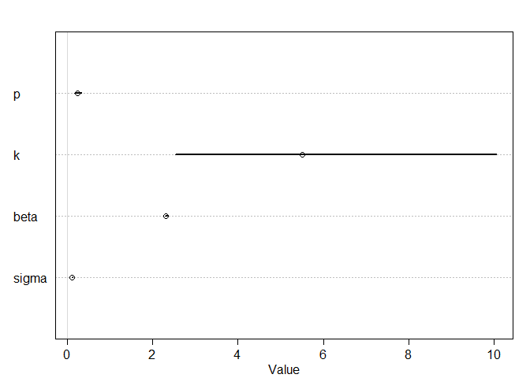
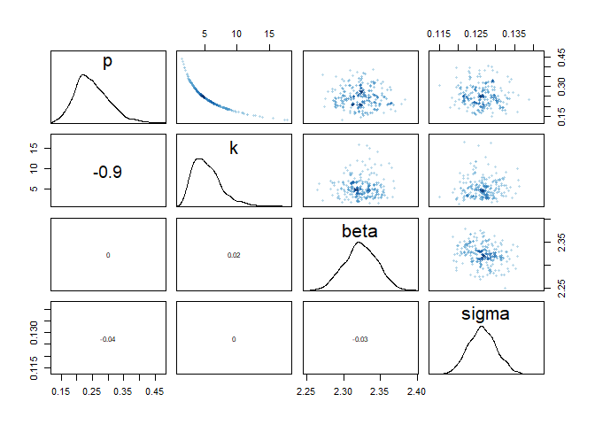
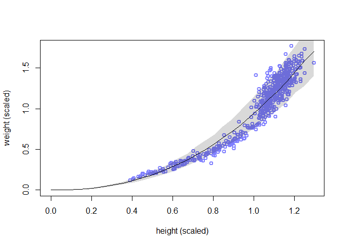
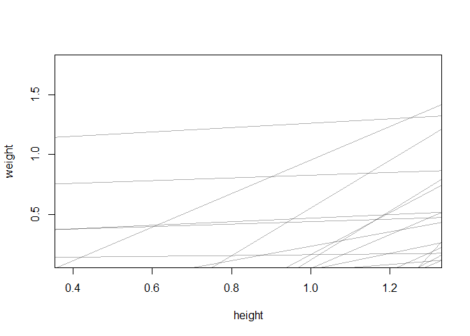
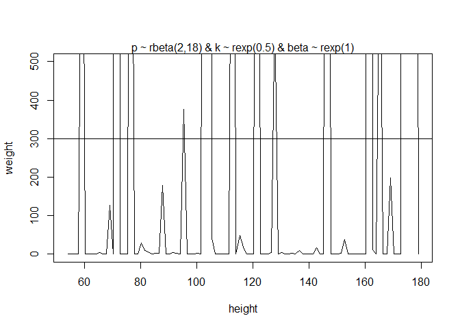
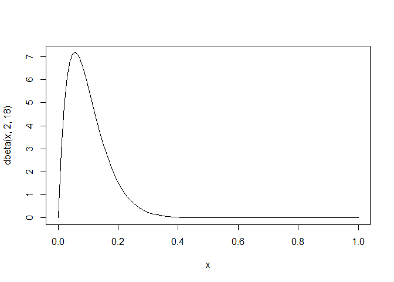
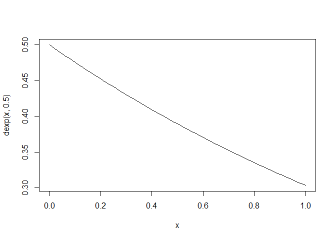
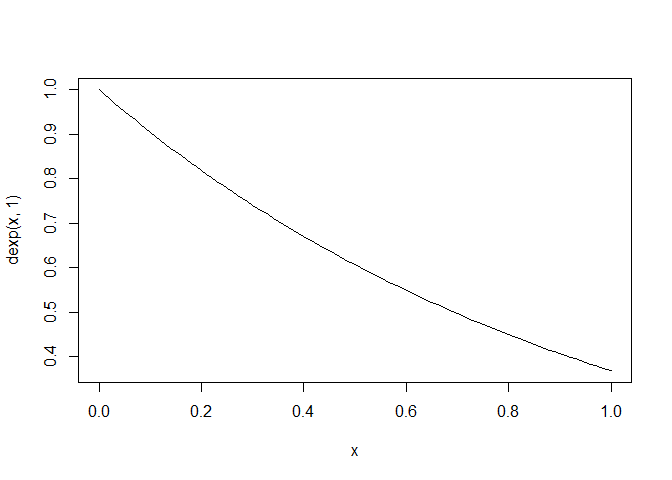
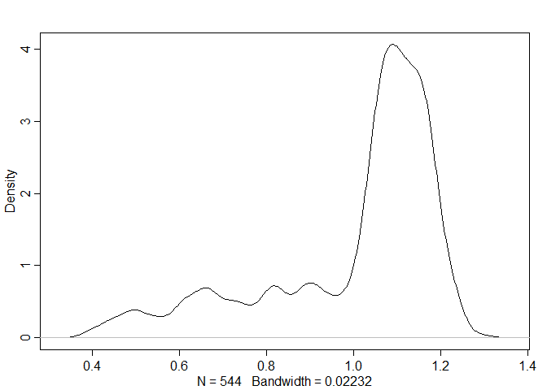

16M1. Modify the cylinder height model, m16.1, so that the exponent 3 on height is instead a free
parameter. Do you recover the value of 3 or not? Plot the posterior predictions for the new model.
How do they differ from those of m16.1?


```r
library(rethinking)
```

```
## Loading required package: rstan
```

```
## Loading required package: StanHeaders
```

```
## Loading required package: ggplot2
```

```
## rstan (Version 2.19.3, GitRev: 2e1f913d3ca3)
```

```
## For execution on a local, multicore CPU with excess RAM we recommend calling
## options(mc.cores = parallel::detectCores()).
## To avoid recompilation of unchanged Stan programs, we recommend calling
## rstan_options(auto_write = TRUE)
```

```
## For improved execution time, we recommend calling
## Sys.setenv(LOCAL_CPPFLAGS = '-march=corei7 -mtune=corei7')
## although this causes Stan to throw an error on a few processors.
```

```
## Loading required package: parallel
```

```
## rethinking (Version 2.11)
```

```
## 
## Attaching package: 'rethinking'
```

```
## The following object is masked from 'package:stats':
## 
##     rstudent
```

```r
data(Howell1)
d <- Howell1

# scale observed variables
d$w <- d$weight / mean(d$weight)
d$h <- d$height / mean(d$height)
```


```r
m16M1 <- ulam(
  alist(
    w ~ dlnorm(mu,sigma),
    exp(mu) <- 3.141593 * k *p^2 * h^beta,
    p ~ beta(2,18),
    k ~ exponential(0.5),
    beta ~ exponential(1),
    sigma ~ exponential(1)
  ),data = d,chains = 4,cores = 4,control = list(max_treedepth = 15)
)
```

```r
precis(m16M1)
```

```
##            mean          sd      5.5%      94.5%     n_eff    Rhat4
## p     0.2486839 0.054020583 0.1716875  0.3407099  528.3399 1.002997
## k     5.5067266 2.475266479 2.5390056 10.0457222  563.6602 1.003023
## beta  2.3234513 0.022403671 2.2869792  2.3594030 1293.4401 1.000232
## sigma 0.1264239 0.003747224 0.1205160  0.1326582 1060.7762 1.002444
```

```r
plot(precis(m16M1))
```

<!-- -->
not 3, probably mean the cylinder model is over-simplified,but nevertheless it is good to start with.
p,k stay very similar while even smaller variation in sigma.


```r
pairs(m16M1)
```

<!-- -->

```r
# plot posterior distribution m16M1
h_seq <- seq( from=0 , to=max(d$h) , length.out=30 )
w_sim <- sim( m16M1 , data=list(h=h_seq) )
mu_mean <- apply( w_sim , 2 , mean )
w_CI <- apply( w_sim , 2 , PI )
plot( d$h , d$w , xlim=c(0,max(d$h)) , ylim=c(0,max(d$w)) , col=rangi2 ,
lwd=2 , xlab="height (scaled)" , ylab="weight (scaled)" )
lines( h_seq , mu_mean )
shade( w_CI , h_seq )
```

<!-- -->
Fits better to lower height,capture the change in sub-structure of the data, ex. children/age here 
`{r}
curve( dnorm( x , 178 , 20 ) , from=100 , to=250 )
16M2. Conduct a prior predictive simulation for the cylinder height model. Begin with the priors
in the chapter. Do these produce reasonable prior height(does it mean weight here?) distributions? If not, which modifications do you suggest?


```r
set.seed(7)
prior <- extract.prior(m16M1)
```

```
## 
## SAMPLING FOR MODEL '3de70af0075afc4a7f8a6f9503e5e074' NOW (CHAIN 1).
## Chain 1: 
## Chain 1: Gradient evaluation took 0 seconds
## Chain 1: 1000 transitions using 10 leapfrog steps per transition would take 0 seconds.
## Chain 1: Adjust your expectations accordingly!
## Chain 1: 
## Chain 1: 
## Chain 1: Iteration:    1 / 2000 [  0%]  (Warmup)
## Chain 1: Iteration:  200 / 2000 [ 10%]  (Warmup)
## Chain 1: Iteration:  400 / 2000 [ 20%]  (Warmup)
## Chain 1: Iteration:  600 / 2000 [ 30%]  (Warmup)
## Chain 1: Iteration:  800 / 2000 [ 40%]  (Warmup)
## Chain 1: Iteration: 1000 / 2000 [ 50%]  (Warmup)
## Chain 1: Iteration: 1001 / 2000 [ 50%]  (Sampling)
## Chain 1: Iteration: 1200 / 2000 [ 60%]  (Sampling)
## Chain 1: Iteration: 1400 / 2000 [ 70%]  (Sampling)
## Chain 1: Iteration: 1600 / 2000 [ 80%]  (Sampling)
## Chain 1: Iteration: 1800 / 2000 [ 90%]  (Sampling)
## Chain 1: Iteration: 2000 / 2000 [100%]  (Sampling)
## Chain 1: 
## Chain 1:  Elapsed Time: 2.14 seconds (Warm-up)
## Chain 1:                2.368 seconds (Sampling)
## Chain 1:                4.508 seconds (Total)
## Chain 1:
```

```r
range(d$h)
```

```
## [1] 0.3903775 1.2951348
```

```r
range(d$w)
```

```
## [1] 0.1194145 1.7689272
```

```r
plot( NULL , xlim=range(d$h) , ylim=range(d$w) , xlab="height" , ylab="weight")
mu <- link( m16M1 , post = prior, data=list(h=range(d$h) ) )
for ( i in 1:1000) lines( c(0,1.5) , mu[i,] , col=col.alpha("black",0.3) )
```

<!-- -->
Another way to plot the prior distribution but not sure why it doesn't work

```r
set.seed(2971)
N <- 100
p <- rbeta(N,2,18)
k <- rexp(N,0.5)
beta <- rexp(N,1)
```

```r
length(k)
```

```
## [1] 100
```
not sure why the below not working

```r
plot( NULL, xlim=range(d$height),ylim=c(0,500),xlab="height" , ylab="weight" )
#abline( h=0, lty=2 )
abline( h=300 , lty=1 , lwd=0.5 )
mtext( "p ~ rbeta(2,18) & k ~ rexp(0.5) & beta ~ rexp(1)" )
for ( i in 1:N ) curve( 3.141593*k*p^2*x^beta,from=min(d$height) , to=max(d$height) , add=TRUE ,
col=col.alpha("black",0.2) )
```

```
## Warning in x^beta: longer object length is not a multiple of shorter object
## length
```

```
## Warning in 3.141593 * k * p^2 * x^beta: longer object length is not a multiple
## of shorter object length
```

```
## Warning in x^beta: longer object length is not a multiple of shorter object
## length
```

```
## Warning in 3.141593 * k * p^2 * x^beta: longer object length is not a multiple
## of shorter object length
```

```
## Warning in x^beta: longer object length is not a multiple of shorter object
## length
```

```
## Warning in 3.141593 * k * p^2 * x^beta: longer object length is not a multiple
## of shorter object length
```

```
## Warning in x^beta: longer object length is not a multiple of shorter object
## length
```

```
## Warning in 3.141593 * k * p^2 * x^beta: longer object length is not a multiple
## of shorter object length
```

```
## Warning in x^beta: longer object length is not a multiple of shorter object
## length
```

```
## Warning in 3.141593 * k * p^2 * x^beta: longer object length is not a multiple
## of shorter object length
```

```
## Warning in x^beta: longer object length is not a multiple of shorter object
## length
```

```
## Warning in 3.141593 * k * p^2 * x^beta: longer object length is not a multiple
## of shorter object length
```

```
## Warning in x^beta: longer object length is not a multiple of shorter object
## length
```

```
## Warning in 3.141593 * k * p^2 * x^beta: longer object length is not a multiple
## of shorter object length
```

```
## Warning in x^beta: longer object length is not a multiple of shorter object
## length
```

```
## Warning in 3.141593 * k * p^2 * x^beta: longer object length is not a multiple
## of shorter object length
```

```
## Warning in x^beta: longer object length is not a multiple of shorter object
## length
```

```
## Warning in 3.141593 * k * p^2 * x^beta: longer object length is not a multiple
## of shorter object length
```

```
## Warning in x^beta: longer object length is not a multiple of shorter object
## length
```

```
## Warning in 3.141593 * k * p^2 * x^beta: longer object length is not a multiple
## of shorter object length
```

```
## Warning in x^beta: longer object length is not a multiple of shorter object
## length
```

```
## Warning in 3.141593 * k * p^2 * x^beta: longer object length is not a multiple
## of shorter object length
```

```
## Warning in x^beta: longer object length is not a multiple of shorter object
## length
```

```
## Warning in 3.141593 * k * p^2 * x^beta: longer object length is not a multiple
## of shorter object length
```

```
## Warning in x^beta: longer object length is not a multiple of shorter object
## length
```

```
## Warning in 3.141593 * k * p^2 * x^beta: longer object length is not a multiple
## of shorter object length
```

```
## Warning in x^beta: longer object length is not a multiple of shorter object
## length
```

```
## Warning in 3.141593 * k * p^2 * x^beta: longer object length is not a multiple
## of shorter object length
```

```
## Warning in x^beta: longer object length is not a multiple of shorter object
## length
```

```
## Warning in 3.141593 * k * p^2 * x^beta: longer object length is not a multiple
## of shorter object length
```

```
## Warning in x^beta: longer object length is not a multiple of shorter object
## length
```

```
## Warning in 3.141593 * k * p^2 * x^beta: longer object length is not a multiple
## of shorter object length
```

```
## Warning in x^beta: longer object length is not a multiple of shorter object
## length
```

```
## Warning in 3.141593 * k * p^2 * x^beta: longer object length is not a multiple
## of shorter object length
```

```
## Warning in x^beta: longer object length is not a multiple of shorter object
## length
```

```
## Warning in 3.141593 * k * p^2 * x^beta: longer object length is not a multiple
## of shorter object length
```

```
## Warning in x^beta: longer object length is not a multiple of shorter object
## length
```

```
## Warning in 3.141593 * k * p^2 * x^beta: longer object length is not a multiple
## of shorter object length
```

```
## Warning in x^beta: longer object length is not a multiple of shorter object
## length
```

```
## Warning in 3.141593 * k * p^2 * x^beta: longer object length is not a multiple
## of shorter object length
```

```
## Warning in x^beta: longer object length is not a multiple of shorter object
## length
```

```
## Warning in 3.141593 * k * p^2 * x^beta: longer object length is not a multiple
## of shorter object length
```

```
## Warning in x^beta: longer object length is not a multiple of shorter object
## length
```

```
## Warning in 3.141593 * k * p^2 * x^beta: longer object length is not a multiple
## of shorter object length
```

```
## Warning in x^beta: longer object length is not a multiple of shorter object
## length
```

```
## Warning in 3.141593 * k * p^2 * x^beta: longer object length is not a multiple
## of shorter object length
```

```
## Warning in x^beta: longer object length is not a multiple of shorter object
## length
```

```
## Warning in 3.141593 * k * p^2 * x^beta: longer object length is not a multiple
## of shorter object length
```

```
## Warning in x^beta: longer object length is not a multiple of shorter object
## length
```

```
## Warning in 3.141593 * k * p^2 * x^beta: longer object length is not a multiple
## of shorter object length
```

```
## Warning in x^beta: longer object length is not a multiple of shorter object
## length
```

```
## Warning in 3.141593 * k * p^2 * x^beta: longer object length is not a multiple
## of shorter object length
```

```
## Warning in x^beta: longer object length is not a multiple of shorter object
## length
```

```
## Warning in 3.141593 * k * p^2 * x^beta: longer object length is not a multiple
## of shorter object length
```

```
## Warning in x^beta: longer object length is not a multiple of shorter object
## length
```

```
## Warning in 3.141593 * k * p^2 * x^beta: longer object length is not a multiple
## of shorter object length
```

```
## Warning in x^beta: longer object length is not a multiple of shorter object
## length
```

```
## Warning in 3.141593 * k * p^2 * x^beta: longer object length is not a multiple
## of shorter object length
```

```
## Warning in x^beta: longer object length is not a multiple of shorter object
## length
```

```
## Warning in 3.141593 * k * p^2 * x^beta: longer object length is not a multiple
## of shorter object length
```

```
## Warning in x^beta: longer object length is not a multiple of shorter object
## length
```

```
## Warning in 3.141593 * k * p^2 * x^beta: longer object length is not a multiple
## of shorter object length
```

```
## Warning in x^beta: longer object length is not a multiple of shorter object
## length
```

```
## Warning in 3.141593 * k * p^2 * x^beta: longer object length is not a multiple
## of shorter object length
```

```
## Warning in x^beta: longer object length is not a multiple of shorter object
## length
```

```
## Warning in 3.141593 * k * p^2 * x^beta: longer object length is not a multiple
## of shorter object length
```

```
## Warning in x^beta: longer object length is not a multiple of shorter object
## length
```

```
## Warning in 3.141593 * k * p^2 * x^beta: longer object length is not a multiple
## of shorter object length
```

```
## Warning in x^beta: longer object length is not a multiple of shorter object
## length
```

```
## Warning in 3.141593 * k * p^2 * x^beta: longer object length is not a multiple
## of shorter object length
```

```
## Warning in x^beta: longer object length is not a multiple of shorter object
## length
```

```
## Warning in 3.141593 * k * p^2 * x^beta: longer object length is not a multiple
## of shorter object length
```

```
## Warning in x^beta: longer object length is not a multiple of shorter object
## length
```

```
## Warning in 3.141593 * k * p^2 * x^beta: longer object length is not a multiple
## of shorter object length
```

```
## Warning in x^beta: longer object length is not a multiple of shorter object
## length
```

```
## Warning in 3.141593 * k * p^2 * x^beta: longer object length is not a multiple
## of shorter object length
```

```
## Warning in x^beta: longer object length is not a multiple of shorter object
## length
```

```
## Warning in 3.141593 * k * p^2 * x^beta: longer object length is not a multiple
## of shorter object length
```

```
## Warning in x^beta: longer object length is not a multiple of shorter object
## length
```

```
## Warning in 3.141593 * k * p^2 * x^beta: longer object length is not a multiple
## of shorter object length
```

```
## Warning in x^beta: longer object length is not a multiple of shorter object
## length
```

```
## Warning in 3.141593 * k * p^2 * x^beta: longer object length is not a multiple
## of shorter object length
```

```
## Warning in x^beta: longer object length is not a multiple of shorter object
## length
```

```
## Warning in 3.141593 * k * p^2 * x^beta: longer object length is not a multiple
## of shorter object length
```

```
## Warning in x^beta: longer object length is not a multiple of shorter object
## length
```

```
## Warning in 3.141593 * k * p^2 * x^beta: longer object length is not a multiple
## of shorter object length
```

```
## Warning in x^beta: longer object length is not a multiple of shorter object
## length
```

```
## Warning in 3.141593 * k * p^2 * x^beta: longer object length is not a multiple
## of shorter object length
```

```
## Warning in x^beta: longer object length is not a multiple of shorter object
## length
```

```
## Warning in 3.141593 * k * p^2 * x^beta: longer object length is not a multiple
## of shorter object length
```

```
## Warning in x^beta: longer object length is not a multiple of shorter object
## length
```

```
## Warning in 3.141593 * k * p^2 * x^beta: longer object length is not a multiple
## of shorter object length
```

```
## Warning in x^beta: longer object length is not a multiple of shorter object
## length
```

```
## Warning in 3.141593 * k * p^2 * x^beta: longer object length is not a multiple
## of shorter object length
```

```
## Warning in x^beta: longer object length is not a multiple of shorter object
## length
```

```
## Warning in 3.141593 * k * p^2 * x^beta: longer object length is not a multiple
## of shorter object length
```

```
## Warning in x^beta: longer object length is not a multiple of shorter object
## length
```

```
## Warning in 3.141593 * k * p^2 * x^beta: longer object length is not a multiple
## of shorter object length
```

```
## Warning in x^beta: longer object length is not a multiple of shorter object
## length
```

```
## Warning in 3.141593 * k * p^2 * x^beta: longer object length is not a multiple
## of shorter object length
```

```
## Warning in x^beta: longer object length is not a multiple of shorter object
## length
```

```
## Warning in 3.141593 * k * p^2 * x^beta: longer object length is not a multiple
## of shorter object length
```

```
## Warning in x^beta: longer object length is not a multiple of shorter object
## length
```

```
## Warning in 3.141593 * k * p^2 * x^beta: longer object length is not a multiple
## of shorter object length
```

```
## Warning in x^beta: longer object length is not a multiple of shorter object
## length
```

```
## Warning in 3.141593 * k * p^2 * x^beta: longer object length is not a multiple
## of shorter object length
```

```
## Warning in x^beta: longer object length is not a multiple of shorter object
## length
```

```
## Warning in 3.141593 * k * p^2 * x^beta: longer object length is not a multiple
## of shorter object length
```

```
## Warning in x^beta: longer object length is not a multiple of shorter object
## length
```

```
## Warning in 3.141593 * k * p^2 * x^beta: longer object length is not a multiple
## of shorter object length
```

```
## Warning in x^beta: longer object length is not a multiple of shorter object
## length
```

```
## Warning in 3.141593 * k * p^2 * x^beta: longer object length is not a multiple
## of shorter object length
```

```
## Warning in x^beta: longer object length is not a multiple of shorter object
## length
```

```
## Warning in 3.141593 * k * p^2 * x^beta: longer object length is not a multiple
## of shorter object length
```

```
## Warning in x^beta: longer object length is not a multiple of shorter object
## length
```

```
## Warning in 3.141593 * k * p^2 * x^beta: longer object length is not a multiple
## of shorter object length
```

```
## Warning in x^beta: longer object length is not a multiple of shorter object
## length
```

```
## Warning in 3.141593 * k * p^2 * x^beta: longer object length is not a multiple
## of shorter object length
```

```
## Warning in x^beta: longer object length is not a multiple of shorter object
## length
```

```
## Warning in 3.141593 * k * p^2 * x^beta: longer object length is not a multiple
## of shorter object length
```

```
## Warning in x^beta: longer object length is not a multiple of shorter object
## length
```

```
## Warning in 3.141593 * k * p^2 * x^beta: longer object length is not a multiple
## of shorter object length
```

```
## Warning in x^beta: longer object length is not a multiple of shorter object
## length
```

```
## Warning in 3.141593 * k * p^2 * x^beta: longer object length is not a multiple
## of shorter object length
```

```
## Warning in x^beta: longer object length is not a multiple of shorter object
## length
```

```
## Warning in 3.141593 * k * p^2 * x^beta: longer object length is not a multiple
## of shorter object length
```

```
## Warning in x^beta: longer object length is not a multiple of shorter object
## length
```

```
## Warning in 3.141593 * k * p^2 * x^beta: longer object length is not a multiple
## of shorter object length
```

```
## Warning in x^beta: longer object length is not a multiple of shorter object
## length
```

```
## Warning in 3.141593 * k * p^2 * x^beta: longer object length is not a multiple
## of shorter object length
```

```
## Warning in x^beta: longer object length is not a multiple of shorter object
## length
```

```
## Warning in 3.141593 * k * p^2 * x^beta: longer object length is not a multiple
## of shorter object length
```

```
## Warning in x^beta: longer object length is not a multiple of shorter object
## length
```

```
## Warning in 3.141593 * k * p^2 * x^beta: longer object length is not a multiple
## of shorter object length
```

```
## Warning in x^beta: longer object length is not a multiple of shorter object
## length
```

```
## Warning in 3.141593 * k * p^2 * x^beta: longer object length is not a multiple
## of shorter object length
```

```
## Warning in x^beta: longer object length is not a multiple of shorter object
## length
```

```
## Warning in 3.141593 * k * p^2 * x^beta: longer object length is not a multiple
## of shorter object length
```

```
## Warning in x^beta: longer object length is not a multiple of shorter object
## length
```

```
## Warning in 3.141593 * k * p^2 * x^beta: longer object length is not a multiple
## of shorter object length
```

```
## Warning in x^beta: longer object length is not a multiple of shorter object
## length
```

```
## Warning in 3.141593 * k * p^2 * x^beta: longer object length is not a multiple
## of shorter object length
```

```
## Warning in x^beta: longer object length is not a multiple of shorter object
## length
```

```
## Warning in 3.141593 * k * p^2 * x^beta: longer object length is not a multiple
## of shorter object length
```

```
## Warning in x^beta: longer object length is not a multiple of shorter object
## length
```

```
## Warning in 3.141593 * k * p^2 * x^beta: longer object length is not a multiple
## of shorter object length
```

```
## Warning in x^beta: longer object length is not a multiple of shorter object
## length
```

```
## Warning in 3.141593 * k * p^2 * x^beta: longer object length is not a multiple
## of shorter object length
```

```
## Warning in x^beta: longer object length is not a multiple of shorter object
## length
```

```
## Warning in 3.141593 * k * p^2 * x^beta: longer object length is not a multiple
## of shorter object length
```

```
## Warning in x^beta: longer object length is not a multiple of shorter object
## length
```

```
## Warning in 3.141593 * k * p^2 * x^beta: longer object length is not a multiple
## of shorter object length
```

```
## Warning in x^beta: longer object length is not a multiple of shorter object
## length
```

```
## Warning in 3.141593 * k * p^2 * x^beta: longer object length is not a multiple
## of shorter object length
```

```
## Warning in x^beta: longer object length is not a multiple of shorter object
## length
```

```
## Warning in 3.141593 * k * p^2 * x^beta: longer object length is not a multiple
## of shorter object length
```

```
## Warning in x^beta: longer object length is not a multiple of shorter object
## length
```

```
## Warning in 3.141593 * k * p^2 * x^beta: longer object length is not a multiple
## of shorter object length
```

```
## Warning in x^beta: longer object length is not a multiple of shorter object
## length
```

```
## Warning in 3.141593 * k * p^2 * x^beta: longer object length is not a multiple
## of shorter object length
```

```
## Warning in x^beta: longer object length is not a multiple of shorter object
## length
```

```
## Warning in 3.141593 * k * p^2 * x^beta: longer object length is not a multiple
## of shorter object length
```

```
## Warning in x^beta: longer object length is not a multiple of shorter object
## length
```

```
## Warning in 3.141593 * k * p^2 * x^beta: longer object length is not a multiple
## of shorter object length
```

```
## Warning in x^beta: longer object length is not a multiple of shorter object
## length
```

```
## Warning in 3.141593 * k * p^2 * x^beta: longer object length is not a multiple
## of shorter object length
```

```
## Warning in x^beta: longer object length is not a multiple of shorter object
## length
```

```
## Warning in 3.141593 * k * p^2 * x^beta: longer object length is not a multiple
## of shorter object length
```

```
## Warning in x^beta: longer object length is not a multiple of shorter object
## length
```

```
## Warning in 3.141593 * k * p^2 * x^beta: longer object length is not a multiple
## of shorter object length
```

```
## Warning in x^beta: longer object length is not a multiple of shorter object
## length
```

```
## Warning in 3.141593 * k * p^2 * x^beta: longer object length is not a multiple
## of shorter object length
```

```
## Warning in x^beta: longer object length is not a multiple of shorter object
## length
```

```
## Warning in 3.141593 * k * p^2 * x^beta: longer object length is not a multiple
## of shorter object length
```

```
## Warning in x^beta: longer object length is not a multiple of shorter object
## length
```

```
## Warning in 3.141593 * k * p^2 * x^beta: longer object length is not a multiple
## of shorter object length
```

```
## Warning in x^beta: longer object length is not a multiple of shorter object
## length
```

```
## Warning in 3.141593 * k * p^2 * x^beta: longer object length is not a multiple
## of shorter object length
```

```
## Warning in x^beta: longer object length is not a multiple of shorter object
## length
```

```
## Warning in 3.141593 * k * p^2 * x^beta: longer object length is not a multiple
## of shorter object length
```

```
## Warning in x^beta: longer object length is not a multiple of shorter object
## length
```

```
## Warning in 3.141593 * k * p^2 * x^beta: longer object length is not a multiple
## of shorter object length
```

```
## Warning in x^beta: longer object length is not a multiple of shorter object
## length
```

```
## Warning in 3.141593 * k * p^2 * x^beta: longer object length is not a multiple
## of shorter object length
```

```
## Warning in x^beta: longer object length is not a multiple of shorter object
## length
```

```
## Warning in 3.141593 * k * p^2 * x^beta: longer object length is not a multiple
## of shorter object length
```

```
## Warning in x^beta: longer object length is not a multiple of shorter object
## length
```

```
## Warning in 3.141593 * k * p^2 * x^beta: longer object length is not a multiple
## of shorter object length
```

```
## Warning in x^beta: longer object length is not a multiple of shorter object
## length
```

```
## Warning in 3.141593 * k * p^2 * x^beta: longer object length is not a multiple
## of shorter object length
```

```
## Warning in x^beta: longer object length is not a multiple of shorter object
## length
```

```
## Warning in 3.141593 * k * p^2 * x^beta: longer object length is not a multiple
## of shorter object length
```

```
## Warning in x^beta: longer object length is not a multiple of shorter object
## length
```

```
## Warning in 3.141593 * k * p^2 * x^beta: longer object length is not a multiple
## of shorter object length
```

```
## Warning in x^beta: longer object length is not a multiple of shorter object
## length
```

```
## Warning in 3.141593 * k * p^2 * x^beta: longer object length is not a multiple
## of shorter object length
```

```
## Warning in x^beta: longer object length is not a multiple of shorter object
## length
```

```
## Warning in 3.141593 * k * p^2 * x^beta: longer object length is not a multiple
## of shorter object length
```

```
## Warning in x^beta: longer object length is not a multiple of shorter object
## length
```

```
## Warning in 3.141593 * k * p^2 * x^beta: longer object length is not a multiple
## of shorter object length
```

<!-- -->

Looking at other prior info

```r
curve( dbeta(x,2,18) )
```

<!-- -->

```r
curve( dexp(x,0.5) )
```

<!-- -->

```r
curve( dexp(x,1))
```

<!-- -->


```r
range(d$h)
```

```
## [1] 0.3903775 1.2951348
```

```r
dens(d$h)
```

<!-- -->


```r
range(d$height)
```

```
## [1]  53.975 179.070
```
