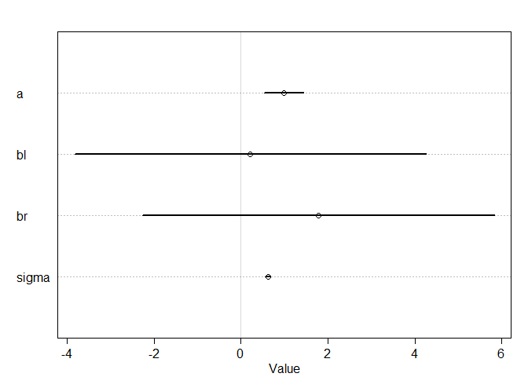
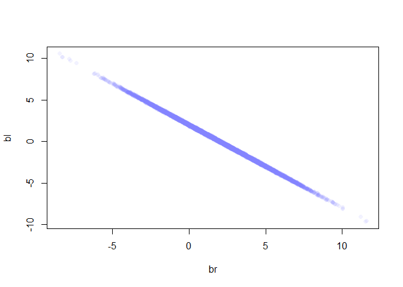
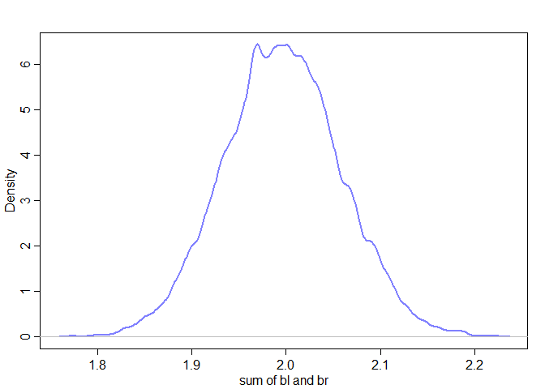
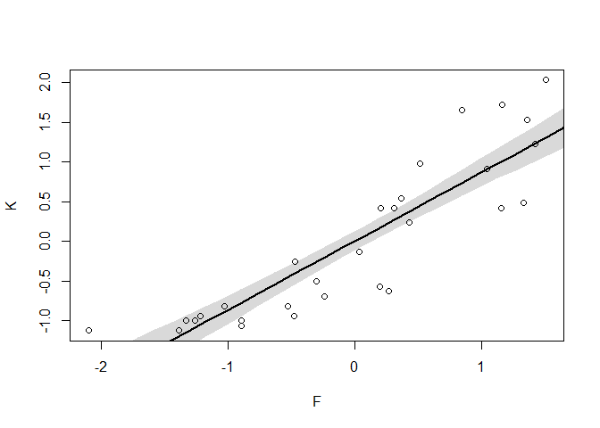
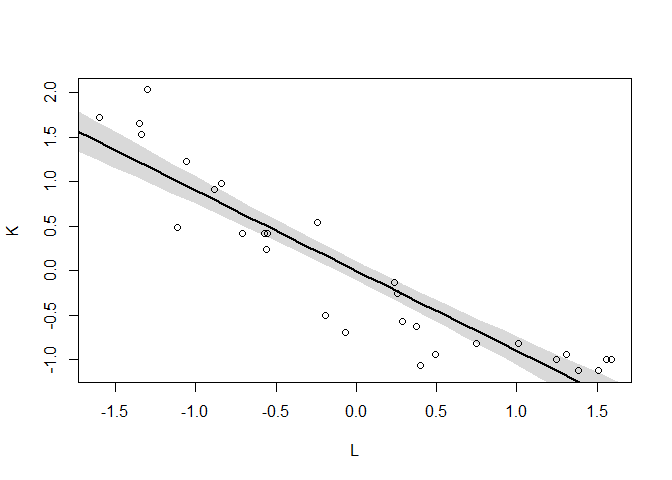
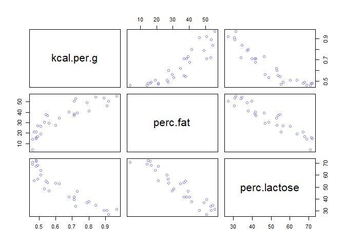
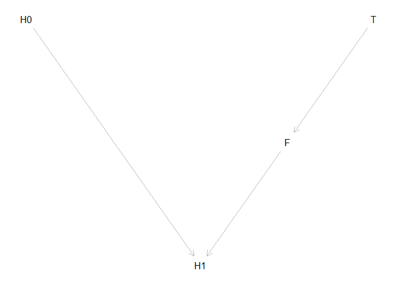

#6.1 Multicollinearity
##6.1.1 Multicollinear legs

```r
library(rethinking)
```

```
## Loading required package: rstan
```

```
## Loading required package: ggplot2
```

```
## Loading required package: StanHeaders
```

```
## rstan (Version 2.18.2, GitRev: 2e1f913d3ca3)
```

```
## For execution on a local, multicore CPU with excess RAM we recommend calling
## options(mc.cores = parallel::detectCores()).
## To avoid recompilation of unchanged Stan programs, we recommend calling
## rstan_options(auto_write = TRUE)
```

```
## For improved execution time, we recommend calling
## Sys.setenv(LOCAL_CPPFLAGS = '-march=native')
## although this causes Stan to throw an error on a few processors.
```

```
## Loading required package: parallel
```

```
## rethinking (Version 1.88)
```

```r
N <- 100  # number of individuals
set.seed(909) 
height <- rnorm(N,10,2) # sim total height of each
leg_prop <- runif(N,0.4,0.5) # leg as proportion of height
leg_left <- leg_prop*height+rnorm(N,0,0.02) # sim left leg as proportion + error
leg_right <- leg_prop*height+rnorm(N,0,0.02) # sim right leg as proportion +error
d <- data.frame(height,leg_left,leg_right) # combine into data frame
```


```r
m6.1 <- quap(
  alist(
    height ~ dnorm(mu,sigma),
    mu <- a+bl*leg_left+br*leg_right,
    a ~ dnorm(10,100),
    bl ~ dnorm(2,10),
    br ~ dnorm(2,10),
    sigma ~ dexp(1)
  ), data = d
)
precis(m6.1)
```

```
##            mean         sd       5.5%     94.5%
## a     0.9812791 0.28395540  0.5274635 1.4350947
## bl    0.2118585 2.52703706 -3.8268348 4.2505518
## br    1.7836774 2.53125061 -2.2617500 5.8291047
## sigma 0.6171026 0.04343427  0.5476862 0.6865189
```

```r
plot(precis(m6.1))
```

<!-- -->


```r
post <- extract.samples(m6.1)
plot(bl ~ br, post, col=col.alpha(rangi2,0.1),pch=16)
```

<!-- -->


```r
sum_blbr <- post$bl+post$br
dens(sum_blbr,col=rangi2,lwd=2,xlab="sum of bl and br")
```

<!-- -->

```r
mean(sum_blbr)
```

```
## [1] 1.996234
```


```r
m6.2 <- quap(
  alist(
    height ~ dnorm(mu,sigma),
    mu <- a+bl*leg_left,
    a ~ dnorm(10,100),
    bl ~ dnorm(2,10),
    sigma ~ dexp(1)
  ),data = d
)
precis(m6.2)
```

```
##            mean         sd      5.5%    94.5%
## a     0.9979326 0.28364620 0.5446112 1.451254
## bl    1.9920676 0.06115704 1.8943269 2.089808
## sigma 0.6186038 0.04353998 0.5490185 0.688189
```

# Multiollinear milk

```r
library(rethinking)
data("milk")
d <- milk
d$K <- scale(d$kcal.per.g)
d$F <- scale(d$perc.fat)
d$L <- scale(d$perc.lactose)
```


```r
# kcal.per.g regressed on perc.fat
m6.3 <- quap(
  alist(
    K ~ dnorm(mu,sigma),
    mu <- a+bF*F,
    a ~ dnorm(0,0.2),
    bF ~ dnorm(0,0.5),
    sigma ~ dexp(1)
  ),data=d
)
xseq <- seq(from=min(d$F)-0.15, to=max(d$F)+0.15,length.out = 30)
mu <- link(m6.3,data = list(F=xseq))
mu_mean <- apply(mu, 2, mean)
mu_PI <- apply(mu, 2, PI)
plot(K ~ F, data=d)
lines(xseq,mu_mean,lwd=2)
shade(mu_PI,xseq)
```

<!-- -->

```r
# kcal.per.g regressed on perc.lactose
m6.4 <- quap(
  alist(
    K ~ dnorm(mu,sigma),
    mu <- a+bL*L,
    a ~ dnorm(0,0.2),
    bL ~ dnorm(0,0.5),
    sigma ~ dexp(1)
  ),data = d
)
xseq <- seq(from=min(d$L)-0.15, to=max(d$L)+0.15,length.out = 30)
mu <- link(m6.4,data = list(L=xseq))
mu_mean <- apply(mu, 2, mean)
mu_PI <- apply(mu, 2, PI)
plot(K ~ L, data=d)
lines(xseq,mu_mean,lwd=2)
shade(mu_PI,xseq)
```

<!-- -->

```r
precis(m6.3)
```

```
##               mean         sd       5.5%     94.5%
## a     1.535526e-07 0.07725195 -0.1234634 0.1234637
## bF    8.618970e-01 0.08426088  0.7272318 0.9965621
## sigma 4.510179e-01 0.05870756  0.3571919 0.5448440
```

```r
precis(m6.4)
```

```
##                mean         sd       5.5%      94.5%
## a      7.806566e-07 0.06661649 -0.1064652  0.1064668
## bL    -9.024568e-01 0.07132864 -1.0164537 -0.7884599
## sigma  3.804663e-01 0.04958291  0.3012232  0.4597093
```


```r
m6.5 <- quap(
  alist(
    K ~ dnorm(mu,sigma),
    mu <- a+bF*F+bL*L,
    a ~ dnorm(0,0.2),
    bF ~ dnorm(0,0.5),
    bL ~ dnorm(0,0.5),
    sigma ~ dexp(1)
  ),data = d
)
precis(m6.5)
```

```
##                mean         sd        5.5%      94.5%
## a      3.554024e-08 0.06603584 -0.10553800  0.1055381
## bF     2.435013e-01 0.18357886 -0.04989313  0.5368958
## bL    -6.780791e-01 0.18377693 -0.97179011 -0.3843680
## sigma  3.767423e-01 0.04918409  0.29813659  0.4553479
```

```r
pairs(~ kcal.per.g+perc.fat+perc.lactose,data=d,col=rangi2)
```

<!-- -->

```r
cor(d$perc.fat,d$perc.lactose)
```

```
## [1] -0.9416373
```
# 6.2 Post-treatment bias

```r
set.seed(71)
# number of plants
N <- 100
# simulate initial heights
h0 <- rnorm(N,10,2)
# assign treatments and simulate fungus and growth
treatment <- rep(0:1,each=N/2)
fungus <- rbinom(N,size = 1,prob = 0.5-treatment*0.4)
h1 <- h0+ rnorm(N,5-3*fungus)
# compose a clean data frame
d <- data.frame(h0=h0,h1=h1,treatment=treatment,fungus=fungus)
precis(d)
```

```
##               mean        sd      5.5%    94.5%
## h0         9.95978 2.1011623  6.570328 13.07874
## h1        14.39920 2.6880870 10.618002 17.93369
## treatment  0.50000 0.5025189  0.000000  1.00000
## fungus     0.23000 0.4229526  0.000000  1.00000
##                                                                                                  histogram
## h0        <U+2581><U+2582><U+2582><U+2582><U+2587><U+2583><U+2582><U+2583><U+2581><U+2581><U+2581><U+2581>
## h1                                        <U+2581><U+2581><U+2583><U+2587><U+2587><U+2587><U+2581><U+2581>
## treatment                 <U+2587><U+2581><U+2581><U+2581><U+2581><U+2581><U+2581><U+2581><U+2581><U+2587>
## fungus                    <U+2587><U+2581><U+2581><U+2581><U+2581><U+2581><U+2581><U+2581><U+2581><U+2582>
```


```r
sim_p <- rlnorm(1e4,0,0.25)
precis(data.frame(sim_p))
```

```
##          mean        sd     5.5%    94.5%
## sim_p 1.03699 0.2629894 0.670683 1.496397
##                                                                                              histogram
## sim_p <U+2581><U+2581><U+2583><U+2587><U+2587><U+2583><U+2581><U+2581><U+2581><U+2581><U+2581><U+2581>
```


```r
m6.6 <- quap (
  alist(
    h1 ~ dnorm(mu,sigma),
    mu <- h0*p,
    p ~ dlnorm(0,0.25),
    sigma ~ dexp(1)
  ),data = d
)
precis(m6.6)
```

```
##           mean         sd     5.5%    94.5%
## p     1.426626 0.01760992 1.398482 1.454770
## sigma 1.793286 0.12517262 1.593236 1.993336
```


```r
m6.7 <- quap(
  alist(
    h1 ~ dnorm(mu,sigma),
    mu <- h0*p,
    p <- a+bt*treatment+bf*fungus,
    a ~ dlnorm(0,0.2),
    bt ~ dnorm(0,0.5),
    bf ~ dnorm(0,0.5),
    sigma ~ dexp(1)
  ),data = d
)
precis(m6.7)
```

```
##               mean         sd        5.5%       94.5%
## a      1.481391468 0.02451069  1.44221865  1.52056429
## bt     0.002412222 0.02986965 -0.04532525  0.05014969
## bf    -0.266718915 0.03654772 -0.32512923 -0.20830860
## sigma  1.408797442 0.09862070  1.25118251  1.56641237
```


```r
m6.8 <- quap(
  alist(
    h1 ~ dnorm(mu,sigma),
    mu <- h0*p,
    p <- a+bt*treatment,
    a ~ dlnorm(0,0.2),
    bt ~ dnorm(0,0.5),
    sigma ~ dexp(1)
  ), data = d)
precis(m6.8)
```

```
##             mean         sd       5.5%     94.5%
## a     1.38035767 0.02517554 1.34012229 1.4205931
## bt    0.08499924 0.03429718 0.03018573 0.1398128
## sigma 1.74631655 0.12191552 1.55147200 1.9411611
```
# 6.2.3 Fungus and d-separation

```r
library(dagitty)
plant_dag <- dagitty("dag{
                     H0 -> H1
                     F -> H1
                     T -> F}"
)
coordinates(plant_dag) <- list(x=c(H0=0,T=2,F=1.5,H1=1),
                               y=c(H0=0,T=0,F=1,H1=2))
plot(plant_dag)
```

<!-- -->

```r
dseparated(plant_dag,"T","H1")
```

```
## [1] FALSE
```

```r
dseparated(plant_dag,"T","H1","F")
```

```
## [1] TRUE
```

```r
impliedConditionalIndependencies(plant_dag)
```

```
## F _||_ H0
## H0 _||_ T
## H1 _||_ T | F
```

# 6.3 Collider bias
## 6.3.1 Collider of false sorrow

```r
library(rethinking)
d <- sim_happiness(seed=1977, N_years = 1000)
precis(d)
```

```
##                    mean        sd      5.5%     94.5%
## age        3.300000e+01 18.768883  4.000000 62.000000
## married    3.007692e-01  0.458769  0.000000  1.000000
## happiness -1.000070e-16  1.214421 -1.789474  1.789474
##                                                                                                          histogram
## age       <U+2587><U+2587><U+2587><U+2587><U+2587><U+2587><U+2587><U+2587><U+2587><U+2587><U+2587><U+2587><U+2587>
## married                           <U+2587><U+2581><U+2581><U+2581><U+2581><U+2581><U+2581><U+2581><U+2581><U+2583>
## happiness                                         <U+2587><U+2585><U+2587><U+2585><U+2585><U+2587><U+2585><U+2587>
```

```r
# filter and scale the data
d2 <- d[d$age>17,] # only adults
d2$A <- (d2$age-18)/(65-18)
```


```r
d2$mid <- d2$married+1
m6.9 <- quap(
  alist(
    happiness ~ dnorm(mu,sigma),
    mu <- a[mid]+bA*A,
    a[mid] ~ dnorm(0,1),
    bA ~ dnorm(0,2),
    sigma ~ dexp(1)
  ),data = d2
)
precis(m6.9,depth = 2)
```

```
##             mean         sd       5.5%      94.5%
## a[1]  -0.2350877 0.06348986 -0.3365568 -0.1336186
## a[2]   1.2585517 0.08495989  1.1227694  1.3943340
## bA    -0.7490274 0.11320112 -0.9299447 -0.5681102
## sigma  0.9897080 0.02255800  0.9536559  1.0257600
```


```r
m6.10 <- quap(
  alist(
    happiness ~ dnorm(mu,sigma),
    mu <- a+bA*A,
    a ~ dnorm(0,1),
    bA ~ dnorm(0,2),
    sigma ~ dexp(1)
  ),data = d2
)
precis(m6.10)
```

```
##                mean         sd       5.5%     94.5%
## a      1.649248e-07 0.07675015 -0.1226614 0.1226617
## bA    -2.728620e-07 0.13225976 -0.2113769 0.2113764
## sigma  1.213188e+00 0.02766080  1.1689803 1.2573949
```


```r
N <- 200 # number of gradparent-parent-child triads
b_GP <- 1 # direct effect of G on P
b_GC <- 0 # direct effect of G on C
b_PC <- 1 # direct effect of P on C
b_U <- 2 # direct effect U on P and C
set.seed(1)
U <- 2*rbern(N,0.5)-1
G <- rnorm(N)
P <- rnorm(N, b_GP*G+b_U*U)
C <- rnorm(N, b_PC*P+b_GC*G+b_U*U)
d <- data.frame(C=C,P=P,G=G,U=U)
```


```r
m6.11 <- quap(
  alist(
    C ~ dnorm(mu,sigma),
    mu <- a+b_PC*P+b_GC*G,
    a ~ dnorm(0,1),
    c(b_PC,b_GC) ~ dnorm(0,1),  # condition on parental eduction turns out to be a collider
    sigma ~ dexp(1)
  ),data = d
)
precis(m6.11)
```

```
##             mean         sd       5.5%       94.5%
## a     -0.1174752 0.09919574 -0.2760091  0.04105877
## b_PC   1.7868915 0.04455355  1.7156863  1.85809664
## b_GC  -0.8389537 0.10614045 -1.0085867 -0.66932077
## sigma  1.4094891 0.07011139  1.2974375  1.52154063
```


```r
m6.12 <- quap(
  alist(
    C ~ dnorm(mu,sigma),
    mu <- a+b_PC*P+b_GC*G+b_U*U,
    a ~ dnorm(0,1),
    c(b_PC,b_GC,b_U) ~ dnorm(0,1),
    sigma ~ dexp(1)
  ),data = d
)
precis(m6.12)
```

```
##              mean         sd       5.5%        94.5%
## a     -0.12197510 0.07192588 -0.2369265 -0.007023655
## b_PC   1.01161103 0.06597258  0.9061741  1.117047948
## b_GC  -0.04081373 0.09728716 -0.1962974  0.114669941
## b_U    1.99648992 0.14770462  1.7604294  2.232550439
## sigma  1.01959911 0.05080176  0.9384081  1.100790130
```


```r
library(dagitty)
dag_6.1 <- dagitty("dag{
X -> Y <- C
X <- U -> B
U <- A -> C
U -> B <- C
                   }")
adjustmentSets(dag_6.1, exposure = "X", outcome = "Y")
```

```
##  { C }
##  { A }
##  { U }
```


```r
library(dagitty)
dag_6.2 <- dagitty("dag {
                   S -> A -> D
                   S -> M -> D
                   S -> W -> D
                   A -> M
                   }")
adjustmentSets(dag_6.2,exposure = "W",outcome = "D")
```

```
##  { A, M }
##  { S }
```

```r
impliedConditionalIndependencies(dag_6.2)
```

```
## A _||_ W | S
## D _||_ S | A, M, W
## M _||_ W | S
```

