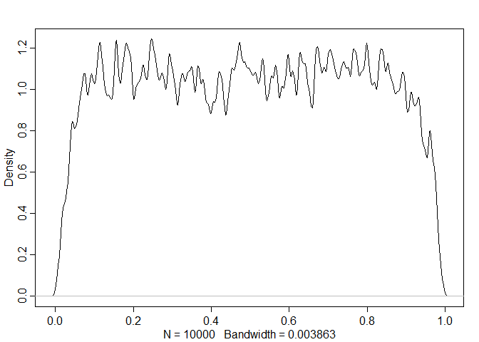

```r
library(rethinking)
```

```
## Loading required package: rstan
```

```
## Loading required package: StanHeaders
```

```
## Loading required package: ggplot2
```

```
## rstan (Version 2.19.2, GitRev: 2e1f913d3ca3)
```

```
## For execution on a local, multicore CPU with excess RAM we recommend calling
## options(mc.cores = parallel::detectCores()).
## To avoid recompilation of unchanged Stan programs, we recommend calling
## rstan_options(auto_write = TRUE)
```

```
## For improved execution time, we recommend calling
## Sys.setenv(LOCAL_CPPFLAGS = '-march=native')
## although this causes Stan to throw an error on a few processors.
```

```
## Loading required package: parallel
```

```
## Loading required package: dagitty
```

```
## rethinking (Version 1.90)
```

```
## 
## Attaching package: 'rethinking'
```

```
## The following object is masked from 'package:stats':
## 
##     rstudent
```


```r
garden_data <- read.table(file = "clarkia_transplant_data.csv",sep = ",",header = TRUE,stringsAsFactors = FALSE)
d <- garden_data
```


```r
str(d)
```

```
## 'data.frame':	3250 obs. of  15 variables:
##  $ temperature_diff_fall  : num  1.19 1.19 1.67 1.94 -1.49 ...
##  $ blk                    : int  1 3 3 3 3 4 3 4 1 1 ...
##  $ nov_germ               : int  0 1 0 1 1 1 1 1 1 1 ...
##  $ pop                    : chr  "AY" "AY" "BB" "BC" ...
##  $ dam                    : chr  "AY29" "AY35" "BB44" "BC54" ...
##  $ sire                   : chr  "AY44" "AY29" "BB37" "BC37" ...
##  $ nov_size               : int  NA 5 NA 1 1 1 5 NA 4 4 ...
##  $ mar_surv               : int  0 1 0 1 0 0 1 1 1 1 ...
##  $ mar_size               : int  NA 2 NA 6 NA NA 10 6 6 6 ...
##  $ fruit_count            : int  0 0 0 0 0 0 0 0 0 0 ...
##  $ total_est_seeds        : int  0 0 0 0 0 0 0 0 0 0 ...
##  $ temperature_diff_annual: num  1.076 1.076 1.579 1.812 -0.642 ...
##  $ precip_diff_spring     : num  22.5 22.5 12 13.4 28.6 ...
##  $ first_fl_julian        : int  NA NA NA NA NA NA NA NA 181 NA ...
##  $ last_fl_julian         : int  NA NA NA NA NA NA NA NA 181 NA ...
```

```r
table(d$nov_germ)
```

```
## 
##    0    1 
## 1495 1755
```

```r
summary(d$temperature_diff_fall)
```

```
##    Min. 1st Qu.  Median    Mean 3rd Qu.    Max. 
## -1.5923 -1.0963  0.3377  0.1945  1.5434  1.9434
```

```r
hist(d$temperature_diff_fall)
```

<!-- -->

1. Fit a simple model with effects of temperature difference (temperature_diff_fall) on November germination (nov_germ). Temperature difference is already centered and scaled (i.e., negative values are the smallest temperature differences). Make sure to use the appropriate likelihood for the germination data (0 = no germ, 1  = germ). 

```r
dat <- list(
  G = d$nov_germ,
  TDF = d$temperature_diff_fall
)

m1 <- ulam(
  alist(
    G ~ dbinom(1,p),
    logit(p) <- a+bt*TDF,
    a ~ dnorm(0,1.5),
    bt ~ dnorm(0,1.5)
  ), data = dat, chains = 4, log_lik = TRUE
)
```

```
## 
## SAMPLING FOR MODEL '01865bb653f96ecd6e02b188a44b3633' NOW (CHAIN 1).
## Chain 1: 
## Chain 1: Gradient evaluation took 0.001 seconds
## Chain 1: 1000 transitions using 10 leapfrog steps per transition would take 10 seconds.
## Chain 1: Adjust your expectations accordingly!
## Chain 1: 
## Chain 1: 
## Chain 1: Iteration:   1 / 1000 [  0%]  (Warmup)
## Chain 1: Iteration: 100 / 1000 [ 10%]  (Warmup)
## Chain 1: Iteration: 200 / 1000 [ 20%]  (Warmup)
## Chain 1: Iteration: 300 / 1000 [ 30%]  (Warmup)
## Chain 1: Iteration: 400 / 1000 [ 40%]  (Warmup)
## Chain 1: Iteration: 500 / 1000 [ 50%]  (Warmup)
## Chain 1: Iteration: 501 / 1000 [ 50%]  (Sampling)
## Chain 1: Iteration: 600 / 1000 [ 60%]  (Sampling)
## Chain 1: Iteration: 700 / 1000 [ 70%]  (Sampling)
## Chain 1: Iteration: 800 / 1000 [ 80%]  (Sampling)
## Chain 1: Iteration: 900 / 1000 [ 90%]  (Sampling)
## Chain 1: Iteration: 1000 / 1000 [100%]  (Sampling)
## Chain 1: 
## Chain 1:  Elapsed Time: 6.759 seconds (Warm-up)
## Chain 1:                7.3 seconds (Sampling)
## Chain 1:                14.059 seconds (Total)
## Chain 1: 
## 
## SAMPLING FOR MODEL '01865bb653f96ecd6e02b188a44b3633' NOW (CHAIN 2).
## Chain 2: 
## Chain 2: Gradient evaluation took 0.002 seconds
## Chain 2: 1000 transitions using 10 leapfrog steps per transition would take 20 seconds.
## Chain 2: Adjust your expectations accordingly!
## Chain 2: 
## Chain 2: 
## Chain 2: Iteration:   1 / 1000 [  0%]  (Warmup)
## Chain 2: Iteration: 100 / 1000 [ 10%]  (Warmup)
## Chain 2: Iteration: 200 / 1000 [ 20%]  (Warmup)
## Chain 2: Iteration: 300 / 1000 [ 30%]  (Warmup)
## Chain 2: Iteration: 400 / 1000 [ 40%]  (Warmup)
## Chain 2: Iteration: 500 / 1000 [ 50%]  (Warmup)
## Chain 2: Iteration: 501 / 1000 [ 50%]  (Sampling)
## Chain 2: Iteration: 600 / 1000 [ 60%]  (Sampling)
## Chain 2: Iteration: 700 / 1000 [ 70%]  (Sampling)
## Chain 2: Iteration: 800 / 1000 [ 80%]  (Sampling)
## Chain 2: Iteration: 900 / 1000 [ 90%]  (Sampling)
## Chain 2: Iteration: 1000 / 1000 [100%]  (Sampling)
## Chain 2: 
## Chain 2:  Elapsed Time: 9.133 seconds (Warm-up)
## Chain 2:                9.109 seconds (Sampling)
## Chain 2:                18.242 seconds (Total)
## Chain 2: 
## 
## SAMPLING FOR MODEL '01865bb653f96ecd6e02b188a44b3633' NOW (CHAIN 3).
## Chain 3: 
## Chain 3: Gradient evaluation took 0.001 seconds
## Chain 3: 1000 transitions using 10 leapfrog steps per transition would take 10 seconds.
## Chain 3: Adjust your expectations accordingly!
## Chain 3: 
## Chain 3: 
## Chain 3: Iteration:   1 / 1000 [  0%]  (Warmup)
## Chain 3: Iteration: 100 / 1000 [ 10%]  (Warmup)
## Chain 3: Iteration: 200 / 1000 [ 20%]  (Warmup)
## Chain 3: Iteration: 300 / 1000 [ 30%]  (Warmup)
## Chain 3: Iteration: 400 / 1000 [ 40%]  (Warmup)
## Chain 3: Iteration: 500 / 1000 [ 50%]  (Warmup)
## Chain 3: Iteration: 501 / 1000 [ 50%]  (Sampling)
## Chain 3: Iteration: 600 / 1000 [ 60%]  (Sampling)
## Chain 3: Iteration: 700 / 1000 [ 70%]  (Sampling)
## Chain 3: Iteration: 800 / 1000 [ 80%]  (Sampling)
## Chain 3: Iteration: 900 / 1000 [ 90%]  (Sampling)
## Chain 3: Iteration: 1000 / 1000 [100%]  (Sampling)
## Chain 3: 
## Chain 3:  Elapsed Time: 9.819 seconds (Warm-up)
## Chain 3:                9.249 seconds (Sampling)
## Chain 3:                19.068 seconds (Total)
## Chain 3: 
## 
## SAMPLING FOR MODEL '01865bb653f96ecd6e02b188a44b3633' NOW (CHAIN 4).
## Chain 4: 
## Chain 4: Gradient evaluation took 0.002 seconds
## Chain 4: 1000 transitions using 10 leapfrog steps per transition would take 20 seconds.
## Chain 4: Adjust your expectations accordingly!
## Chain 4: 
## Chain 4: 
## Chain 4: Iteration:   1 / 1000 [  0%]  (Warmup)
## Chain 4: Iteration: 100 / 1000 [ 10%]  (Warmup)
## Chain 4: Iteration: 200 / 1000 [ 20%]  (Warmup)
## Chain 4: Iteration: 300 / 1000 [ 30%]  (Warmup)
## Chain 4: Iteration: 400 / 1000 [ 40%]  (Warmup)
## Chain 4: Iteration: 500 / 1000 [ 50%]  (Warmup)
## Chain 4: Iteration: 501 / 1000 [ 50%]  (Sampling)
## Chain 4: Iteration: 600 / 1000 [ 60%]  (Sampling)
## Chain 4: Iteration: 700 / 1000 [ 70%]  (Sampling)
## Chain 4: Iteration: 800 / 1000 [ 80%]  (Sampling)
## Chain 4: Iteration: 900 / 1000 [ 90%]  (Sampling)
## Chain 4: Iteration: 1000 / 1000 [100%]  (Sampling)
## Chain 4: 
## Chain 4:  Elapsed Time: 8.684 seconds (Warm-up)
## Chain 4:                8.733 seconds (Sampling)
## Chain 4:                17.417 seconds (Total)
## Chain 4:
```

2. Simulate from your priors to see if you've chosen reasonable priors, adjust them if necessary. 

```r
set.seed(1999)
prior <- extract.prior(m1,n=1e4)
```

```
## 
## SAMPLING FOR MODEL '562eca13984ebc3bde50549ce6e8e3e3' NOW (CHAIN 1).
## Chain 1: 
## Chain 1: Gradient evaluation took 0.001 seconds
## Chain 1: 1000 transitions using 10 leapfrog steps per transition would take 10 seconds.
## Chain 1: Adjust your expectations accordingly!
## Chain 1: 
## Chain 1: 
## Chain 1: Iteration:     1 / 20000 [  0%]  (Warmup)
## Chain 1: Iteration:  2000 / 20000 [ 10%]  (Warmup)
## Chain 1: Iteration:  4000 / 20000 [ 20%]  (Warmup)
## Chain 1: Iteration:  6000 / 20000 [ 30%]  (Warmup)
## Chain 1: Iteration:  8000 / 20000 [ 40%]  (Warmup)
## Chain 1: Iteration: 10000 / 20000 [ 50%]  (Warmup)
## Chain 1: Iteration: 10001 / 20000 [ 50%]  (Sampling)
## Chain 1: Iteration: 12000 / 20000 [ 60%]  (Sampling)
## Chain 1: Iteration: 14000 / 20000 [ 70%]  (Sampling)
## Chain 1: Iteration: 16000 / 20000 [ 80%]  (Sampling)
## Chain 1: Iteration: 18000 / 20000 [ 90%]  (Sampling)
## Chain 1: Iteration: 20000 / 20000 [100%]  (Sampling)
## Chain 1: 
## Chain 1:  Elapsed Time: 40.675 seconds (Warm-up)
## Chain 1:                35.405 seconds (Sampling)
## Chain 1:                76.08 seconds (Total)
## Chain 1:
```

```r
p <- inv_logit(prior$a)
dens(p,adj = 0.1)
```

<!-- -->
prior looks fine

These blocks were set up in the field, and had differences in soil depth, slope, and competitive environment. So maybe a model that includes block will describe the data better.
3. Fit a model that includes an effect of block (blk), with no pooling.

```r
dat <- list(
  G = d$nov_germ,
  TDF = d$temperature_diff_fall,
  B =d$blk
)

m2 <- ulam(
  alist(
    G ~ dbinom(1,p),
    logit(p) <- a[B]+bt*TDF,
    a[B]~ dnorm(0,1.5),
    bt ~ dnorm(0,1.5)
  ), data = dat, chains = 4, log_lik = TRUE
)
```

```
## 
## SAMPLING FOR MODEL 'e2d22431c7aa5b5ff6a1fd8d1c75b61a' NOW (CHAIN 1).
## Chain 1: 
## Chain 1: Gradient evaluation took 0.002 seconds
## Chain 1: 1000 transitions using 10 leapfrog steps per transition would take 20 seconds.
## Chain 1: Adjust your expectations accordingly!
## Chain 1: 
## Chain 1: 
## Chain 1: Iteration:   1 / 1000 [  0%]  (Warmup)
## Chain 1: Iteration: 100 / 1000 [ 10%]  (Warmup)
## Chain 1: Iteration: 200 / 1000 [ 20%]  (Warmup)
## Chain 1: Iteration: 300 / 1000 [ 30%]  (Warmup)
## Chain 1: Iteration: 400 / 1000 [ 40%]  (Warmup)
## Chain 1: Iteration: 500 / 1000 [ 50%]  (Warmup)
## Chain 1: Iteration: 501 / 1000 [ 50%]  (Sampling)
## Chain 1: Iteration: 600 / 1000 [ 60%]  (Sampling)
## Chain 1: Iteration: 700 / 1000 [ 70%]  (Sampling)
## Chain 1: Iteration: 800 / 1000 [ 80%]  (Sampling)
## Chain 1: Iteration: 900 / 1000 [ 90%]  (Sampling)
## Chain 1: Iteration: 1000 / 1000 [100%]  (Sampling)
## Chain 1: 
## Chain 1:  Elapsed Time: 13.867 seconds (Warm-up)
## Chain 1:                8.971 seconds (Sampling)
## Chain 1:                22.838 seconds (Total)
## Chain 1: 
## 
## SAMPLING FOR MODEL 'e2d22431c7aa5b5ff6a1fd8d1c75b61a' NOW (CHAIN 2).
## Chain 2: 
## Chain 2: Gradient evaluation took 0.002 seconds
## Chain 2: 1000 transitions using 10 leapfrog steps per transition would take 20 seconds.
## Chain 2: Adjust your expectations accordingly!
## Chain 2: 
## Chain 2: 
## Chain 2: Iteration:   1 / 1000 [  0%]  (Warmup)
## Chain 2: Iteration: 100 / 1000 [ 10%]  (Warmup)
## Chain 2: Iteration: 200 / 1000 [ 20%]  (Warmup)
## Chain 2: Iteration: 300 / 1000 [ 30%]  (Warmup)
## Chain 2: Iteration: 400 / 1000 [ 40%]  (Warmup)
## Chain 2: Iteration: 500 / 1000 [ 50%]  (Warmup)
## Chain 2: Iteration: 501 / 1000 [ 50%]  (Sampling)
## Chain 2: Iteration: 600 / 1000 [ 60%]  (Sampling)
## Chain 2: Iteration: 700 / 1000 [ 70%]  (Sampling)
## Chain 2: Iteration: 800 / 1000 [ 80%]  (Sampling)
## Chain 2: Iteration: 900 / 1000 [ 90%]  (Sampling)
## Chain 2: Iteration: 1000 / 1000 [100%]  (Sampling)
## Chain 2: 
## Chain 2:  Elapsed Time: 9.642 seconds (Warm-up)
## Chain 2:                9.904 seconds (Sampling)
## Chain 2:                19.546 seconds (Total)
## Chain 2: 
## 
## SAMPLING FOR MODEL 'e2d22431c7aa5b5ff6a1fd8d1c75b61a' NOW (CHAIN 3).
## Chain 3: 
## Chain 3: Gradient evaluation took 0.002 seconds
## Chain 3: 1000 transitions using 10 leapfrog steps per transition would take 20 seconds.
## Chain 3: Adjust your expectations accordingly!
## Chain 3: 
## Chain 3: 
## Chain 3: Iteration:   1 / 1000 [  0%]  (Warmup)
## Chain 3: Iteration: 100 / 1000 [ 10%]  (Warmup)
## Chain 3: Iteration: 200 / 1000 [ 20%]  (Warmup)
## Chain 3: Iteration: 300 / 1000 [ 30%]  (Warmup)
## Chain 3: Iteration: 400 / 1000 [ 40%]  (Warmup)
## Chain 3: Iteration: 500 / 1000 [ 50%]  (Warmup)
## Chain 3: Iteration: 501 / 1000 [ 50%]  (Sampling)
## Chain 3: Iteration: 600 / 1000 [ 60%]  (Sampling)
## Chain 3: Iteration: 700 / 1000 [ 70%]  (Sampling)
## Chain 3: Iteration: 800 / 1000 [ 80%]  (Sampling)
## Chain 3: Iteration: 900 / 1000 [ 90%]  (Sampling)
## Chain 3: Iteration: 1000 / 1000 [100%]  (Sampling)
## Chain 3: 
## Chain 3:  Elapsed Time: 12.3 seconds (Warm-up)
## Chain 3:                9.085 seconds (Sampling)
## Chain 3:                21.385 seconds (Total)
## Chain 3: 
## 
## SAMPLING FOR MODEL 'e2d22431c7aa5b5ff6a1fd8d1c75b61a' NOW (CHAIN 4).
## Chain 4: 
## Chain 4: Gradient evaluation took 0.002 seconds
## Chain 4: 1000 transitions using 10 leapfrog steps per transition would take 20 seconds.
## Chain 4: Adjust your expectations accordingly!
## Chain 4: 
## Chain 4: 
## Chain 4: Iteration:   1 / 1000 [  0%]  (Warmup)
## Chain 4: Iteration: 100 / 1000 [ 10%]  (Warmup)
## Chain 4: Iteration: 200 / 1000 [ 20%]  (Warmup)
## Chain 4: Iteration: 300 / 1000 [ 30%]  (Warmup)
## Chain 4: Iteration: 400 / 1000 [ 40%]  (Warmup)
## Chain 4: Iteration: 500 / 1000 [ 50%]  (Warmup)
## Chain 4: Iteration: 501 / 1000 [ 50%]  (Sampling)
## Chain 4: Iteration: 600 / 1000 [ 60%]  (Sampling)
## Chain 4: Iteration: 700 / 1000 [ 70%]  (Sampling)
## Chain 4: Iteration: 800 / 1000 [ 80%]  (Sampling)
## Chain 4: Iteration: 900 / 1000 [ 90%]  (Sampling)
## Chain 4: Iteration: 1000 / 1000 [100%]  (Sampling)
## Chain 4: 
## Chain 4:  Elapsed Time: 10.736 seconds (Warm-up)
## Chain 4:                7.375 seconds (Sampling)
## Chain 4:                18.111 seconds (Total)
## Chain 4:
```

The experiment included many individuals from each of the 15 populations. So, each individual is not an independent representative of a given temperature, but might be similar to other plants from that population for reasons besides temperature. 

5. Build a model that accounts for this by including population (pop) and allowing partial pooling between populations A) without block, and B) with block included as in the model above. How does including population affect the temperature estimate?

```r
summary(is.na(d$pop))
```

```
##    Mode   FALSE 
## logical    3250
```


```r
d$pop <- as.factor(d$pop)
pop_levels <- c(1:15)
d$pop_level <- pop_levels[d$pop]
dat <- list(
  G = d$nov_germ,
  TDF = d$temperature_diff_fall,
  P = d$pop_level
)

m4 <- ulam(
  alist(
    G ~ dbinom(1,p),
    logit(p) <- a[P]+bt*TDF,
    a[P] ~ dnorm(a_bar,sigma),
    a_bar ~ dnorm(0,1.5),
    sigma ~ dexp(1),
    bt ~ dnorm(0,1.5)
  ), data = dat, chains = 4, log_lik = TRUE, iter = 2000
)
```

```
## 
## SAMPLING FOR MODEL 'b0b74c60182c8b5566e19a4019866ebd' NOW (CHAIN 1).
## Chain 1: 
## Chain 1: Gradient evaluation took 0.002 seconds
## Chain 1: 1000 transitions using 10 leapfrog steps per transition would take 20 seconds.
## Chain 1: Adjust your expectations accordingly!
## Chain 1: 
## Chain 1: 
## Chain 1: Iteration:    1 / 2000 [  0%]  (Warmup)
## Chain 1: Iteration:  200 / 2000 [ 10%]  (Warmup)
## Chain 1: Iteration:  400 / 2000 [ 20%]  (Warmup)
## Chain 1: Iteration:  600 / 2000 [ 30%]  (Warmup)
## Chain 1: Iteration:  800 / 2000 [ 40%]  (Warmup)
## Chain 1: Iteration: 1000 / 2000 [ 50%]  (Warmup)
## Chain 1: Iteration: 1001 / 2000 [ 50%]  (Sampling)
## Chain 1: Iteration: 1200 / 2000 [ 60%]  (Sampling)
## Chain 1: Iteration: 1400 / 2000 [ 70%]  (Sampling)
## Chain 1: Iteration: 1600 / 2000 [ 80%]  (Sampling)
## Chain 1: Iteration: 1800 / 2000 [ 90%]  (Sampling)
## Chain 1: Iteration: 2000 / 2000 [100%]  (Sampling)
## Chain 1: 
## Chain 1:  Elapsed Time: 62.553 seconds (Warm-up)
## Chain 1:                66.586 seconds (Sampling)
## Chain 1:                129.139 seconds (Total)
## Chain 1: 
## 
## SAMPLING FOR MODEL 'b0b74c60182c8b5566e19a4019866ebd' NOW (CHAIN 2).
## Chain 2: 
## Chain 2: Gradient evaluation took 0.002 seconds
## Chain 2: 1000 transitions using 10 leapfrog steps per transition would take 20 seconds.
## Chain 2: Adjust your expectations accordingly!
## Chain 2: 
## Chain 2: 
## Chain 2: Iteration:    1 / 2000 [  0%]  (Warmup)
## Chain 2: Iteration:  200 / 2000 [ 10%]  (Warmup)
## Chain 2: Iteration:  400 / 2000 [ 20%]  (Warmup)
## Chain 2: Iteration:  600 / 2000 [ 30%]  (Warmup)
## Chain 2: Iteration:  800 / 2000 [ 40%]  (Warmup)
## Chain 2: Iteration: 1000 / 2000 [ 50%]  (Warmup)
## Chain 2: Iteration: 1001 / 2000 [ 50%]  (Sampling)
## Chain 2: Iteration: 1200 / 2000 [ 60%]  (Sampling)
## Chain 2: Iteration: 1400 / 2000 [ 70%]  (Sampling)
## Chain 2: Iteration: 1600 / 2000 [ 80%]  (Sampling)
## Chain 2: Iteration: 1800 / 2000 [ 90%]  (Sampling)
## Chain 2: Iteration: 2000 / 2000 [100%]  (Sampling)
## Chain 2: 
## Chain 2:  Elapsed Time: 55.692 seconds (Warm-up)
## Chain 2:                39.75 seconds (Sampling)
## Chain 2:                95.442 seconds (Total)
## Chain 2: 
## 
## SAMPLING FOR MODEL 'b0b74c60182c8b5566e19a4019866ebd' NOW (CHAIN 3).
## Chain 3: 
## Chain 3: Gradient evaluation took 0.001 seconds
## Chain 3: 1000 transitions using 10 leapfrog steps per transition would take 10 seconds.
## Chain 3: Adjust your expectations accordingly!
## Chain 3: 
## Chain 3: 
## Chain 3: Iteration:    1 / 2000 [  0%]  (Warmup)
## Chain 3: Iteration:  200 / 2000 [ 10%]  (Warmup)
## Chain 3: Iteration:  400 / 2000 [ 20%]  (Warmup)
## Chain 3: Iteration:  600 / 2000 [ 30%]  (Warmup)
## Chain 3: Iteration:  800 / 2000 [ 40%]  (Warmup)
## Chain 3: Iteration: 1000 / 2000 [ 50%]  (Warmup)
## Chain 3: Iteration: 1001 / 2000 [ 50%]  (Sampling)
## Chain 3: Iteration: 1200 / 2000 [ 60%]  (Sampling)
## Chain 3: Iteration: 1400 / 2000 [ 70%]  (Sampling)
## Chain 3: Iteration: 1600 / 2000 [ 80%]  (Sampling)
## Chain 3: Iteration: 1800 / 2000 [ 90%]  (Sampling)
## Chain 3: Iteration: 2000 / 2000 [100%]  (Sampling)
## Chain 3: 
## Chain 3:  Elapsed Time: 51.314 seconds (Warm-up)
## Chain 3:                44.244 seconds (Sampling)
## Chain 3:                95.558 seconds (Total)
## Chain 3: 
## 
## SAMPLING FOR MODEL 'b0b74c60182c8b5566e19a4019866ebd' NOW (CHAIN 4).
## Chain 4: 
## Chain 4: Gradient evaluation took 0.003 seconds
## Chain 4: 1000 transitions using 10 leapfrog steps per transition would take 30 seconds.
## Chain 4: Adjust your expectations accordingly!
## Chain 4: 
## Chain 4: 
## Chain 4: Iteration:    1 / 2000 [  0%]  (Warmup)
## Chain 4: Iteration:  200 / 2000 [ 10%]  (Warmup)
## Chain 4: Iteration:  400 / 2000 [ 20%]  (Warmup)
## Chain 4: Iteration:  600 / 2000 [ 30%]  (Warmup)
## Chain 4: Iteration:  800 / 2000 [ 40%]  (Warmup)
## Chain 4: Iteration: 1000 / 2000 [ 50%]  (Warmup)
## Chain 4: Iteration: 1001 / 2000 [ 50%]  (Sampling)
## Chain 4: Iteration: 1200 / 2000 [ 60%]  (Sampling)
## Chain 4: Iteration: 1400 / 2000 [ 70%]  (Sampling)
## Chain 4: Iteration: 1600 / 2000 [ 80%]  (Sampling)
## Chain 4: Iteration: 1800 / 2000 [ 90%]  (Sampling)
## Chain 4: Iteration: 2000 / 2000 [100%]  (Sampling)
## Chain 4: 
## Chain 4:  Elapsed Time: 48.436 seconds (Warm-up)
## Chain 4:                56.218 seconds (Sampling)
## Chain 4:                104.654 seconds (Total)
## Chain 4:
```

just include block as a dummy variable, how to use it hierachically

```r
d$pop <- as.factor(d$pop)
pop_levels <- c(1:15)
d$pop_level <- pop_levels[d$pop]
dat <- list(
  G = d$nov_germ,
  TDF = d$temperature_diff_fall,
  P = d$pop_level,
  B =d$blk
)

m5 <- ulam(
  alist(
    G ~ dbinom(1,p),
    logit(p) <- a[P]+a[B]+bt*TDF,
    a[P] ~ dnorm(a_bar,sigma),
    a[B] ~ dnorm(0,sigma_b),
    a_bar ~ dnorm(0,1.5),
    c(sigma,sigma_b) ~ dexp(1),
    bt ~ dnorm(0,1.5)
  ), data = dat, chains = 4, log_lik = TRUE, iter = 2000
)
```

```
## 
## SAMPLING FOR MODEL 'fa7ada10cdba5897a47da97a2f82dab0' NOW (CHAIN 1).
## Chain 1: 
## Chain 1: Gradient evaluation took 0.003 seconds
## Chain 1: 1000 transitions using 10 leapfrog steps per transition would take 30 seconds.
## Chain 1: Adjust your expectations accordingly!
## Chain 1: 
## Chain 1: 
## Chain 1: Iteration:    1 / 2000 [  0%]  (Warmup)
## Chain 1: Iteration:  200 / 2000 [ 10%]  (Warmup)
## Chain 1: Iteration:  400 / 2000 [ 20%]  (Warmup)
## Chain 1: Iteration:  600 / 2000 [ 30%]  (Warmup)
## Chain 1: Iteration:  800 / 2000 [ 40%]  (Warmup)
## Chain 1: Iteration: 1000 / 2000 [ 50%]  (Warmup)
## Chain 1: Iteration: 1001 / 2000 [ 50%]  (Sampling)
## Chain 1: Iteration: 1200 / 2000 [ 60%]  (Sampling)
## Chain 1: Iteration: 1400 / 2000 [ 70%]  (Sampling)
## Chain 1: Iteration: 1600 / 2000 [ 80%]  (Sampling)
## Chain 1: Iteration: 1800 / 2000 [ 90%]  (Sampling)
## Chain 1: Iteration: 2000 / 2000 [100%]  (Sampling)
## Chain 1: 
## Chain 1:  Elapsed Time: 46.211 seconds (Warm-up)
## Chain 1:                39.45 seconds (Sampling)
## Chain 1:                85.661 seconds (Total)
## Chain 1: 
## 
## SAMPLING FOR MODEL 'fa7ada10cdba5897a47da97a2f82dab0' NOW (CHAIN 2).
## Chain 2: 
## Chain 2: Gradient evaluation took 0.002 seconds
## Chain 2: 1000 transitions using 10 leapfrog steps per transition would take 20 seconds.
## Chain 2: Adjust your expectations accordingly!
## Chain 2: 
## Chain 2: 
## Chain 2: Iteration:    1 / 2000 [  0%]  (Warmup)
## Chain 2: Iteration:  200 / 2000 [ 10%]  (Warmup)
## Chain 2: Iteration:  400 / 2000 [ 20%]  (Warmup)
## Chain 2: Iteration:  600 / 2000 [ 30%]  (Warmup)
## Chain 2: Iteration:  800 / 2000 [ 40%]  (Warmup)
## Chain 2: Iteration: 1000 / 2000 [ 50%]  (Warmup)
## Chain 2: Iteration: 1001 / 2000 [ 50%]  (Sampling)
## Chain 2: Iteration: 1200 / 2000 [ 60%]  (Sampling)
## Chain 2: Iteration: 1400 / 2000 [ 70%]  (Sampling)
## Chain 2: Iteration: 1600 / 2000 [ 80%]  (Sampling)
## Chain 2: Iteration: 1800 / 2000 [ 90%]  (Sampling)
## Chain 2: Iteration: 2000 / 2000 [100%]  (Sampling)
## Chain 2: 
## Chain 2:  Elapsed Time: 46.439 seconds (Warm-up)
## Chain 2:                40.552 seconds (Sampling)
## Chain 2:                86.991 seconds (Total)
## Chain 2: 
## 
## SAMPLING FOR MODEL 'fa7ada10cdba5897a47da97a2f82dab0' NOW (CHAIN 3).
## Chain 3: 
## Chain 3: Gradient evaluation took 0.002 seconds
## Chain 3: 1000 transitions using 10 leapfrog steps per transition would take 20 seconds.
## Chain 3: Adjust your expectations accordingly!
## Chain 3: 
## Chain 3: 
## Chain 3: Iteration:    1 / 2000 [  0%]  (Warmup)
## Chain 3: Iteration:  200 / 2000 [ 10%]  (Warmup)
## Chain 3: Iteration:  400 / 2000 [ 20%]  (Warmup)
## Chain 3: Iteration:  600 / 2000 [ 30%]  (Warmup)
## Chain 3: Iteration:  800 / 2000 [ 40%]  (Warmup)
## Chain 3: Iteration: 1000 / 2000 [ 50%]  (Warmup)
## Chain 3: Iteration: 1001 / 2000 [ 50%]  (Sampling)
## Chain 3: Iteration: 1200 / 2000 [ 60%]  (Sampling)
## Chain 3: Iteration: 1400 / 2000 [ 70%]  (Sampling)
## Chain 3: Iteration: 1600 / 2000 [ 80%]  (Sampling)
## Chain 3: Iteration: 1800 / 2000 [ 90%]  (Sampling)
## Chain 3: Iteration: 2000 / 2000 [100%]  (Sampling)
## Chain 3: 
## Chain 3:  Elapsed Time: 44.832 seconds (Warm-up)
## Chain 3:                42.872 seconds (Sampling)
## Chain 3:                87.704 seconds (Total)
## Chain 3: 
## 
## SAMPLING FOR MODEL 'fa7ada10cdba5897a47da97a2f82dab0' NOW (CHAIN 4).
## Chain 4: 
## Chain 4: Gradient evaluation took 0.001 seconds
## Chain 4: 1000 transitions using 10 leapfrog steps per transition would take 10 seconds.
## Chain 4: Adjust your expectations accordingly!
## Chain 4: 
## Chain 4: 
## Chain 4: Iteration:    1 / 2000 [  0%]  (Warmup)
## Chain 4: Iteration:  200 / 2000 [ 10%]  (Warmup)
## Chain 4: Iteration:  400 / 2000 [ 20%]  (Warmup)
## Chain 4: Iteration:  600 / 2000 [ 30%]  (Warmup)
## Chain 4: Iteration:  800 / 2000 [ 40%]  (Warmup)
## Chain 4: Iteration: 1000 / 2000 [ 50%]  (Warmup)
## Chain 4: Iteration: 1001 / 2000 [ 50%]  (Sampling)
## Chain 4: Iteration: 1200 / 2000 [ 60%]  (Sampling)
## Chain 4: Iteration: 1400 / 2000 [ 70%]  (Sampling)
## Chain 4: Iteration: 1600 / 2000 [ 80%]  (Sampling)
## Chain 4: Iteration: 1800 / 2000 [ 90%]  (Sampling)
## Chain 4: Iteration: 2000 / 2000 [100%]  (Sampling)
## Chain 4: 
## Chain 4:  Elapsed Time: 43.373 seconds (Warm-up)
## Chain 4:                54.578 seconds (Sampling)
## Chain 4:                97.951 seconds (Total)
## Chain 4:
```

6. Compare the five models you built using WAIC. Which fits best? #four models?

```r
compare(m1,m2,m4,m5)
```

```
##        WAIC     pWAIC     dWAIC       weight       SE      dSE
## m5 4203.966 14.090184   0.00000 1.000000e+00 31.89057       NA
## m4 4271.313 14.328530  67.34766 2.374873e-15 30.09467 16.82727
## m2 4354.984  4.872266 151.01874 1.609525e-33 24.68777 24.85357
## m1 4436.359  1.954617 232.39308 3.439410e-51 16.73727 27.61109
```
model partial-pooling across both block and population has best prediction

7. Plot effects of temperature difference for the average block, and also make a plot that includes the variability across blocks.

```r
post <- extract.samples(m5)
```

There are other complexities to this data. For example, there is also some family structure within populations (dam and sire) which could be included as hierarchical effects. There are also other response variables (November size, March survival and size, first flower date, last flower date, fruit number, estimated seed production) that might require different likelihoods (and in some cases treatment for over-dispersion or zero inflation). So if the above problems were too easy and you feel adventurous, you could try analyzing one of these responses instead of germination (you will need to filter out missing observations). 
