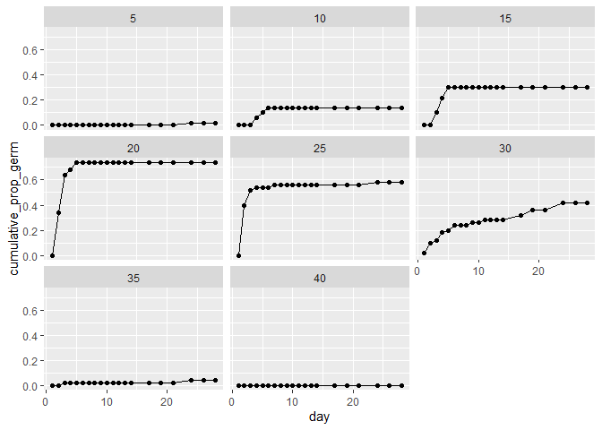

```r
library(rethinking)
```

```
## Loading required package: rstan
```

```
## Loading required package: StanHeaders
```

```
## Loading required package: ggplot2
```

```
## rstan (Version 2.19.3, GitRev: 2e1f913d3ca3)
```

```
## For execution on a local, multicore CPU with excess RAM we recommend calling
## options(mc.cores = parallel::detectCores()).
## To avoid recompilation of unchanged Stan programs, we recommend calling
## rstan_options(auto_write = TRUE)
```

```
## For improved execution time, we recommend calling
## Sys.setenv(LOCAL_CPPFLAGS = '-march=corei7 -mtune=corei7')
## although this causes Stan to throw an error on a few processors.
```

```
## Loading required package: parallel
```

```
## rethinking (Version 2.11)
```

```
## 
## Attaching package: 'rethinking'
```

```
## The following object is masked from 'package:stats':
## 
##     rstudent
```

```r
library(dplyr)
```

```
## 
## Attaching package: 'dplyr'
```

```
## The following objects are masked from 'package:stats':
## 
##     filter, lag
```

```
## The following objects are masked from 'package:base':
## 
##     intersect, setdiff, setequal, union
```

```r
library(reshape2)
library(ggplot2)
library(purrr)
```

```
## 
## Attaching package: 'purrr'
```

```
## The following object is masked from 'package:rethinking':
## 
##     map
```

```r
d <- read.csv(file = "light_round1_tall.csv",header = T, sep = ",", stringsAsFactors = F)
```
1.  Subset the data to only include wps==0.  We may look at water potential in a future week.

2. Let's start with a single pop "STDI".  

```r
d_wps0 <- filter(d,wps==0)
```

```r
d_wps0_STDI <- filter(d_wps0,pops=="STDI")
```

```r
ggplot(data = d_wps0_STDI,aes(x = day, y = cumulative_prop_germ))+
  geom_point()+
  geom_line()+
  facet_wrap(~temps)
```

<!-- -->
Evaluate models relate germination rate to temperature.  Explain your model choice and prior choice.  Try to do this both with ulam and brm.


```r
dat <- list(G = d_wps0_STDI$cumulative_prop_germ,day=d_wps0_STDI$day,germ=d_wps0_STDI$germ, temps=d_wps0_STDI$temps)
```


```r
# zero-inflated model as seed under dormancy won't germinate
# censored model as observation window might be shorter than time-range required by seed germination
m1 <- ulam(
alist(
G ~ dzipois( p , lambda ),  # should the dataframe be re-organized thus the maximum germination prop ~ temp used?
logit(p) <- ap + bd*temps,

day|germ > 0 ~ exponential(lambda),
day|germ == 0 ~ custom(exponential_lccdf(!Y| lambda)),
log(lambda) <- ag+bg*temps,

ap ~ dnorm( 0 , 1 ),
ag ~ dnorm( 1 , 0.5 ),
bd ~ dnorm(0,.5),
bg ~ dnorm(0,.5)
) , data=dat , chains=4 )
```

```
## 
## SAMPLING FOR MODEL '7598324b6bcc5c07fbb0bba02b282be8' NOW (CHAIN 1).
## Chain 1: 
## Chain 1: Gradient evaluation took 0 seconds
## Chain 1: 1000 transitions using 10 leapfrog steps per transition would take 0 seconds.
## Chain 1: Adjust your expectations accordingly!
## Chain 1: 
## Chain 1: 
## Chain 1: Iteration:   1 / 1000 [  0%]  (Warmup)
## Chain 1: Iteration: 100 / 1000 [ 10%]  (Warmup)
## Chain 1: Iteration: 200 / 1000 [ 20%]  (Warmup)
## Chain 1: Iteration: 300 / 1000 [ 30%]  (Warmup)
## Chain 1: Iteration: 400 / 1000 [ 40%]  (Warmup)
## Chain 1: Iteration: 500 / 1000 [ 50%]  (Warmup)
## Chain 1: Iteration: 501 / 1000 [ 50%]  (Sampling)
## Chain 1: Iteration: 600 / 1000 [ 60%]  (Sampling)
## Chain 1: Iteration: 700 / 1000 [ 70%]  (Sampling)
## Chain 1: Iteration: 800 / 1000 [ 80%]  (Sampling)
## Chain 1: Iteration: 900 / 1000 [ 90%]  (Sampling)
## Chain 1: Iteration: 1000 / 1000 [100%]  (Sampling)
## Chain 1: 
## Chain 1:  Elapsed Time: 2.281 seconds (Warm-up)
## Chain 1:                0.511 seconds (Sampling)
## Chain 1:                2.792 seconds (Total)
## Chain 1: 
## 
## SAMPLING FOR MODEL '7598324b6bcc5c07fbb0bba02b282be8' NOW (CHAIN 2).
## Chain 2: 
## Chain 2: Gradient evaluation took 0 seconds
## Chain 2: 1000 transitions using 10 leapfrog steps per transition would take 0 seconds.
## Chain 2: Adjust your expectations accordingly!
## Chain 2: 
## Chain 2: 
## Chain 2: Iteration:   1 / 1000 [  0%]  (Warmup)
## Chain 2: Iteration: 100 / 1000 [ 10%]  (Warmup)
## Chain 2: Iteration: 200 / 1000 [ 20%]  (Warmup)
## Chain 2: Iteration: 300 / 1000 [ 30%]  (Warmup)
## Chain 2: Iteration: 400 / 1000 [ 40%]  (Warmup)
## Chain 2: Iteration: 500 / 1000 [ 50%]  (Warmup)
## Chain 2: Iteration: 501 / 1000 [ 50%]  (Sampling)
## Chain 2: Iteration: 600 / 1000 [ 60%]  (Sampling)
## Chain 2: Iteration: 700 / 1000 [ 70%]  (Sampling)
## Chain 2: Iteration: 800 / 1000 [ 80%]  (Sampling)
## Chain 2: Iteration: 900 / 1000 [ 90%]  (Sampling)
## Chain 2: Iteration: 1000 / 1000 [100%]  (Sampling)
## Chain 2: 
## Chain 2:  Elapsed Time: 1.48 seconds (Warm-up)
## Chain 2:                0.5 seconds (Sampling)
## Chain 2:                1.98 seconds (Total)
## Chain 2: 
## 
## SAMPLING FOR MODEL '7598324b6bcc5c07fbb0bba02b282be8' NOW (CHAIN 3).
## Chain 3: 
## Chain 3: Gradient evaluation took 0 seconds
## Chain 3: 1000 transitions using 10 leapfrog steps per transition would take 0 seconds.
## Chain 3: Adjust your expectations accordingly!
## Chain 3: 
## Chain 3: 
## Chain 3: Iteration:   1 / 1000 [  0%]  (Warmup)
## Chain 3: Iteration: 100 / 1000 [ 10%]  (Warmup)
## Chain 3: Iteration: 200 / 1000 [ 20%]  (Warmup)
## Chain 3: Iteration: 300 / 1000 [ 30%]  (Warmup)
## Chain 3: Iteration: 400 / 1000 [ 40%]  (Warmup)
## Chain 3: Iteration: 500 / 1000 [ 50%]  (Warmup)
## Chain 3: Iteration: 501 / 1000 [ 50%]  (Sampling)
## Chain 3: Iteration: 600 / 1000 [ 60%]  (Sampling)
## Chain 3: Iteration: 700 / 1000 [ 70%]  (Sampling)
## Chain 3: Iteration: 800 / 1000 [ 80%]  (Sampling)
## Chain 3: Iteration: 900 / 1000 [ 90%]  (Sampling)
## Chain 3: Iteration: 1000 / 1000 [100%]  (Sampling)
## Chain 3: 
## Chain 3:  Elapsed Time: 1.766 seconds (Warm-up)
## Chain 3:                0.437 seconds (Sampling)
## Chain 3:                2.203 seconds (Total)
## Chain 3: 
## 
## SAMPLING FOR MODEL '7598324b6bcc5c07fbb0bba02b282be8' NOW (CHAIN 4).
## Chain 4: 
## Chain 4: Gradient evaluation took 0 seconds
## Chain 4: 1000 transitions using 10 leapfrog steps per transition would take 0 seconds.
## Chain 4: Adjust your expectations accordingly!
## Chain 4: 
## Chain 4: 
## Chain 4: Iteration:   1 / 1000 [  0%]  (Warmup)
## Chain 4: Iteration: 100 / 1000 [ 10%]  (Warmup)
## Chain 4: Iteration: 200 / 1000 [ 20%]  (Warmup)
## Chain 4: Iteration: 300 / 1000 [ 30%]  (Warmup)
## Chain 4: Iteration: 400 / 1000 [ 40%]  (Warmup)
## Chain 4: Iteration: 500 / 1000 [ 50%]  (Warmup)
## Chain 4: Iteration: 501 / 1000 [ 50%]  (Sampling)
## Chain 4: Iteration: 600 / 1000 [ 60%]  (Sampling)
## Chain 4: Iteration: 700 / 1000 [ 70%]  (Sampling)
## Chain 4: Iteration: 800 / 1000 [ 80%]  (Sampling)
## Chain 4: Iteration: 900 / 1000 [ 90%]  (Sampling)
## Chain 4: Iteration: 1000 / 1000 [100%]  (Sampling)
## Chain 4: 
## Chain 4:  Elapsed Time: 2.797 seconds (Warm-up)
## Chain 4:                0.524 seconds (Sampling)
## Chain 4:                3.321 seconds (Total)
## Chain 4:
```

```r
plot(precis(m1))
```

<!-- -->

```r
precis(m1)
```

```
##           mean         sd        5.5%       94.5%     n_eff     Rhat4
## ap  0.17508011 0.96551756 -1.42358511  1.70684873 1438.7680 0.9994838
## ag -2.72052615 0.23272345 -3.10192771 -2.36482197  880.5617 1.0046958
## bd  0.42227019 0.35025063 -0.04678077  0.96139817 1337.4729 1.0004697
## bg -0.05753212 0.01308578 -0.07791123 -0.03685463  831.6299 1.0050329
```

```r
inv_logit(-1.25) # temperature effect on dormancy intercept
```

```
## [1] 0.2227001
```

```r
inv_logit(0.48) 
```

```
## [1] 0.6177479
```

```r
exp(-2.74) # temperature effect on germination intercept
```

```
## [1] 0.06457035
```

```r
exp(-0.06)
```

```
## [1] 0.9417645
```

```r
postcheck(m1)
```

<!-- --><!-- --><!-- --><!-- --><!-- --><!-- --><!-- --><!-- -->

3. now expand the data set to all species/populations.  Include species/pop (use "pops" as the predictor, don't worry about having a separate predictor for pops nested within species).  is partial pooling appropriate here?

```r
d_wps0$pop_ID <- as.integer(as.factor(d_wps0$pops))
dat <- list(G = d_wps0$cumulative_prop_germ,day=d_wps0$day,germ=d_wps0$germ, temps=d_wps0$temps,Pop=d_wps0$pop_ID)
```


```r
# zero-inflated model as seed under dormancy won't germinate
# censored model as observation window might be shorter than time-range required by seed germination
m2 <- ulam(
alist(
G ~ dzipois( p , lambda ),  #dgampois()? how to integrate with dzipois, or partial pooling
logit(p) <- ap[Pop] + bd[Pop]*temps,

day|germ > 0 ~ exponential(lambda),
day|germ == 0 ~ custom(exponential_lccdf(!Y| lambda)),
log(lambda) <- ag[Pop]+bg[Pop]*temps,

ap[Pop] ~ dnorm( -1.5 , 1 ),
ag[Pop] ~ dnorm( 1 , 0.5 ),
bd[Pop] ~ dnorm(0,.5),
bg[Pop] ~ dnorm(0,.5)
) , data=dat , chains=4,log_lik = T)
```

```
## 
## SAMPLING FOR MODEL '07ab651b29d532266896d6bc4f2a61c1' NOW (CHAIN 1).
## Chain 1: 
## Chain 1: Gradient evaluation took 0.004 seconds
## Chain 1: 1000 transitions using 10 leapfrog steps per transition would take 40 seconds.
## Chain 1: Adjust your expectations accordingly!
## Chain 1: 
## Chain 1: 
## Chain 1: Iteration:   1 / 1000 [  0%]  (Warmup)
## Chain 1: Iteration: 100 / 1000 [ 10%]  (Warmup)
## Chain 1: Iteration: 200 / 1000 [ 20%]  (Warmup)
## Chain 1: Iteration: 300 / 1000 [ 30%]  (Warmup)
## Chain 1: Iteration: 400 / 1000 [ 40%]  (Warmup)
## Chain 1: Iteration: 500 / 1000 [ 50%]  (Warmup)
## Chain 1: Iteration: 501 / 1000 [ 50%]  (Sampling)
## Chain 1: Iteration: 600 / 1000 [ 60%]  (Sampling)
## Chain 1: Iteration: 700 / 1000 [ 70%]  (Sampling)
## Chain 1: Iteration: 800 / 1000 [ 80%]  (Sampling)
## Chain 1: Iteration: 900 / 1000 [ 90%]  (Sampling)
## Chain 1: Iteration: 1000 / 1000 [100%]  (Sampling)
## Chain 1: 
## Chain 1:  Elapsed Time: 607.479 seconds (Warm-up)
## Chain 1:                37.908 seconds (Sampling)
## Chain 1:                645.387 seconds (Total)
## Chain 1: 
## 
## SAMPLING FOR MODEL '07ab651b29d532266896d6bc4f2a61c1' NOW (CHAIN 2).
## Chain 2: 
## Chain 2: Gradient evaluation took 0.002 seconds
## Chain 2: 1000 transitions using 10 leapfrog steps per transition would take 20 seconds.
## Chain 2: Adjust your expectations accordingly!
## Chain 2: 
## Chain 2: 
## Chain 2: Iteration:   1 / 1000 [  0%]  (Warmup)
## Chain 2: Iteration: 100 / 1000 [ 10%]  (Warmup)
## Chain 2: Iteration: 200 / 1000 [ 20%]  (Warmup)
## Chain 2: Iteration: 300 / 1000 [ 30%]  (Warmup)
## Chain 2: Iteration: 400 / 1000 [ 40%]  (Warmup)
## Chain 2: Iteration: 500 / 1000 [ 50%]  (Warmup)
## Chain 2: Iteration: 501 / 1000 [ 50%]  (Sampling)
## Chain 2: Iteration: 600 / 1000 [ 60%]  (Sampling)
## Chain 2: Iteration: 700 / 1000 [ 70%]  (Sampling)
## Chain 2: Iteration: 800 / 1000 [ 80%]  (Sampling)
## Chain 2: Iteration: 900 / 1000 [ 90%]  (Sampling)
## Chain 2: Iteration: 1000 / 1000 [100%]  (Sampling)
## Chain 2: 
## Chain 2:  Elapsed Time: 627.145 seconds (Warm-up)
## Chain 2:                40.417 seconds (Sampling)
## Chain 2:                667.562 seconds (Total)
## Chain 2: 
## 
## SAMPLING FOR MODEL '07ab651b29d532266896d6bc4f2a61c1' NOW (CHAIN 3).
## Chain 3: 
## Chain 3: Gradient evaluation took 0.002 seconds
## Chain 3: 1000 transitions using 10 leapfrog steps per transition would take 20 seconds.
## Chain 3: Adjust your expectations accordingly!
## Chain 3: 
## Chain 3: 
## Chain 3: Iteration:   1 / 1000 [  0%]  (Warmup)
## Chain 3: Iteration: 100 / 1000 [ 10%]  (Warmup)
## Chain 3: Iteration: 200 / 1000 [ 20%]  (Warmup)
## Chain 3: Iteration: 300 / 1000 [ 30%]  (Warmup)
## Chain 3: Iteration: 400 / 1000 [ 40%]  (Warmup)
## Chain 3: Iteration: 500 / 1000 [ 50%]  (Warmup)
## Chain 3: Iteration: 501 / 1000 [ 50%]  (Sampling)
## Chain 3: Iteration: 600 / 1000 [ 60%]  (Sampling)
## Chain 3: Iteration: 700 / 1000 [ 70%]  (Sampling)
## Chain 3: Iteration: 800 / 1000 [ 80%]  (Sampling)
## Chain 3: Iteration: 900 / 1000 [ 90%]  (Sampling)
## Chain 3: Iteration: 1000 / 1000 [100%]  (Sampling)
## Chain 3: 
## Chain 3:  Elapsed Time: 600.365 seconds (Warm-up)
## Chain 3:                45.91 seconds (Sampling)
## Chain 3:                646.275 seconds (Total)
## Chain 3: 
## 
## SAMPLING FOR MODEL '07ab651b29d532266896d6bc4f2a61c1' NOW (CHAIN 4).
## Chain 4: 
## Chain 4: Gradient evaluation took 0.003 seconds
## Chain 4: 1000 transitions using 10 leapfrog steps per transition would take 30 seconds.
## Chain 4: Adjust your expectations accordingly!
## Chain 4: 
## Chain 4: 
## Chain 4: Iteration:   1 / 1000 [  0%]  (Warmup)
## Chain 4: Iteration: 100 / 1000 [ 10%]  (Warmup)
## Chain 4: Iteration: 200 / 1000 [ 20%]  (Warmup)
## Chain 4: Iteration: 300 / 1000 [ 30%]  (Warmup)
## Chain 4: Iteration: 400 / 1000 [ 40%]  (Warmup)
## Chain 4: Iteration: 500 / 1000 [ 50%]  (Warmup)
## Chain 4: Iteration: 501 / 1000 [ 50%]  (Sampling)
## Chain 4: Iteration: 600 / 1000 [ 60%]  (Sampling)
## Chain 4: Iteration: 700 / 1000 [ 70%]  (Sampling)
## Chain 4: Iteration: 800 / 1000 [ 80%]  (Sampling)
## Chain 4: Iteration: 900 / 1000 [ 90%]  (Sampling)
## Chain 4: Iteration: 1000 / 1000 [100%]  (Sampling)
## Chain 4: 
## Chain 4:  Elapsed Time: 863.905 seconds (Warm-up)
## Chain 4:                1447.13 seconds (Sampling)
## Chain 4:                2311.03 seconds (Total)
## Chain 4:
```

```
## Warning: There were 500 transitions after warmup that exceeded the maximum treedepth. Increase max_treedepth above 10. See
## http://mc-stan.org/misc/warnings.html#maximum-treedepth-exceeded
```

```
## Warning: Examine the pairs() plot to diagnose sampling problems
```

```
## Warning: The largest R-hat is 1.41, indicating chains have not mixed.
## Running the chains for more iterations may help. See
## http://mc-stan.org/misc/warnings.html#r-hat
```

```
## Warning: Bulk Effective Samples Size (ESS) is too low, indicating posterior means and medians may be unreliable.
## Running the chains for more iterations may help. See
## http://mc-stan.org/misc/warnings.html#bulk-ess
```

```
## Warning: Tail Effective Samples Size (ESS) is too low, indicating posterior variances and tail quantiles may be unreliable.
## Running the chains for more iterations may help. See
## http://mc-stan.org/misc/warnings.html#tail-ess
```

```r
precis(m2,depth=2)
```

```
##               mean          sd        5.5%        94.5%       n_eff     Rhat4
## ap[1]  -1.08117721 1.036548236 -2.84089137  0.350488303    7.613289 1.1897255
## ap[2]  -0.95893852 1.069066748 -2.73830521  0.541955645    9.065679 1.1551631
## ap[3]  -1.08129560 1.074168078 -2.71104286  0.856618301   21.097067 1.1892433
## ap[4]  -1.10495865 0.969017784 -2.66605535  0.353273315   27.049531 1.1578367
## ap[5]  -1.27830610 0.861726726 -2.72510607  0.153222963 1876.195651 1.0010114
## ap[6]  -1.06680215 0.996311353 -2.73643697  0.337450085   13.232040 1.1018947
## ap[7]  -0.94399314 1.097819917 -2.69291916  0.909020849    6.293784 1.3069836
## ap[8]  -1.48600164 0.982763578 -2.87725455  0.145076696   14.213539 1.1145610
## ap[9]  -1.29167291 0.930561227 -2.77653467  0.184415955  189.035393 1.0022362
## ap[10] -1.27506848 0.877119378 -2.74118047  0.143784196  505.040892 1.0100497
## ap[11] -0.81874751 1.147789625 -2.70798824  0.802658625    4.630976 1.3299169
## ap[12] -1.03590871 0.987469463 -2.70008384  0.500640750   12.587343 1.1268839
## ap[13] -1.07480250 0.982852960 -2.73378477  0.395604762   32.181621 1.1008099
## ap[14] -1.04842626 0.978313571 -2.71831976  0.203866130    8.465868 1.1528774
## ap[15] -1.48030799 1.027085459 -3.17037171  0.193141633   40.778430 1.0645953
## ap[16] -1.10472476 0.930313050 -2.69759949  0.269694798   20.572236 1.0787685
## ap[17] -0.77675566 1.136840406 -2.52866460  1.208904915    6.254815 1.3257896
## ap[18] -1.32943805 0.961906778 -2.79243040  0.387920876  272.421138 1.0212900
## ap[19] -1.24754863 0.901686244 -2.62622083  0.240617091  757.824191 1.0124100
## ap[20] -1.60350239 0.899137464 -3.02902655 -0.085559184  297.586556 1.0123693
## ap[21] -1.11238131 0.949631339 -2.65109741  0.349039054   58.922567 1.0518238
## ap[22] -1.98759771 0.856133916 -3.40188269 -0.628672321  508.502357 1.0139647
## ap[23] -1.15226537 0.897590598 -2.68389684  0.233573665 1011.823246 1.0100208
## ap[24] -1.30904523 0.856823398 -2.65212738  0.051750487  732.659553 1.0084657
## ag[1]  -1.76825407 0.345284617 -2.33062470 -1.229093483  142.431659 1.0324507
## ag[2]  -2.57788545 0.231102484 -2.95374818 -2.221237512  169.792789 1.0240602
## ag[3]  -2.76185206 0.238660497 -3.16589542 -2.395928313  394.633665 1.0091753
## ag[4]  -2.54550768 0.236750397 -2.91638282 -2.161284450  148.512308 1.0572059
## ag[5]  -2.52868431 0.264566318 -2.94604447 -2.104944031  197.552557 1.0165686
## ag[6]  -2.93376755 0.223465176 -3.29725101 -2.584796324  441.830493 1.0056320
## ag[7]  -2.97925060 0.276718318 -3.45404909 -2.564085186   88.170675 1.0232951
## ag[8]  -2.92813824 0.239217803 -3.32156331 -2.554335070  641.872175 1.0018465
## ag[9]  -2.75056001 0.239801560 -3.13749994 -2.374327278  521.250326 1.0021733
## ag[10] -2.91303242 0.242691529 -3.29055055 -2.505968000  110.853346 1.0242500
## ag[11] -2.90803028 0.223089367 -3.27818255 -2.568545189  714.992805 1.0042942
## ag[12] -2.98784848 0.235539281 -3.37188286 -2.616359668  386.529690 1.0029095
## ag[13] -2.72335806 0.255417735 -3.11738719 -2.303118073  255.617335 1.0071058
## ag[14] -2.77449415 0.263294134 -3.19963947 -2.337984811  103.943489 1.0111884
## ag[15] -2.90569111 0.231434881 -3.27751946 -2.544282387 1155.007977 1.0009403
## ag[16] -2.73072666 0.211664331 -3.07704520 -2.407564104  313.810031 1.0054087
## ag[17] -2.26937113 0.198659721 -2.58091283 -1.951431319  203.206288 1.0009570
## ag[18] -2.57413852 0.189106645 -2.87031156 -2.274883764  404.482579 1.0105575
## ag[19] -2.73316468 0.206204508 -3.06726603 -2.408180525  315.196081 1.0016199
## ag[20] -2.92927648 0.210494709 -3.28138433 -2.597428416  977.707655 1.0000561
## ag[21] -2.78957791 0.232668432 -3.16182394 -2.417991687  240.709877 1.0081060
## ag[22] -2.05889735 0.206202982 -2.39000041 -1.733644896  698.779495 1.0078261
## ag[23] -2.12920273 0.231541115 -2.52335809 -1.778411311  390.094039 1.0051388
## ag[24] -2.48807748 0.228868940 -2.85965800 -2.118321331  481.136581 1.0143904
## bd[1]   0.16451652 0.476810191 -0.66197759  0.873594590  126.464836 1.0198471
## bd[2]   0.30875668 0.539050306 -0.85189221  1.004530537    5.203085 1.8722086
## bd[3]   0.45810133 0.398467186 -0.19388275  1.017315457  238.909224 1.0155266
## bd[4]   0.37996110 0.451960817 -0.57759215  1.005964216   25.193644 1.1553887
## bd[5]   0.41404821 0.431244359 -0.31294658  1.121048227  103.265284 1.0253683
## bd[6]   0.52778940 0.306290494  0.13708512  1.049488697  372.808223 1.0014753
## bd[7]   0.37037155 0.491826603 -0.56256918  1.061250032   34.279646 1.1504694
## bd[8]   0.60970014 0.455847466  0.04666543  1.507294324   14.010820 1.2002728
## bd[9]   0.45418401 0.356110098 -0.11385563  1.002413058  448.198962 1.0038907
## bd[10]  0.58800363 0.331936590  0.14364822  1.168524315   64.999220 1.0510130
## bd[11]  0.53723114 0.294383119  0.13124706  1.013329770  141.815186 0.9991225
## bd[12]  0.38656174 0.447901498 -0.58735516  1.026722495   10.203961 1.3493304
## bd[13]  0.43209810 0.334964366 -0.01297101  0.966475332  142.643736 1.0345312
## bd[14]  0.40250306 0.419480686 -0.28970616  1.028705337  128.865038 1.0081367
## bd[15]  0.52017524 0.289135808  0.14052468  1.042474450  204.298191 1.0265641
## bd[16]  0.50709697 0.300443649  0.13938801  1.075184864   19.263047 1.0772663
## bd[17]  0.52379434 0.302877107  0.12109800  1.040151167   56.080860 1.0652045
## bd[18]  0.57767707 0.375962906  0.08078169  1.120455713   28.077894 1.1807860
## bd[19]  0.65512543 0.344455071  0.18729932  1.289902035   16.351327 1.1488659
## bd[20] -0.39257284 0.319945519 -1.01089176 -0.018794396  263.609407 1.0093497
## bd[21]  0.48784827 0.378042371  0.04620521  1.037063183   83.503845 1.0200235
## bd[22] -0.40385753 0.423684212 -1.07203232  0.290723196   10.497950 1.1376773
## bd[23]  0.52358596 0.369993045  0.01414560  1.102220272  175.629938 1.0295542
## bd[24]  0.44838695 0.386659413 -0.15245411  1.081678293  127.965899 1.0522662
## bg[1]  -0.27117113 0.051615860 -0.35526045 -0.193158110  307.743330 1.0163863
## bg[2]  -0.05623963 0.013210843 -0.07766545 -0.035222030  190.116843 1.0278831
## bg[3]  -0.06214180 0.014059475 -0.08507070 -0.040268339  694.168628 1.0050922
## bg[4]  -0.08076520 0.015586026 -0.10646891 -0.056578808  161.714884 1.0520867
## bg[5]  -0.10037667 0.019592523 -0.13316989 -0.069049547  399.871049 1.0094359
## bg[6]  -0.02960730 0.010717325 -0.04702250 -0.013251889  646.811559 1.0023009
## bg[7]  -0.06346486 0.016499350 -0.09039790 -0.037424575  126.405540 1.0153437
## bg[8]  -0.03897158 0.012144737 -0.05806237 -0.019406044  874.609251 1.0004197
## bg[9]  -0.05894620 0.013778398 -0.08218024 -0.037740686  803.952561 1.0013528
## bg[10] -0.02701819 0.011162486 -0.04640923 -0.009950942  137.264764 1.0214590
## bg[11] -0.02330983 0.010166031 -0.03877196 -0.007002725  871.574658 1.0036077
## bg[12] -0.03286329 0.011452446 -0.05159907 -0.015308339  452.700768 1.0099337
## bg[13] -0.05730943 0.013919480 -0.08075723 -0.036138768  378.432111 1.0051200
## bg[14] -0.07177433 0.016573417 -0.09881703 -0.046555116  142.460368 1.0131705
## bg[15] -0.02877666 0.010955043 -0.04648676 -0.011140716 1249.130845 1.0019064
## bg[16] -0.02897207 0.010024347 -0.04544367 -0.013386358  421.724410 1.0046801
## bg[17] -0.05095387 0.010557875 -0.06848155 -0.034443658  315.414462 1.0010868
## bg[18] -0.02591866 0.008890219 -0.04044021 -0.012534208  484.742581 1.0047274
## bg[19] -0.02463733 0.009376206 -0.04016617 -0.009679915  457.733622 0.9995090
## bg[20] -0.01703005 0.009244382 -0.03178780 -0.002553874 1036.184007 1.0002432
## bg[21] -0.04174147 0.011678024 -0.06074269 -0.023261746  332.512054 1.0028711
## bg[22] -0.08368367 0.013623074 -0.10593100 -0.062193090  769.675318 1.0046689
## bg[23] -0.10016273 0.016766461 -0.12825488 -0.074990897  530.620149 1.0005891
## bg[24] -0.07747616 0.014678819 -0.10126964 -0.054728226  719.517040 1.0097611
```

