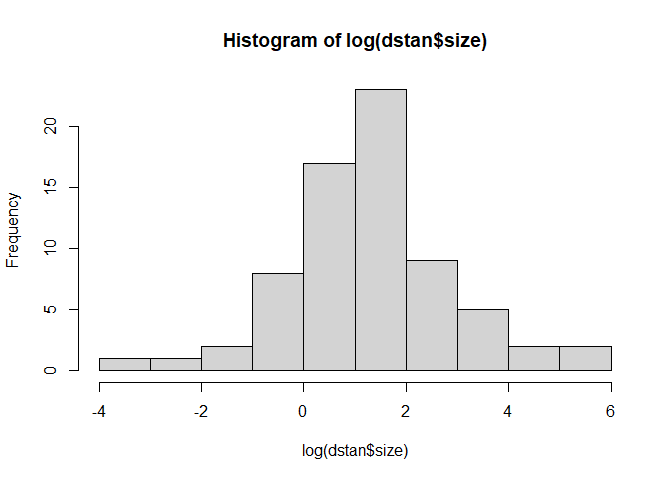

```r
library(rethinking)
```

```
## Loading required package: rstan
```

```
## Loading required package: StanHeaders
```

```
## Loading required package: ggplot2
```

```
## rstan (Version 2.19.3, GitRev: 2e1f913d3ca3)
```

```
## For execution on a local, multicore CPU with excess RAM we recommend calling
## options(mc.cores = parallel::detectCores()).
## To avoid recompilation of unchanged Stan programs, we recommend calling
## rstan_options(auto_write = TRUE)
```

```
## For improved execution time, we recommend calling
## Sys.setenv(LOCAL_CPPFLAGS = '-march=corei7 -mtune=corei7')
## although this causes Stan to throw an error on a few processors.
```

```
## Loading required package: parallel
```

```
## rethinking (Version 2.11)
```

```
## 
## Attaching package: 'rethinking'
```

```
## The following object is masked from 'package:stats':
## 
##     rstudent
```

```r
library(ape)
library(ade4)
```


```r
data("carni70")
```

# plot the tree

```r
  carni70.phy <- newick2phylog(carni70$tre)
  plot(carni70.phy, font=1, no.margin=TRUE,label.offset=1 , cex=0.5 )
```

<!-- -->
# Model without Phylogenetic Regression
You want to test the hypothesis that the range size of carnivores is influenced by their body size (larger carnivores roam further).  You want to be sure that if you do see a relationship that is is not just due to shared evolutionary history.  That is you want to do a phylogenetic regression.


```r
library(data.table)
d <- carni70$tab
setDT(d,keep.rownames = TRUE)
dstan <- d[complete.cases(d$rn,d$size,d$range),]
spp_obs <- dstan$rn
```

3) Should either range or size be transformed?
I guess so 

```r
hist(dstan$range)
```

<!-- -->

```r
hist(log(dstan$range))
```

<!-- -->

```r
hist(standardize(log(dstan$range))) #?
```

<!-- -->

```r
hist(dstan$size)
```

<!-- -->

```r
hist(log(dstan$size))
```

<!-- -->

```r
hist(standardize(log(dstan$size)))
```

<!-- -->


```r
dat_list <- list(
  N_spp = nrow(dstan),
  R = standardize(log(dstan$range)),
  S = standardize(log(dstan$size)),
  Imat = diag(nrow(dstan))
)

# without phylogenetic regression
m1 <- ulam(
  alist(
    R ~ multi_normal(mu, SIGMA),
    mu <- a + bS*S,
    matrix[N_spp,N_spp]:SIGMA <- Imat * sigma_sq,
    a ~ normal(0,1),
    bS ~ normal(0,0.5),
    sigma_sq ~ exponential(1)
      ),data = dat_list, chains = 4, cores = 4)
```

```r
precis(m1)
```

```
##                  mean        sd        5.5%     94.5%    n_eff     Rhat4
## a        -0.001696469 0.1108315 -0.17874290 0.1759601 2011.413 0.9992265
## bS        0.279527711 0.1142419  0.09161704 0.4521249 1768.483 0.9985527
## sigma_sq  0.950745274 0.1701994  0.71042916 1.2400143 1912.504 0.9994747
```
looks like a positive association between size and range. But these data are swirling with confounds.

#Phylogenetic Regression
4) Does size predict range?  Evaluate this question without and with accounting for phylogenetic relationships.
2) Note that the species name given in "rownames(d)" and in "tre$tip.label" do not match.  Fix that (e.g. using str_replace() )
handle it when doing Phylogenetic Regression
?

```r
#library("stringr") 
#d$rn tree$tip.label look identical to me
#str_replace(d$rn,"[aeiou]",replacement = tree$tip.label)
```
## Brownian motion

```r
library(ape)
tree <- as.phylo(carni70.phy)
Rbm <- corBrownian(phy = tree)
V <- vcv(Rbm)
```

```
## Warning in Initialize.corPhyl(phy, dummy.df): No covariate specified, species
## will be taken as ordered in the data frame. To avoid this message, specify a
## covariate containing the species names with the 'form' argument.
```

```r
Dmat <- cophenetic(tree)
plot(Dmat, V, xlab="phylogenetic distance", ylab="covariance")
```

<!-- -->

```r
# put species in right order
dat_list$V <- V[spp_obs,spp_obs]
# convert to correlation matrix 
dat_list$R <- dat_list$V/max(V)

# Brownian motion model
m2 <- ulam(
  alist(
    R ~ multi_normal(mu, SIGMA),
    mu <- a + bS*S,
    matrix[N_spp,N_spp]:SIGMA <- R * sigma_sq,
    a ~ normal(0,1),
    bS ~ normal(0,0.5),
    sigma_sq ~ exponential(1)
  ), data = dat_list, chains = 4, cores = 4
)
precis(m2)
```

```
##                  mean           sd         5.5%        94.5%     n_eff
## a         0.273865162 0.0065065452  0.263669353  0.283981715  970.0933
## bS       -0.002336607 0.0007585254 -0.003546308 -0.001114137 2216.4126
## sigma_sq  0.010362748 0.0002105595  0.010025809  0.010696166  672.2698
##              Rhat4
## a        0.9996901
## bS       0.9993503
## sigma_sq 1.0019196
```
the correlation disappeared, the model is suggesting the previous correlation observed is due to phylogenetic relatedness


## OU process

```r
# add scaled and reordered distance matrix
dat_list$Dmat <- Dmat[spp_obs,spp_obs]/max(Dmat)

m3 <- ulam(
  alist(
    R ~ multi_normal(mu,SIGMA),
    mu <- a + bS*S,
    matrix[N_spp,N_spp]:SIGMA <- cov_GPL1(Dmat,etasq,rhosq,0.01),
    a ~ normal(0,1),
    bS ~ normal(0,0.5),
    etasq ~ half_normal(1,0.25),
    rhosq ~ half_normal(3,0.25)
  ), data = dat_list, chains = 4, cores = 4
)

precis(m3)
```

```
##               mean          sd        5.5%        94.5%     n_eff    Rhat4
## a      0.283037387 0.042313806  0.21507557  0.348074385  674.0706 1.007641
## bS    -0.009780613 0.002590561 -0.01389753 -0.005621057 1864.9480 1.000042
## etasq  0.134815180 0.023111873  0.10216323  0.179683569  486.0497 1.007138
## rhosq  0.189132916 0.032637292  0.13716978  0.244550575  547.8335 1.006965
```
There is no correlation between body size and range using this phylogenetic model as well


